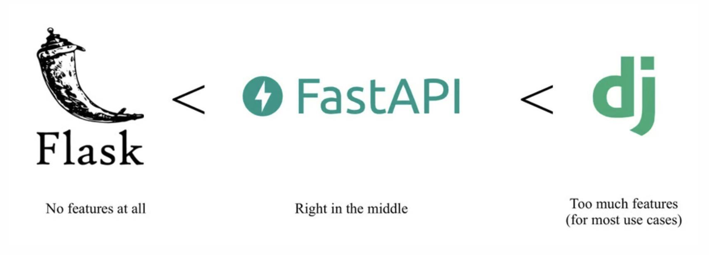

FastAPI
<!--more-->
## 1. Introduction

{}


Chúng ta giao tiếp với nhau qua API, vậy API là gì?
{}

## 2. API

{}
**API** (Giao diện lập trình ứng dụng) là một công cụ trung gian cho phép các ứng dụng, cơ sở dữ liệu, phần mềm và thiết bị IoT giao tiếp với nhau.


{}

{}


{}

+ **Client-Server:** Tách biệt giữa giao diện người dùng và lưu trữ dữ liệu.
+ **Stateless:** Mỗi request từ client phải chứa tất cả thông tin cần thiết để hiểu request đó.
+ **Cacheable:** Server phải gửi thông tin về cache để client có thể sử dụng.
+ **Uniform Interface:** Để giảm sự phức tạp của hệ thống, REST sử dụng các giao thức chuẩn như HTTP.
+ **Layered System:** Client không cần biết server làm gì, server cũng không cần biết client làm gì.
+ REST hỗ trợ nhiều định dạng dữ liệu, bao gồm:
  + **JSON (JavaScript Object Notation):** Định dạng dữ liệu phổ biến nhất.
  + **XML:** Định dạng phức tạp hơn, thường được sử dụng trong các ứng dụng doanh nghiệp.
  + **HTML:** Định dạng dữ liệu được hiển thị trên trình duyệt.


  Ưu điểm của REST: Linh hoạt trong việc xử lý định dạng và cấu trúc dữ liệu. Dễ dàng mở rộng và tích hợp với nhiều loại client khác nhau.


{}

{}
GraphQL là một ngôn ngữ truy vấn cho API, nơi người dùng có thể yêu cầu chính xác dữ liệu mà họ cần. Nó sử dụng schema để xác định các loại dữ liệu và mối quan hệ giữa chúng. Điều này cho phép người dùng truy vấn nhiều tài nguyên trong một yêu cầu duy nhất.

GraphQL chủ yếu sử dụng **JSON** để truyền dữ liệu. Cấu trúc của dữ liệu được xác định bởi schema, cho phép client yêu cầu các trường cụ thể.


  Giải quyết vấn đề over-fetching (lấy quá nhiều dữ liệu) và under-fetching (lấy không đủ dữ liệu). Client có thể yêu cầu đúng các trường dữ liệu mà nó cần.


{}

{}
SOAP (Simple Object Access Protocol) là một giao thức truyền thông cho phép trao đổi dữ liệu giữa các ứng dụng. Nó có cấu trúc tin nhắn cố định, sử dụng XML để định nghĩa nội dung và quy tắc giao tiếp. SOAP thường đi kèm với WS-Security để đảm bảo tính bảo mật.

SOAP sử dụng XML làm định dạng chính để cấu trúc tin nhắn. Điều này giúp đảm bảo tính nhất quán và tính tương thích giữa các hệ thống khác nhau.


  Rất an toàn và có thể mở rộng. Hỗ trợ các giao thức bảo mật như WS-Security, phù hợp cho các ứng dụng yêu cầu bảo mật cao như ngân hàng.



{}

{}

**RPC (Remote Procedure Call)** cho phép một chương trình gọi hàm hoặc thực thi một thủ tục trên một máy tính khác như thể nó là một phần của chương trình cục bộ. RPC thường sử dụng các giao thức như HTTP/HTTPS và có thể truyền dữ liệu ở nhiều định dạng khác nhau.

RPC hỗ trợ nhiều định dạng khác nhau, bao gồm JSON, XML, và Flatbuffers, cho phép linh hoạt trong việc truyền tải dữ liệu.


  Tải trọng nhẹ giúp tăng hiệu suất. Cách thức gọi hàm rất gần gũi với lập trình, giúp người phát triển dễ dàng sử dụng.

{}
{}

{}

+ Concurrency: Đồng thời, nhiều tác vụ chạy cùng một lúc.
{}

{}
+ Non-Concurrency: Không đồng thời, một tác vụ chạy xong mới tới tác vụ khác.


  Concurrency is not parabellism.



{}

## 3. Fast API

{}


{}

{}

Then locate `localhost:8000/docs` to see the Swagger UI.


{}

{}


{}

{}


{}

{}
+ **Path Parameters** are request parameters that have been attached to the URL

+ **Path Parameters** are usually defined as a way to find information based on location


{}

{}
**Query Parameters** are request parameters that have been attached after a “?”
**Query Parameters** have `name`=`value pairs`

+ Example:
     `localhost:8000/items/?skip=0&limit=10`


{}


{}

{}
+ Used to create data
+ POST can have a body that has additional information that GET does not have

{}

{}
+ Used to update data
+ PUT can have a body that has additional information (like POST) that GET does not have


{}

{}
+ Used to delete data


{}

{}


## 4. Pydantics


{}
Pydantic là một thư viện Python mạnh mẽ được sử dụng để mô hình hóa dữ liệu, phân tích dữ liệu và xử lý lỗi hiệu quả. Nó thường được sử dụng để xác thực dữ liệu và xử lý dữ liệu đến trong ứng dụng FastAPI. Pydantic giúp định nghĩa các mô hình dữ liệu và tự động xác thực, chuyển đổi dữ liệu đầu vào, cung cấp thông báo lỗi chi tiết khi xác thực không thành công.

+ **Data Modeling:**

```python
from pydantic import BaseModel

class Item(BaseModel):
    id: int
    name: str
    price: float
```

+ **Data Parsing:**

```python
item_data = {"id": 1, "name": "Sample Item", "price": 19.99}
item = Item(**item_data)
```

+ **Error Handling:**

```python
from pydantic import ValidationError

try:
    item = Item(id="not-an-integer", name="Sample Item", price=19.99)
except ValidationError as e:
    print(e.json())
```
{}

{}


{}


{}

{}


{}

{}


{}

{}

{}

**Annotated** và **Field** trong FastAPI & Pydantic

+ Dùng để thêm metadata vào các mô hình (models) của Pydantic.

+ **Annotated** được sử dụng để thêm metadata tùy chỉnh vào các kiểu dữ liệu.
+ **Field** dùng để thêm các trường dữ liệu cho mô hình (ví dụ giá trị mặc định, xác thực dữ liệu), thêm metadata phục vụ cho quá trình truần tự hóa dữ liệu.

```python {filename="Dữ liệu mẫu"}
from typing import Annotated
from fastapi import FastAPI, Query
from pydantic import BaseModel, Field

app = FastAPI()

items = [
    {
        "name": "Banh thap cam",
        "price": 45.0,
        "description": "Description of the banh trung thu thap cam",
    },
    {
        "name": "Banh dau xanh",
        "price": 40.0,
        "description": "Description of the banh trung thu dau xanh",
    },
]
```

```python {filename="Feild method"}
class Item(BaseModel):
    name: str = Field(..., min_length=1, max_length=100)
    price: float = Field(..., gt=0, description="Price of the mooncake")
    description: str | None = Field(
        None, max_length=500, description="Optional description"
    )
```

`BaseModel`: Kế thừa từ `BaseModel` của Pydantic để xác định mô hình dữ liệu.
`Field(...)`:
+ `min_length=1`, `max_length=100`: Giới hạn độ dài chuỗi cho name.
+ `gt=0`: Giá của bánh phải lớn hơn 0.
+ `description`: Cung cấp mô tả giúp tài liệu API dễ hiểu hơn.
+ `None`, `max_length=500`: Trường description có thể không bắt buộc (None), nhưng tối đa 500 ký tự.

```python {filename="Annotated method"}
@app.get("/search_items/")
async def search_items(
    q: Annotated[str, Query(min_length=3, max_length=50, description="Search query")],
    max_price: Annotated[float | None, Query(gt=0, description="Maximum price")] = None,
):
    results = [item for item in items if q.lower() in item["name"].lower()]

    if max_price:
        results = [item for item in results if item["price"] <= max_price]

    return results
```

{}

{}
Trong ví dụ sau đây có hai cách để xử lí một file upload trong FastAPI

+ **Direct File Access:** Nhận tệp dưới dạng byte và truy cập kích thước của nó.
+ **Upload file class:** Sử dụng UploadFile class cho dạng metata có thể truy cập tên file và content type.


{}
## 5. Middleware

{}
Middleware là một hàm trung gian hoạt động với mọi request trước khi một route (đường dẫn API) cụ thể được xử lý, và cũng mọi response trước khi nó được trả về client. Middleware thường được dùng để:
+ Xử lý xác thực (authentication)
+ Ghi log (logging)
+ Thêm hoặc thay đổi header của request/response
+ Giới hạn tốc độ (rate limiting)
+ Kiểm tra bảo mật


{}

{}
```python
import time
from fastapi import FastAPI, Request

app = FastAPI()

@app.middleware("http")
async def add_process_time_header(request: Request, call_next):
    # Ghi lại thời gian bắt đầu xử lý request
    start_time = time.perf_counter()
    
    # Gọi middleware tiếp theo hoặc route handler
    response = await call_next(request)
    
    # Tính thời gian xử lý request
    process_time = time.perf_counter() - start_time
    
    # Thêm thời gian xử lý vào response header
    response.headers["X-Process-Time"] = str(process_time)
    
    # Trả về response đã chỉnh sửa
    return response

```

+ **FastAPI Middleware**: Measures HTTP request processing time.
+ **Records Start/End Times**: Uses `time.perf_counter()` to track request duration.
+ **Adds** `“X-Process-Time”` **Header**: Includes processing time in response headers. 
+ **Calls Next Handler**: Passes the request to the next `middleware` or `route`.

{}
```python
from fastapi import FastAPI, Request
from starlette.middleware.base import BaseHTTPMiddleware

app = FastAPI()

class CustomMiddleware(BaseHTTPMiddleware):
    async def dispatch(self, request: Request, call_next):
        # Trước khi xử lý request
        print(f"Request: {request.method} {request.url}")
        
        # Chuyển request đến route handler
        response = await call_next(request)
        
        # Sau khi xử lý response
        response.headers["X-Custom-Header"] = "Middleware Example"
        print("Response processed")

        return response

# Thêm middleware vào FastAPI app
app.add_middleware(CustomMiddleware)

@app.get("/")
async def read_root():
    return {"message": "Hello, World!"}

```

{}
{}

## 6.  CORS (Cross-Origin Resource Sharing)

{}
CORS (Cross-Origin Resource Sharing) là một cơ chế cho phép tài nguyên từ một trang web hoặc ứng dụng web được yêu cầu từ một nguồn khác ngoài trang web hoặc ứng dụng web hiện tại. CORS cho phép các trang web hoặc ứng dụng web chia sẻ dữ liệu với các nguồn khác mà không cần lo lắng về việc chặn truy cập từ các nguồn khác.


+ Allow requests from specific origins (e.g., http://localhost.tiangolo.com)
+ Allow credentials (cookies, authorization headers, etc.)
+ Allow all HTTP methods (GET, POST, etc.)
+ Enable all headers


{}

## 7. Static Files

{}
Phục vụ các tệp tĩnh tự động từ một thư mục bằng cách sử dụng **StaticFiles**

"Mounting" có nghĩa là thêm một ứng dụng độc lập vào một đường dẫn cụ thể, sau đó ứng dụng đó sẽ xử lý tất cả các đường dẫn con.
{}

{}
```python
from fastapi import FastAPI
from fastapi.staticfiles import StaticFiles

app = FastAPI()

# Gắn thư mục chứa các tệp tĩnh
app.mount("/static", StaticFiles(directory="static"), name="static")

@app.get("/")
def read_root():
    return {"message": "Hello World"}

```

{}

## 8. Alembic

{}
Cơ sở dữ liệu là gì?

+ Cơ sở dữ liệu là một tập hợp dữ liệu.
+ Nó quản lý dữ liệu, cho phép việc truy xuất, lưu trữ và chỉnh sửa dễ dàng hơn.
+ Có nhiều loại Hệ quản trị cơ sở dữ liệu (DBMS).

SQL là gì?

+ **SQL (Structured Query Language**) là ngôn ngữ truy vấn cấu trúc. Nó cho phép người dùng thực hiện các thao tác trên các bản ghi trong cơ sở dữ liệu, thường được gọi là CRUD:
  + **Create**: Tạo mới bản ghi.
  + **Read**: Đọc dữ liệu từ bản ghi.
  + **Update**: Cập nhật dữ liệu trong bản ghi.
  + **Delete**: Xóa bản ghi.

{}

{}
+ **Alembic** là một công cụ di chuyển cơ sở dữ liệu nhẹ, thường được sử dụng với SQLAlchemy.
+ Nó cung cấp các công cụ di chuyển cho phép lập kế hoạch, chuyển giao và nâng cấp tài nguyên trong cơ sở dữ liệu.
+ Alembic cho phép bạn thay đổi bảng cơ sở dữ liệu SQLAlchemy sau khi đã tạo.
+ Hiện tại, SQLAlchemy chỉ có thể tạo các bảng cơ sở dữ liệu mới mà không thể **update** các bảng đã có.
{}

{}
+ Alembic cung cấp việc tạo và thực thi các script quản lý thay đổi.
+ Điều này cho phép bạn tạo môi trường di chuyển và thay đổi dữ liệu theo ý muốn.
+ Trong phần này, bạn sẽ học cách sử dụng Alembic cho dự án của mình.

{}
+ Giả sử bạn đã có một số dữ liệu trong cơ sở dữ liệu của mình.
+ Xem xét bảng người dùng hiện tại và tạo một cột mới trong bảng đã tồn tại.

{}
{}

{}
+ **Alembic** là một công cụ di chuyển quan trọng giúp bạn sửa đổi cấu trúc cơ sở dữ liệu khi ứng dụng của bạn phát triển.
+ Khi ứng dụng của bạn tiến triển, cơ sở dữ liệu cũng cần phát triển theo.
+ **Alembic** giúp bạn tiếp tục sửa đổi cơ sở dữ liệu để đáp ứng các yêu cầu phát triển nhanh chóng.
+ Nó hoạt động trên các bảng đã có dữ liệu, cho phép bạn liên tục tạo nội dung bổ sung phù hợp với ứng dụng của mình.
{}