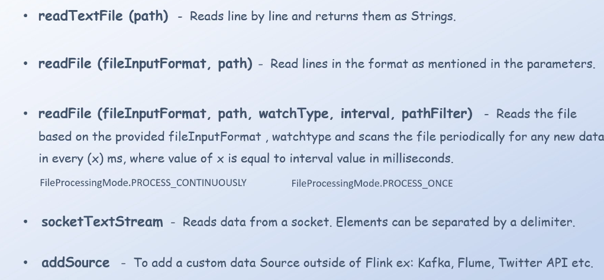

## **0. Overview**

Apache Flink là một trong những công cụ hàng đầu dùng để xử lý dữ liệu streaming (dữ liệu dòng). Khi chúng ta chuyển từ **Dataset API** sang **DataStream API**, sự khác biệt chủ yếu nằm ở cách xử lý dày dữ liệu liên tục thay vì chỉ xử lý dữ liệu tĩnh. Bài viết này sẽ cung cấp kiến thức cơ bản về **DataStream API**, bao gồm các điểm mạnh, các loại data source (nguồn dữ liệu) và data sink (bên ghi dữ liệu).

## **1. DataStream API trong Apache Flink**

DataStream API là mô-đun quan trọng trong Apache Flink giúp xử lý dữ liệu streaming theo thời gian thực.

### **1.1. Sự khác nhau giữa Dataset API và DataStream API**

| **Dataset API** | **DataStream API** |
|-----------------|-----------------|
| Xử lý dữ liệu tĩnh | Xử lý dữ liệu dòng |
| Chạy trên batch processing | Chạy theo thời gian thực |
| Sử dụng `ExecutionEnvironment` | Sử dụng `StreamExecutionEnvironment` |

**Lưu ý**: Về mã nguồn, chúng ta chỉ cần thay thế `ExecutionEnvironment` bằng `StreamExecutionEnvironment` và thay đổi một số tham số là có thể chạy DataStream API.

## **2. Nguồn Dữ Liệu trong DataStream API**
Flink hỗ trợ nhiều loại nguồn dữ liệu (**data sources**), bao gồm:

### **2.1. File (tệp tin)**
- **`readTextFile(path)`**: Đọc file theo dòng.
- **`readTextFile(path, format)`**: Đọc file theo định dạng tùy chỉnh.
- **`readTextFile(path, format, watchType)`**: Kiểm tra file và đọc liên tục.
  - `PROCESS_CONTINUOUSLY`: Theo dõi file theo khoảng thời gian định sẵn.
  - `PROCESS_ONCE`: Chỉ đọc một lần rồi dừng.

### **2.2. Socket (Kết nối mạng)**
- **`socketTextStream(host, port)`**: Nhận dữ liệu trực tiếp từ một socket.

### **2.3. Nguồn Bên Ngoài (Kafka, Flume, Twitter API, etc.)**
- **`addSource()`**: Kết nối với các hệ thống streaming khác như Kafka, Flume, hoặc Twitter API.

## **3. Cách Flink Đọc Dữ Liệu**

Flink chia quá trình đọc dữ liệu từ file thành hai giai đoạn:
1. **Monitoring**: Theo dõi file để phát hiện dữ liệu mới.
2. **Reading**: Chia dữ liệu thành nhiều **splits** và đọc song song.

**Mỗi split chỉ có một reader đọc, tránh trùng lẫp dữ liệu.**

## **4. Data Sinks (Nơi Ghi Dữ Liệu)**
Flink hỗ trợ nhiều loại sink (bên ghi dữ liệu), bao gồm:

- **`writeAsText()`**: Ghi dữ liệu dưới dạng văn bản.
- **`writeAsCsv()`**: Ghi dữ liệu dạng CSV.
- **`print()`**: Hiển thị dữ liệu trên console.
- **`writeUsingOutputFormat()`**: Ghi theo định dạng tùy chỉnh.
- **`writeToSocket()`**: Ghi dữ liệu ra socket.
- **`addSink()`**: Ghi dữ liệu vào hệ thống bên ngoài (Kafka, Elasticsearch, v.v.).

## **5. Kết Luận**
Apache Flink DataStream API là công cụ mạnh mẽ trong xử lý dữ liệu thời gian thực. Các chức năng như **quản lý dữ liệu streaming**, **xử lý song song**, **hỗ trợ Kafka, Flume, Socket**, giúp nó trở thành một lựa chọn hàng đầu trong lĩnh vực **big data**.