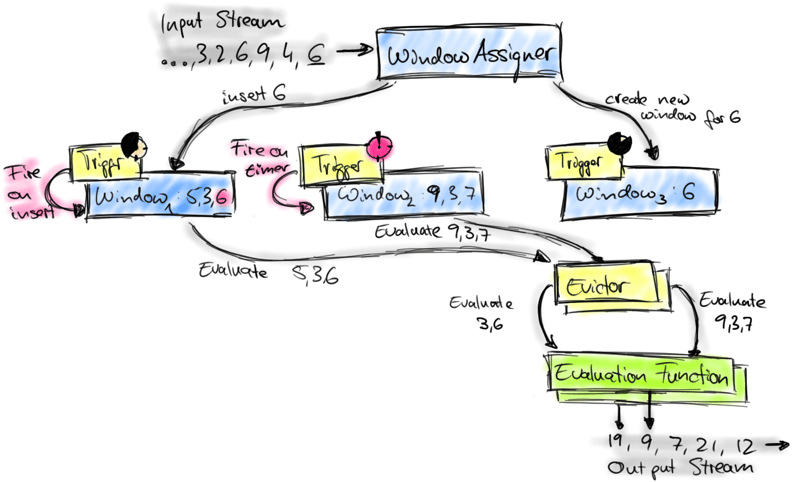
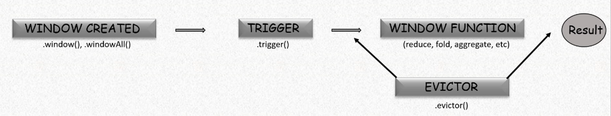

## **1. Trigger là gì?**

Triggers trong Apache Flink xác định thời điểm một cửa sổ (window) sẽ phát ra kết quả và có thể xóa dữ liệu cửa sổ đó. Mỗi cửa sổ có một trigger để đánh giá dữ liệu đến và quyết định khi nào **FIRE** (phát kết quả) hoặc **PURGE** (xóa nội dung cửa sổ).

### **1.1. Các Trigger tích hợp sẵn (Built-in Triggers)**
+ *Flink cung cấp một số trigger mặc định*:

  + **EventTimeTrigger**: Kích hoạt khi **watermark** vượt qua thời gian kết thúc cửa sổ.
  + **ProcessingTimeTrigger**: Kích hoạt khi thời gian xử lý đạt đến thời gian kết thúc cửa sổ.
  + **CountTrigger**: Kích hoạt khi số lượng phần tử trong cửa sổ đạt ngưỡng quy định.
  + **PurgingTrigger**: Biến **trigger** khác thành **trigger** có thể xóa dữ liệu cửa sổ sau khi kích hoạt.

### **1.2. Hạn chế của Built-in Triggers**

+ Không thể kết hợp nhiều trigger (ví dụ: không thể kích hoạt khi đạt số lượng phần tử hoặc đạt đến thời gian nhất định).

+ Nếu thay đổi trigger của một cửa sổ, trigger mặc định sẽ bị thay thế chứ không bổ sung thêm.

### **1.3. Custom Triggers (Trigger Tùy Chỉnh)**

+ Giúp kết hợp nhiều điều kiện (ví dụ: kích hoạt khi đạt số lượng phần tử hoặc khi thời gian kết thúc).

+ Hữu ích cho các kịch bản đặc biệt như phát kết quả sớm, xử lý dữ liệu muộn, hoặc logic theo phiên.

+ Giúp vượt qua giới hạn của built-in triggers để linh hoạt hơn trong xử lý luồng.

## **2. Custom Triggers trong Apache Flink**

### **2.1. Tổng quát về custom Triggers**


Trong **Flink** (DataStream API), một **Trigger** xác định khi nào một cửa sổ (window) sẽ thực thi và phát ra kết quả.

Để tạo một Trigger tùy chỉnh (Custom Trigger), bạn cần tạo một lớp mở rộng từ `Trigger<T, W>`, trong đó:
+ `T` là kiểu dữ liệu của các phần tử trong cửa sổ.
+ `W` là loại cửa sổ (ví dụ: `TimeWindow` cho cửa sổ theo thời gian).

### **2.2. Ghi đè (Override) các phương thức trong Trigger**
- Khi tạo **Custom Trigger**, bạn cần ghi đè một số phương thức của Flink để xác định cách nó hoạt động.  
- Các phương thức quan trọng cần ghi đè bao gồm:
  - `onElement()` → Xử lý khi có phần tử mới vào cửa sổ.
  - `onEventTime()` → Xử lý khi đến một thời điểm cụ thể trong event-time.
  - `onProcessingTime()` → Xử lý khi đến một thời điểm cụ thể trong processing-time.
  - `clear()` → Xóa trạng thái khi cửa sổ kết thúc.

### **2.3. TriggerContext và quản lý trạng thái**
- **`TriggerContext`** là một đối tượng đặc biệt giúp bạn:
  - **Đăng ký hoặc xóa bộ định thời (timers)**: Dùng để thực hiện hành động tại một thời điểm cụ thể.  
  - **Truy cập trạng thái của cửa sổ**: Giúp lưu trữ và theo dõi dữ liệu, ví dụ: đếm số phần tử trong cửa sổ.  
- Ví dụ: Nếu bạn muốn **Trigger kích hoạt sau khi có 10 phần tử**, bạn có thể sử dụng `ValueState<Integer>` để lưu số lượng phần tử đã nhận.

### **2.4. Lưu ý quan trọng về Trigger**
- **Triggers phải có khả năng tuần tự hóa (Serializable)**: Vì chúng là một phần của **Job Graph** được gửi đến các worker nodes.  
- **Trigger chỉ bắn (FIRE) nhưng không xóa dữ liệu**:  
  - Nếu bạn chỉ trả về `FIRE`, cửa sổ vẫn tiếp tục nhận dữ liệu và có thể bắn nhiều lần.  
  - Nếu bạn muốn xóa dữ liệu sau khi Trigger bắn, hãy dùng `FIRE_AND_PURGE` hoặc `PurgingTrigger`.

### **2.5. Ứng dụng thực tế**
- Để giúp bạn hiểu rõ hơn, Flink cung cấp hai ví dụ thực tế về **Custom Triggers**.  
- Nếu bạn đang tìm kiếm giải pháp triển khai trong môi trường sản xuất, bạn có thể tham khảo **Ververica Cloud**, một nền tảng hỗ trợ Apache Flink.

{}

**Scenario**: Một ứng dụng thương mại điện tử theo foix các sự kiện của người dùng như: xem sản phẩm, thêm vào giỏ hàng, hoặc mua hàng, các sự kiện này được xử lý dưới dạng luồng (Datastream). Cử sổ Tumbling có kích thước 1 giờ để tính toán các phân tích theo từng người dùng.

**Requirements:** 
- Phát kết quả sớm nếu cửa sổ nhận được 5 sự kiện từ một người dùng.
- Phát kết quả bình thường nếu khi kết thúc cửa sổ sau sau 1 giờ.

**Cách tiếp cận:**
- Sử dụng **Custom Trigger** để kích hoạt khi đạt 5 sự kiện hoặc kết thúc cửa sổ.
- Kích hoạt cửa sổ trong 2 trường hợp:
  - **Khi đạt 5 sự kiện**: Phát kết quả sớm.
  - **Khi kết thúc cửa sổ**: Phát kết quả bình thường.

```java

// UserEvent là kiểu dữ liệu của sự kiện người dùng
// TimeWindow là loại cửa sổ theo thời gian
public class CustomCountTrigger extends Trigger<UserEvent, TimeWindow> {

    // Xác định worker nào đang làm việc.
    private static final long serialVersionUID = 1L;

    // ValueState to count enlements in the window
    private final ValueStateDescriptor<Integer> countStateDesc = new ValueStateDescriptor<>("count", Integer.class);

    @Override
    public TriggerResult onElement(UserEvent element, long timestamp, TimeWindow window, TriggerContext ctx) throws Exception {
        // Get or create the count state
        ValueState<Integer> countState = ctx.getPartitionedState(countStateDesc);
        int count = countState.value();
        if (count == null) {
            count = 0;
        }

        // Increment the count
        count++;
        countState.update(count);

        // if this is the first element, register an event-time for end-of-window.
        // (Timers are set window end timestamp, so when the watermatk passes windown.end, onEventTime will fire)

        if (count == 1) {
            long windowEnd = window.getEnd(); // Get the end timestamp of the window
            ctx.registerEventTimeTimer(windowEnd);
        }

        if (count >= 5) {
            return TriggerResult.FIRE;
        } else {
            return TriggerResult.CONTINUE;
        }
    }

    @Override
    public TriggerResult onProcessingTime(long timestamp, TimeWindow window, TriggerContext triggerContext) throws Exception {
        return TriggerResult.CONTINUE;
    }

    @Override
    public TriggerResult onEventTime(long timestamp, TimeWindow window, TriggerContext ctx) throws Exception {
        // This is called when the event-time timer fires (i.e when the watermark passes the end of the window)
        if (timestamp == window.getEnd()){
            return TriggerResult.FIRE_AND_PURGE;
        }

        // if it's not the end of the window, continue processing
        return TriggerResult.CONTINUE;
    }

    @Override
    public void clear(TimeWindow window, TriggerContext ctx) throws Exception {
        // Clear the count state when the window is purged/closed.
        ValueState<Integer> countState = ctx.getPartitionedState(countStateDesc);
        countState.clear();
        // we don't need to clean up timers because they will be cleared automatically
    }
    
}
```



Nếu tổng số sự kiện đạt 5, kích hoạt `TriggerResult.FIRE`.

`FIRE` có nghĩa là phát kết quả nhưng không xóa trạng thái cửa sổ.
Điều này cho phép tiếp tục thu thập dữ liệu trong cửa sổ, đảm bảo rằng kết quả cuối cùng vẫn có đầy đủ dữ liệu.
Nếu muốn kích hoạt nhiều lần (mỗi 5 sự kiện), ta có thể đặt lại `countState = 0` sau khi `FIRE`.


{}

{}
**Scenario:** Trong các ứng dụng thương mại điện tử hoặc hệ thống đăng nhập, chúng ta có thể xác định thời gian kết thúc phiên (session) theo hai cách:
+ Sau 30 phút không có hoạt động (session timeout).
+ Khi gặp sự kiện đặc biệt như logout hoặc checkout complete.

**Problem:** Flink mặc định chỉ đóng cửa sổ dựa trên timeout và không nhận diện được sự kiện đặc biệt.

**Approach:** Xây dựng một trigger tùy chỉnh, kích hoạt khi:

+ Gặp sự kiện đặc biệt → kết thúc ngay lập tức.
+ Hết thời gian timeout → kết thúc phiên bình thường.

```java
public class SesionEndTrigger extends Trigger<UserEvent, TimeWindow>{
    private static final long serialVersionUID = 1L;

    @Override
    public TriggerResult onElement(UserEvent element, long timestamp, TimeWindow window, TriggerContext ctx) throws Exception {
        // Register a processing-time timer for the end of the session
        ctx.registerProcessingTimeTimer(window.getEnd());

        if ("LOGOUT".equals(element.geEventType()) || "CHECKOUT_COMPLETE".equals(element.getEventType())){
            return TriggerResult.FIRE_AND_PURGE;
        } else {
            return TriggerResult.CONTINUE;
        }
    }

    @Override
    public TriggerResult onProcessingTime(long timestamp, TimeWindow window, TriggerContext ctx) throws Exception {
        return TriggerResult.CONTINUE;
    }

    @Override
    public TriggerResult onEventTime(long timestamp, TimeWindow window, TriggerContext ctx) throws Exception {
        // round the timestamp to the next millisecond
        if (timestamp + 1 == window.getEnd()){
            return TriggerResult.FIRE_AND_PURGE;
        } else {
            return TriggerResult.CONTINUE;
        }
    }

    @Override
    public void onMerge(TimeWindow window, OnMergeContext ctx) throws Exception {
        // When windows merge, the new window will have the latest end time
        ctx.registerProcessingTimeTimer(window.getEnd());
    }

    @Override
    public boolean canMerge() {
        return true;
    }

    @Override
    public void clear(TimeWindow window, TriggerContext ctx) throws Exception {
        ctx.deleteEventTimeTimer(window.maxTimestamp());
    }
}
```
{}


## **3. Evictor**

### **3.1. Evictor là gì?**

**Evictor** là một tùy chọn trong cửa sổ (window) của Flink, dùng để loại bỏ các phần tử khỏi cửa sổ sau khi trigger kích hoạt, trước và/hoặc sau khi áp dụng hàm xử lý cửa sổ.


### **3.2. Vòng đời của một cửa sổ trong Flink**



1. Cửa sổ được tạo bằng `window` hoặc `windowAll`.
2. Trigger kích hoạt khi điều kiện thỏa mãn (có thể là mặc định hoặc tùy chỉnh).
3. Hàm xử lý cửa sổ (window function) như `reduce`, `fold`, `aggregate` được áp dụng để tính toán kết quả.
4. `Evictor` (tuỳ chọn) có thể hoạt động:
+ Trước khi hàm xử lý cửa sổ chạy (`evictBefore`).
+ Sau khi hàm xử lý cửa sổ chạy (`evictAfter`).
+ Cả hai vị trí cùng lúc.