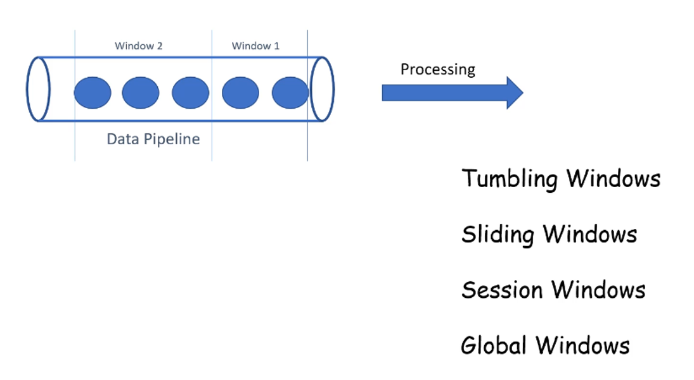
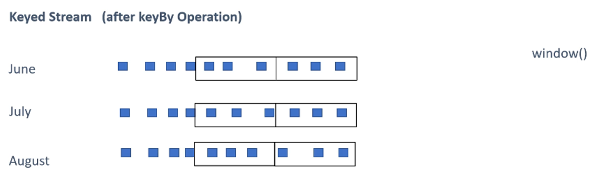
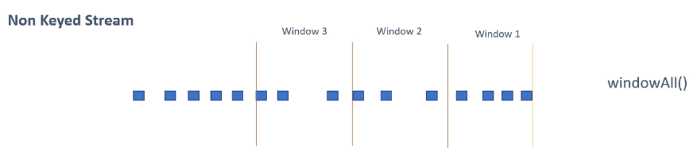

Windows là một khái niệm quan trọng trong xử lý dữ liệu dòng (stream processing) trong Apache Flink. Chúng giúp chia dữ liệu dòng vô hạn thành các phần nhỏ có kích thước hữu hạn để có thể áp dụng các phép tính toán. Nói cách khác, windows là các tập hợp con của một dòng dữ liệu và được xử lý như các đơn vị riêng lẻ.

Trong bài viết này, chúng ta sẽ tìm hiểu chi tiết về các loại Windows có sẵn trong Flink, cách chúng hoạt động và cách triển khai chúng trong một chương trình Flink.

## **1. Introduction to Windowns in Flink**

Trong xử lý dữ liệu dòng, dữ liệu có thể đến một cách liên tục với khoảng thời gian không xác định. Để xử lý dữ liệu này, Flink cung cấp các cơ chế "Windows" để nhóm các phần dữ liệu lại với nhau dựa trên một số điều kiện nhất định.

Một cửa sổ (window) được tạo ngay khi phần tử đầu tiên thuộc về cửa sổ đó xuất hiện. Cửa sổ kết thúc khi một điều kiện cụ thể được đáp ứng, và một cửa sổ mới bắt đầu.

Những điều kiện này có thể là:

+ Một khoảng thời gian đã trôi qua (theo giây, phút, giờ, v.v.).

+ Một sự kiện xảy ra.

+ Khi số lượng phần tử trong cửa sổ đạt đến giới hạn nhất định.

> Mỗi điều kiện này tương ứng với một loại cửa sổ khác nhau trong Flink.

### **1.1. Types of Windows in Flink**



Flink cung cấp một số loại cửa sổ được định nghĩa sẵn, bao gồm:

+ **Tumbling Windows** (Cửa sổ cố định không trùng lặp) Là các cửa sổ có kích thước cố định và không chồng lấp nhau. Mỗi phần tử chỉ thuộc về một cửa sổ duy nhất. Ví dụ, với cửa sổ tumbling 10 giây, dữ liệu sẽ được chia thành các khoảng thời gian 10 giây liên tiếp, và mỗi cửa sổ sẽ chứa các phần tử trong khoảng thời gian đó. 

+ **Sliding Windows** (Cửa sổ trượt): Cũng có kích thước cố định nhưng có thể chồng lấp nhau. Mỗi phần tử có thể thuộc về nhiều cửa sổ khác nhau tùy thuộc vào khoảng thời gian trượt (slide interval). Ví dụ, với cửa sổ kích thước 10 giây và khoảng trượt 5 giây, một cửa sổ mới sẽ bắt đầu mỗi 5 giây và chứa dữ liệu trong 10 giây tiếp theo, dẫn đến sự chồng lấp giữa các cửa sổ.

+ **Session Windows** (Cửa sổ phiên): Được xác định dựa trên khoảng thời gian không hoạt động (inactivity gap). Một cửa sổ session kết thúc khi không có sự kiện nào xảy ra trong một khoảng thời gian xác định trước. Điều này hữu ích để nhóm các sự kiện liên quan xảy ra gần nhau về mặt thời gian. ​

+ **Global Windows** (Cửa sổ toàn cục): Thu thập tất cả các phần tử vào một cửa sổ duy nhất mà không áp dụng bất kỳ giới hạn thời gian nào. Cửa sổ này tiếp tục mở và chỉ kết thúc khi được kích hoạt bởi một trigger cụ thể. 

>[!NOTE]
>Ngoài các cửa sổ tích hợp sẵn, Flink còn cho phép người dùng tạo các cửa sổ tùy chỉnh để phù hợp với nhu cầu cụ thể của ứng dụng. ​

## **2. Window Assigners**

Windows có thể được áp dụng trên **Keyed Stream** hoặc **Non-Keyed Stream**:

+ **Keyed Stream** là một luồng dữ liệu đã được nhóm lại dựa trên một khóa `keyBy()`. Khi dữ liệu được nhóm theo một khóa cụ thể, Flink sẽ tạo ra các `sub-stream` độc lập cho mỗi giá trị khóa. Điều này cho phép xử lý song song vì mỗi sub-stream có thể được xử lý một cách riêng biệt và ta dùng .`window(...)` để tạo cửa sổ.


+ **Non-Keyed Stream** là luồng dữ liệu không được nhóm theo bất kỳ khóa nào, tức là toàn bộ dữ liệu được xử lý như một thể thống nhất. Điều này có nghĩa là tất cả dữ liệu trong luồng sẽ được xử lý cùng nhau trong một cửa sổ duy nhất và ta dùng `windowAll(...)` để tạo cửa sổ.


```java{filename="Example"}
// Non-Keyed Stream
input.windowAll(TumblingEventTimeWindows.of(Time.seconds(10)))
     .sum(1);

// Keyed Stream
input.keyBy(value -> value.f0)
     .window(TumblingEventTimeWindows.of(Time.seconds(10)))
     .sum(1);
```

>Việc sử dụng **Keyed Stream** giúp việc xử lý dữ liệu được thực hiện song song trên nhiều tác vụ, trong khi **Non-Keyed Stream** xử lý dữ liệu trong một nhiệm vụ duy nhất.

## **3. Various Time Notions of Windows in Flink**


+ **Event Time** là thời gian thực tế khi sự kiện xảy ra tại `source`. Timestamp của sự kiện được nhúng vào trong data. Kết quả tính toán là nhất quán không bị ảnh hưởng bởi thứ tự đến của dữ liệu. Có thể gặp độ trễ khi chờ các sự kiện đến muộn.

+ **Ingestion Time** là thời gian khi dữ liệu được nhập vào Flink. Mỗi `record` nhận một `timestamp` tại thời điểm hệ thống. Mọi phép toán dựa trên thời gian sử dụng `timestamp` này. Không thể xử lý sự kiện đến muộn hoặc sai thứ tự.

+ **Processing Time** là thời gian khi dữ liệu được xử lý bởi Flink. Không cần đồng bộ với các máy trong hệ phân tán. Có độ trễ thấp và hiệu năng cao. Không phù hợp với môi trường phân tán có dữ liệu đến muộn.


{}
### **1. Event Time - Xử lý dựa trên thời gian thực tế của sự kiện**
Giả sử chúng ta có dữ liệu giao dịch được ghi nhận từ cảm biến với timestamp thực tế:

| Transaction ID | Amount | Event Time |
|---------------|--------|------------|
| T1            | 100    | 12:00:01   |
| T2            | 200    | 12:00:03   |
| T3            | 150    | 12:00:07   |

Nếu chúng ta muốn tính tổng số tiền giao dịch theo cửa sổ 5 giây dựa trên **Event Time**, chúng ta sử dụng:

```java
env.setStreamTimeCharacteristic(TimeCharacteristic.EventTime);

DataStream<Transaction> transactions = input
    .assignTimestampsAndWatermarks(
        WatermarkStrategy.<Transaction>forBoundedOutOfOrderness(Duration.ofSeconds(2))
            .withTimestampAssigner((event, timestamp) -> event.getTimestamp())
    );

DataStream<Tuple2<String, Integer>> result = transactions
    .keyBy(Transaction::getCategory)
    .window(TumblingEventTimeWindows.of(Time.seconds(5)))
    .sum("amount");
```

- **Ưu điểm**: Đảm bảo tính toán chính xác dù dữ liệu đến muộn.
- **Nhược điểm**: Cần xử lý trễ để đảm bảo dữ liệu muộn không bị mất.

---

### **2. Ingestion Time - Xử lý dựa trên thời gian nhập vào Flink**
Giả sử dữ liệu từ cảm biến được nhập vào Flink với thời gian nhập liệu như sau:

| Transaction ID | Amount | Event Time | Ingestion Time |
|---------------|--------|------------|----------------|
| T1            | 100    | 12:00:01   | 12:00:02       |
| T2            | 200    | 12:00:03   | 12:00:04       |
| T3            | 150    | 12:00:07   | 12:00:08       |

Flink sẽ sử dụng **Ingestion Time** thay vì **Event Time**:

```java
env.setStreamTimeCharacteristic(TimeCharacteristic.IngestionTime);

DataStream<Tuple2<String, Integer>> result = input
    .keyBy(value -> value.f0)
    .window(TumblingProcessingTimeWindows.of(Time.seconds(5)))
    .sum(1);
```

- **Ưu điểm**: Không cần xử lý dữ liệu trễ.
- **Nhược điểm**: Không phù hợp nếu dữ liệu đến không theo thứ tự hoặc bị trễ.

---

### **3. Processing Time - Xử lý theo thời gian thực của máy chạy Flink**

Khi sử dụng **Processing Time**, Flink lấy thời gian hiện tại của hệ thống để xử lý dữ liệu:

```java
env.setStreamTimeCharacteristic(TimeCharacteristic.ProcessingTime);

DataStream<Tuple2<String, Integer>> result = input
    .keyBy(value -> value.f0)
    .window(TumblingProcessingTimeWindows.of(Time.seconds(5)))
    .sum(1);
```

- **Ưu điểm**: Hiệu suất cao vì không cần chờ dữ liệu muộn.
- **Nhược điểm**: Không chính xác nếu dữ liệu đến muộn hoặc đến không theo thứ tự.

{}


## **4. Implement Tumbling Windows**

### **4.1. Tumbling Windows với Processing Time**

Chúng ta sẽ tạo một tumbling window sử dụng Processing Time với kích thước 2 giây. Dữ liệu đầu vào sẽ được đọc từ socket 9090.

```java
DataStream<String> input = env.socketTextStream("localhost", 9090);
DataStream<Tuple2<String, Integer>> result = input
    .map(value -> new Tuple2<>(value, 1))
    .keyBy(value -> value.f0)
    .window(TumblingProcessingTimeWindows.of(Time.seconds(2)))
    .sum(1);
```

>[!NOTE]
>Ban đầu chương trình sẽ chạy `env.socketTextStream` thì nó sẽ default là **processing time**.

### **4.2. Tumbling Windows với Event Time**

Để tạo tumbling windows với Event Time, ta cần đảm bảo dữ liệu có timestamp và thông báo timestamp cho Flink.

```java
DataStream<String> input = env.socketTextStream("localhost", 9090);
DataStream<Tuple2<Long, Integer>> result = input
    .map(value -> {
        String[] parts = value.split(",");
        return new Tuple2<>(Long.parseLong(parts[0]), Integer.parseInt(parts[1]));
    })
    .assignTimestampsAndWatermarks(WatermarkStrategy
        .<Tuple2<Long, Integer>>forMonotonousTimestamps()
        .withTimestampAssigner((event, timestamp) -> event.f0))
    .windowAll(TumblingEventTimeWindows.of(Time.seconds(5)))
    .sum(1);
```

Trong đoạn code trên, chúng ta sử dụng `assignTimestampsAndWatermarks` để chỉ định trường timestamp từ dữ liệu và sử dụng Tumbling Event Time Windows với kích thước 5 giây.


**Phần này để lưu file có thể coi kỹ ở** [DataStream API Operation](https://nightlies.apache.org/flink/flink-docs-release-1.20/docs/connectors/datastream/filesystem/).
```python
reduced.addSink(StreamingFileSink
      .forRowFormat(new Path("/home/jivesh/www"),
        new SimpleStringEncoder < Tuple5 < String, String, String, Integer, Integer >> ("UTF-8"))
      .withRollingPolicy(DefaultRollingPolicy.builder().build())
      .build());
```



## **5. Implement Sliding Windows**

### **5.1. Sliding Windows với Processing Time**

```java
DataStream<Tuple5<String, String, String, Integer, Integer>> reduced = mapped
	.keyBy(0)
	.window(SlidingProcessingTimeWindows.of(Time.seconds(2), Time.seconds(1)))
	.reduce(new Reduce1());
```

### **5.2. Sliding Windows với Event Time**

```java
env.setStreamTimeCharacteristic(TimeCharacteristic.EventTime);

DataStream<Tuple2<Long, String>> sum = data.map(new sliptter())
    .assignTimestampsAndWatermarks(new AscendingTimestampExtractor<Tuple2<Long, String>>()  
    {
        public long extractAscendingTimestamp(Tuple2<Long, String> t)
        {
            return t.f0;
        }
    })
    .windowAll(SlidingEventTimeWindows.of(Time.seconds(4), Time.seconds(2)))
    .reduce(new Reduce1());
```

## **6. Implement Session Windows**

Session Windows không có kích thước cố định. Thay vào đó, chúng được xác định bởi khoảng thời gian không hoạt động giữa các sự kiện. Khi không có sự kiện nào đến trong một khoảng thời gian nhất định (timeout), cửa sổ sẽ đóng lại. Còn nếu có sự kiến đến trong khoảng thời gian timeout, cửa sổ sẽ tiếp tục mở.khoảng các giữa 2 size gap nhỏ ở một ngưỡng nhất định sẽ được gộp lại.


```java
DataStream<Tuple5<String, String, String, Integer, Integer>> reduced = mapped
    .keyBy(0)
    .window(ProcessingTimeSessionWindows.withGap(Time.seconds(1)))
    .reduce(new Reduce1());   
```

## **7. Implement Global Windows**

Global Windows là một loại cửa sổ đặc biệt trong Flink. Không giống như các cửa sổ khác, Global Windows không tự động chia nhỏ dữ liệu theo thời gian hay sự kiện. Thay vào đó, nó giữ toàn bộ dữ liệu vào một cửa sổ duy nhất cho mỗi key.

> 📌 **Vấn đề:** Vì Global Windows không có giới hạn, nếu không có trigger, dữ liệu sẽ không bao giờ được xử lý.


Do dữ liệu trong Global Windows không bao giờ tự động được xử lý, ta cần sử dụng Trigger để xác định khi nào nên thực hiện tính toán.

```java
DataStream<Tuple2<String, Integer>> result = input
    .keyBy(value -> value.f0)
    .window(GlobalWindows.create())
    .trigger(CountTrigger.of(1))
    .sum(1);
```


## **8. Timers trong Apache Flink**

Timers trong Flink là các **callback** được lập lịch để kích hoạt tại một thời điểm cụ thể trong tương lai. Chúng giúp bạn thực hiện các hành động như:

+ Kích hoạt logic **khi đến hạn**.
+ **Hẹn giờ** xóa dữ liệu trong cửa sổ.
+ **Phát tín hiệu** khi một khoảng thời gian trôi qua.

Flink hỗ trợ hai loại Timer chính dựa trên **Processing Time** và **Event Time**.

### **8.1 Processing-Time Timers (Bộ đếm thời gian dựa trên thời gian xử lý)**

+ Dựa trên thời gian thực của hệ thống (wall-clock time).
+ Khi thời gian trên máy đạt mốc hẹn giờ, bộ đếm thời gian kích hoạt.

+ **Ưu điểm**
    + Dễ triển khai độ trễ thấp.
    + Không cần đồng bộ watermark giữa các luồng dữ liệu.

+ **Không đảm bảo tính chính xác của dữ liệu đến muộn hoặc bị trễ xử lý.**

### **8.2 Event-Time Timers (Bộ đếm thời gian dựa trên thời gian sự kiện)**

+ Dựa trên timestamp của sự kiện (thời điểm sự kiện xảy ra thực tế).
+ Dựa vào watermark để quyết định khi nào bộ đếm thời gian kích hoạt.

+ **Ưu điểm**:
    + Đảm bảo tính chính xác của dữ liệu đến muộn hoặc bị trễ xử lý.
    + Được sử dụng trong các trường hợp cần xử lý dữ liệu theo thời gian thực tế.
+ **Nhược điểm**:
    + Đòi hỏi đồng bộ watermark giữa các luồng dữ liệu.
    + Cần xử lý trễ để đảm bảo dữ liệu đến muộn không bị mất.

### **8.3 Stateful Processing và Timers trong Flink**

Trong Flink, hầu hết các ứng dụng streaming đều stateful, tức là lưu trạng thái giữa các sự kiện. `ProcessFunction`, đặc biệt là `KeyedProcessFunction`, cung cấp quyền truy cập vào state và timers, giúp xây dựng logic tùy chỉnh mạnh mẽ.

+ **Những thành phần chính**:
  + *Keyed State:*
    + Cho phép lưu trữ các dạng dữ liệu ở dạng key (Ví dụ `ValueState`, `ListState`)
    + Trạng thái này được lưu trong **State backend** và có thể phục hồi sau sự cố.
  + **TimerService:**
    + Cho phép đăng ký timmers theo eventime hoặc processing time.
    + Khi đến thời điểm đăng ký, Flink gọi `onTimer()` để thực thi logic.
  + **Timer Callbacks**
    + Khi timer kích hoạt, onTimer() chạy trong bối cảnh của key, cho phép đọc và cập nhật state.
    + Flink đảm bảo đồng bộ, tránh xung đột truy cập state.
  + **Quản lý State và Timers**:
    + State và timers đều được checkpoint để phục hồi khi job restart.
    + Nếu một timer lẽ ra đã kích hoạt khi job bị down, nó sẽ được gọi ngay sau khi job khôi phục.
    + Timers được **deduplicate**, mỗi key chỉ có một timer cho mỗi timestamp.

{}
Chúng ta có một luồng dữ liệu từ các cảm biến IoT, mỗi bản ghi bao gồm **ID cảm biến**, **Timestamp** (thời gian sự kiên - event time), **Giá trị nhiệt độ**.

Chúng ta cần thực hiện **hai nhiệm vụ chính**:

+ **Tổng hợp định kỳ** (Sử dụng Event-Time Timer):
  + Tính nhiệt độ trung bình của mỗi cảm biến trong 1 phút.
  + Thay vì dùng cửa sổ thời gian (window), ta sử dụng event-time timer để kiểm soát khi nào xuất kết quả.
  + Điều này giúp xử lý chính xác các sự kiện đến trễ (out-of-order) bằng watermark.
+ **Cảnh báo khi cảm biến ngừng hoạt động** (Sử dụng Processing-Time Timer)
  + Phát hiện nếu một cảm biến ngừng gửi dữ liệu trong 10 giây.
  + Nếu không có sự kiện mới trong khoảng thời gian này, tạo cảnh báo.
  + Điều này sử dụng processing-time timer, vì thời gian xử lý vẫn tiếp tục chạy ngay cả khi không có sự kiện mới.
+ **Quản lý trạng thái** (ValueState)
    Đối với mỗi cảm biến (key), ta lưu trữ:
    + Tổng nhiệt độ và số lượng bản ghi để tính trung bình.
    + Thời điểm kết thúc cửa sổ hiện tại, giúp xác định khi nào cần xuất kết quả.
    + Thời điểm của timer giám sát hoạt động, để có thể hủy nếu cảm biến gửi dữ liệu kịp thời.

Bằng cách sử dụng `KeyedProcessFunction`, `event-time timer`, và `processing-time timer`, chúng ta có thể thực hiện tổng hợp dữ liệu theo thời gian sự kiện và phát hiện bất thường theo thời gian thực một cách hiệu quả!

```java{filename="SensorReading.java"}
import lombok.AllArgsConstructor;
import lombok.Data;
import lombok.NoArgsConstructor;

@Data
@NoArgsConstructor
@AllArgsConstructor
public class SensorReading {
    private String sensorId;
    private long timestamp;
    private double temperature;
}

```

```java{filename="SensorProcessorFn.java"}
public class SensorProcessorFn extends KeyedProcessFunction<String, SensorReading, String> {
    
    private ValueState<Double> sumState;
    private ValueState<Long> countState;
    private ValueState<Long> windowEndState;
    private ValueState<Long> inactivityTimerState;

    // Constrants for timer duration

    private static final long WINDOW_DURATION = 60_000L;       // 1 minute window
    private static final long INACTIVITY_THRESHOLD = 10_000L;  // 10 seconds inactivity

    @Override
    public void open(OpenContext openContext) throws Exception {
        // Initialize state descriptors
        sumState = getRuntimeContext()
                .getState(
                        new ValueStateDescriptor<>("sum", Types.DOUBLE)
                );

        countState = getRuntimeContext()
                .getState(
                        new ValueStateDescriptor<>("count", Types.LONG)
                );

        windowEndState = getRuntimeContext()
                .getState(
                        new ValueStateDescriptor<>("windowEnd", Types.LONG)
                );

        inactivityTimerState = getRuntimeContext()
                .getState(
                        new ValueStateDescriptor<>("inactivityTimer", Types.LONG)
                );
    }
    
    @Override
    public void processElement(SensorReading sensorReading,
                               KeyedProcessFunction<String, SensorReading, String>.Context context,
                               Collector<String> collector) throws Exception {
        // Extract the event timestamp of the current reading
        long eventTime = sensorReading.getTimestamp();
        Long currentWindowEnd = windowEndState.value();

        // 1) Event-Time Timer Logic for windowing
        if (currentWindowEnd == null) {
            // This is the first event for this key or the first event after a window reset
            long windowStart = eventTime - (eventTime % WINDOW_DURATION);
            long windowEnd = windowStart + WINDOW_DURATION;
            // register an event-time timer for end of the window
            context.timerService().registerEventTimeTimer(windowEnd);

            windowEndState.update(windowEnd);
            sumState.update(sensorReading.getTemperature());
            countState.update(1L);
        } else if (eventTime < currentWindowEnd) {
            // Still within the current window
            sumState.update(sumState.value() + sensorReading.getTemperature());
            countState.update(countState.value() + 1);
        } else {
            // The new event belongs to a next window (current window has ended)
            // Emit the result for the current window before resetting
            double sum = sumState.value();
            long count = countState.value();
            double avg = sum / count;
            collector.collect(
                    "Average temperature for sensor " + sensorReading.getSensorId()
                            + " for window ending at " + currentWindowEnd + " = " + avg
            );
            // Clear the old window state and cancel the old timer
            context.timerService().deleteEventTimeTimer(currentWindowEnd);

            sumState.clear();
            countState.clear();
            windowEndState.clear();

            // Start a new window for the incoming event
            long windowStart = eventTime - (eventTime % WINDOW_DURATION);
            long windowEnd = windowStart + WINDOW_DURATION;

            context.timerService().registerEventTimeTimer(windowEnd);
            windowEndState.update(windowEnd);
            sumState.update(sensorReading.getTemperature());
            countState.update(1L);
        }
        // 2) Processing-Time Timer Logic for inactivity alert (10s of no events)
        //      Every time we get an event, schedule a processing-time timer X ms in the future.
        //      If a new event comes before that, cancel the previous timer and schedule a new one.
        Long prevTimerTimestamp = inactivityTimerState.value();
        if (prevTimerTimestamp != null) {
            // Remove the old scheduled timer because we got a new event
            context.timerService().deleteProcessingTimeTimer(prevTimerTimestamp);
        }
        // Register a new processing-time timer for now + threshold
        long newTimerTimestamp = context.timerService().currentProcessingTime() + INACTIVITY_THRESHOLD;
        context.timerService().registerProcessingTimeTimer(newTimerTimestamp);
        // Store the new timer's timestamp in state
        inactivityTimerState.update(newTimerTimestamp);
    }

    @Override
    public void onTimer(long timestamp, KeyedProcessFunction<String, SensorReading, String>.OnTimerContext ctx, Collector<String> out) throws Exception {
        // Check the domain of the timer (event-time or processing-time)
        if (ctx.timeDomain() == TimeDomain.EVENT_TIME) {
            // Event-time timer fired (window end reached)
            double sum = sumState.value() != null ? sumState.value() : 0.0;
            long count = countState.value() != null ? countState.value() : 0L;
            if (count > 0) {
                double avg = sum / count;
                out.collect("Average temperature for sensor " + ctx.getCurrentKey() +
                        " for window ending at " + timestamp + " = " + avg);
            }
            // Clear window state after emitting result
            sumState.clear();
            countState.clear();
            windowEndState.clear();
//            Thread.sleep(10000); // Uncomment this line to simulate a slow processing time and show the inactivity alert in action
        } else if (ctx.timeDomain() == TimeDomain.PROCESSING_TIME) {
            // Processing-time timer fired (inactivity threshold passed)
            out.collect("ALERT: Sensor " + ctx.getCurrentKey() + " has been inactive for " + (INACTIVITY_THRESHOLD / 1000) + " seconds");
            // Clear the inactivity timer state (no active timer now for this key)
            inactivityTimerState.clear();
        }
    }
}
```


{}


