Chapter 1: Introduction
<!--more-->

## 1. Computer Networks and the Internet

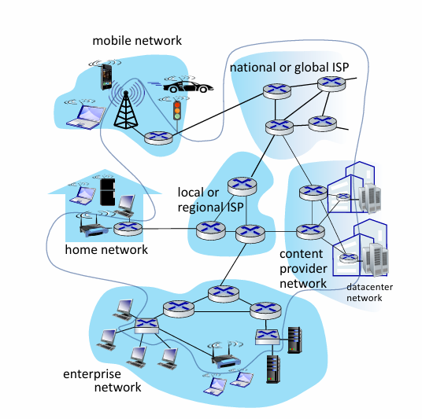

Hàng tỷ thiết bị (devices) điện toán được kết nối: 

- host = end system
- chạy các ứng dụng mạng ở “Internet edge”

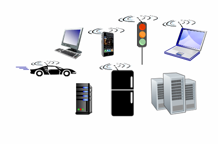

Packet switches: forward packets (chunks of data) routers, switches

→ Ngày xưa ngta phân routers và switches riêng biệt nhưng ngày nay thường các hệ thốn gộp hai cái đó lại nếu user muốn sử dụng cái nào thì chỉ cần cấu hình cái đó ra thôi.

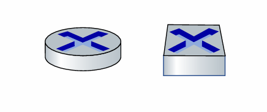

Communication links: fiber, copper, radio, satellite

transmission rate: bandwidth (đánh giá tốc độ mạng nó chỉ mang tính chất tương đối)

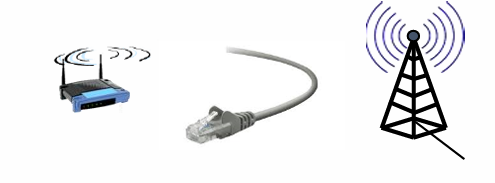

Networks:  collection of devices, routers/switches, links: managed by an organization

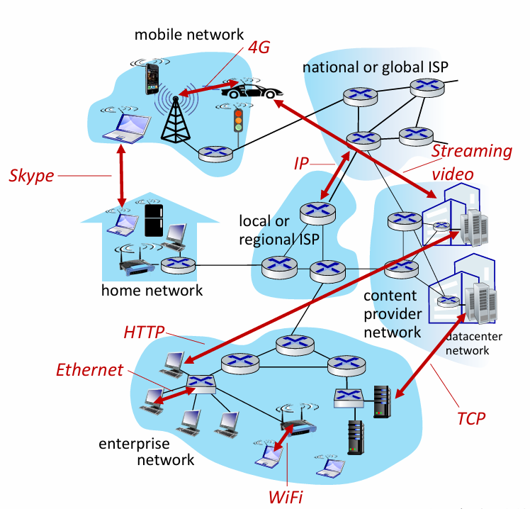

Internet: “network of networks” các ISPs (ISPs là các nhà cung cấp mạng như viettel, vinaphone, … nó sẽ có các hạ tầng khác nhau nhưng mà nó phải giao tiếp chung được với nhau) kết nối với nhau

protocolsare everywhere :

- control sending, receiving of messages e.g., HTTP (Web), RTP (streaming video), Skype, TCP, IP, Wi-Fi, 4G, Ethernet

Internet  standards:

- RFC: Request for Comments ( nó không như chuẩn nó bắt buộc phải thỏa mãn  không bị lỗi còn cái này nếu bị lỗi thì nó sẽ phản hồi về lỗi )
- IETF: Internet Engineering Task Force

Internet vừa cung cấp dịch vụ cho người dùng vừa được sử dụng để tạo ra ứng dụng:

- Infrastructure that provides services to applications: Web, streaming video, multimedia
teleconferencing, email, games, ecommerce, social media, interconnected appliances, …
- provides programming interface to distributed applications:  “hooks” allowing sending/receiving apps to “connect”to, use  Internet transport service

Các protocolsare xác định định dạng, thứ tự của các message được gửi và nhận giữa các thực thể mạng và các hành động được thực hiện khi truyền, nhận tin nhắn.

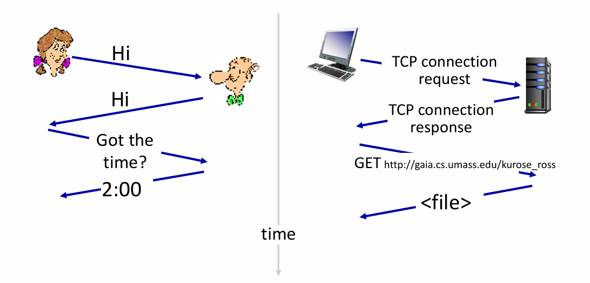

## 2. Network edge: hosts, access network, physical media

- Network edge: hosts: clients and servers , servers often in data centers (hiện nay thường là clouds)
- client và server chỉ là vai trò của thiết bị.

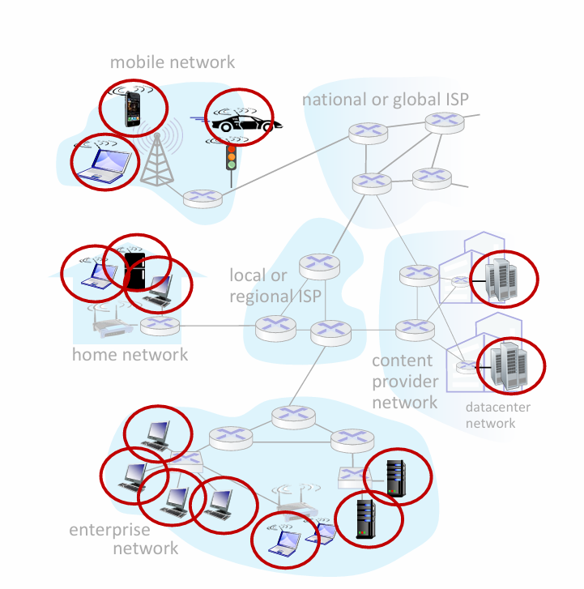

- Access networks, physical media:  wired, wireless communication links
- Quan tâm kết nối thế nào trên đường tuy cập

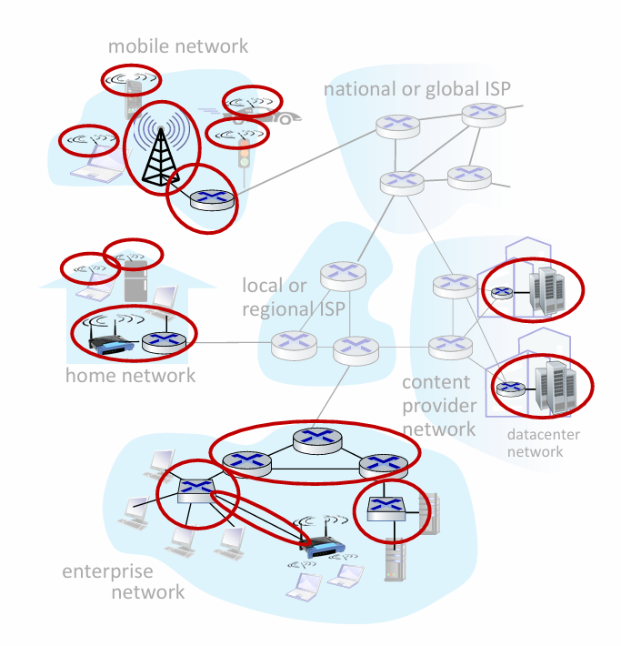

- Network core: interconnected routers, network of networks

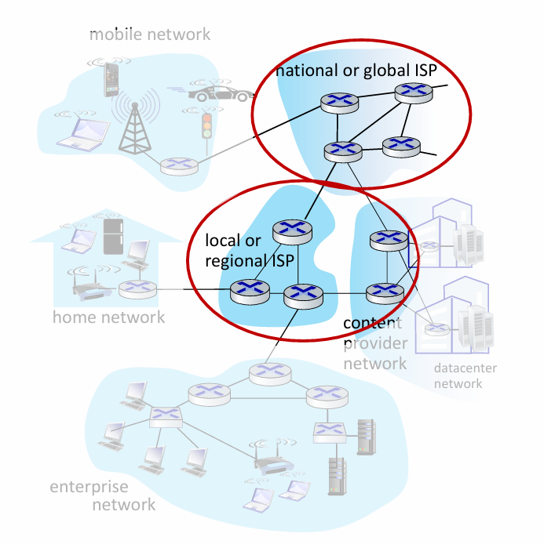

## 3. Access networks

- ***Cable-based access***
    
    
    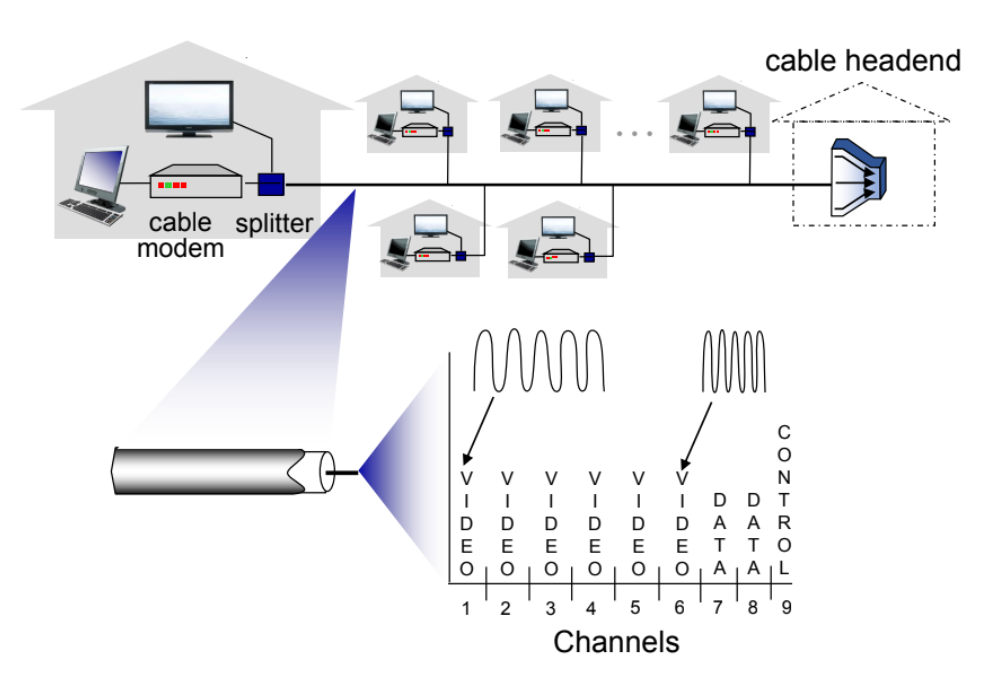
    
    
    
    Dây cáp quang được sử dụng với tốc độ downstream: 40 Mbps - 1.2 Gbs và tốc độ upstream: 30 - 100 Mbps.
    
- ***Digital subscriber line (DSL)***
    
    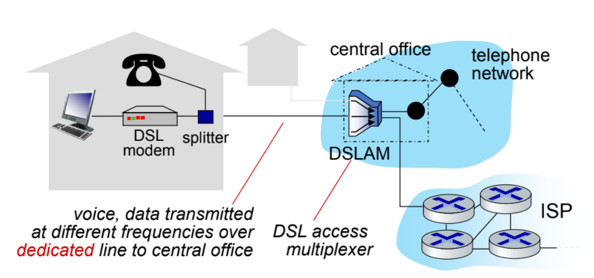
    
    Downstream với tốc độ: 24-52Mbps và Upstream với tốc độ: 3.5-16Mbps.
    
- ***Home networks***
    
    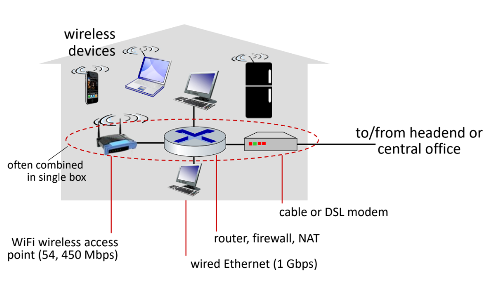
    
    Wireless access networks
    
    Wireless local area networks (WLANs)
    
    ---
    
    Sử dụng trong khu vực nhà, hoặc trong tòa nhà. Với tốc độ: 11, 54, 540 Mbps.
    
    ---
    
    WireCung cấp cho điện thoại di động với hơn 10kms. Tốc độ mạng 10Mbps.
    
- **Enterprise networks**
    
    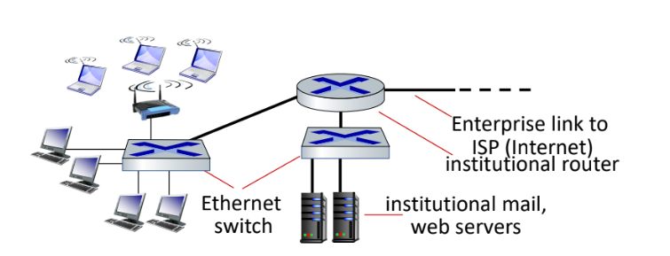
    
    Chi phí làm switch sẽ ít tốn hơn so với route nên phân chia các chức năng ngta thường sử dụng switch.
    
    - **Ethernet**: wired access at 100Mbps, 1Gbps, 10Gbps
    - **WiFi**: wireless access points at 11, 54, 450 Mbps
- **Links: physical media**
    
    Nối bên gửi và bên nhận với nhau:
    
    - Có hướng: cáp đồng, cáp quang
    - Không hướng: môi trường không dây
    - **Có hướng - Cáp đồng xoắn (Twisted Pair)**
        
        
        - Nhiều cặp dây đồng xoắn
        - Có bọc kim chống nhiễu (Shielded Twisted Pair)
        - Không bọc kim chống nhiễu (Unshielded Twisted Pair)
        - Giá thành thấp
        - Tốc độ thấp
        - **Phân loại:**
            - UTP (không có vỏ bảo vệ)
            - STP (có giấy bạc (thiếc) bảo vệ → chống nhiễu tốt hơn → tin cậy hơn)
        
        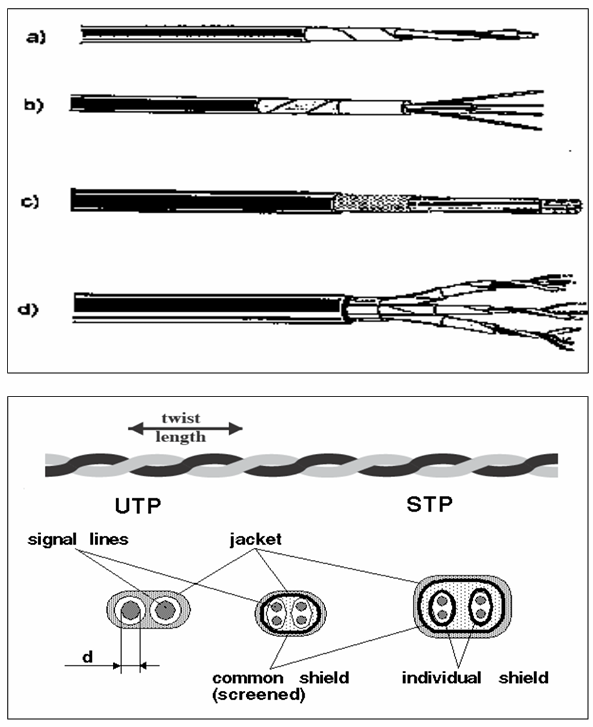
        
    - **Có hướng - Cáp đồng trục (Coaxial Cable)**
        
        
        - Lõi dẫn điện được bọc bởi một lớp điện môi không dẫn điện
        - Quấn thêm một lớp đệm kim loại
        - Ngoài cùng có vỏ bọc cách điện
        - Giá thành cao, tốc độ cao
        
        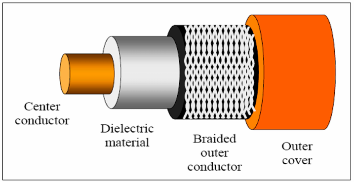
        
    - **Có hướng - Cáp quang (Fiber Optic)**
        
        
        - Thuỷ tinh hoặc nhựa truyền sóng ánh sáng
        - Giá thành cao
        - Tốc độ cao, tỉ lệ lỗi bit thấp, độ suy hào rất nhỏ.
        
        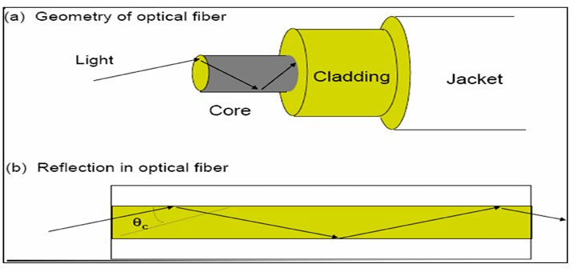
        
    - **Không hướng – Môi trường không dây (wireless)**
        - Truyền thông tin trên các dải tần khác nhau của sóng điện từ
        - Không sử dụng dây nối
        - Broadcast, “bán song công” (từ thiết bị gửi đến thiết bị nhận)
        - Ảnh hưởng của môi trường gây ra các hiện tượng:
            - Phản xạ
            - Nhiễu/Giao thoa
            - Tán xạ do vật cản
        - Phân loại:
            - Mạng LAN (WIFI):  10-100’s Mbps; khoảng cách 10m
            - WAN (4G): 10’s Mbps, khoảng cách 10Km
            - Bluetooth: khoảng cách nhỏ, tốc độ thấp
            - Vệ tinh:45 Mbps,	270	ms

## 4. Chuyển mạch gói (Packet-switching) và chuyển mạch dòng (circuit switching)

- **Đặt vấn đề**
    - Băng thông (bandwidth): lượng dữ liệu truyền tối đa trong một đơn vị thời gian (bps – bit per second)
    - Trễ (Latency): thời gian truyền dữ liệu từ A đến B.
        - Trễ truyền tải = Kích thước dữ liệu / Băng thông = L / R
        - Trễ truyền dẫn = Độ dài liên kết / Tốc độ tín hiệu (≈ 2. 108 m / sec).
    - Kết nối giữa nhiều nút mạng:
        - Sử dụng mạng chuyển mạch
            - Mỗi host kết nối với một thiết bị chuyển mạch
            - Các thiết bị chuyển mạch kết nối điểm - điểm và chuyển tiếp dữ liệu tới đích bằng cách định tuyến.
            - Chia sẻ tài nguyên đường truyền.
- **Chuyển mạch gói (Packet-switching)**
    
    Toàn bộ băng thông được chia sẽ cho tất cả mọi người. Nếu còn băng thông, ai cũng có thể sử dụng.
    
    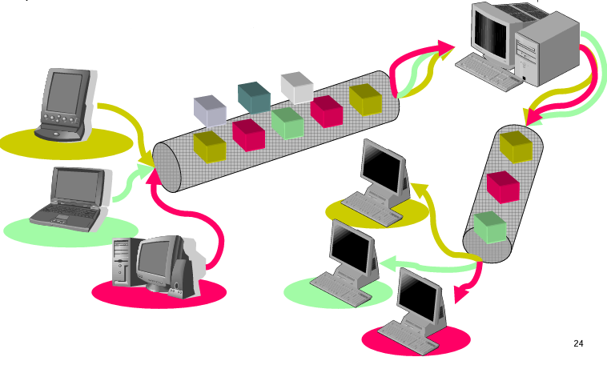
    
    - ***Cách chuyển:***
        - Dữ liệu được chia sẽ thành các gói tin (package) bao gồm: Tiêu đề (Header) [ Địa chỉ, số thứ tự ] và dữ liệu (playload)
        - Thiết bị chuyển mạch chuyển tiếp gói tin dựa vào tiêu đề.
        - Chỉ chuyển tiếp khi nhận được toàn bộ gói tin
        - Công đoạn xử lí lỗi, gửi gói tin thường ***nhỏ hơn*** so với ***trễ truyền tin***
        - Mỗi gói tin có thể xử lí độc lập, đường đi khác nhau, không đúng thứ tự.
        - Tài nguyên dùng chung cho tất cả kết nối.
    - ***Cách thức chuyển***
        
        
        | **Unicast**: Chuyển tới một nút mạng | **Multicast**: Chuyển tới một nhóm nút mạng |
        | --- | --- |
        | **Broadcast**: Chuyển tới tất cả nút mạng |  |
    - ***Trên mỗi thiết bị chuyển mạch***
        - Có một hàng đợi (FIFO - First in First out) để sắp xếp các gói tin
        - Mất gói tin nếu hàng đợi đầy
    
- **Chuyển mạch dòng (circuit switching)**
    
    Tài nguyên được gán riêng cho mỗi kênh, kể cả tài nguyên của các kênh đó đang rỗi người khác cũng không được dùng.
    
    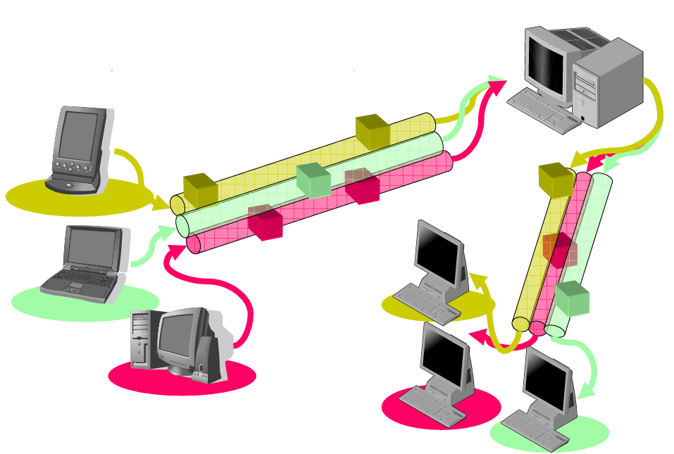
    
    - *Trên mỗi thiết bị chuyển mạch*
        - **Ghép kênh:** gửi dữ liệu của nhiều kênh trên cùng liên kết vật lý.
            - Theo thời gian (TDM): sử dụng tài nguyên trong khe theo thời gian được phân.
                
                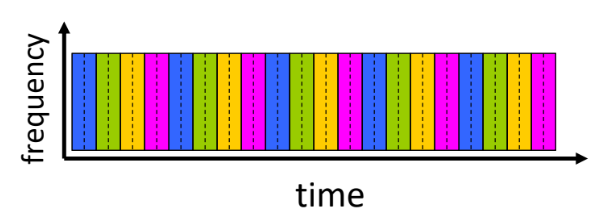
                
            - Theo tần số (FDM): sử dụng một băng tần tín hiệu riêng.
                
                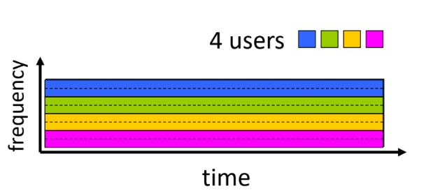
                
        - **Phân kênh**
            - phân dữ liệu nhận được trên liên kết vật lý vào các kênh tương ứng và chuyển đến đúng đích.
        
        | **Ưu điểm** | **Nhược điểm** |
        | --- | --- |
        | Kênh thiết lập sẵn → Trễ chuyển mạch rất thấp. | Dễ mất thông tin khi truyền.	 |
        | Tài nguyên dành riêng và không đổi khi truyền → đảm bảo chất lượng dịch vụ. | Tốn thời gian khi dữ liệu nhỏ. |
        |  | Bắt đầu lại quá trình nếu lỗi trên thiết bị chuyển mạch. |
        |  | Hiệu suất sử dụng đường truyền thấp.  |

## 5. Kiến trúc Internet - Mạng của các mạng:

- **Mạng biên (Network Edge)**
    - *Các nút mạng đầu cuối (end, system, host):* PC, điện thoại, máy chủ,…
    - *Các nút mạng truy nhập (access network):* đường truyền, thiết bị kết nối (router, switch, hub, tổng đài...)
- **Mạng lõi (network core)**
    
    Mạng lõi: đường truyền, thiết bị kết nối, mạng khu vực (Regional Net), trạm chuyển tiếp của nhà cung cấp (ISP), trạm trung chuyển Internet (IXP),…
    
    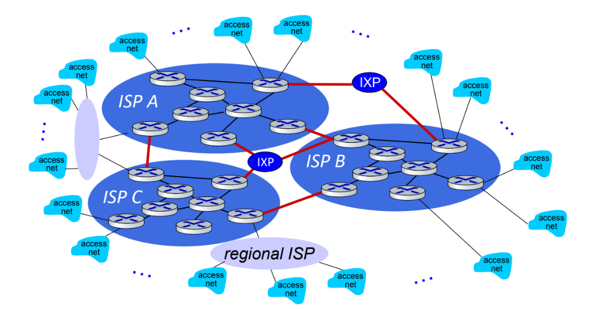
    

## 6. Performance: loss, delay, throughput

- Băng thông = Tốc độ truyền tin = Dung lượng.
- Thông lượng:
    - Là tốc độ truyền tin qua một điểm nào đó trong mạng (bits/sec).
    - Thông lượng tức thời: tại một thời điểm.
    - Thông lượng trung bình: trong một khoảng thời gian.
    - Nút thắt cổ chai (bottleneck): là điểm làm giới hạn thông lượng trên đường truyền.
- Độ trễ:                  $𝒅_{𝒂𝒍𝒍} = 𝒅_{𝒑𝒓𝒐𝒄} + 𝒅_{𝒒𝒖𝒆𝒖𝒆} + 𝒅_{𝒕𝒓𝒂𝒏} + 𝒅_{𝒑𝒓𝒐𝒑}$
    
    Trong đó:
    
    - $𝒅_{𝒑𝒓𝒐𝒄}$  (trễ xử lý): kiểm tra lỗi bit và xác định liên kết ra (cỡ 𝜇s)
    - $𝒅_{𝒒𝒖𝒆𝒖𝒆}$  (trễ hàng đợi): phụ thuộc vào hàng đợi, dựa trên tỉ số 𝐿. 𝑎⁄ 𝑅.
    - $𝒅_{𝒕𝒓𝒂𝒏}$ kích thước gói tin / băng thông
    - $𝒅_{𝒑𝒓𝒐𝒑}$ : độ dài đường truyền /tốc độ lan truyền (≈ 2. 108 m/s)
    
    ▪ R: link bandwidth (bps)
    ▪ L: packet length (bits)
    ▪ a: average packet arrival rate
    
    ▪ La/R ~ 0: avg. queueing delay small
    ▪ La/R -> 1: avg. queueing delay large
    ▪ La/R > 1: more “work” arriving is more than can be serviced - average delay infinite!
    
    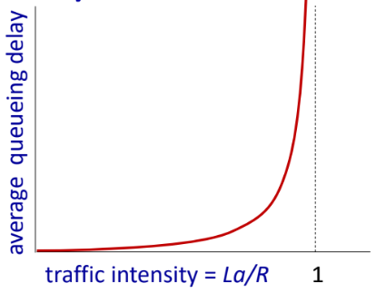
    
    - Trễ khứ hồi (Round Trip Time = 𝑡3 − 𝑡0)
        
        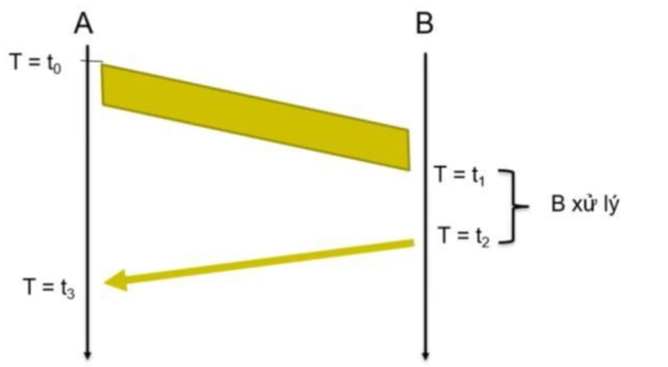
        
    - MTU (Maximum Transmission Unit): kích thước tối đa của gói tin có thể truyền VD
        
        Ethernet có MTU = 1526 byte.
        
        - Mục đích 1: Giảm tỉ lệ gói tin bị lỗi bit: do BER là hằng số → gói tin càng nhỏ càng ít lỗi.
        - Mục đích 2: Giảm xác suất phải truyền lại do mất gói tin:
        
        Kích thước hàng đợi cố định → Nếu mất gói tin thì truyền lại cũng đơn giản hơn.
        
        → MTU làm giảm kích thước dữ liệu phải truyền lại.
        
        Mặt khác, MTU không thể quá nhỏ vì sẽ làm giảm hiệu suất truyền. Do gói tin gồm header (hằng số) và payload (phần hữu ích)
        
        → Hiệu suất = payload ⁄ (header + payload)
        
        → Nếu MTU quá nhỏ thì hiệu suất sẽ thấp
        

## 7. Network security

- **Lĩnh vực an ninh mạng:**
    - Cách kẻ xấu có thể tấn công mạng máy tính.
    - Cách chúng ta bảo vệ mạng khỏi các cuộc tấn công.
    - Cách thiết kế kiến trúc mạng chống lại các cuộc tấn công.
- **Phần mềm độc hại có thể xâm nhập vào máy chủ từ:**
    - **Virus:** Lây nhiễm tự sao chép bằng cách nhận và thực thi một đối tượng (ví dụ: tệp đính kèm email).
    - **Worm:** Lây nhiễm tự sao chép bằng cách thụ động nhận một đối tượng và tự động thực thi nó.
- **Phần mềm gián điệp (spyware) có thể:**
    - Ghi lại thao tác gõ phím, các trang web đã truy cập.
    - Tải lên thông tin tới một trang thu thập dữ liệu.
- **Denial of Service (DoS):** Kẻ tấn công làm cho tài nguyên (máy chủ, băng thông) không thể truy cập được bởi lưu lượng hợp pháp bằng cách áp đảo tài nguyên với lưu lượng giả mạo.
    
    
    1. select target
    2. break into hosts
    around the network
    (see botnet)
    3. send packets to target
    from compromised
    hosts
    
    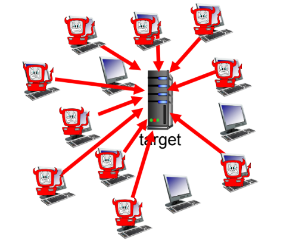
    
- **packet interception**
    - Xảy ra trên các phương tiện truyền phát (Ethernet chia sẻ, mạng không dây).
    - Giao diện mạng ở chế độ promiscuous có thể đọc và ghi lại tất cả các gói tin (bao gồm cả mật khẩu) đi qua.
    
    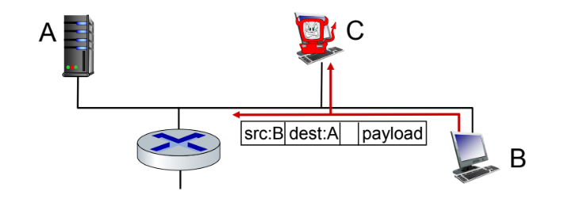
    
    Phầm mềm **Wireshark** sử dụng để mở gửi chỉnh sử gói tin
    
- **fake identity**
    
    IP spoofing: send packet with false source address
    
    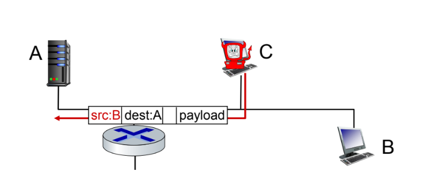
    

## 8. Kiến trúc phân tầng:

Nguyên tắc “Chia để trị” xác định, tổ chức, điều phối và phân công thực hiện các nhiệm vụ

- Mỗi tầng có thể có một hoặc nhiều chức năng.
- Thực hiện các chức năng: cung cấp dịch vụ cho tầng trên, sử dụng dịch vụ tầng dưới, độc lập với các tầng còn lại.
- Mỗi dịch vụ có thể có một hoặc nhiều cách triển khai khác nhau, cho phép tầng trên lựa chọn dịch vụ phù hợp

⇒ dễ thiết kế, triển khai, tái sử dụng và nâng cấp.