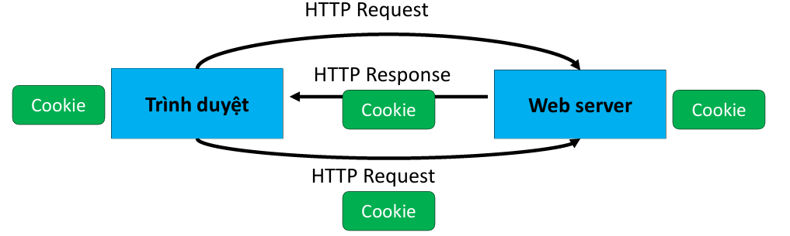

Chapter 2: Application layer
<!--more-->

## 1. Overview

<div style='display: flex'>
<div>
    <ul>
    <li> Điều khiển và cung cấp các dịch vụ mạng. </li>
    <li> Trong mô hình TCP/IP không có 2 tầng presetation và session. </li>
    <li> Các ứng dụng mạng sẽ cài chức năng của 2 tầng này. </li>
    </ul>
</div>

</div>

Mục tiêu của chúng ta:
+ **Khái niệm** và **triển khai** các khía cạnh của giao thức **tầng ứng dụng**

+ Mô hình dịch vụ tầng vận chuyển
+ Mô hình máy khách - máy chủ
+ Mô hình ngang hàng (peer-to-peer)

Tìm hiểu về giao thức bằng cách nghiên cứu các giao thức tầng ứng dụng phổ biến:
+ HTTP
+ SMTP, IMAP
+ DNS
+ Lập trình các ứng dụng mạng

Giao diện lập trình socket (socket API)

## 2. Principles of network applications

Some network apps:
 
<div style='display: flex;'>
    <div style='flex:1; margin-right: 10px;'>
        <ul>
            <li>social networking</li>
            <li>Web</li>
            <li>text messaging</li>
            <li>e-mail</li>
            <li>multi-user network games</li>
            <li>streaming stored video (YouTube, Hulu, Netflix)</li>
        </ul>
    </div>
    <div style='flex:1;'>
        <ul>
            <li>P2P file sharing</li>
            <li>voice over IP (e.g., Skype)</li>
            <li>real-time video conferencing</li>
            <li>Internet search</li>
            <li>remote login</li>
        </ul>
    </div>
</div>

<div style='display: flex'>
<div>
    <ul>
    <li> Hoạt động ứng dụng trên hệ thống đầu cuối(end system) </li>
    <li> Cài đặt các giao thức ứng dụng để cung cấp dịch vụ</li>
    <li> Gồm có 2 tiến trình giao tiếp với nhau qua mạng, client giúp cung cấp giao diện gửi thông điệp yêu cầu dịch vụ và server cung cấp dịch vụ trả thông điệp đáp ứng. </li>
    </ul>
</div>

</div>

### 2.1. Mô hình client/server 


- **Server:**
  - luôn là host.
  - IP address là cố định.
  - thường đặt ở data center.
  - có thể có máy chủ dự phòng để nâng cao hiệu quả và phòng ngừa sự cố.
- **Client:**
  - Kết nối, giao tiếp với server.
  - có thể IP address thay đổi.
  - có thể được kết nối không liên tục.
  - Không giao tiếp trực tiếp với các client khác.

### 2.2. Peer-peer architecture


- Máy chủ không bắt buộc luôn luôn được bật.
- Hệ thống đầu cuối tùy ý kết nối với nhau.
- peer yêu cầu dịch vụ từ 1 peer và peer cung cấp dịch vụ trả về cho một peer khác.
- peers có thể kết nối không liên tục và có thể thay đổi IP address -> Phức tạp trong quản lý.

### 2.3. Processes Communicating

- **Socket:** đối tượng dịch vụ do tầng giao vận cung cấp
  - Các tiến trình ứng dụng sử dụng dịch vụ của tầng giao vận để trao đổi thông điệp 

- Địa chỉ socket: Địa chỉ IP, Số hiệu cổng

- Ví dụ: Socket mà phần mềm Web Server trên máy chủ của HCMUT có định danh 198.191.11.65:80
  


- Tiến trình client: gửi yêu cầu
- Tiến trình server: trả lời
- Mô hình điển hình: 1 server – nhiều client 
- Client cần biết địa chỉ của server: địa chỉ IP, số 
hiệu cổng.

>[!NOTE]
>Ứng dụng với kiến trúc P2P có thể có cả 2 client process và server process.


### 2.4. An application-layer protocol defines:

+ **types of messages exchanged**, 
    + e.g., request, response 
+ **message syntax**:
    + what fields in messages & how fields are delineated

+ **message semantics** 
   + meaning of information in fields
+ **rules** for when and how processes send & respond to messages
+ **open protocols**:
    + defined in **RFCs**, everyone has access to protocol definition
    + allows for **interoperability**
      + e.g., HTTP, SMTP
+ **proprietary** protocols:
    + e.g., Skype, Zoom

### 2.5. transport service does an app need.

**Toàn vẹn dữ liệu (Data Integrity)**  
- Một số ứng dụng (ví dụ: truyền tệp, giao dịch web) yêu cầu truyền dữ liệu đáng tin cậy 100%.  
- Các ứng dụng khác (ví dụ: âm thanh) có thể chịu được một số mất mát

**Băng thông (throughout)** 
- Một số ứng dụng (ví dụ: đa phương tiện) yêu cầu mức băng thông tối thiểu để có thể hoạt động “hiệu quả”.  
- Các ứng dụng khác (“ứng dụng đàn hồi”) sử dụng bất kỳ băng thông nào mà chúng nhận được.  

**Thời gian (Timing)**  
- Một số ứng dụng (ví dụ: điện thoại Internet, trò chơi tương tác) yêu cầu độ trễ thấp để có thể hoạt động “hiệu quả”.  

**Bảo mật (Security)**  
- Mã hóa, toàn vẹn dữ liệu, ...  

Transport service requirements:


### 2.6. Internet transport protocols services
<table>
    <tr>
        <th>Dịch vụ TCP</th>
        <th>Dịch vụ UDP</th>
    </tr>
    <tr>
        <td>
            <ul>
                <li>Truyền tải đáng tin cậy giữa quá trình gửi và nhận</li>
                <li>Kiểm soát luồng: người gửi sẽ không làm quá tải người nhận</li>
                <li>Kiểm soát tắc nghẽn: điều chỉnh tốc độ gửi khi mạng bị quá tải</li>
                <li>Kết nối hướng đối tượng: cần thiết lập giữa các tiến trình của máy khách và máy chủ</li>
                <li>Không cung cấp: tính thời gian, đảm bảo băng thông tối thiểu, bảo mật</li>
            </ul>
        </td>
        <td>
            <ul>
                <li>Truyền dữ liệu không đáng tin cậy giữa quá trình gửi và nhận</li>
                <li>Không cung cấp: độ tin cậy, kiểm soát luồng,kiểm soát tắc nghẽn, tính thời gian, đảm bảo băng thông, bảo mật, hay thiết lập kết nối</li>
            </ul>
        </td>
    </tr>
</table>


### 2.7. Securing TCP

**Socket TCP & UDP thông thường:**  
- Không có mã hóa  
- Mật khẩu văn bản thuần được gửi vào socket và truyền qua Internet dưới dạng văn bản thuần.

**Bảo mật lớp truyền tải (TLS):**  
- Cung cấp kết nối TCP được mã hóa  
- Đảm bảo tính toàn vẹn dữ liệu  
- Xác thực điểm cuối  
- TLS được triển khai ở lớp ứng dụng  
- Ứng dụng sử dụng thư viện TLS, và thư viện này sử dụng TCP  
- Dữ liệu văn bản thuần được gửi vào “socket” sẽ được truyền qua Internet dưới dạng đã mã hóa  


## 3. Web and HTTP

### 3.1. Uniform Resource Locator

Xác định một tài nguyên bất kì nào đó trên mạng và các thức để truy cập tài nguyên đó.


protocol://hostname[:port]/directory-path/resource


+ protocol: Giao thức (http, ftp, https, smtp, rstp,...)
+ hostname: tên miền, địa chỉ IP.
+ port: cổng ứng dụng (có thể không cần)
+ directory path: đường dẫn tới tài nguyên
+ resource: định danh tài nguyên

### 3.2. HTTP overview


**WWW**: world wide web trao đổi siêu dữ liệu văn bản HTML trên mạng

**HTTP**: HyperText Transfer Protocol
+   Mô hình client-server.
+   Client truy cập tới các trang web (chứa đối tượng web) và hiển thị chúng trên trinhf duyệt.
+   Server: Nhận yêu cầu và trả lời cho client.

#### 3.2.1. HTTP uses TCP:

+ **Thiết lập liên kết TCP**
  + Server mở một TCP socket chờ yêu cầu kết nối tại cổng 80 (mặc định)
  + Client khởi tạo một yêu cầu liên kết TCP với Sever.
  + Server chấp nhận yêu cầu, tạo liên kết.
  
+ **Trao đổi thông điệp HTTP (giao thức ứng dụng)**
  + **HTTP Request:** thông điệp yêu cầu
  + **HTTP Respone:** thông điệp trả lời

+ **Đóng liên kết TCP**

#### 3.2.2. HTTP is “stateless”

+ Một phiên hoạt động của HTTP:
  + Trình duyệt kết nối với Web server
  + Trình duyệt gửi thông điệp yêu cầu đến HTTP Request
  + Web server đáp ứng với một thông điệp HTTP Response
  + ..lặp lại
  + Trình ngắt kết nối
+ Các thông điệp HTTP Request được xử lý độc lập
+ Web Server không ghi nhớ trạng thái của phiên HTTP
  + Nếu dịch vụ web cần xác thực người dùng thì người dùng phải đăng nhập lại cho mỗi thông điệp HTTP Request gửi đi.

### 3.3. HTTP connections

HTTP connections gồm 2 loại:

{}

+ Chỉ một đối tượng web được gửi qua liên kết TCP
+ Sử dụng mặc định trong HTTP/1.0
+ **HTTP 1.0**: RFC 1945


**RTT (definition)**: time for a small packet to travel from client to server and back

{}

{}

+ Nhiều đối tượng có thể được gửi qua một liên kết TCP
+ Sử dụng mặc định trong HTTP/1.1
+ **HTTP 1.1**: RFC 2068


{}

### 3.4. HTTP Message
{}
+  Mã ASCII (dễ dàng đọc được dưới dạng văn bản) 


+ **General format**


+ **Các phương thức HTTP Request**

    <h5>HTTP/1.0</h5>
    <ul>
        <li>GET</li>
        <li>POST</li>
        <li>HEAD
            <ul>
                <li>Chỉ các tiêu đề (headers) của yêu cầu sẽ được trả về nếu URL được chỉ định được yêu cầu bằng phương thức HTTP GET.</li>
            </ul>
        </li>
    </ul>

    <h5>HTTP/1.1</h5>
    <ul>
        <li>GET, POST, HEAD</li>
        <li>PUT
            <ul>
                <li>Tải file lên máy chủ, đường dẫn chỉ ra trong URL, file để trong body</li>
            </ul>
        </li>
        <li>DELETE
            <ul>
                <li>Xóa file chỉ ra bởi đường dẫn</li>
            </ul>
        </li>
    </ul>

    <p class="note">Lưu ý: Có 2 cách để gửi tham số đến server: POST hoặc GET</p>

    <p>Ví dụ: <a href="http://www.google.com/search?q=computer+network&flags=68&num=10">
        http://www.google.com/search?q=computer+network&flags=68&num=10</a></p>

{}

{}
+ **General format**:

+ **Mã trạng thái** của các thông điệp:

{}


### 3.5. Maintaining user/server state

Web sites và client browser sử dụng cookies để quy trì một trạng thái giao dịch.



+ Cookie: dữ liệu do ứng dụng web tạo ra, chứa thông tin trạng thái của phiên làm việc.
  + server có thể lưu lại cookie (một phần hoặc toàn bộ)
+ Sau khi xử lý yêu cầu, web server trả lại thông điệp HTTP Response với cookie đính kèm
  + Set-Cookie: key = value: options
+ Trình duyệt lưu cookie
+ Trình duyệt gửi HTTP Request tiếp theo với cookie được đính kèm.


{}


**Cookies** có thể được sử dụng để:  
- Theo dõi hành vi của người dùng trên một trang web cụ thể (**cookie bên thứ nhất**).  
- Theo dõi hành vi của người dùng trên nhiều trang web khác nhau (**cookie bên thứ ba**) mà không cần người dùng truy cập trực tiếp vào trang web theo dõi (!).  

Việc theo dõi có thể **không hiển thị** đối với người dùng:  
- Thay vì một quảng cáo hiển thị kích hoạt HTTP GET đến trình theo dõi, có thể sử dụng một liên kết vô hình.  

**Theo dõi bên thứ ba qua cookies:**  
- **Bị vô hiệu hóa theo mặc định** trên trình duyệt **Firefox, Safari**.  
- **Sẽ bị vô hiệu hóa trên Chrome** vào năm **2023**.
{}

### 3.6. Web caches


Thỏa mãn yêu cầu của máy khách mà không cần liên hệ với máy chủ gốc. 

**Cách hoạt động:**  
- Người dùng cấu hình trình duyệt để trỏ đến một **bộ nhớ đệm web (Web cache) cục bộ**.  
- Trình duyệt gửi tất cả các yêu cầu HTTP đến bộ nhớ đệm:  
  - **Nếu đối tượng có trong bộ nhớ đệm** → bộ nhớ đệm trả lại đối tượng cho máy khách.  
  - **Nếu đối tượng không có trong bộ nhớ đệm** → bộ nhớ đệm gửi yêu cầu đến máy chủ gốc, lưu trữ đối tượng nhận được, rồi trả lại đối tượng cho máy khách. 

**Bộ nhớ đệm web (hay còn gọi là máy chủ proxy)**  

- **Bộ nhớ đệm web đóng vai trò như cả máy khách và máy chủ**  
  - Là **máy chủ** đối với máy khách yêu cầu ban đầu  
  - Là **máy khách** đối với máy chủ gốc  

- **Máy chủ gốc thông báo cho bộ nhớ đệm về khả năng lưu trữ của đối tượng thông qua tiêu đề phản hồi:**  
  - `Cache-Control: max-age=<seconds>` → Chỉ định thời gian lưu trữ tối đa  
  - `Cache-Control: no-cache` → Không lưu vào bộ nhớ đệm  


{}

- **Giảm thời gian phản hồi cho yêu cầu của máy khách**  
  - Vì bộ nhớ đệm gần máy khách hơn  

- **Giảm lưu lượng trên đường truyền của tổ chức**  

- **Internet chứa nhiều bộ nhớ đệm**  
  - Giúp các nhà cung cấp nội dung có tài nguyên hạn chế phân phối nội dung hiệu quả hơn  

{}

{}
<div style='display: flex;'>
    <div style='flex:1; margin-right: 10px;'>
        
    </div>
    <div style='flex:1;'>
        
    </div>
</div>


Chúng ta có thể thấy trường hợp trên tình trạng tắc nghẽn khá cao vậy cách tối ưu chúng ta thử tăng access link xem sao.


Có vẽ cách trên thật sự tốt nhưng chi phí làm ra access link có tốc độ như trên sẽ rất đắt. Bây giờ chúng ta thử sử dụng web cache


{}

### 3.7. Browser caching: Conditional GET

**Mục tiêu:** Không gửi đối tượng nếu trình duyệt đã có phiên bản được lưu trong bộ nhớ đệm và vẫn còn hợp lệ

- **Tránh độ trễ khi truyền đối tượng** (hoặc sử dụng tài nguyên mạng)  

**Cách hoạt động:**  
- **Máy khách:**  
  - Chỉ định ngày của bản sao được lưu trong bộ nhớ đệm trong yêu cầu HTTP  
  - Sử dụng tiêu đề:  
    ```http
    If-Modified-Since: <date>
    ```  

- **Máy chủ:**  
  - Nếu bản sao trong bộ nhớ đệm của trình duyệt **vẫn còn hợp lệ**, phản hồi sẽ **không chứa đối tượng**  
  - Phản hồi HTTP:  
    ```http
    HTTP/1.0 304 Not Modified
    ```

### 3.8. HTTP/2

**Mục tiêu chính:**  Giảm độ trễ trong các yêu cầu HTTP chứa nhiều đối tượng


+ **HTTP/1.1:**  
  - Giới thiệu **nhiều yêu cầu GET được xử lý theo chuỗi (pipelined GETs)** trên một kết nối TCP duy nhất.  
  - **Máy chủ phản hồi theo thứ tự** (FCFS - First-Come-First-Served) đối với các yêu cầu GET.  
  - Với FCFS, **các đối tượng nhỏ có thể phải chờ** để được truyền do bị **tắc nghẽn hàng đợi (HOL blocking)** bởi các đối tượng lớn.  
  - **Cơ chế khôi phục lỗi** (truyền lại các phân đoạn TCP bị mất) có thể làm chậm quá trình truyền đối tượng.  

+ **HTTP/2:**  
  - **Tăng tính linh hoạt tại máy chủ** khi gửi đối tượng đến máy khách.  
  - **Không thay đổi** phương thức, mã trạng thái, và hầu hết các tiêu đề từ HTTP/1.1.  
  - **Sắp xếp thứ tự truyền đối tượng** dựa trên mức độ ưu tiên do máy khách chỉ định (**không bắt buộc FCFS**).  
  - **Gửi trước (push) các đối tượng chưa được yêu cầu** đến máy khách.  
  - **Chia nhỏ đối tượng thành các khung dữ liệu (frames)** và **lập lịch gửi khung** để giảm thiểu tắc nghẽn hàng đợi (HOL blocking).  

   and 3 smaller objects')

  

### 3.9. HTTP/2 to HTTP/3

**HTTP/2 trên một kết nối TCP duy nhất có nghĩa là:**  
- **Việc khôi phục mất gói tin vẫn làm chậm toàn bộ quá trình truyền tải đối tượng**, giống như trong HTTP/1.1.  
- **Trình duyệt vẫn có động cơ mở nhiều kết nối TCP song song** để giảm tình trạng tắc nghẽn và tăng tổng thông lượng truyền tải.  
- **Không có cơ chế bảo mật** khi sử dụng kết nối TCP thông thường.  
**HTTP/3:**  
- **Bổ sung bảo mật**, kiểm soát lỗi và tắc nghẽn **trên từng đối tượng** (**tăng cường pipelining**) bằng cách sử dụng **UDP** thay vì TCP.  
- **Chi tiết về HTTP/3 sẽ được đề cập trong tầng truyền tải (transport layer).**  

### 3.10. HTTPS

+ **Hạn chế của HTTP:**
  + Không có cơ chế để người dùng kiểm tra tính tin cậy của web -> lỗ hỗng để kẻ tấn công giả mạo dịch vụ hoặc chèn mã độc vào trang web html.
  + Không có cơ chế mã hóa bảo mật -> lỗ hổng để kẻ tấn công nghe lén đánh cắp thông tin nhạy cảm
+ **Secure HTTP:** sử dụng liên kết SSL/TLS thay cho TCP để truyền thông điểm HTTP
  + Xác thực:
    + Người dùng truy cập vào đúng web mong muốn.
    + Dữ liệu trong qúa trình truyền không bị thay đổi
  + Bảo mật: dữ liệu được bí mật trong quá trình truyển
+ **Số hiệu cổng ứng dụng:** 443.
## 4. E-mail, SMTP, IMAP

{}


+ **User agents (UA)**  
  + Lấy thư từ máy chủ
  + Soạn thư, trả lời, chuyển tiếp, lưu trữ
  + Ví dụ: Outlook, Thunderbird, Apple Mail
+ **Mail servers**
  + Chứa hộp thư đến của NSD (mail box)
  + Hàng đợi để gửi thư đi
  + Ví dụ: Sendmail, Microsoft Exchange,...
+ **Giao thức:**
  + Chuyển thư : SMTP - Simple Mail Transfer Protocol
  + Nhận thư:
    + POP - Post Office Protocol
    + IMAP - Internet Mail Access Protocol
{}
{}


Tài liệu mô tả: **RFC (5321)**

- **Sử dụng TCP** để truyền tải tin nhắn email **một cách đáng tin cậy** từ máy khách (mail server khởi tạo kết nối) đến máy chủ, qua **cổng 25**.  
- **Truyền tải trực tiếp**: Máy chủ gửi đóng vai trò như **client**, gửi email đến máy chủ nhận.  
- **Ba giai đoạn chính của quá trình truyền tải**:  
  1. **SMTP handshaking** (chào hỏi, thiết lập kết nối)  
  2. **SMTP transfer of messages** (truyền tải nội dung email)  
  3. **SMTP closure** (đóng kết nối)  

- **Giao tiếp theo kiểu lệnh/phản hồi**, tương tự như HTTP:  
  - **Lệnh**: Được gửi dưới dạng văn bản **ASCII**  
  - **Phản hồi**: Gồm **mã trạng thái (status code) và thông điệp phản hồi**
{}

{}
+ POP: Post Office Protocol [RFC 1939] 
    + Đăng nhập và lấy hết thư về user agent 
+ IMAP: Internet Mail Access Protocol [RFC 1730] 
    + Phức tạp hơn POP 
    + Cho phép lưu trữ và xử lý thư trên máy chủ
{}

{}
+ HTTP chủ yếu dùng để lấy dữ liệu (pull-based), còn SMTP dùng để gửi dữ liệu (push-based).
+ SMTP cần đảm bảo tin nhắn đúng chuẩn 7-bit ASCII, trong khi HTTP linh hoạt hơn.
+ SMTP sử dụng kết nối liên tục để truyền nhiều thư trong một phiên làm việc.
{}


{}


{}

## 5. The Domain Name System DNS

{}
+ **IP address**: 32-bit used for addressing datagrams 
+ 'name', e.g., cs.umass.edu - used by humans
{}

>[!WARNING]
>how to map between IP address and name, and vice versa ?

{}


- **Cơ sở dữ liệu phân tán** được triển khai theo **hệ thống phân cấp** của nhiều máy chủ tên miền (name servers).  
- **Giao thức tầng ứng dụng**: Các máy chủ DNS và thiết bị (host) **giao tiếp để phân giải tên miền** (dịch từ tên miền sang địa chỉ IP và ngược lại).  
- **Chức năng cốt lõi của Internet**, nhưng được triển khai dưới dạng một **giao thức tầng ứng dụng**.  
- **Sự phức tạp nằm ở “rìa” mạng** (edge network), giúp mạng lõi đơn giản hơn.

{}

{}


Client wants IP address for www.amazon.com; 1st approximation:
+ client queries root server to find .com DNS server
+ client queries .com DNS server to get amazon.com DNS server
+ client queries amazon.com DNS server to get  IP address for www.amazon.com

{}

- **Máy chủ tên miền gốc (Root DNS servers)**: Là cơ quan chính thức, điểm liên hệ cuối cùng khi các máy chủ DNS khác không thể phân giải tên miền.  
- **Chức năng cực kỳ quan trọng trên Internet** – Internet không thể hoạt động nếu thiếu DNS!  
- **DNSSEC**: Cung cấp bảo mật, đảm bảo **xác thực** và **toàn vẹn dữ liệu** trong quá trình phân giải tên miền.  
- **ICANN** (Tập đoàn Internet cấp số và tên miền): Quản lý **hệ thống DNS gốc** trên toàn cầu.
{}

{}
Quản lý tên miền cấp 1
{}


{}
Quản lí tên miền cấp đưới.
{}

{}
Không nằm trong phân cấp DNS
{}

{}

Không nằm trong phân cấp DNS
{}

{}


{}
Khi một máy chủ (host) gửi truy vấn DNS, nó sẽ được gửi đến **máy chủ DNS cục bộ** (Local DNS server).  

Máy chủ DNS cục bộ sẽ phản hồi theo hai cách:  
- Trả lời từ **bộ nhớ cache** chứa các cặp ánh xạ tên miền - địa chỉ IP gần đây (**có thể đã lỗi thời!**).  
- Chuyển tiếp yêu cầu vào **hệ thống phân cấp DNS** để tìm kiếm kết quả chính xác.  

Mỗi nhà cung cấp dịch vụ Internet (ISP) đều có **máy chủ DNS cục bộ**. Cách kiểm tra máy chủ DNS của bạn:  
- **MacOS**: Chạy lệnh `scutil --dns`  
- **Windows**: Chạy lệnh `ipconfig /all`  

Lưu ý: **Máy chủ DNS cục bộ không thuộc hệ thống phân cấp DNS một cách chặt chẽ** nhưng đóng vai trò quan trọng trong quá trình phân giải tên miền.

{}

{}

- **Giao thức** tầng ứng dụng: **DNS**
- Sử dụng dịch vụ UDP/TCP với **cổng dịch vụ** là **53**
{}

{}

{}

{}
{}

{}

- **Caching**: Máy chủ DNS cục bộ lưu trữ các cặp ánh xạ tên miền - địa chỉ IP gần đây.
- **Cập nhật bản ghi**: Máy chủ DNS cục bộ sẽ cập nhật bản ghi DNS sau mỗi thời gian nhất định.
- **Nhược điểm:** Các mục trong cache có thể lỗi thời. Nếu một máy chủ thay đổi địa chỉ IP, thông tin này có thể không được cập nhật ngay lập tức trên toàn Internet cho đến khi TTL của tất cả các bản ghi cũ hết hạn
{}

{}


- **Type=A**: ánh xạ tên miền - địa chỉ IP
- **Type=NS**: máy chủ tên miền cấp cao hơn
- **Type=CNAME**: tên miền chuyển hướng
- **Type=MX**: máy chủ thư
{}

{}
DNS query and reply messages, both have same  format:


{}


{}

{}

{}
**Các cuộc tấn công DDoS:**
- Tấn công vào các máy chủ chính của hệ thống DNS với lượng truy cập lớn.
  - Hiện tại chưa có thành công lớn.
  - Có thể lọc lưu lượng.
  - Các máy chủ DNS cục bộ có thể bỏ qua máy chủ chính.
- Tấn công vào các máy chủ TLD (Top-Level Domain) cũng rất nguy hiểm.

**Các cuộc tấn công giả mạo:**
- Can thiệp vào các truy vấn DNS và trả về thông tin sai lệch.
  - Có thể làm hỏng bộ nhớ cache DNS.
  - Liên quan đến dịch vụ xác thực DNSSEC.

{}

## 6. P2P applications

{}


- **Không có máy chủ luôn hoạt động:** Các hệ thống có thể giao tiếp trực tiếp với nhau.
  
- **Các bên ngang hàng yêu cầu dịch vụ:** Các bên có thể yêu cầu dịch vụ từ nhau và trả lại dịch vụ.

- **Tự mở rộng:** Các bên mới tham gia có thể mang theo năng lực và nhu cầu dịch vụ mới.

- **Kết nối không liên tục:** Các bên có thể thay đổi địa chỉ IP, tạo ra sự phức tạp trong kết nối.

- **Ví dụ:** Chia sẻ tệp P2P (BitTorrent), phát trực tuyến (KanKan), VoIP (Skype).

{}

{}

>[!WARNING]
>

{}


{}

{}

{}


{}

{}


**Peer tham gia:**
   - Không có phần nào khi mới tham gia, sẽ tích lũy dần từ các peer khác.
   - Đăng ký với tracker để tìm danh sách peer và kết nối với một số peer.

**Tải xuống và chia sẻ:**
   - Trong khi tải xuống, peer cũng tải lên các phần cho peer khác.
   - Trao đổi các phần với nhau, tạo mạng lưới chia sẻ hiệu quả.

**Chiến lược chia sẻ:**
   - Peer yêu cầu các phần còn thiếu từ các peer khác.
   - Gửi phần theo kiểu "tit-for-tat" để khuyến khích chia sẻ công bằng.

{}
Ví dụ, nếu Alice gửi các phần cho bốn peer mà cô ấy đang kết nối, các peer khác sẽ trả lại các phần cho Alice. Điều này khuyến khích việc chia sẻ công bằng.

Mỗi 30 giây, một peer sẽ chọn ngẫu nhiên một peer khác để "mở khóa" (tức là gửi phần cho peer đó) nhằm tối ưu hóa việc chia sẻ.


{}
{}


## 7. video streaming and content distribution networks

{}
+ **Lưu lượng video:** Là người tiêu thụ chính băng thông Internet, với Netflix, YouTube, Amazon Prime chiếm khoảng 80% lưu lượng ISP.
+ **Thách thức về quy mô:** Làm thế nào để phục vụ gần 1 tỷ người dùng?
+ **Thách thức về tính đồng nhất:** Các thiết bị có khả năng khác nhau (cố định, di động) và băng thông cũng khác nhau (cao vs thấp).
+ **Giải pháp:** Cơ sở hạ tầng phân tán, ứng dụng CDN (Mạng phân phối nội dung).
{}

{}
+ CBR (Bitrate cố định): Tốc độ mã hóa video không thay đổi.
+ VBR (Bitrate thay đổi): Tốc độ mã hóa thay đổi tùy theo sự thay đổi không gian và thời gian.
+ Ví dụ: MPEG 1 (1.5 Mbps), MPEG 2 (3-6 Mbps), MPEG 4 (64 Kbps - 12 Mbps thường sử dụng trong Internet).
{}

{}


**Thách thứ chính:**
+ **Băng thông** thay đổi theo thời gian do mức độ tắc nghẽn mạng thay đổi.
+ Mất gói tin và độ trễ do tắc nghẽn, có thể làm chậm phát video hoặc gây chất lượng kém


- **Ràng buộc phát liên tục**: Khi video bắt đầu phát, **phát lại phải khớp với thời gian gốc**. Tuy nhiên, **độ trễ mạng thay đổi** (jitter), nên cần **bộ đệm phía client** để đảm bảo phát mượt mà.  
- **Các thách thức khác**:  
  - **Tính tương tác của client**: Tạm dừng, tua nhanh, tua lại, nhảy đến phần khác của video.  
  - **Mất gói dữ liệu** có thể xảy ra và cần được **truyền lại**.  


Có hình ảnh minh họa quá trình **buffering**, cho thấy vấn đề xảy ra khi bộ đệm không đủ dữ liệu để phát liên tục.  

{}

{}

**Bộ đệm phía client và độ trễ phát lại** có vai trò quan trọng trong việc đảm bảo trải nghiệm phát video mượt mà bằng cách:  

- **Bù đắp độ trễ do mạng**: Khi có độ trễ từ mạng (do tắc nghẽn, khoảng cách truyền dữ liệu, v.v.), bộ đệm phía client giúp lưu trữ một phần dữ liệu trước khi phát, tránh bị gián đoạn.  
- **Giảm tác động của jitter (biến động độ trễ)**: Jitter xảy ra khi các gói dữ liệu đến không đều, gây ra gián đoạn nếu không có bộ đệm. Bộ đệm giúp làm mượt luồng dữ liệu trước khi phát để đảm bảo phát lại ổn định.  

Tuy nhiên, **độ trễ phát lại (playout delay)** cần được điều chỉnh phù hợp:  
- Độ trễ cao giúp video ổn định hơn nhưng làm tăng thời gian chờ.  
- Độ trễ thấp giúp phát nhanh hơn nhưng có nguy cơ bị gián đoạn nếu mạng không ổn định.
{}

{}

**DASH (Dynamic Adaptive Streaming over HTTP)** là một phương pháp streaming multimedia hiệu quả.

+ **Về mặt cấu trúc:**
  + Video được chia thành nhiều "chunk" (mảnh).
  + Mỗi chunk được mã hóa với các tỷ lệ khác nhau
+ **Về mặt máy chủ:**
  + Máy chủ lưu trữ nhiều phiên bản của video với các tỷ lệ khác nhau
+ **Về mặt client:**
  + Liên tục đo lường băng thông từ máy chủ đến client.
  + Yêu cầu từng chunk một theo thứ tự.
  + Chọn tỷ lệ mã hóa tối đa dựa trên băng thông hiện có.
  + Có khả năng chọn các tỷ lệ mã hóa khác nhau tại các thời điểm khác nhau, tùy thuộc vào băng thông sẵn có.
{}


Streaming video = encoding + DASH + playout buffering


{}

**Thách thức lớn:** Việc phát trực tuyến nội dung từ hàng triệu video đến hàng trăm người dùng cùng lúc là một vấn đề phức tạp.

**Giải pháp:** Sử dụng CDN để lưu trữ và phục vụ nhiều bản sao video tại các địa điểm khác nhau trên toàn cầu, giúp cải thiện tốc độ truy cập và giảm độ trễ.

{}
+ CDN bao gồm các máy chủ (nodes) được phân phối gần với người dùng hơn, tạo điều kiện cho việc truy cập nhanh chóng.
+ Ví dụ điển hình: Akamai, với hơn 240,000 máy chủ tại hơn 120 quốc gia (tính đến 2015).
{}

{}
+ Khi người dùng yêu cầu nội dung (ví dụ: phim MadMen từ Netflix), yêu cầu sẽ được chuyển đến node CDN gần nhất.
+ Nếu đường truyền bị tắc nghẽn, người dùng có thể chọn lấy một bản sao khác từ một node khác.
{}

{}

{}

Nhà cung cấp nội dung cung cấp dịch vụ qua Internet mà không cần sử dụng cơ sở hạ tầng truyền thống (các nhà cung cấp dịch vụ Internet).

Thách thức trong mô hình OTT:
+ Lựa chọn node CDN: Làm thế nào để quyết định từ node nào để lấy nội dung.
+ Hành vi người xem: Cách người xem tương tác với nội dung khi mạng bị tắc nghẽn.
+ Quản lý nội dung: Xác định nội dung nào nên được lưu trữ ở đâu trong các node CDN để tối ưu hóa hiệu suất.


{}

{}


{}

## 8. socket programming with UDP and TCP

{}
+ Socket: đối tượng dịch vụ do tầng giao vận cung cấp
  + Các tiến trình ứng dụng sử dụng dịch vụ của tầng giao vận để trao đổi thông điệp
+ Địa chỉ socket: Địa chỉ IP, Số hiệu cổng  
+ Ví dụ: Socket mà phần mềm Web Server trên máy chủ của SoICT có định danh 202.191.56.65:80


{}

{}

+ **UDP (User Datagram Protocol)**:
  + Không tin cậy (unreliable).
  + Dữ liệu được gửi dưới dạng datagram (gói tin) mà không có đảm bảo về việc truyền tải.
+ **TCP (Transmission Control Protocol)**:
  + Tin cậy (reliable).
  + Dữ liệu được gửi dưới dạng luồng byte (byte stream-oriented) và đảm bảo rằng tất cả dữ liệu sẽ được nhận đúng thứ tự.
{}

{}
+ **UDP (User Datagram Protocol):**
  + Không thiết lập kết nối giữa client và server.
  + Không có quá trình bắt tay trước khi gửi dữ liệu.
+ **Cách thức hoạt động:**
  + Người gửi gắn địa chỉ IP đích và số cổng vào mỗi gói dữ liệu.
  + Người nhận trích xuất thông tin từ gói nhận được.
+ **Đặc điểm:**
  + Dữ liệu có thể bị mất hoặc nhận không theo thứ tự.
  + Cung cấp truyền tải không tin cậy giữa client và server.


{}

{}
+ **TCP (Transmission Control Protocol):**
  + Kết nối cần thiết: Client phải liên hệ với server, và server phải đang chạy.
+ **Cách thức hoạt động:**
  + Server tạo socket để chờ kết nối từ client.
  + Client tạo socket TCP, chỉ định địa chỉ IP và số cổng của server.
  + Khi client kết nối, server tạo một socket mới để giao tiếp với client đó.
+ **Đặc điểm:**
  + Cho phép server xử lý nhiều client cùng lúc.
  + Sử dụng số cổng nguồn để phân biệt các kết nối.


{}

