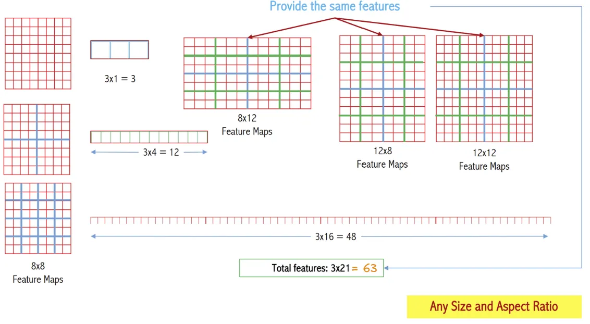
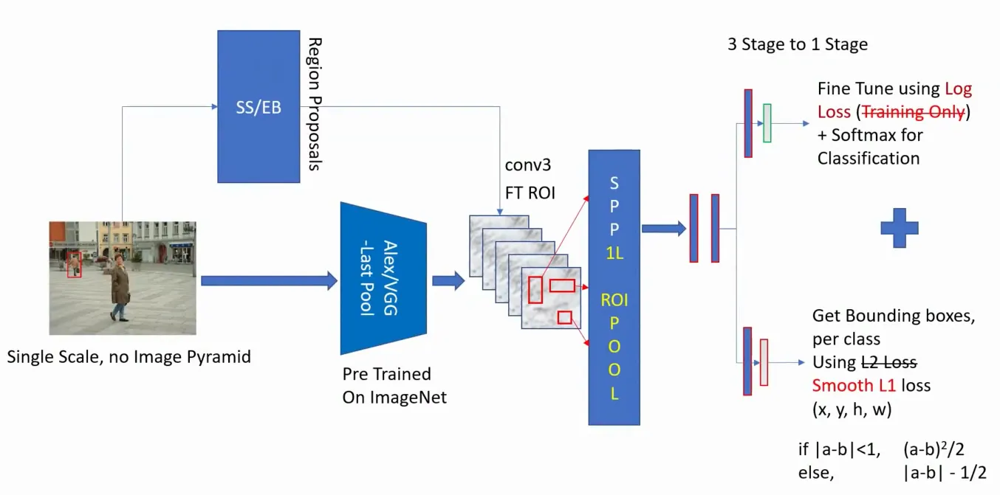

## 1. CNN Limitations

### 1.1. Approach problem 1: One Detector - One Object

Với cách thiết kế cũ dùng để dectection thì chỉ detect được 1 đối tượng.

**Pipeline cũ:**

1. Chuyển hình ảnh về dạng vuông (3x224x224)
2. Qua các lớp tích chập và pooling
3. Flatten chúng
4. Dự đoán nhãn (class score) và tọa độ (x, y, w, h) thông qua các lớp fully connection


  Ưu điểm của cách làm này là end-to-end pipeline, nghĩa là đưa toàn bộ bức ảnh vào model và nhận lại output.



  Tuy nhiên, mô hình chỉ có khả năng phát hiện 1 đối tượng tại một thời điểm. Điều này không đáp ứng được các bài toán yêu cầu phát hiện nhiều đối tượng trong cùng một hình ảnh.


### 1.2. Approach problem 2: Sliding window - Two many box

Với classification, chúng ta dùng phương pháp sliding window

1. Trượt từng ô (sliding window): Chia tấm ảnh đầu vào thành các vùng nhỏ bằng các trượt một cửa sổ kích thước cố định (sliding window) qua toàn bộ hình ảnh.
2. Bỏ qua Network: Mỗi vùng (crop từ sliding window ) được đưa qua mô hình CNN hoặc một bộ phận loại khác để trích xuất đặc trưng và xác định nhãn.
3. Phân loại: Mô hình CNN sẽ phân loại vùng đó thành một lớp dự kiến $C$ hoặc phân loại là "background" nếu vùng đó không chứa đối tượng nào.


**Hạn chế :**

- Ví dụ bạn có trước một window và bạn trượt toàn tấm ảnh, số patch bạn nhận được sẽ là:

$$\sum_{h=1}^{H} \sum_{w=1}^{W} (W - w + 1)(H - h + 1)$$

$$ = \frac{H(H+1)}{2} \cdot \frac{W(W+1)}{2}$$

Ví dụ : 

Nếu $W = H = 224,$  công thức cho kết quả:

$$\frac{224 \cdot 225}{2} \cdot \frac{224 \cdot 225}{2} = 635,000,000 \text{ (635 triệu bounding boxes)}.$$



Với mỗi **ROI** được trích xuất sẽ trả về 1 kết quả object dự đoán tương ứng.

Việc sử dụng sliding window cho phép detect được nhiều đối tượng bằng cách quét toàn bộ ảnh. Tuy nhiên, phương pháp này yêu cầu tính toán trên $O(n)$ bounding boxes (rất lớn), dẫn đến tốc độ xử lý chậm và không thể đáp ứng các yêu cầu real-time.

## 2. Region based convolutional neural network (R-CNN)

### 2.1. Selective search

Thay vì sử dụng sliding window để trượt qua toàn bộ ảnh, ta sử dụng selective search được sử dụng dựa trên image segmentation để đưa ra các region proposals (khoảng 2000 regions) có khả năng chưa object.

{}
Đầu tiên chúng ta sẽ segmentation tấm ảnh theo 5 bước : 

1. **Tương đồng màu sắc (Color similarity):**
  + Tính toán histogram màu với 25 bin trên mỗi kênh của ảnh (giả định có 3 kênh màu).
  + Kết hợp các histogram này thành một vector mô tả cuối cùng có kích thước $25×3=75$
  + Đo lường độ tương đồng màu giữa hai vùng bằng khoảng cách giao nhau giữa histogram (histogram intersection distance).
2. **Tương đồng kết cấu (Texture similarity):**
  + Một phương pháp phổ biến là sử dụng gradient direction histogram (ví dụ như HOG - Histogram of Oriented Gradients) 
  + Trích xuất đạo hàm Gaussian tại 8 hướng cho mỗi kênh màu (giả định có 3 kênh màu).
  + Trong đó một bức ảnh chia làm 10 ô thì số feature có của bước này là $8×10×3=240$
3. **Tương đồng về kích thước (Size similarity)**
  + Sử dụng tiêu chí ưu tiên hợp nhất các **vùng nhỏ hơn trước các vùng lớn**.
  + Mục tiêu là tránh tình trạng các vùng lớn nuốt chửng toàn bộ các vùng nhỏ trong quá trình hợp nhất, như hiện tượng xảy ra trong các thuật toán phân cụm Hierarchical Agglomerative Clustering (HAC).
4. **Tương đồng về hình dạng (Shape similarity/compatibility)**
  + Ý tưởng ở đây là các vùng được hợp nhất khi chúng **phù hợp** với nhau.
  + Hai vùng được coi là tương thích nếu chúng có thể **lấp đầy được khoảng trống giữa nhau** trong quá trình tạo đề xuất vùng.
  + Các vùng không tiếp xúc không chạm nhau sẽ không được hợp nhất.

>[!NOTE]
>Đo lường meta-tương đồng (Meta-similarity):
>
>

{}

{}

{}
### 2.2. R-CNN

Selective search được sử dụng để tạo ra khoảng **2000 region proposals** có khả năng chứa object, thay vì quét toàn bộ ảnh bằng slicing window, giúp giảm khối lượng tính toán.

{}
Có thể bỏ luôn, tuy nhiên sẽ giảm accuracy.

Tuật toán **Selective Search** đã có thể đưa ra luôn bounding box khá **fit với object** cho dù không biết object đó là gì.

{}

{}
Thay vì chỉ đưa qua hàm Softmax đơn giản, họ thay thế bằng SVM.

{}

**AlexNet** hoặc **VGG16** được thiết kế dành riêng cho **Image classification** (đưa toàn bộ bức ảnh vào học **global feature**), không **chuyên cho việc object detection.** 

Do đó cần thiết để thực hiện fine-tune lại cho việc detect các region proposal nhỏ lẻ trong bức ảnh.

>[!NOTE]
>Sử dụng **Log-loss** để fine-tune param của **AlexNet/VGG** (chỉ sử dụng trong quá trình **training**). Điều này giúp tăng acc từ $44\% \to 54\%$.

>[!NOTE]
>Sau khi gắn lại các regression head thì độ chính xác tăng lên AlexNet : Tăng từ $54\% \to 58\%$, GG: Tăng từ $54\% \to 66\%$.

{}
Không cần, bởi vì selective search đã giúp học được các đặc trưng của các vùng khác nhau trong ảnh và sử dụng các mô hinh CNN để trích xuất các đặc trưng này.


  ~2k CNN → rất tốn thời gian và tài nguyên tính toán. Liệu có cách nào đưa trực tiếp input vào CNN để thực hiện feature extraction một lần duy nhất, sau đó mới thực hiện focus vào các vùng quan trọng không?


{}

## 3. Spatial Pyramid Pooling

### 3.1. Histograms of Images

**Histogram** của hình ảnh cho chúng ta một cái nhìn tổng quát về sự phân bố cường độ pixel trong ảnh:

Điều đặc biệt là  mặc dù các pixel được sắp xếp khác nhau trong từng ảnh, nhưng tổng số lượng pixel của mỗi giá trị cường độ (0, 150, 255) vẫn giống hệt nhau. Vì vậy histogram của chúng biểu diễn cùng một sự phân bố.

Ví dụ : 2 ảnh này có cùng histograms

>[!NOTE]
>Thực tế khi nhìn vào mắt thường thì 2 hình ảnh trên là hoàn toàn khác nhau, nhưng chúng lại có chung histogram vậy có cách nào để xử lý phần này.

### 3.2. Bag Of Visual Words

Trong NLP thì có **Bag of words** thì trong CV có **Bag Of Visual Words**, rồi sử dụng Bag đó để **encode image**.

{}
*Trích xuất đặc trưng từ hình ảnh:*

+ Sử dụng các thuật toán như HOG(Histogram of Oriented Gradient) hoặc SIFT(Scale invariant feature transform) để trích xuất được các đặc trưng cục bộ từ các vùng khác nhau trong hình ảnh.
+ Những đặc trưng này đại diện cho các chi tiết quan trọng (ví dụ góc, cạnh đường nét) trong hình ảnh.

*Tạo từ điển thị giác (Visual Codebook):*

+ Các đặc trưng được gom nhóm (clustering) bằng các thuật toán như K-Means.
+ Mỗi cụm (cluster) đại diện cho một visual word.
+ Tập hợp các visual words tạo thành một từ điển thị giác (codebook). Trong hình, codebook gồm các biểu tượng như tam giác, dấu cộng, hình tròn, v.v.

*Biểu diễn hình ảnh dưới dạng histogram:*

+ Đếm đề xuất xuất hiện từng visual word trong hình ảnh
+ Kết quả một một histogram trong đó:
    - Trục x là các visual words (các cluster).
    - Trục y là tần suất xuất hiện của visual word trong hình ảnh.

*Inference histogram:*

+ Đề phát hiện hoặc phân loại đối tượng, ta không cần làm trực tiếp trên hình ảnh mà sử dụng histogram như một biểu diễn đặc trưng.
+ Khi có Bag of vision word rồi thì sử dụng encode cho tấm ảnh bất kì
+ Encode này sau đó được đưa làm đầu vào cho thuật toán phân loại như Support Vector Machine (SVM) hoặc Navie Bayes.

{}

### 3.2. Spatial Pyramid Matching

{}
Chúng ta học được cách phân loại dựa trên sử dụng **BoVW** để **encoding image**, nhưng có một vấn đề là : BoVW truyền thống biểu diễn hình ảnh dựa trên **histograms** nên chỉ quan tâm để tần suất xuất hiện mà không quan tâm đến vị trí của chúng trong hình ảnh, dẫn đến mất mát thông tin về cấu trúc không gian.

Đó là lý do vì sao 2 tấm ảnh này được coi là same nhau khiến phân loại có thể nhầm, không chỉ có cùng histogram pixel mà cùng histogram BoVW (mục solution phía dưới sẽ rõ)

{}

{}
SPM giải quyết vấn đề này bằng cách chia hình ảnh thành các lưới ở nhiều cấp độ phân giải khác nhau và tính toán histogram của các đặc trưng trong mỗi ô lưới, từ đó bảo toàn thông tin không gian của các đặc trưng.

Encode từng level rồi concatnate lại

{}

{}
Phần tuyệt vời nhất của **Spatial Pyramid Matching (SPM)** là nó không phụ thuộc vào kích thước feature map. Vì vậy, độ dài của vector biểu diễn histogram tổng hợp sẽ luôn có cùng kích thước là 63, dù featuremap của bạn có kích thước khác nhau.

Bởi vì

- **Kích thước ảnh không quan trọng:** Kích thước của ảnh có thể lớn hay nhỏ, kết quả vector đặc trưng vẫn có độ dài **63** vì SPM chỉ tập trung vào việc chia ảnh ($2 \times 2 , 4 \times 4$) và tính histogram cho từng phần.
- **Tỷ lệ khung hình cũng không quan trọng:** Nếu hình ảnh có tỷ lệ không chuẩn (ví dụ: **12x8** thay vì vuông), vector đặc trưng cuối cùng vẫn sẽ có độ dài **63**.

### 3.3. Spatial Pyramid Pooling

Chúng ta nắm được concept về SPM , ta có các bước chính như sau : 
Dựa trên các đặc trưng như **HOG** hoặc **SIFT**, sau đó tạo **codebook** bằng **K-Means clustering**.

SPP thì khác , chỉ cần Maxpooling là đủ, điều này giúp đơn giản quá trình encode image. (Chú ý là vẫn giữ nguyên tính chất không phụ thuộc vào kích thước **feature map)**

{}

{}
Các mạng nơ-ron tích chập sâu (CNN) hiện tại thường yêu cầu ảnh đầu vào có kích thước cố định (ví dụ: $224 \times 224$). Tuy nhiên, yêu cầu này mang tính "gượng ép" và có thể làm giảm độ chính xác khi nhận diện các hình ảnh hoặc vùng hình ảnh có kích thước hay tỷ lệ bất kỳ.

Ví dụ những tấm ảnh có size quá $224 \times 224$, phải sử dụng crop or wrap để xử lý ảnh về $224 \times 224$

{}

Kích thước ảnh đầu vào phải cố định vì các lớp Fully Connected (FC) yêu cầu kích thước cố định cho đầu vào của chúng. Nếu mà bức ảnh đầu vào size không cố định thì đến layer cuối sẽ có feature map có size khác nhau,  reshape để đi vào FC nó có kích thước khác nhau (mà FC định nghĩa in_features trước mà , đâu có thay đổi được) 

Vì bộ dữ liệu của `imageNet1k` có size là `224`, mà các model thời đó toàn pre-train trên bộ này , nên muốn tận dụng sức mạnh của bộ nhớ.

{}

{}
Dựa vào tính chất chia vùng (từ SPM) ($2 \times 2, 4 \times 4)$ thì vector đặc trưng luôn có cùng 1 shape 

{}

{}

{}

{}

### 3.4. SPP-Net

Người ta thấy rằng việc sử dụng Selective search không cần thiết, vì SPP-Net có thể tự động tạo ra các đề xuất vùng (region proposals) mà không cần sử dụng thuật toán bên ngoài như Selective Search (có thể tham khảo bài trước `overfeat classification`)

SPP-Net = SPP + OverFeat for classification.

## 4. SPP - Two stage-based methods → Fast-RCNN

>[!NOTE]
>Trước đây là sử dụng SS/EB để generate ra 2000 Roi và thực hiện pooling, điều này làm mạng còn chạy khá chậm thì phải thực hiện 2000 roi cùng một lúc

>—> Tách riêng SS/EB và AlexNet chạy song song . Alexnet generate ra feature map, SS/EB generate ra 2000 roid và mapping 2000 roid vào feature map.


Vấn đề gặp phải là:

1. Làm sao để mapping roid chính xác vào featuremap? Tại vì SS/EB được lấy từ ảnh gốc còn feature map được lấy từ AlexNet nên chúng không có cùng kích thước
2. How do you pool the ROI proposals from the Feature Map
3. How to train the BBox regressor


{}

Mình sẽ ôn qua về tỷ lệ kích thước của output/input . Như hai ví dụ dưới ta có $1/18$, $3/18 = 1/6$

Áp dụng vào bài tính **subsampling ratio** từ network(**AlexNet**) , khi tính được ratio thì ta biết nên **giảm ratio** của **ROI** bao nhiêu để **mapping chính xác** vào **feature map**

Ví dụ hình dưới ta tính được ratio = 1/16 từ input image và feature maps . Ta có được x_center và y_center của ROI và áp dụng subsampling ratio vào ROI và mapping vào

{}

{}
Để thực hiện **RoI Pooling** hiệu quả, kích thước của feature map đầu ra cần đủ lớn. **Nếu feature map quá nhỏ**, việc **chia các vùng** quan tâm (RoI) thành lưới cố định như 4x4 hoặc 6x6 **sẽ gặp khó khăn**, dẫn đến **mất thông tin quan trọng**. Do đó, việc duy trì kích thước đủ lớn cho feature map là cần thiết để đảm bảo quá trình **RoI Pooling** hoạt động chính xác và hiệu quả.

Ví dụ với ảnh 224x224 sau khi qua network còn 13x13 . Feature map khá nó vậy làm sao để tăng nó lên? 

—> Tăng input image thì feature map sẽ tăng lên 

Về việc tăng input image ta tăng 224 → 688 rồi thực hiện pooling

Người ta cũng sử dụng nhiều image-pyramid trong quá trình trainning

{}

{}
Với cách tiếp cận truyền thống (**Absolute**), ta dự đoán (x_1, y_1, x_2, x_2), rồi so sánh trực tiếp với tọa độ $(x_{\text{min}}, y_{\text{min}}, x_{\text{max}}, y_{\text{max}})$ của ground truth. Đây được gọi là phương pháp Absolute.

Trong cách tiếp cận mới (**Relative**), ta không dự đoán trực tiếp tọa độ mà dự đoán các giá trị điều chỉnh $(d_x, d_y, d_w, d_h)$. Các giá trị này được dùng để điều chỉnh các tọa độ gốc, và sử dụng hàm Loss dạng:

$$(x + d_x - x_g)^2 = 0$$

Và backpropagation cập nhật như bình thường…

{}

>[!NOTE]
>Kết quả:
>
>Cách cũ khi `SS/EB` chưa tách ra là **9s** —> tách chạy song song còn **0.3s**
>
>Ở `classifier` layer sử dụng thêm 2 fc thì tăng thành **0.9s**

## 5. RCNN -> SPPNet -> Fast RCNN

**Đầu tiên :** Trong Fast R-CNN , thay vì dùng nhiều cấp độ pooling ($1 \times1, 2\times2, 4\times4$), nhóm nghiên cứu đã đơn giản hóa bằng cách chỉ sử dụng một lưới cố định kích thước $7 \times 7$

Thứ 2: `Classification` thay bằng `softmax` và ghép cùng `Log loss`

Thứ 3 : Thay L2 bằng Smooth L1 loss

- Thay vì huấn luyện từng bước riêng biệt, **Fast R-CNN** kết hợp cả **classification loss** và **bounding box regression loss** vào một hàm mất mát duy nhất:
    
    $\text{Loss} = \text{Classification Loss} + \text{Bounding Box Regression Loss}$
    
- Sau đó, họ sử dụng **combined loss** này để **backpropagate qua toàn bộ mạng**.

**Lợi ích:**

- Giảm số bước huấn luyện từ **3 bước** (trong R-CNN) xuống còn **1 bước duy nhất**.
- Đạt được độ chính xác cao hơn vì mạng có thể tối ưu hóa toàn diện hơn khi kết hợp hai loại loss.

Thứ 4 : Trong **Fast R-CNN**, quá trình huấn luyện và tối ưu hóa không được thực hiện trên toàn bộ **feature map** (bản đồ đặc trưng) của hình ảnh đầu vào. Thay vào đó, mô hình chỉ tập trung vào các **RoI proposals** - tức là các vùng được dự đoán là có khả năng chứa đối tượng quan tâm.

Thứ 5 : Fine-tune chỉ từ Convolutional Layer 3 trở đi

Thứ 6 :  Thay vì sử dụng nhiều scale image, nhóm nghiên cứu quyết định sử dụng chỉ một scale duy nhất (họ cũng nghiên cứu sao chọn 1 scale image đủ lớn để đi qua ROI Pooling vẫn còn hiệu quả). 

**Kết quả là** : Giữ được độ chính xác tương đối cao (dù mất 0.5% so với multi-scale) nhưng đổi lại thời gian xử lý tăng gấp 4 lần

## 6. Kết luận quá trình phát triển

+ *RCNN:*

+ *SPPNet:*

+ **SPP - 2 Stage Network - Inference:**

+ **Fast RCNN Network**

{}

{}

## 7. Faster R-CNN

{}
Với `Fast RCNN` thì việc tách `Selective search` để chạy riêng thì nó còn chậm và chưa đủ chạy real time. Thay vì đó ta cho network `(VGG/Alex)` học cánh `generate ROIs` đồng thời với `feature maps`.

{}
Trường hợp khi bị overlaps như hình , nếu sử dụng selective search nhiều iteration thì chỉ generate ra 1 bounding box thôi, không giải quyết được overlapping

Còn ít iteration thì sẽ giải quyết được overlapping nhưng Rois sẽ > 2000

Vậy khi đề xuất giải pháp thay thế phải: 

- < 2000 Region Proposals
- As fast as SS or better
- As Accurate as SS or better
- Should be able to propose Overlapping ROIs with different Aspect Ratios and Scale

{}

{}
Để tránh trường hợp overlapping , ở mỗi ô của lưới , mình sẽ đề xuất 9 anchor boxes có kích cỡ khác nhau thay vì chỉ là 1 bounding box như trước

{}

{}

{}
Trước đây , thay vì slicing window trên ảnh gốc thì đề xuất SS/EB để tìm ROIs giúp xử lý nhanh hơn

Phương pháp này lại xóa SS/EB và sử dụng lại slicing window nhưng trên feature map . Bởi vì feature map nhỏ hơn ảnh gốc nên tính toán nhanh hơn nhiều . 

**Nhược điểm :** Vì slicing window là có size cố định nên không giải quyết được vấn đề multi scales

{}

{}
Mình cải thiện vấn đề multiscales bằng cách đầu vào là image pyramid với 5 scale khác nhau nhưng điều này làm nó chậm hơn 4 lần 

{}

{}
- **Input và Feature Map:**
    - Ảnh đầu vào có kích thước (800x600) được đưa qua mạng CNN (ví dụ: VGG/AlexNet) để trích xuất feature map, kích thước nhỏ hơn (40x60).
- **Sliding Window trên Feature Map:**
    - Tại mỗi vị trí trên feature map, áp dụng **9 sliding windows với kích thước khác nhau**.
    - Mỗi sliding window là một "cửa sổ tiềm năng" chứa đối tượng.

Nhược điểm : 

- Số lượng vùng đề xuất được tính bằng: $40 \times 60 \times 9 = 21,600$ region proposals.
- Thực hiện backpropagation qua một số lượng lớn các vùng đề xuất như vậy là khó khăn và tốn thời gian.

{}

{}

Thay thế SS/EB bằng Overfeat (vì chỉ thực hiện tìm ROIs nên vứt layer classifier và NMS) 

Ưu điểm : Đề xuất ra 300-800 ROIs giúp giảm thiểu được tính toán

Nhược điểm : Vì Overfeats có liên quan đến Image Pyramid nên vẫn chậm

{}

>[!NOTE]
> Fast RCNN + RPN
> Dựa vào ý tưởng thay thế SS/EB bằng Network ở trên , chúng ta sẽ tự design Network đơn giản hiệu quả hơn
> Hãy xem xét việc sử dụng một bộ dự đoán Bounding Box (BBox regressor) đơn giản dựa trên mạng CNN để thay thế Selective Search nhằm tạo ra các vùng đề xuất (region proposals) gần đúng của hình ảnh, sau đó có thể được đưa vào kiến trúc Fast R-CNN bên dưới. Đây chính là ý tưởng cốt lõi đằng sau Faster R-CNN.
> - RPN sử dụng một mạng convolutional để dự đoán khả năng mỗi anchor box chứa đối tượng (phân loại foreground/background) và tinh chỉnh vị trí của chúng (bounding box regression).
>- Sau khi dự đoán, các anchor boxes có xác suất cao chứa đối tượng sẽ được chọn làm region proposals để tiếp tục xử lý trong các bước sau của mô hình.
>

{}

{}

## 8. Deeply Faster RCNN

Ở phần Introduction , chúng ta đã tìm hiểu về lý do tại sao Selective search bị thay thế bởi RPN, ở phần này chúng ta sẽ đi sâu hơn vào RPN

{}
**Review: Ideas for Localization using ConvNets**
---
Absolute bounding box regression:

Relative bounding box:

Với ý tưởng anchor box ta được architecture

{}

{}
Với architecture như hình ta có vấn đề là mỗi điểm window đi qua ta được một anchor box , khiến những vùng không có object cũng có anchor box làm lượng tính toán lớn

Phương pháp : Thêm 1 nhánh classifier

- Phân loại proposal là **foreground (FG)** hay **background (BG)**.
- Trả về **điểm số xác suất** cho mỗi nhãn (FG/BG).
- Các proposals còn lại (foreground) được xếp hạng dựa trên điểm số xác suất của nhãn FG.
- Giữ lại một số lượng nhất định các proposals có điểm cao nhất (ví dụ: top 2000, 1000, …. proposals).

{}

Với ý tưởng reduce proposal ta được architecture:

{}
Bây giờ ta tối ưu hóa hơn , nếu sử dụng Alexnet extract feature ở cả 2 nhánh thì performance rất lâu, mình sẽ gộp chung AlexNet lại.

—> AlexNet chỉ còn 1 nhiệm vụ là extract feature ở 1 nhánh và RPN sử dụng feature đó để tìm ra Anchor box thích hợp và mapping ngược lại vào feature maps

Trước khi tìm hiểu chúng ta nên tìm hiểu một vấn đề sau dây:

{}
Thay thế fully connected layer thành Convolution để xử lý pyramid images (ý tưởng từ overfeat)

—> toàn bộ network của mình chỉ là convolution

{}

{}

Sau bước gộp Alexnet và chuyển thành convolution ta được network như hình

(Gọi là Dense Sampling ở RPN bởi vì quá trình xử lý của RPN tạo ra nhiều Anchorbox trên mỗi điểm ở feature maps. Còn Sparse Sampling ở dưới là do RPN xử lý và lọc bớt anchorbox nên feature map thưa thớt anchorbox đi)

{}

Thực nghiệm có kết quả như sau:

{}

{}
1. **Train RPN using ConvNet1** : Đầu tiên là train riêng RPN với ConvNet1 (Không dính dáng đến Fast RCNN)

2. Train Fast-RCNN using ConvNet2 & RPN Proposals: Sau khi hoàn thành bước 1, ta có được các ROIs (ví dụ: 300 ROIs) từ việc huấn luyện RPN. 
    
Trong bước 2, quá trình huấn luyện chỉ cập nhật tham số của Fast R-CNN (mình chỉ sử dụng ROIs từ RPN chứ RPN không dính dáng đến training)

3. Fine-Tune RPN using ConvNet2
    
    Điều này giúp RPN cải thiện khả năng tạo ra các đề xuất vùng chính xác hơn, dựa trên các đặc trưng đã được học từ ConvNet2.

    

4. Fine-Tune Fast-RCNN using ConvNet2 & new RPN Proposals: Đảm bảo rằng cả RPN và Fast R-CNN đều được huấn luyện trên cùng một tập hợp các đặc trưng và đề xuất vùng, tạo ra một mô hình thống nhất với các tầng tích chập được chia sẻ. (mình chỉ sử dụng ROIs từ RPN chứ RPN không dính dáng đến training)

    
{}

## Resource

{}

{}
