## 1. Intro to Object Detection

### 1.1. Mục tiêu chính của Object Detection

Dựa vào hình ảnh bên dưới, ta thấy Object Detection (phát hiện đối tượng) không chỉ nhận dạng (classification) đối tượng trong ảnh là gì (ví dụ: xe buýt, ô tô) mà còn xác định vị trí (localization) của nó bằng cách khoanh vùng, tạo ra một bounding box cho đối tượng đó trong ảnh.

Nói cách khác, **Object Detection** = **Classification** + **Localization**.

### 1.2. Lịch sử của Object Detection

- **1998** : **Yan Lecun** tạo ra mạng **LeNet**, một trong những mạng CNN đầu tiên. Tuy nhiên thời gian xử lý khá là chậm.
- Về sau **Object Detection** được chia làm 2 nhánh chính:
  - **Multi-stage object detector**: phát hiện đối tượng theo nhiều giai đoạn.
  - **Single-stage object detector**: phát hiện đối tượng trọng một giai đọan.

{}
- **2016**: YOLO (You Only Look Once) được đề xuất bởi Joseph Redmon, sử dụng single neural network để phát hiện đối tượng trong một lần duy nhất.
- **2016**: SSD (Single Shot MultiBox Detector) cũng ra đời, sử dụng multi-reference và multi-resolution detection.
- **2017**: RetinaNet được đề xuất bởi T.-Y. Lin, sử dụng focal loss để giải quyết vấn đề mất cân bằng lớp.
- **2019**: MobileNetV3 được đề xuất bởi Andrew Howard, sử dụng thuật toán NAS+NetAdapt để tối ưu cho thiết bị di động.
- **2020**: DERT (Detection Transformer) được đề xuất bởi Carion Nicolas, sử dụng end-to-end attention mechanism.
{} 

{}
- **2001**: HOG (Histogram of Oriented Gradients) được đề xuất bởi N. Dalal & B. Triggs, sử dụng để phát hiện các lớp đối tượng khác nhau.
- **2008**: DPM (Deformable Part Model) được đề xuất bởi P. Felzenszwalb & R. Girshick, sử dụng root-filter và part-filter để phát hiện đối tượng.
- **2012**: AlexNet ra đời, đánh dấu bước phát triển vượt bậc của CNN (Convolutional Neural Network) trong thị giác máy tính.
- **2014**: R-CNN được đề xuất bởi R. Girshick, sử dụng CNN để trích xuất đặc trưng từ các vùng đề xuất (object candidate boxes).
- **2015**:
    - SPPNet được đề xuất bởi K. He, sử dụng Spatial Pyramid Pooling để cải thiện hiệu suất của R-CNN.
    - Fast R-CNN cũng do R. Girshick đề xuất, cải thiện tốc độ xử lý của R-CNN.
- **2016**: Faster R-CNN được đề xuất bởi S. Ren, sử dụng Region Proposal Network (RPN) để tạo vùng đề xuất, tăng tốc độ xử lý đáng kể.
- **2017**: Pyramid Networks được đề xuất bởi T.-Y. Lin, sử dụng kiến trúc top-down với các kết nối lateral để phát hiện đối tượng ở nhiều tỉ lệ khác nhau.
- **2019**: Context R-CNN được đề xuất bởi Beery S et.al, sử dụng long term memory bank và contextual feature để cải thiện độ chính xác.
- **2020**: MnasFPN được đề xuất bởi Chen B et.al, sử dụng kiến trúc latency-aware để tối ưu tốc độ xử lý.
{}

Nguồn: [https://onlinelibrary.wiley.com/doi/10.1155/2021/5808206](https://onlinelibrary.wiley.com/doi/10.1155/2021/5808206)

>[!NOTE]
>Gần đây, sự xuất hiện của **Transformer** đã thúc đẩy mạnh mẽ sự phát triển của **Object Detection**, mang lại hiệu suất vượt trội so với các phương pháp trước đó.
>Các mô hình dựa trên **Transformer** đang dần trở thành xu hướng chủ đạo trong lĩnh vực này.

### 1.3. Các mô hình được sử dụng cho bài toán Object Detection

1. **Giai đoạn đầu** (*trước Deep Learning*):

+ **DPM-v1 (2008)**: Đây là một phương pháp ML truyền thống, sử dụng Deformable Part Model, đạt hiệu suất mAP (mean Average Precision) khoảng 21 trên tập dữ liệu VOC07.

2. **Giai đoạn Deep Learning lên ngôi**:

+ **R-CNN (2014)**: Đánh dấu sự khởi đầu của việc áp dụng CNN vào Object Detection, đạt mAP 58.5 trên VOC07.
+ **Fast R-CNN (2015)** & **Faster R-CNN (2015)**: Cải thiện đáng kể tốc độ và hiệu suất so với **R-CNN**.
+ **SSD (2016)**: Single Shot MultiBox Detector, một phương pháp **single-stage detector**, đạt tốc độ xử lý cao.
+ **FPN (2017)** & **RetinaNet (2017)**: Tiếp tục cải thiện hiệu suất phát hiện đối tượng, đặc biệt là với các đối tượng nhỏ.

3. **Giai đoạn Transformers**:

- **DETR (2020):** Mô hình đầu tiên sử dụng Transformer cho Object Detection, mở ra hướng nghiên cứu mới.
- **Deformable DETR (2021):** Cải thiện DETR bằng cách thêm cơ chế attention linh hoạt hơn, đạt hiệu suất vượt trội trên các tập dữ liệu VOC07, VOC12 và COCO.
- **Swin Transformer (2021):** Kiến trúc Transformer được thiết kế đặc biệt cho thị giác máy tính, đạt hiệu suất cao nhất trong tất cả các mô hình được liệt kê, với mAP 83.8 trên VOC07.

{}

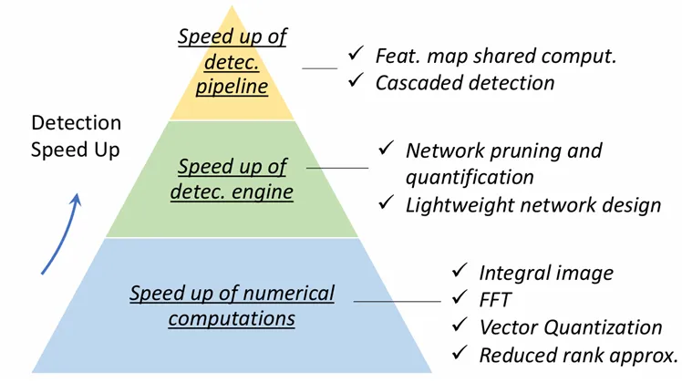

**Để tăng tốc độ xử lý OD, người ta chia các phương pháp ra thành 3 level** (3 hướng tiếp cận) chính, tùy theo tính chất của bài toán mà nhà nghiên cứu có thể tiếp cận theo level khác nhau.

{}

Đây là cấp độ thấp nhất, tập trung vào việc tăng tốc các phép tính số học cơ bản. 

Các kỹ thuật ở level này bao gồm:

- **Integral image:** Sử dụng các phép tích phân trên ảnh để tính toán nhanh các đặc trưng.
- **FFT:** Sử dụng Fast Fourier Transform để tăng tốc độ tính toán các phép tính tích chập.
- **Vector Quantization:** Lượng tử hóa vector để giảm kích thước dữ liệu và tăng tốc độ tính toán.
- **Reduced rank approximation:** Loại bỏ các thông tin dư thừa bằng cách giảm bớt dimension không cần thiết trong các ma trận Convolution để giảm số lượng phép tính.

{}

{}

Cấp độ này tập trung vào việc tăng tốc độ của thuật toán và mô hình được sử dụng để phát hiện đối tượng. 

**Các kỹ thuật ở level này bao gồm**:

- **Network pruning and quantification:** Cắt tỉa và lượng tử hóa mạng neuron để giảm kích thước và tăng tốc độ.
- **Lightweight network design:** Thiết kế các mạng neuron gọn nhẹ, yêu cầu ít tài nguyên tính toán.

{}

{}

Đây là cấp độ cao nhất, tập trung vào việc tăng tốc toàn bộ quy trình phát hiện đối tượng (detection pipeline). 

**Các kỹ thuật ở level này bao gồm**:

- **Feat. map shared comput.:** Chia sẻ tính toán trên các feature map để tránh tính toán dư thừa.
- **Cascaded detection:** Sử dụng kiến trúc cascaded để loại bỏ sớm các vùng không chứa đối tượng.
{}

{}

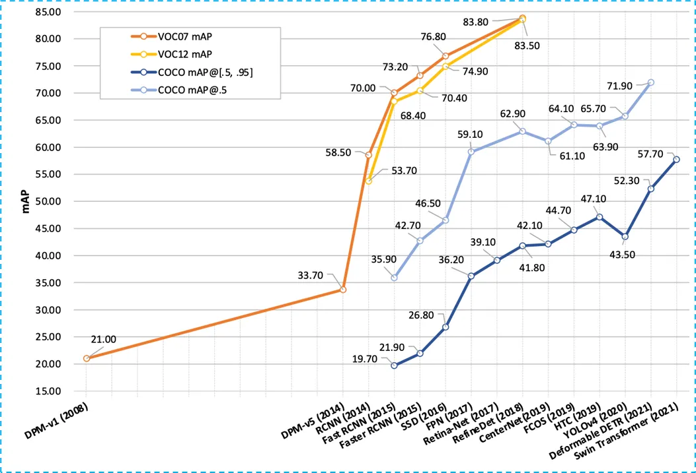

{}
**Multi-scale** (đa tỷ lệ) đề cập đến việc xử lý và phát hiện các đối tượng ở nhiều kích thước khác nhau trong một bức ảnh. Vấn đề này phát sinh do trong thực tế, các đối tượng có thể xuất hiện với kích thước rất đa dạng, từ nhỏ bé (ví dụ: con kiến) đến cực lớn (ví dụ: tòa nhà).

Nếu chỉ sử dụng một kích thước cố định để xử lý ảnh, mô hình có thể gặp khó khăn trong việc phát hiện các đối tượng có kích thước quá khác biệt so với kích thước đó. Ví dụ, nếu mô hình chỉ được huấn luyện trên các đối tượng lớn, nó có thể bỏ sót các đối tượng nhỏ hoặc ngược lại.

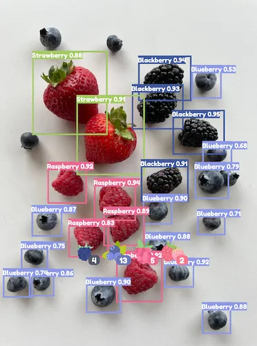

{}

### 1.3. Multi-scale trong Object Detection

{}
Mục tiêu là làm sao cho mô hình có thể “nhìn thấy” hình ảnh ở nhiều mức độ chi tiết, tỉ lệ khác nhau. 

Có hai cách tiếp cận chính:

+ **Image pyramid:** Chia hình ảnh đầu vào thành nhiều phiên bản với kích thước khác nhau (tạo thành một kim tự tháp ảnh), sau đó xử lý từng phiên bản độc lập.

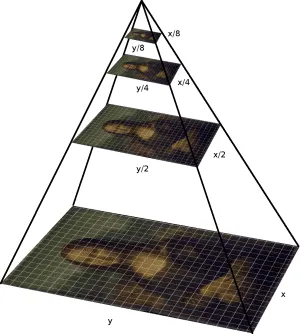

Nguồn: [link](https://huytranvan2010.github.io/Image-pyramid-with-Python/)

+ **Feature pyramid:**  Tạo ra một kim tự tháp các feature map (bản đồ đặc trưng) từ các tầng khác nhau của mạng CNN. Các feature map ở tầng thấp chứa thông tin chi tiết về các đối tượng nhỏ, trong khi các feature map ở tầng cao chứa thông tin ngữ nghĩa về các đối tượng lớn.

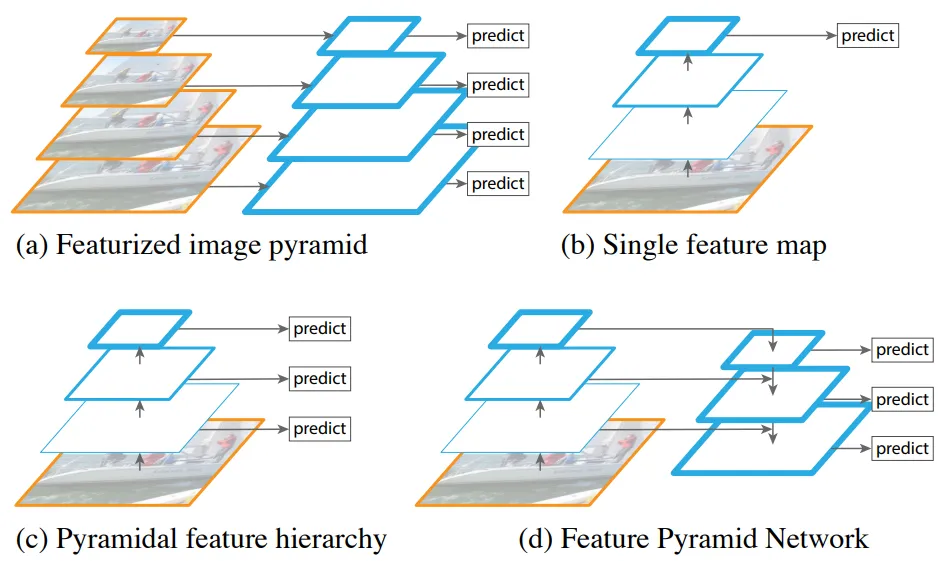

| Tiêu chí | Image Pyramid | Feature Pyramid |
|----------|---------------|-----------------|
| Nguyên lý | Xử lý nhiều phiên bản thu nhỏ của ảnh gốc | Tận dụng feature map từ các tầng của mạng, học thông tin trừu tượng |
| Ưu điểm | Dễ hiểu, hiệu quả với đối tượng nhỏ | Hiệu quả cao, tiết kiệm tài nguyên |
| Nhược điểm | Tốn kém tài nguyên, tăng thời gian suy luận | Khó triển khai, hiệu quả phụ thuộc kiến trúc mạng |
| Tính interpretable | Cao, dễ dàng hình dung thông tin ở mỗi tầng do không biến đổi input | Thấp, khó hiểu ý nghĩa của feature map |

>[!NOTE]
>Feature pyramid học được thông tin trừu tượng hơn, giúp mô hình "hiểu" ảnh sâu hơn và cho kết quả chính xác hơn, nhưng đánh đổi bằng việc giảm tính interpretable. Ngược lại, Image pyramid dễ hiểu và diễn giải hơn, nhưng kém hiệu quả về mặt tài nguyên.

{}

{}
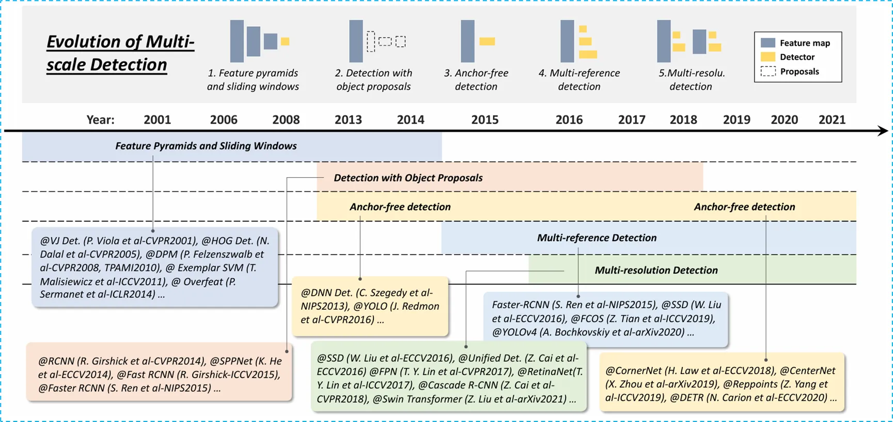

{}
- Đây là giai đoạn đầu của **Multi-scale Detection**, sử dụng **Feature pyramid** kết hợp với **Sliding windows** để phát hiện đối tượng ở nhiều tỷ lệ khác nhau.
- Một số phương pháp tiêu biểu trong giai đoạn này:
 - **VJ Det. (2001):** Sử dụng Haar-like features và AdaBoost để phát hiện khuôn mặt.
 - **HOG Det. (2005):** Sử dụng Histogram of Oriented Gradients (HOG) để phát hiện người đi bộ.
 - **DPM (2008):** Sử dụng Deformable Part Model (DPM) để phát hiện đối tượng.

{}

{}

Giai đoạn này đánh dấu sự chuyển dịch sang sử dụng **Object Proposals** (đề xuất đối tượng) để giảm không gian tìm kiếm và tăng tốc độ xử lý.

Các phương pháp tiêu biểu:

- **RCNN (2014):** Sử dụng **Selective Search** để tạo vùng đề xuất, sau đó sử dụng **CNN để phân loại**.
- **SPPNet (2014):** Giới thiệu **Spatial Pyramid Pooling** để xử lý các vùng đề xuất có kích thước khác nhau.
- **Fast RCNN (2015):** Cải thiện **tốc độ xử lý của RCNN**.
- **Faster RCNN (2015):** Sử dụng **Region Proposal Network (RPN)** để tạo vùng đề xuất, tăng tốc độ đáng kể.
{}

{}
Giai đoạn này tập trung vào các phương pháp **Anchor-free**, **không** sử dụng **anchor boxes** để dự đoán vị trí đối tượng.

Một số phương pháp tiêu biểu:

- **CornerNet (2018):** Phát hiện đối tượng bằng cách dự đoán các góc của bounding box.
- **CenterNet (2019):** Phát hiện đối tượng bằng cách dự đoán tâm của bounding box.
- **Reppoints (2019):** Sử dụng các điểm đại diện để biểu diễn đối tượng.

{}

{}
Giai đoạn này tập trung vào việc sử dụng nhiều **reference boxes** (hộp tham chiếu) để dự đoán **bounding box** chính xác hơn.

Các phương pháp tiêu biểu:

- **SSD (2016):** Sử dụng nhiều anchor boxes với các tỷ lệ và kích thước khác nhau.
- **FPN (2017):** Kết hợp feature map từ các tầng khác nhau để tạo **feature pyramid**.
- **RetinaNet (2017):** Sử dụng **focal loss** để giải quyết mất cân bằng lớp.

{}

{}
Giai đoạn này tập trung vào việc xử lý hình ảnh ở nhiều độ phân giải khác nhau để phát hiện đối tượng ở nhiều tỷ lệ.

Các phương pháp tiêu biểu:

- **SSD (2016):** Sử dụng feature map từ các tầng khác nhau để phát hiện đối tượng ở nhiều tỷ lệ.
- **YOLOv4 (2020):** Sử dụng kỹ thuật multi-scale training để tăng cường khả năng phát hiện đối tượng.
- **Swin Transformer (2021):** Kiến trúc Transformer được thiết kế cho thị giác máy tính, đạt hiệu suất cao trong Object Detection.

{}

{}

{}

Thay vì phải xem xét tất cả các vùng có thể có trong ảnh để tìm kiếm đối tượng, **Object Proposals** sẽ tạo ra một tập hợp các vùng *"tiềm năng" (candidate regions)* có khả năng cao chứa đối tượng. Các vùng này được gọi là "object proposals" hay "region proposals".

Điều này giúp:

+ Giảm không gian tìm kiếm, bỏ qua các vùng không gian background.
+ Tăng tốc độ xử lý, vì chỉ cần xem xét các vùng đề xuất thay vì toàn bộ ảnh như sliding windows.

{}

+ **Selective Search:** Dựa trên các đặc trưng màu sắc, kết cấu, và kích thước để nhóm các pixel lại với nhau và tạo thành các vùng đề xuất.

+ **EdgeBoxes**: Sử dụng các cạnh trong ảnh để tạo vùng đề xuất -> sử dụng các features như sobel để detect cạnh phần nào nhiều cạnh xuất hiện phần đó sẽ là vùng cần được detect.

+ **Region Proposal Network (RPN)**: Một thành phần trong kiến trúc **Faster R-CNN**, sử dụng mạng nơ-ron để tạo vùng đề xuất -> sử dụng một mạng nơ ron để học và detect.

{}

{}

{}
Anchor box là các hộp có kích thước cố định và tỷ lệ cố định đặt sẵn trong ảnh, đóng vai trò như điểm tham chiếu để mô hình dự đoán bounding box của đối tượng.

{}

{}

Khi thực hiện object detection, chúng ta có thể sử dụng region proposal để khoanh vùng trước khu vực có khả năng cao chứa đối tượng trong ảnh. Các thuật toán như Selective Search hay Region Proposal Network thường được dùng để tạo ra các vùng đề xuất này.

Sau đó, tại mỗi vùng đề xuất, chúng ta sẽ đặt một số lượng anchor box với kích thước và tỷ lệ cố định khác nhau. Các anchor box này đóng vai trò như "mẫu" để mô hình dự đoán bounding box của đối tượng bằng cách dự đoán độ lệch từ anchor box đến vị trí thực tế của đối tượng. 

Tuy nhiên, cần lưu ý rằng không phải mô hình object detection nào cũng sử dụng cả region proposal và anchor box.


Vậy thì câu hỏi đặt ra ở đây là bao nhiêu region proposal là đủ tốt?
Các phương pháp truyền thống có thể trả về lên tới vài trăm, vài ngàn region proposal khác nhau.
Đây cũng chính là khuyết điểm lớn và là motivation cho hướng Anchor-free.


.

---

**Hạn chế của Anchor box:**

- **Nhiều siêu tham số cần điều chỉnh:** Cần phải xác định **số lượng**, **kích thước**, **tỷ lệ của anchor box** sao cho phù hợp với tập dữ liệu.
- **Tính toán phức tạp:** Cần phải tính toán **IoU (Intersection over Union)** giữa anchor box và ground-truth box cho mỗi vị trí trên feature map.
- **Mất cân bằng giữa positive và negative anchor boxes:** Thường có **rất nhiều anchor box không chứa đối tượng (negative),** dẫn đến mất cân bằng trong quá trình huấn luyện.

{}

{}

Thay vì dựa vào anchor box, các phương pháp **anchor-free** dự đoán **trực tiếp vị trí** và **kích thước** của đối tượng dựa trên các đặc trưng của feature map.

Một số thuật toán anchor-free phổ biến:

- **CornerNet:** Phát hiện đối tượng bằng cách dự đoán hai góc của bounding box (góc trên bên trái và góc dưới bên phải).
- **CenterNet:** Phát hiện đối tượng bằng cách dự đoán tâm của bounding box và kích thước của đối tượng.
- **FCOS (Fully Convolutional One-Stage Object Detection):** Dự đoán trực tiếp bounding box cho mỗi điểm trên feature map.
- **RepPoints:** Sử dụng một tập hợp các điểm đại diện để biểu diễn đối tượng, sau đó dự đoán bounding box dựa trên các điểm này.

{}
Câu trả lời là có, có một số phương pháp anchor-free sử dụng region proposal, nhưng không phải là tất cả.

Để hiểu rõ ta cần phân biệt hai khái niệm sau:

+ Region proposal: là bước tiền xử lý nhằm tạo ra các vùng có tiềm năng chứ đối tượng giúp giảm không gian tìm kiếm cho mô hình.
+ Anchor box: là các hộp có kích thước và tỷ lệ cố định, được đặt trên ảnh để làm điểm tham chiếu cho việc dự đoán bounding box.

Anchor-free bản chất là loại bỏ việc sử dụng anchor box nhưng không nhất thiết phải loại bỏ region proposal.
Ví dụ:

+ **FCOS (Fully Convolutional One-Stage Object Detection)**: Đây là một phương pháp anchor-free không sử dụng region proposal. FCOS dự đoán trực tiếp bounding box cho mỗi điểm trên feature map.

+ **RepPoints**: Tương tự **FCOS**, **RepPoints** cũng là một phương pháp anchor-free không sử dụng region proposal. **RepPoints** sử dụng một tập hợp các điểm đại diện để biểu diễn đối tượng.

+ **CornerNet**: Mặc dù là anchor-free, **CornerNet** vẫn sử dụng một hình thức region proposal. Nó sử dụng **corner pooling** để tạo ra các "**heatmaps**" (bản đồ nhiệt) biểu diễn khả năng xuất hiện góc của đối tượng tại mỗi vị trí trên ảnh. Các điểm có **giá trị cao** trên **heatmap** có thể được coi là **một dạng region proposal**.


  Tóm lại:

  + **Anchor-free** tập trung vào việc loại bỏ **anchor box**, **không phải region proposal**.
  + Một số phương pháp **anchor-free** có thể sử dụng **region proposal** để cải thiện hiệu suất hoặc đơn giản hóa quá trình huấn luyện.
  
  Việc sử dụng hay không sử dụng region proposal trong anchor-free phụ thuộc vào thiết kế cụ thể của từng phương pháp.


{}

{}

## 2. Evoluation of Context Priming in Object Detection

{}

**Context Priming** trong **Object Detection** là một kỹ thuật tận dụng thông tin ngữ cảnh (contextual information) trong ảnh để cải thiện độ chính xác của việc phát hiện đối tượng. Ý tưởng chính là các **đối tượng thường xuất hiện trong những ngữ cảnh nhất định**, và việc **hiểu được ngữ cảnh này có thể giúp mô hình dự đoán chính xác hơn**.

Ví dụ, nếu ta thấy một cái bàn, ta có thể mong đợi sẽ thấy các đối tượng liên quan như ghế, máy tính, sách vở,... ở gần đó. Hoặc nếu ta thấy một người đang cầm vợt tennis, ta có thể suy ra rằng có khả năng cao sẽ có một quả bóng tennis hoặc một sân tennis trong ảnh.

Lưu ý rằng ta chỉ lấy thêm 1 phần nhỏ xung quanh đối tượng mới cải thiện được performance, không lấy quá nhiều → **local context**.

{}

{}

Global Context là việc nắm bắt thông tin toàn bộ bức ảnh.

CNN truyền thống chủ yếu tập trung vào local context, nhưng có thể kết hợp với các kỹ thuật như *Global Average Pooling (GAP)* hoặc *Attention mechanism* để lấy thông tin toàn cục từ ảnh.
{}

{}
Thay vì chỉ xem xét ngữ cảnh như một yếu tố bổ sung, Context Interactives tập trung vào việc phân tích và khai thác các mối quan hệ phức tạp giữa các đối tượng và môi trường xung quanh.

{}

## 3. Evoluation of Hard Negative Mining

{}
Hard Negative Mining là một kỹ thuật được sử dụng trong Object Detection để cải thiện độ chính xác của mô hình bằng cách tập trung vào những hard negative samples.

Negative samples là những vùng trong ảnh không chứa đối tượng mà chúng ta quan tâm, trong quá trình huấn luyện mô hình object detection, chúng ta cần cung cấp cho mô hình cả Positive samples (chứa đối tượng) và Negative samples (không chứa đối tượng ) để mô hình phân biệt nếu không thì mô hình sẽ rất dễ bị bias cũng như khôgn dự đoán tốt được class bị imbalanced (trainning trên số lượng ít hơn nhiều so với các class khác)

{}

{}
Giai đoạn đầu, **Bootstrap** được sử dụng rộng rãi để xử lý các vấn đề về hạn chế tài nguyên tính toán.

+ **Ý tưởng**: Bootstrap là một kỹ thuật tối ưu trong lấy mẫu, trong đó ta lấy mẫu ngẫu nhiên có thể lặp lại từ tập dữ liệu gốc để tạo tập dữ liệu mới (giống bootstrap trong decision tree nhỉ).

+ **Ứng dụng trong Hard Negative Mining**: Bootstrap được sử dụng để tạo ra các tập huấn luyện chứa nhiều mẫu negative khó hơn, giúp cải thiện hiệu quả huấn luyện khi tài nguyên tính toán còn hạn chế.

+ Một số phương pháp tiêu biểu:
  + Face Det. (H. A. Rowley et al-CMUTechRep1995)
  + Haar Det. (C. P. Papageorgiou et al-ICCV1998)
  + VJ Det. (P. Viola et al-CVPR2001)
  + HOG Det. (N. Dalal et al-CVPR2005)
  + DPM (P. Felzenszwalb et al-CVPR2008, ΤΡΑΜ12010)
{}

{}
Giai đoạn này, các phương pháp **không tập trung **vào **Hard Negative Mining** mà chủ yếu **cân bằng trọng số giữa các lớp đối tượng và lớp nền**.

+ Ý tưởng: thay vì tìm kiếm các mẫu âm khó, các phương pháp tập trung vào việc điều chỉnh trọng số (weight) của các lớp trong hàm loss, giúp cân bằng giữa mẫu negative và positive.  

- **Một số phương pháp tiêu biểu:**
    - RCNN (R. Girshick et al-CVPR2014)
    - SPPNet (K. He et al-ECCV2014)
    - Fast RCNN (R. Girshick-ICCV2015)
    - Faster RCNN (S. Ren et al-NIPS2015)
    - YOLO (J. Redmon et al-CVPR2016)
{}

{}
Giai đoạn này đánh dấu sự trở lại của **Bootstrap**, kết hợp với các **hàm loss mới**, tập trung vào việc khai thác các mẫu khó.

- **Ý tưởng:** Sử dụng Bootstrap để tạo ra các tập huấn luyện chứa nhiều mẫu âm khó, đồng thời sử dụng các hàm loss mới để tập trung vào việc huấn luyện trên các mẫu này.
- **Một số phương pháp tiêu biểu:**
    - SSD (W. Liu et al-ECCV2016)
    - FasterPed (L. Zhang et al-ECCV2016)
    - OHEM (A. Shrivastava et al-CVPR2016)
    - RetinaNet (T. Y. Lin et al-ICCV2017)
    - RefineDet (Zhang et al-CVPR18)
    - FCOS (Z. Tian et al-ICCV2019)
    - YOLOv4 (A. Bochkovskiy et al-arXiv2020)

{}

## 4. Evoluation of Non-max suppression.

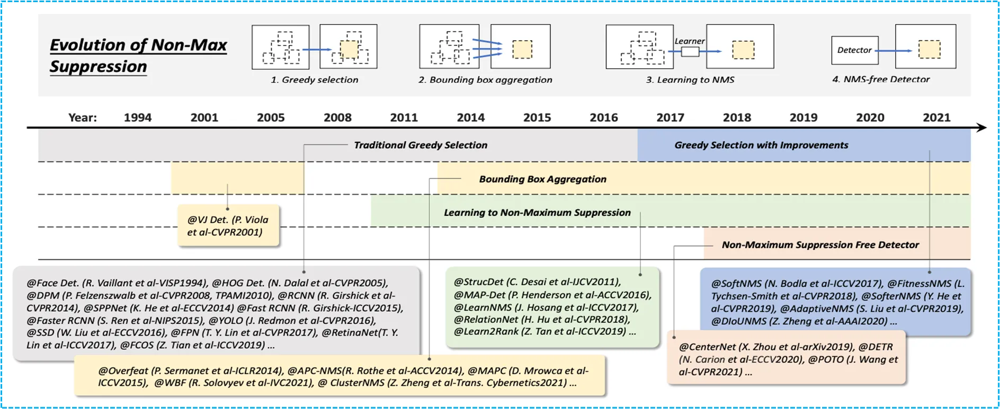

{}
Non-maximum suppression (NMS) là một kỹ thuật post-processing được sử dụng để loại bỏ các bounding box trùng lặp và chỉ giữ lại các bounding box tốt có độ tin cậy cao nhất.

{}

{}
Đây là phương pháp NMS truyền thống sử dụng thuật toán tham lam (greedy algorithm) để loại bỏ các bounding box trùng lặp.

**Ý tưởng:** Chọn bounding box có độ tin cậy cao nhất, sau đó bỏ các bounding box chồng chéo với nó. Lặp lại qúa trình đến khi không còn bounding box nào.

**Hạn chế:** Có thể loại bỏ nhầm các bouding box của các đối tượng gần nhau.

{}

{}

Nhánh này tập trung vào việc tổng hợp các bounding box chồng chéo để tạo ra bounding box chính xác hơn.

**Ý tưởng:** Thay vì loại bỏ các bounding box chồng chéo, các phương pháp này kết hợp chúng lại để tạo ra bounding box mới có vị trí và kích thước chính xác hơn.

**Lợi ích:** Cải thiện độ chính xác, đặc biệt là khi các đối tượng gần nhau.

{}

{}
Nhánh này sử dụng học máy để học cách thực hiện NMS.

**Ý tưởng:** Huấn luyện một mô hình để học cách lựa chọn bounding box tối ưu, thay vì sử dụng các thuật toán tham lam cố định.

**Lợi ích:** Cải thiện độ chính xác và khả năng thích ứng với các tập dữ liệu khác nhau.

{}

{}

Nhánh này phát triển các mô hình Object Detection không cần sử dụng NMS.

**Ý tưởng:** Thiết kế kiến trúc mạng và hàm loss để mô hình tự động dự đoán các bounding box không trùng lặp.

**Lợi ích:** Đơn giản hóa quy trình, giảm thời gian xử lý.
{}

## 5. Overview Object Detection.

### 5.1. Overview YOLO

{}

| **S. No.** | **Authors** | **Detector** | **Type** | **Input image** | **Published in** | **URL link** |
| --- | --- | --- | --- | --- | --- | --- |
| 1 | Li et al. ([2017](https://link.springer.com/article/10.1007/s10462-024-10877-1)) | YOLOv3-DarkNet53 | Anchor-based | 320*320 | arXiv 2018 | [https://github.com/westerndigitalcorporation/YOLOv3-in-PyTorch](https://github.com/westerndigitalcorporation/YOLOv3-in-PyTorch) |
| 2 | Howard et al. ([2017](https://link.springer.com/article/10.1007/s10462-024-10877-1)) | MobileNet-SSD | Anchor-based | 300*300 | arXiv 2017 | [https://github.com/chuanqi305/MobileNet-SSD](https://github.com/chuanqi305/MobileNet-SSD) |
| 3 | Sandler et al. ([2018](https://link.springer.com/article/10.1007/s10462-024-10877-1)) | MobileNetv2-SSDLite | Anchor-based | 320*320 | CVPR 2018 | [https://github.com/tranleanh/mobilenets-ssd-pytorch](https://github.com/tranleanh/mobilenets-ssd-pytorch) |
| 4 | Li et al. ([2018](https://link.springer.com/article/10.1007/s10462-024-10877-1)) | Tiny-DSOD | Anchor-based | 300*300 | arXiv 2018 | [https://github.com/lyxok1/Tiny-DSOD](https://github.com/lyxok1/Tiny-DSOD) |
| 5 | Wang et al. ([2018](https://link.springer.com/article/10.1007/s10462-024-10877-1)) | Pelee | Anchor-based | 304*304 | NeurIPS 2018 | [https://github.com/Robert-JunWang/Pelee](https://github.com/Robert-JunWang/Pelee) |
| 6 | Qin et al. ([2019](https://link.springer.com/article/10.1007/s10462-024-10877-1)), Huang et al. ([2018](https://link.springer.com/article/10.1007/s10462-024-10877-1)) | YOLO-LITE | Anchor-based | 416*416 | ICBD 2018 | [https://github.com/reu2018DL/YOLO-LITE](https://github.com/reu2018DL/YOLO-LITE) |
| 7 | Qin et al. ([2019](https://link.springer.com/article/10.1007/s10462-024-10877-1)) | ThunderNet | Anchor-based | 320*320 | ICCV 2019 | [https://github.com/DayBreak-u/Thundernet_Pytorch](https://github.com/DayBreak-u/Thundernet_Pytorch) |
| 8 | Tan et al. ([2019](https://link.springer.com/article/10.1007/s10462-024-10877-1)) | MnasNet-A1 + SSDLite | Anchor-based | 320*320 | CVPR 2019 | [https://github.com/tensorflow/tpu/tree/master/models/official/mnasnet](https://github.com/tensorflow/tpu/tree/master/models/official/mnasnet) |
| 9 | Tang et al. ([2020a](https://link.springer.com/article/10.1007/s10462-024-10877-1), [2020b](https://link.springer.com/article/10.1007/s10462-024-10877-1)) | LightDet | Anchor-based | 320*320 | ICASSP 2020 | Not available |
| 10 | Yi et al. ([2019](https://link.springer.com/article/10.1007/s10462-024-10877-1)) | YOLOV3-Tiny | Anchor-based | 416*416 | ICACCS 2020 | [https://github.com/pjreddie/darknet/blob/master/cfg/yolov3-tiny.cfg](https://github.com/pjreddie/darknet/blob/master/cfg/yolov3-tiny.cfg) |
| 11 | Long et al. ([2020a](https://link.springer.com/article/10.1007/s10462-024-10877-1), [2020b](https://link.springer.com/article/10.1007/s10462-024-10877-1)) | PP‐YOLO | Anchor-based | 608*608 | CVPR 2020 | [https://github.com/PaddlePaddle/PaddleDetection](https://github.com/PaddlePaddle/PaddleDetection) |
| 12 | Long et al. ([2020a](https://link.springer.com/article/10.1007/s10462-024-10877-1), [2020b](https://link.springer.com/article/10.1007/s10462-024-10877-1)) | YOLOv4-Tiny | Anchor-based | 416*416 | arXiv 2020 | [https://github.com/truong2710-cyber/Mask-Detection-YOLOv4-tiny-Kaggle-Dataset](https://github.com/truong2710-cyber/Mask-Detection-YOLOv4-tiny-Kaggle-Dataset) |
| 13 | Tan et al. ([2020](https://link.springer.com/article/10.1007/s10462-024-10877-1)) | EfficientDet | Anchor-based | 512*512 | CVPR 2020 | [https://github.com/xuannianz/EfficientDet](https://github.com/xuannianz/EfficientDet) |
| 14 | Huang et al. ([2021](https://link.springer.com/article/10.1007/s10462-024-10877-1)) | PP‐YOLOv2 | Anchor-based | 640*640 | arXiv 2021 | [https://github.com/PaddlePaddle/PaddleDetection](https://github.com/PaddlePaddle/PaddleDetection) |
| 15 | Ge et al. ([2021](https://link.springer.com/article/10.1007/s10462-024-10877-1)) | YOLOX-Nano | Anchor-free | 416*416 | ICSP 2022 | [https://github.com/Megvii-BaseDetection/YOLOX](https://github.com/Megvii-BaseDetection/YOLOX) |
| 16 | Ge et al. ([2021](https://link.springer.com/article/10.1007/s10462-024-10877-1)) | YOLOX-Tiny | Anchor-free | 416*416 | IJCINI 2022 | [https://github.com/TexasInstruments/edgeai-yolox/blob/main/exps/default/yolox_tiny.py](https://github.com/TexasInstruments/edgeai-yolox/blob/main/exps/default/yolox_tiny.py) |
| 17 | Cai et al. ([2021](https://link.springer.com/article/10.1007/s10462-024-10877-1)) | YOLObile | Anchor-based | 320*320 | AAAI 2021 | [https://github.com/nightsnack/YOLObile](https://github.com/nightsnack/YOLObile) |
| 18 | Wang et al. ([2021](https://link.springer.com/article/10.1007/s10462-024-10877-1)) | Scaled YOLOv4 | Anchor-based | 608*608 | CVPR 2021 | [https://github.com/WongKinYiu/ScaledYOLOv4](https://github.com/WongKinYiu/ScaledYOLOv4) |
| 19 | Wang et al. ([2021](https://link.springer.com/article/10.1007/s10462-024-10877-1)) | Trident YOLO | Anchor-based | 416*416 | Wiley IET | Not available |
| 20 | Li et al. ([2021a](https://link.springer.com/article/10.1007/s10462-024-10877-1), [2021b](https://link.springer.com/article/10.1007/s10462-024-10877-1), [2021c](https://link.springer.com/article/10.1007/s10462-024-10877-1)) | NanoDet | Anchor-free | 320*320 | Journals of Radar | [https://github.com/RangiLyu/nanodet](https://github.com/RangiLyu/nanodet) |
| 21 | Yu et al. ([2021](https://link.springer.com/article/10.1007/s10462-024-10877-1)) | PP-PicoDet | Anchor-free | 416*416 | arXiv 2021 | [https://github.com/PaddlePaddle/PaddleDetection](https://github.com/PaddlePaddle/PaddleDetection) |
| 22 | Ding et al. ([2022](https://link.springer.com/article/10.1007/s10462-024-10877-1)) | Slim YOLOv4 | Anchor-free | 416*416 | JRIP | Not available |
| 23 | Liu et al. ([2022a](https://link.springer.com/article/10.1007/s10462-024-10877-1), [2022b](https://link.springer.com/article/10.1007/s10462-024-10877-1)) | Mini YOLO | Anchor-free | 320*320 | Wiley Journal | Not available |
| 24 | Xu et al. ([2022](https://link.springer.com/article/10.1007/s10462-024-10877-1)) | PP-YOLOE-S | Anchor-free | 640*640 | arXiv 2022 | [https://github.com/PaddlePaddle/PaddleDetection](https://github.com/PaddlePaddle/PaddleDetection) |
| 25 | Wang et al. ([2022a](https://link.springer.com/article/10.1007/s10462-024-10877-1), [2022b](https://link.springer.com/article/10.1007/s10462-024-10877-1), [2022c](https://link.springer.com/article/10.1007/s10462-024-10877-1), [2022d](https://link.springer.com/article/10.1007/s10462-024-10877-1)) | YOLOv7-X | Anchor-free | 640*640 | arXiv 2022 | [https://github.com/WongKinYiu/yolov7](https://github.com/WongKinYiu/yolov7) |
| 26 | Li et al. ([2022a](https://link.springer.com/article/10.1007/s10462-024-10877-1), [2022b](https://link.springer.com/article/10.1007/s10462-024-10877-1)) | L-DETR | Anchor-free | 800*1333 | IEEE Access | [https://github.com/wangjian123799/L-DETR.git](https://github.com/wangjian123799/L-DETR.git) |

        
| **No.** | **Detector** | **Backbone** | **Loss function** | **AP** | **Proposal** |
| --- | --- | --- | --- | --- | --- |
| 1 | YOLOv3-DarkNet53 | DarkNet53 | Logistic regression | 38.1 | Network structure makes greater use of the GPU, making it faster to evaluate than Darknet-19 |
| 2 | MobileNet-SSD | MobileNet | Smooth L1 loss | 19.3 | Lightweight deep network is constructed using depth-wise separable convolutions |
| 3 | MobileNetv2-SSDLite | MobileNetv2 | Smooth L1 loss | 22.1 | With fewer parameters and less computational complexity, gets competitive accuracy |
| 4 | Tiny-DSOD | DDB-Net | Smooth L1 loss | 23.2 | For resource-constrained uses based on DDB and D-FPN blocks |
| 5 | Pelee | PeleeNet | Smooth L1 loss | 22.4 | Variant of DenseNet, built with conventional convolution |
| 6 | YOLO-LITE | Darknet-53 | L1 loss | 12.2 | A real-time detection model developed to run on portable devices lacking a GPU |
| 7 | ThunderNet | SNet535 | Sigmoid | 28.1 | Embedded context enhancement and spatial attention module |
| 8 | MnasNet-A1 + SSDLite | MnasNet-A1 | Smooth L1 loss | 23.0 | Directly measures real-world inference latency by executing the model on edge devices |
| 9 | LightDet | Modified ShuffleV2 | Smooth L1 loss | 24.0 | Introduce an efficient feature-preserving and refinement module |
| 10 | YOLOv3-Tiny | Reduced Darknet-53 | Logistic regression | 16.6 | Lightweight model of YOLOv3, which takes reduced training time |
| 11 | PP‐YOLO | MobileNetV3 | IoU aware loss | 45.9 | Balanced efficiency, directly applied in real application scenarios |
| 12 | YOLOv4-Tiny | CSP-ResNet | CIoU loss | 28.7 | Reduced parameters, makes it suitable for edge devices |
| 13 | EfficientDet | EfficientNet | Focal loss | 34.6 | Proposed a weighted bi-directional FPN for feature fusion |
| 14 | PP‐YOLOv2 | ResNet101 | IoU aware loss | 49.5 | Increasing the input size and follow the design of PAN to aggregate the top-down information |
| 15 | YOLOX-Nano | DarkNet53 | GIoU loss | 25.8 | Dynamic label assignment strategy SimOTA |
| 16 | YOLOX-Tiny | CBAM | GIoU loss | 32.8 | Fuses convolutional attention and mixup data enhancement strategy |
| 17 | YOLObile | CSP-DarkNet53 | GIoU loss | 31.6 | Offers mobile acceleration and block-punched pruning with a mobile GPU-CPU collaborative strategy |
| 18 | Scaled YOLOv4 | CSPNet-15 | CIoU loss | 28.7 | Propose a network scaling approach that modifies the width, and resolution of network |
| 19 | TridentYOLO | CSP-RFBs | Focal loss | 40.3 | Propose a trident feature pyramid network |
| 20 | NanoDet | ShuffleNetV2 | Focal loss | 20.6 | Based on visual saliency and perform feature learning on samples added with saliency maps |
| 21 | PP-PicoDet | Enhanced ShuffleNet | GIoU Loss | 30.6 | Improved detection One-Shot NAS pipeline |
| 22 | Slim YOLOv4 | MobileNetV2 | CIoU loss | 29.2 | Efficient network computing methods for convolution |
| 23 | MiniYOLO | DSLightNet | CIoU | 21.4 | Adopted depthwise separable convolution |
| 24 | PP-YOLOE-S | ResNet50-vd | IoU aware loss | 43.1 | Scalable backbone-neck architecture, and refined loss function |
| 25 | YOLOv7-X | RepCSPResNet | Assistant loss | 53.1 | Propose the trainable bag-of-freebies method to enhance accuracy |
| 26 | L-DETR | PP-LCNet | H-sigmoid function | – | Embedded group normalization |
        
| **No.** | **Light-weight object detector** | **Backbone** | **FLOPs** | **Inference time (ms)** | **FPS** | **Parameters (M)** | **Real-time applications** |
| --- | --- | --- | --- | --- | --- | --- | --- |
| 1 | YOLOv3-DarkNet53 | DarkNet53 | 1453B | 22 | 171 | – | √ |
| 2 | MobileNet-SSD | MobileNet | 1.2G | – | 59.3 | 4.31 | * |
| 3 | MobileNetv2-SSDLite | MobileNetv2 | 0.8G | – | – | 3.38 | * |
| 4 | Tiny-DSOD | DDB-Net | 1.12G | – | 105 | 0.95 | * |
| 5 | Pelee | PeleeNet | 1.21B | – | 205 | 5.98 | * |
| 6 | YOLO-LITE | Darknet-53 | 0.48G | – | 21 | – | * |
| 7 | ThunderNet | SNet535 | 0.47 | – | 248 | – | √ |
| 8 | MnasNet-A1 + SSDLite | MnasNet-A1 | 0.8B | 203 | – | 4.9 | * |
| 9 | LightDet | Modified ShuffleV2 | 0.50G | – | 250 | – | √ |
| 10 | YOLOv3-Tiny | Reduced Darknet-53 | 5.56 B | 4.5 | 368 | 8.86 | * |
| 11 | PP‐YOLO | MobileNetV3 | 1.02G | 10.48 | 73 | 1.08 | √ |
| 12 | YOLOv4-Tiny | CSP-ResNet | – | – | 371 | 6.06 | √ |
| 13 | EfficientDet | EfficientNet | 2.5B | 10.20 | 98 | 3.9 | √ |
| 14 | PP‐YOLOv2 | ResNet101 | 0.115G | 14.50 | 68.9 | 1.08 | √ |
| 15 | YOLOX-Nano | DarkNet53 | 1.08G | 19.23 | 90.1 | 0.91 | √ |
| 16 | YOLOX-Tiny | CBAM | 6.48G | 32.77 | – | 5.06 | √ |
| 17 | YOLObile | CSP-DarkNet53 | 3.95G | – | 17 | 4.59 | √ |
| 18 | Scaled YOLOv4 | CSPNet-15 | 6.3B | – | 62 | 53 | √ |
| 19 | TridentYOLO | CSP-RFBs | 5.19B | – | 29.3 | – | √ |
| 20 | NanoDet | ShuffleNetV2 | 1.2G | 13.35 | – | 0.95 | * |
| 21 | PP-PicoDet | Enhanced ShuffleNet | 0.73G | 8.13 | – | 0.99 | √ |
| 22 | Slim YOLOv4 | MobileNetV2 | – | – | 60.19 | – | √ |
| 23 | MiniYOLO | DSLightNet | – | – | – | 2.06 | * |
| 24 | PP-YOLOE-S | ResNet50-vd | 110.7G | 12.8 | 208.3 | 52.20 | √ |
| 25 | YOLOv7-X | RepCSPResNet | 189.9G | – | 114 | 71.3 | √ |
| 26 | L-DETR | PP-LCNet | – | – | – | – | √ |

{}

### 5.2. Overview về Detection Transformer (DETR)

### 5.3. Overview về Dataset

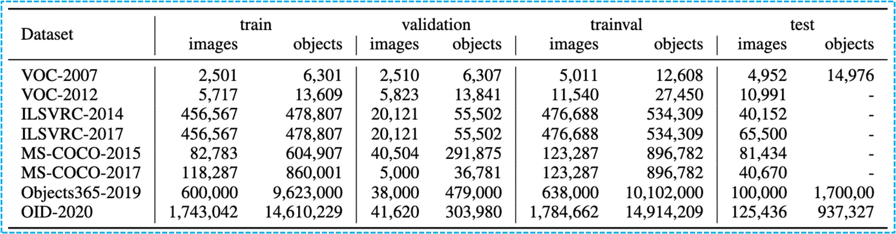

### 5.4. Traditional vs Deeplearning Method

### 5.5. Object Detection Milestiones


  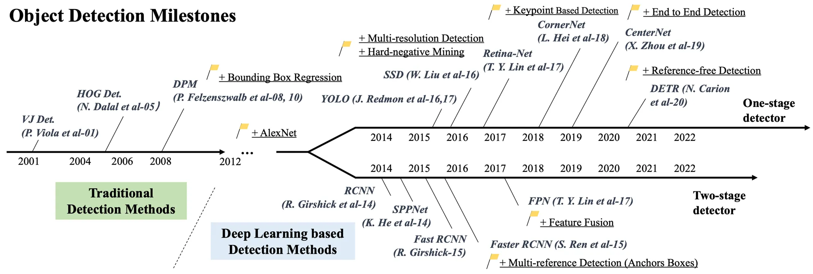


## 6. Sliding windows



Phần tiếp theo chúng ta sẽ đi lại từ thời điểm ban đầu, khi còn sử dụng các phương pháp truyền thống, naive để OD.
Đầu tiên sẽ là sliding window, giống như CNN, nó sẽ lần lượt trượt từ trái → phải, từ trên xuống dưới hết toàn bộ bức ảnh.
Tuy nhiên điều này không giúp máy tính “hiểu”/xác định được đối tượng.



{}

+ Làm sao **trích xuất được thông tin**/**feature** có trong window đó.
+ Từ các thông tin trích xuất được, làm sao để **phân loại đối tượng** đó chính xác

{}

**Region of Interest (ROI)** là thuật ngữ chỉ các vùng trích xuất/vùng đối tượng quan tâm từ sliding window.

{}

Ta có thể sử dụng các thông tin có sẵn trong image như:

**Haar-like features**: Các đặc trưng haar-like là các bộ lọc đơn giản dựa trên sự khác biệt của cường độ các pixel giữa các vùng hình chữ nhật. Chúng tìm kiếm thông tin sẵn có trong pixel như:

+ **Edge (Cạnh)**: Là ranh giới giữa các vùng có màu sắc hoặc cường độ sáng khác nhau.
+ **Corners (Góc):** Là điểm giao của 2 cạnh hoặc là điểm có độ cong cao.

**SIFT (Scale-Invariant Feature Transform):** là một thuật toán trích xuất đặc trưng (feature extraction) giúp tìm các điểm quan trọng bất biến với tỉ lệ xoay, biến đổi ánh sáng.

{}

{}

+ **Ưu điểm:**
  + Dễ tính toán, hiệu quả với các tác vụ đơn giản.
+ **Nhược điểm:**
  + Phải xử lý rất nhiều ROI từ window
  + Do đó dù dễ tính và interpretable nhưng tổng thể cực kì chậm chạp.
  + Khó hiểu các đặc trưng phức tạp nhạt cảm với nhiễu và các biến đổi nhỏ.
{}

{}

{}

Sử dụng các quy tắc và kiến thức về khuôn mặt người để xác định các đặc điểm và vị trí của khuôn mặt trong ảnh.

- Ví dụ: khuôn mặt người thường có hai mắt, một mũi, một miệng và chúng có vị trí tương đối cố định với nhau.
- Hạn chế: Các phương pháp này thường khó khăn khi xử lý các biến đổi về tư thế, biểu cảm, ánh sáng và che khuất.

{}

{}
Các phương pháp này trích xuất các đặc trưng hình ảnh từ ảnh, sau đó sử dụng các đặc trưng này để phân loại các vùng trong ảnh là khuôn mặt hay không phải khuôn mặt.

- Ví dụ: các đặc trưng có thể là màu sắc da, kết cấu da, cạnh, góc, hoặc các đặc trưng phức tạp hơn như HOG (Histogram of Oriented Gradients), LBP (Local Binary Patterns).
- Một số phương pháp phổ biến:
    - **Eigenfaces:** Sử dụng phân tích thành phần chính (PCA) để trích xuất các đặc trưng chính của khuôn mặt.
    - **Fisherfaces:** Sử dụng phân tích phân biệt tuyến tính (LDA) để trích xuất các đặc trưng phân biệt giữa các khuôn mặt.

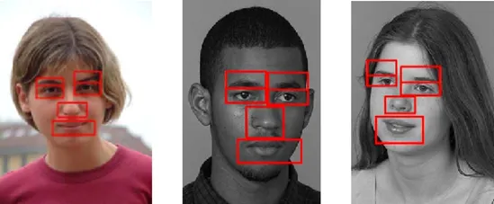

{}

{}
Các phương pháp này sử dụng một hoặc nhiều khuôn mẫu (template) của khuôn mặt, sau đó so sánh các khuôn mẫu này với các vùng trong ảnh để tìm ra sự tương đồng.

**Hạn chế:** Các phương pháp này thường nhạy cảm với các biến đổi về **kích thước**, **tư thế** và **góc nhìn của khuôn mặt**.

{}

{}

Các phương pháp này sử dụng các mô hình thống kê để biểu diễn sự biến đổi của khuôn mặt.

Ví dụ: **Active Appearance Models (AAMs)** sử dụng một tập hợp các điểm **landmark** để mô tả hình dạng khuôn mặt và một mô hình thống kê để biểu diễn sự biến đổi của hình dạng và kết cấu.

{}
{}



Phần tiếp theo chúng ta sẽ cùng tìm hiểu một trong những giải thuật truyền thống nổi tiếng nhất lúc bấy giờ là **Viola-Jones Algorithm** sử dụng **Haar Wavelets** hay **Haar Features**.
  


## 7. Viola-Jones Algorithm

>[!NOTE]
>Bối cảnh lúc này đang là chúng ta biết được gương mặt sẽ luôn có những đặc điểm như: **eyes**, **eyebrows**, **nose**, **lips**,…
>- Câu hỏi hiện tại là làm sao **extract** được face feature này?
>- Bên cạnh việc nhận biết những đặc điểm này, làm sao để **face detect real-time**.

### 7.1. Giới thiệu về Viola-Jones

**Viola-Jones** dùng các kernel đơn giản để tìm đặc trưng khuôn mặt, kết hợp với bộ phân loại theo các stage để loại bỏ nhanh vùng không phải khuôn mặt, cuối cùng dùng **sliding window** để quét qua ảnh và **tìm ra khuôn mặt.**

Cụ thể hơn, mỗi stage xem như 1 conditional feature mà ROI đó phải đáp ứng. Nếu **không đáp ứng** → **xem như background và loại bỏ**, không cần xét đến những stage tiếp theo.

### 7.2. Giới thiệu về Haar features

**Haar feature** tính toán sự khác biệt về cường độ pixel giữa các vùng hình chữ nhật trên ảnh.

Nó sử dụng kernel đơn giản, được các chuyên gia định nghĩa trước (các hình chữ nhật đen trắng như hình bên dưới) cho từng bộ phận khác nhau. 

Các vùng đen biểu thị trọng số âm, các vùng trắng biểu thị trọng số dương.

Giá trị của **Haar feature** được tính bằng cách lấy tổng giá trị pixel trong các vùng trắng trừ đi tổng giá trị pixel trong các vùng đen. Việc tính toán này có thể được thực hiện rất nhanh chóng nhờ sử dụng **Integral Image**.

>[!NOTE]
>Vậy để detect được gương mặt, ta sẽ phải sử dụng một bộ kernel chuyên biệt như sau:
>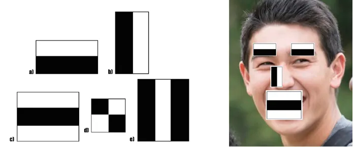

{}
Không phải **áp bộ kernel** này trong 1 lần mà là phải **Sliding window** rất nhiều lần

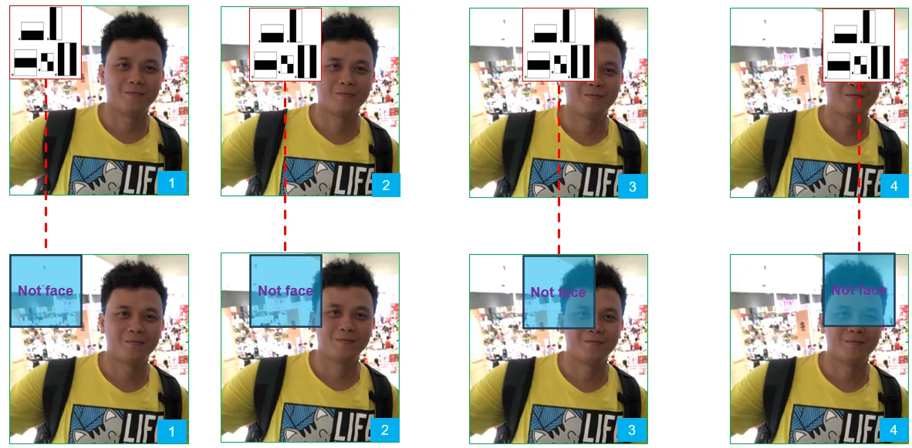

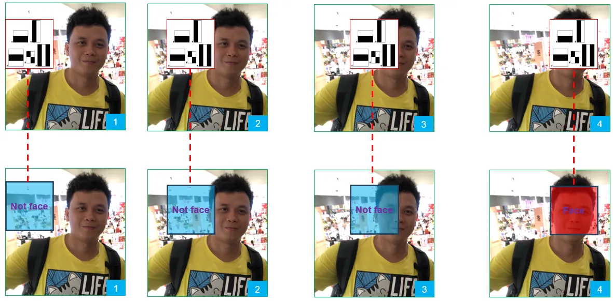

{}

{}
>“Viola-Jones uses 24*24 as base window size and calculates the above features all over the image shifting by 1 PX (Template + Feature).
>There are over 160,000 possible feature combinations that can fit into a 24x24 pixel image, and over 250,000 for a 28x28 image.” 

{}

{}
*Giả sử ta có 1 ROI được lưu dưới máy tính như sau:*

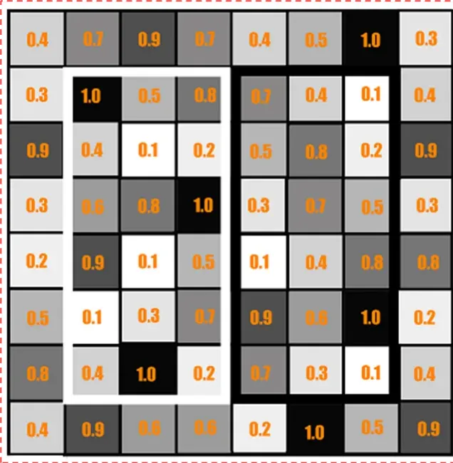

*Và filter để detect mũi như sau:*

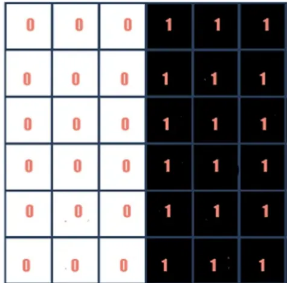


  Lưu ý rằng mình dùng từ filter ở đây thay vì kernel nhằm mục đích nhấn mạnh các giá trị ở đây chỉ nhằm mục đích xác định vị trí, không có thực hiện nhân tương ứng như Convolution. Lúc này chưa có khái niệm Convolution cho xử lý ảnh


*Ta sẽ lấy tổng toàn bộ giá trị pixel trong vùng màu đen - tổng pixel trong vùng màu trắng.*

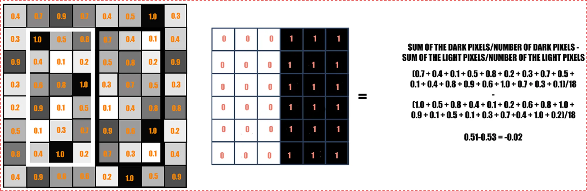

Vậy bạn có thể thay đổi giá trị filter thành con số bất kì, nó không ảnh hưởng đến các giá trị của image.


 **Hạn chế:**

+ Tốn nhiều thời gian và chi phí tính toán.

+ Cùng 1 vùng chân mày bên trái, bạn sẽ phải apply nhiều kernel khác nhau và tính sum cho từng kernel tương ứng. 

+ Bạn nghĩ chỉ có 5 kernel thôi thì cũng nhanh mà phải không? Vậy nếu bài toán Object Detection mở rộng lên 100 class khác nhau thì sao, mỗi class lại có 5 kernel thì bạn sẽ phỉ tính 500 lần summation như vậy.


{}

{}

Integral Image. Idea chính của nó là làm đẩy qua 1 bước trung gian, tính **tổng 1 lần ban đầu**, sau đó ta có thể đưa các bước tính tổng tiếp theo

Ta sẽ tạo một ma trận mới với các giá trị của nó sẽ được tính bằng **tổng** các giá trị ở **vị trí bên trái** và **phía trên** của bức ảnh gốc

](https://miro.medium.com/v2/resize:fit:1400/1*K2r9aTsaU-spymgjcMCWAA.gif 'https://towardsdatascience.com/face-detection-with-haar-cascade-727f68dafd08')

Nhìn vào hình minh họa bên dưới, ta có thể thấy

- Cách thông thường → long way $\mathcal O(N)$ do phải chạy vòng lặp tính tổng toàn bộ pixel ảnh gốc.
- Short way → $\mathcal O(1)$ do chỉ cần lấy giá trị góc phải của ROI là 178 - đi góc phải của vùng liền kề bên trái là 90.

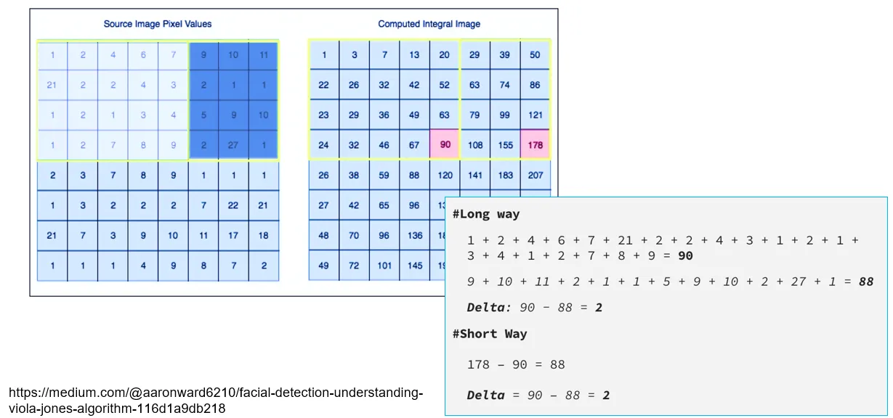

>[!NOTE]
>Vậy công thức tổng quát để tính tổng của một vùng filter bất kì ở original image thông qua integral image sẽ là 
>\text{Giá trị tổng của index (pixel integral image) : } 4 -(2+3) + 1

Lí do ta phải cộng lại cho 1 là vì $4-(2+3)$ vô tình trừ đi 2 lần vùng $A$

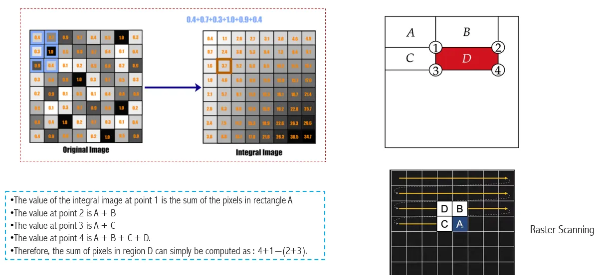

{}


Câu chuyện thực tế tương đối phức tạp, 
1. Cùng 1 object nhưng sẽ có các size khác nhau → **Multi-scale problem**
2. Ngoài ra ta phải sử dụng rất nhiều **Haar Feature** khác nhau, không phải cũng có ích cho việc dự đoán.


{}
**AdaBoost** giúp chọn ra một tập hợp nhỏ các đặc trưng tốt nhất, có khả năng phân loại cao nhất.

- Mỗi đặc trưng Haar-like tương ứng với một bộ phân loại yếu. **AdaBoost** sẽ huấn luyện các bộ phân loại yếu này trên tập dữ liệu huấn luyện.
- **AdaBoost** sẽ gán trọng số cho từng mẫu huấn luyện. Các mẫu bị phân loại sai sẽ được gán trọng số cao hơn.
- Sau đó chọn ra những bộ phân loại yếu có hiệu suất tốt nhất trên tập dữ liệu được gán trọng số.
- Và cuối cùng là kết hợp các bộ phân loại yếu đã chọn thành một bộ phân loại mạnh (strong classifier).

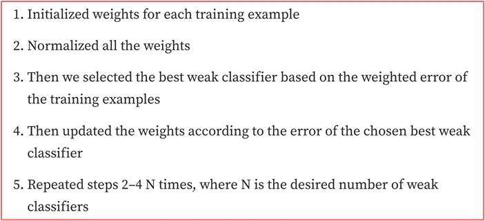

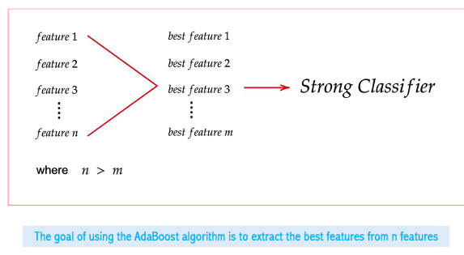

{}

{}
Vì **top-K filter** đã đủ để **100% positive samples**, vậy chỉ cần những ROI nào **không đáp ứng top-K filter đó thì ta loại bỏ**. Còn nếu đáp ứng thì tiếp tục apply những filter tiếp theo để tăng accuracy. Do đó hình vẽ ban đầu mới chia ra thành nhiều stage với số lượng filter lớn hơn.

Phương pháp này được gọi là **Cascade Classifier**.

{}

### 7.3. Summary

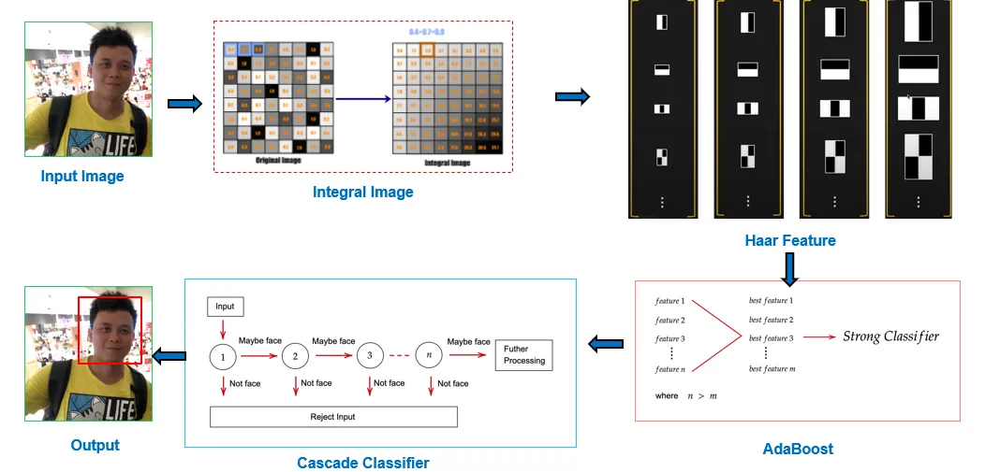

## 8. Apply SVM vào Object Detection

Sử dụng các phương pháp **xử lý ảnh truyền thống**: **HOG (Histogram of Oriented Gradients)**, **SIFT (Scale-Invariant Feature Transform)**, **LBP (Local Binary Patterns)** là những phương pháp phổ biến để trích xuất đặc trưng từ ảnh.

### 8.1. HOG (Histogram of Oriented Gradients)

**HOG (Histogram of Oriented Gradients)** là mô tả đối tượng trong ảnh dựa trên sự phân bố của hướng gradient.

Nói một cách đơn giản, HOG sẽ xem xét các cạnh (edge) trong ảnh và phân tích hướng của các cạnh này. Từ đó, **HOG tạo ra một histogram** biểu diễn **tần suất xuất hiện** của các **hướng gradient** khác nhau **trong một vùng ảnh nhất định**.

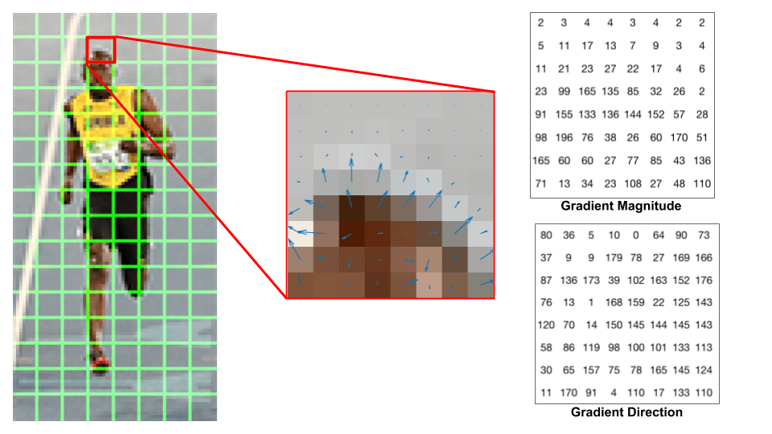

Input là một bức ảnh size 720x475. Giả sử bằng cách thần kỳ nào đó ta crop được hình ảnh con người 100x200 và resize nó về chuẩn 64x128.

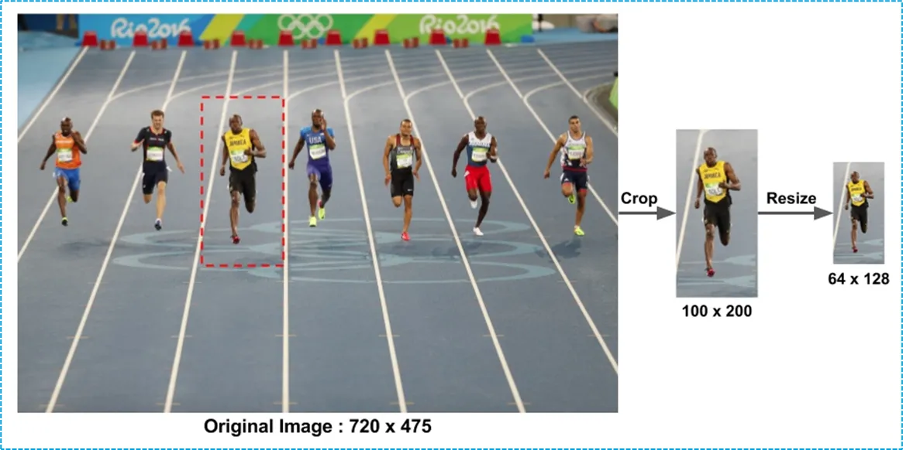

Output sẽ giúp làm nổi bật các cạnh và biên của con người trong bức ảnh.

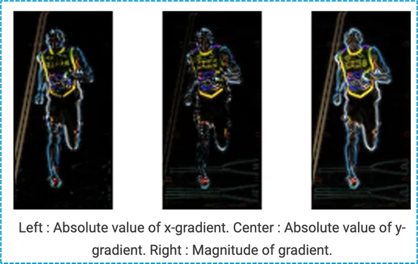

Nó giúp giảm số pixel cần phải xử lý từ 64 x 128 x 3 = 24576 (input) về còn 3780 (output). Từ đó đẩy vào SVM phân loại cho dễ.

{}
Tại mỗi pixel, chúng ta sẽ quan tâm đến 2 giá trị:

1. **Độ lớn (magnitude)**
2. **Hướng (direction)**

  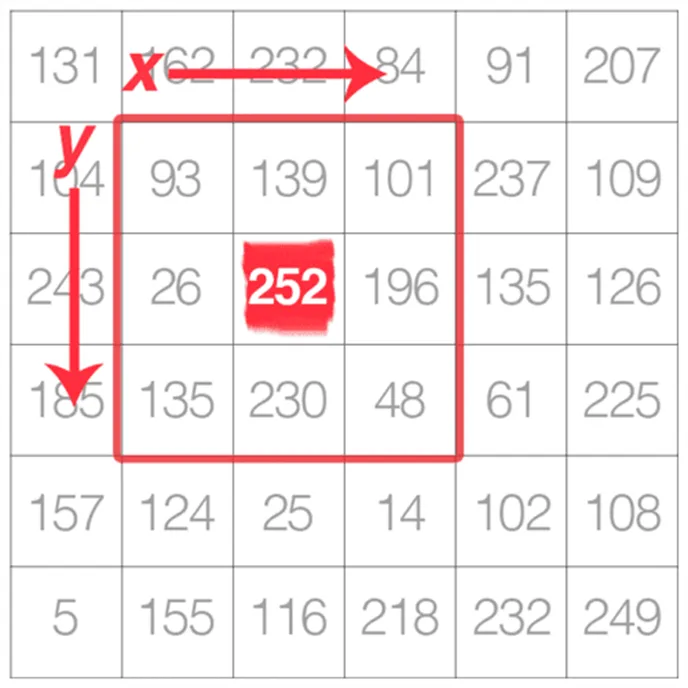

  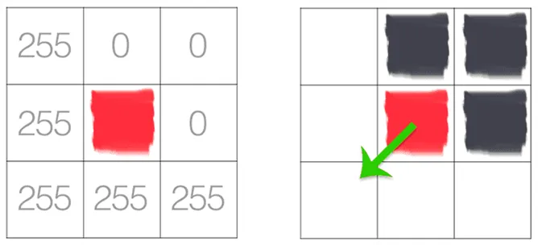
  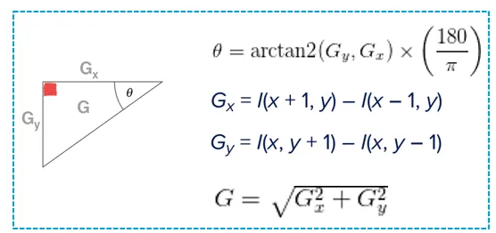

{}

{}
Giả sử ta crop được hình ảnh người đàn ông như bức hình bên dưới (làm sao crop được thì không được đề cập trong bài giảng).

1. Ta resize nó về 64x128

2. Sau đó lại tiếp tục chia nó thành một grid, mỗi ô 8x8, áp dụng kernel như câu 40 ta sẽ ra được 2 ma trận như sau:

3.  Chia ảnh thành các ô nhỏ (cells). Thường kích thước mỗi ô là 8x8 pixels.

Trong mỗi cell, xây dựng histogram 9 bins theo hướng gradient (từ 0° đến 180°, hoặc 0° đến 360° tùy chọn).

{}

>[!NOTE]
>Nói chung chỉ cần nhớ đẩy thẳng image gốc vào SVM không được, các pixel không được cấu trúc rõ ràng như numerical feature trong tabular data để SVM hoạt động được tốt.
>Phải qua một bước trung gian như HOG để trích xuất các đặc trưng như cạnh và biên rồi đẩy vào SVM mới tốt.

{}
Image pyramid là việc biểu diễn một hình ảnh ở nhiều độ phân giải (resolution) hay multi-scale khác nhau. 

Có hai loại Image pyramids chính:

- **Gaussian Image pyramids :** Mỗi cấp độ trong kim tự tháp được tạo ra bằng cách làm mờ (Gaussian blur) và sau đó lấy mẫu xuống (downsampling) phiên bản trước đó.
- **Laplacian Image pyramids:** Kim tự tháp này lưu trữ sự khác biệt giữa các cấp độ trong kim tự tháp Gaussian. Nó được sử dụng để tái tạo lại hình ảnh gốc từ kim tự tháp Gaussian.

{}

{}
Soft NMS là một cải tiến của thuật toán Non-Maximum Suppression (NMS) truyền thống, được đề xuất để giải quyết vấn đề loại bỏ nhầm các bounding box chứa đối tượng.

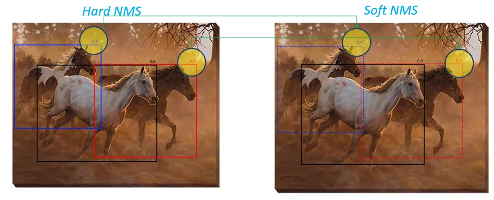

Thay vì loại bỏ hoàn toàn các bounding box có IoU lớn, Soft NMS sẽ giảm confidence score của chúng. Mức độ giảm điểm số phụ thuộc vào IoU giữa các bounding box.

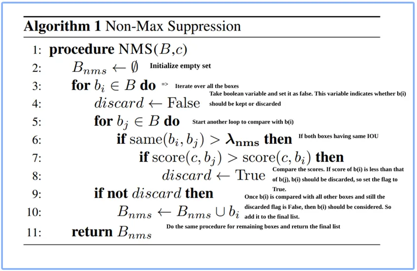

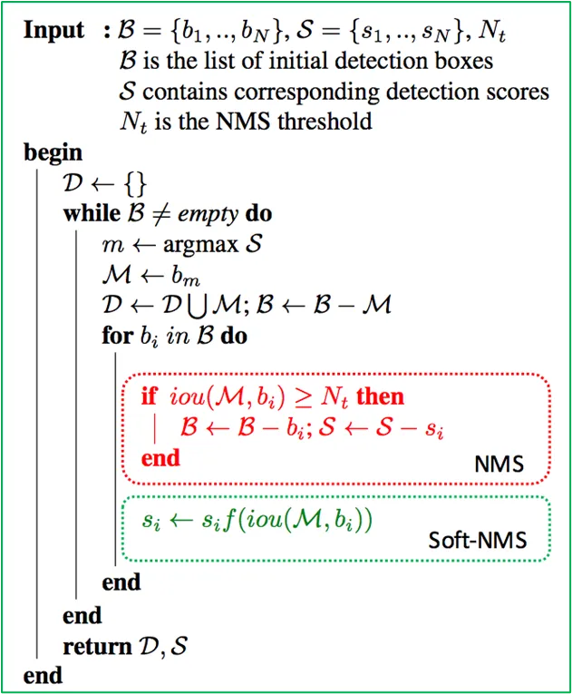

{}

## 9. Quy trình Object Detection với CNN

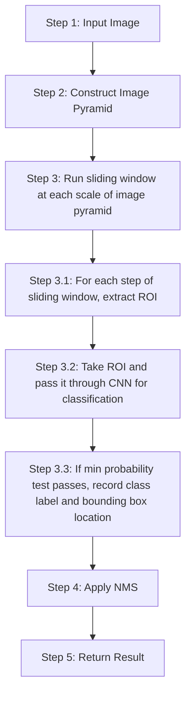
```mermaid
graph TD
A[Step 1: Input Image] --> B[Step 2: Construct Image Pyramid]
B --> C[Step 3: Run sliding window at each scale of image pyramid]
C --> D[Step 3.1: For each step of sliding window, extract ROI]
D --> E[Step 3.2: Take ROI and pass it through CNN for classification]
E --> F[Step 3.3: If min probability test passes, record class label and bounding box location]
F --> G[Step 4: Apply NMS]
G --> H[Step 5: Return Result]
```

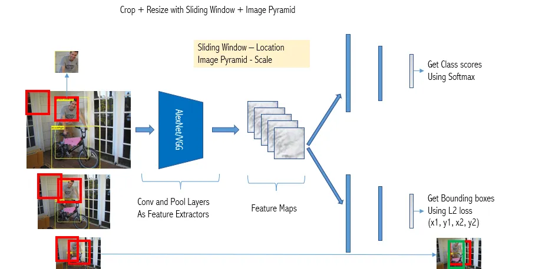

{}
Decoupled head là phần head của mô hình được tách thành hai nhánh độc lập, thường là:

1. **Branch 1: Classification Head** - Chịu trách nhiệm dự đoán nhãn lớp của các đối tượng trong ảnh.
2. **Branch 2: Regression Head** - Chịu trách nhiệm dự đoán tọa độ hộp giới hạn (bounding box) của các đối tượng.

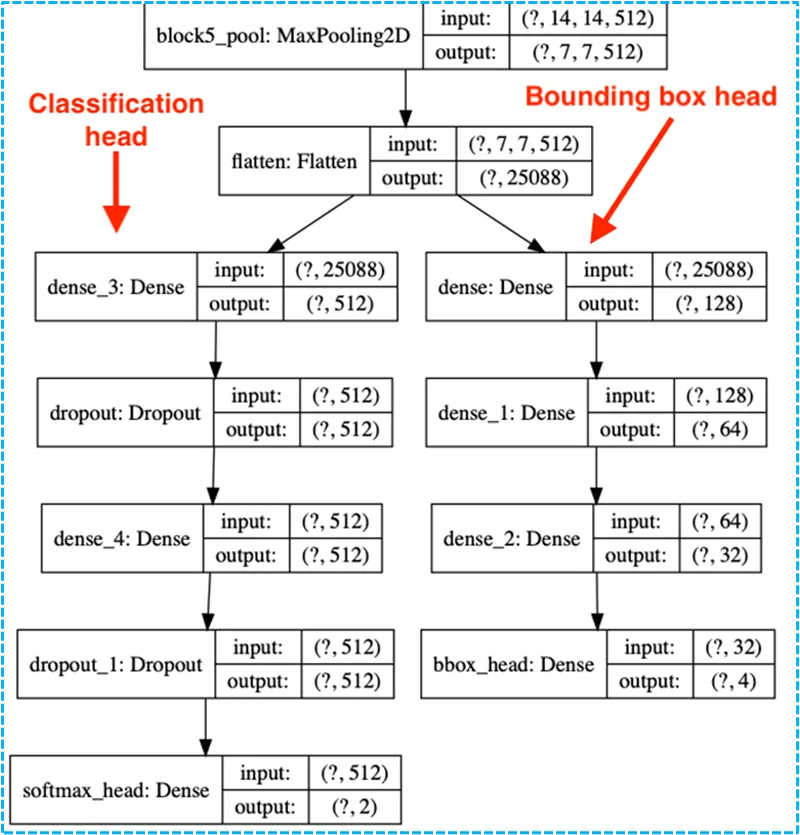

Mỗi head chịu trách nhiệm khác nhau 

- Classification cần tập trung vào việc phân biệt các đặc trưng của các lớp đối tượng.
- Regression đòi hỏi độ chính xác cao trong việc ước lượng tọa độ bounding box.

Hai nhiệm vụ này có bản chất và trọng tâm khác nhau, việc dùng chung một head sẽ khiến mô hình khó tối ưu tốt cho cả hai. Nếu không tách biệt, hai nhiệm vụ có thể "cạnh tranh" trong việc tối ưu hóa các tham số của mô hình, dẫn đến hiệu suất thấp hơn.

{}

## 10.  CNN Limitations and Spatial Outputs


Một câu hỏi khác đặt ra là việc resize input image với các **resolution** khác nhau làm mất mát thông tin input.

Vậy có cách nào để giữ nguyên input size hay không?


{}
Vấn đề nằm ở bước **Fully-connected** cuối khi tổng hợp thông tin. Số neurons ở bước này phải khai báo trước và cố định cho toàn bộ samples. *Do đó nếu input size khác nhau sẽ không match với lớp FC cuối này*.

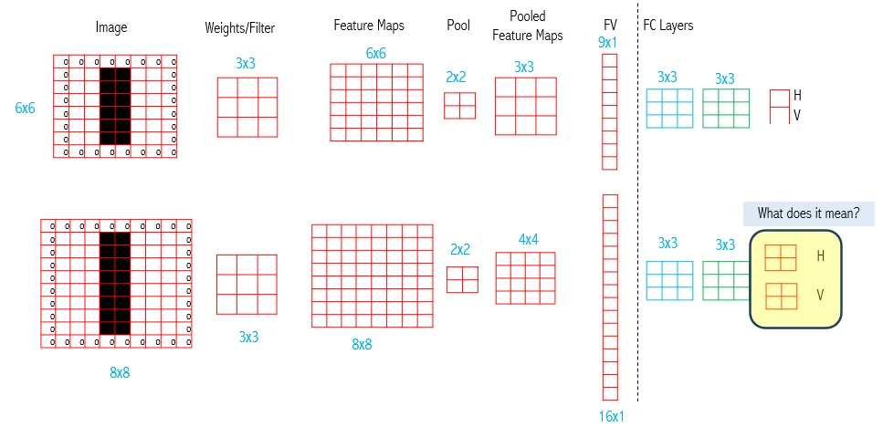

Điều này vô tình giúp CNN tạo ra tính **localization**, giống với pooling có thể tổng hợp thông tin ở nhiều vị trí khác nhau của input (có nghĩa mỗi cột sẽ vẫn là ouput của một sliding windows nhưng tại vì số lượng input lớn hơn nên tạo nhiều sliding windows hơn tạo ra nhiều output của nhiều sliding windows hơn).

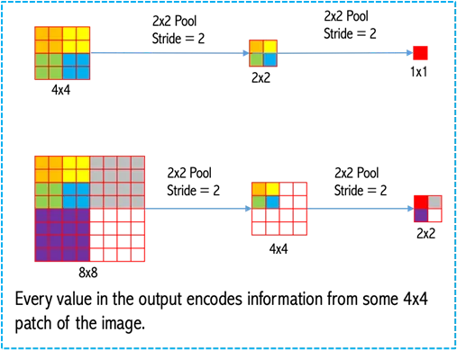

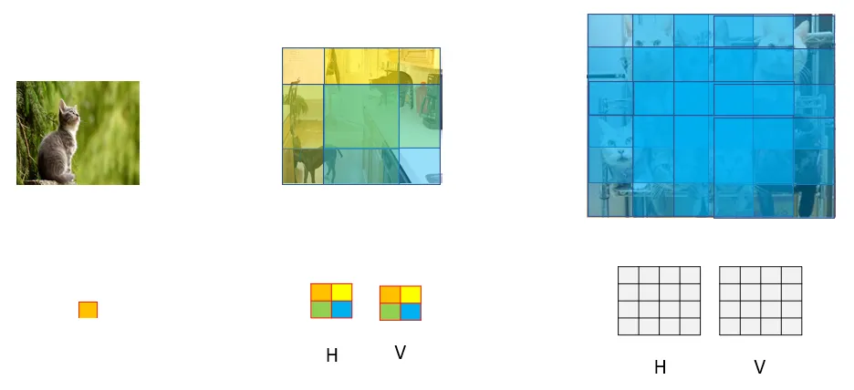
{}

## Resource

{}

{}

{}
[https://skyil.tistory.com/195](https://skyil.tistory.com/195)
{}

