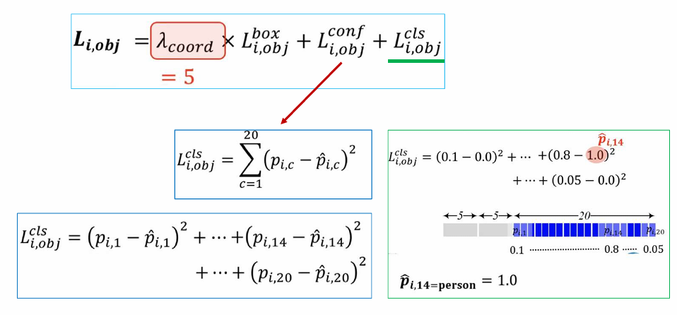
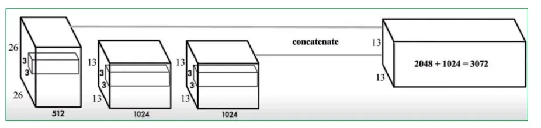

## 1. YOLOv1

### 1.1. One-stage vs. Two-stage

{}
Trong lĩnh vực phát hiện đối tượng (object detection), các mô hình thường được chia thành hai nhóm chính: Two-stage detectors và One-stage detectors.

+ **Two-stage detectors** như Faster R-CNN hoạt động theo hai bước:
Bước đầu tiên là tạo ra các vùng đề xuất (region proposals) – những khu vực có khả năng chứa đối tượng, thông qua một mạng gọi là Region Proposal Network (RPN). Sau đó, những vùng này được cắt ra từ feature map và đưa vào một mạng con khác để phân loại đối tượng và tinh chỉnh lại vị trí bounding box.
Ưu điểm của phương pháp này là độ chính xác cao, đặc biệt với các đối tượng nhỏ, nhưng tốc độ xử lý thường chậm hơn.

+  **One-stage detectors** như YOLO, SSD thực hiện việc phân loại và hồi quy bounding box trực tiếp trên toàn bộ feature map, bỏ qua bước sinh region proposal. Mỗi ô trên feature map sẽ chịu trách nhiệm dự đoán một hoặc nhiều hộp chứa đối tượng với các tọa độ và nhãn lớp.
Phương pháp này thường nhanh hơn đáng kể, phù hợp với ứng dụng thời gian thực, tuy nhiên có thể hy sinh một phần độ chính xác, đặc biệt ở các object nhỏ hoặc bị che khuất.

{}

### 1.2. Motivation

{}
Vào năm 2015, **Joseph Redmon** (Đại học washington) đã phát triển mô hình YOLO (You Only Look Once), như một giải pháp phát hiện đối tượng nhanh chóng và hiệu quả hơn. Cùng thời điểm đó, **Ross Girshick** (Microsoft Research) cũng công bố mô hình Faster R-CNN. Cả hai phương pháp đều sử dụng các lớp tích chập (convolutional layers) để trích xuất đặc trưng từ ảnh đầu vào, tuy nhiên cách tiếp cận rất khác nhau.

Faster R-CNN là một mô hình hai giai đoạn (two-stage), trong đó bước đầu tiên tạo ra các vùng đề xuất (region proposals) trước khi thực hiện phân loại và hồi quy vị trí. Trong khi đó, YOLO là một mô hình một giai đoạn (one-stage), không có bước đề xuất vùng riêng biệt, mà thực hiện phân loại và định vị trực tiếp trên toàn bộ ảnh. Điều này giúp YOLO nhanh hơn đáng kể so với Faster R-CNN, mặc dù ban đầu độ chính xác không cao bằng.

{}

### 1.3. Step in YOlO

#### Chia ảnh thành grid cells
Chia ảnh đầu vào thành $SxS$ ô (grid cells). Mỗi ô sẽ dự đoán 2 bouding box. Các grid này không overlap với nhau và thường có size là $7x7$.

{}
Ví dụ image có size là $28x28$ thì ta sẽ có 10 cái patch có size $7x7$.

{}

#### Bouding box prediction

Mỗi bouding box sẽ có 5 tham số: $x, y, w, h, confidence score$

Các tham số này có thể được biểu diễn theo nhiều các khác nhau:

+ Tạo độ tuyệt đối (absolute coordinates):
    - $x$ và $y$ là tọa độ của tâm bouding box trong ô (grid cell) đó.
    - $w$ và $h$ là chiều rộng và chiều cao của bouding box.
+ Tọa độ tương đối (relative coordinates):
  + (x, y) có thể là tọa độ tương đối so với một điểm mốc nào đó (ví dụ như tâm của grid cell trong YOLO).
  + (w, h) có thể là tỷ lệ so với chiều rộng/chiều cao của ảnh hoặc một vùng nhất định
+ Offset(độ lệch): Trong một số mô hình, ta dự đoán offset (độ lệch của tâm) bouding box và kích thước của nó so với một anchor box (khung chữ nhật) được xác định trước.

{}
Giả sử bạn có một ảnh với size $500\times 300$ pixel. Bounding box của một vật thể có thể được biểu diễn là:

- **Tọa độ tuyệt đối:** (x=100, y=50, w=200, h=150)
- **Tọa độ tương đối:** (x=0.2, y=0.167, w=0.4, h=0.5) (tỉ lệ so với chiều rộng/cao của ảnh)

Và cuối cùng là **Confidence score** được tính dựa trên công thức:

$$
\text{p(Object)} \times \text{IoU}^{\text{truth}}_{\text{predict}}
$$

Trong đó: 

- $\text{p(Object)}$ là xác suất dự đoán đối tượng (có được thông qua hàm Softmax ở layer cuối).

{}

#### Label Encoding

**Binary vector** với độ dài = số class cần dự đoán. Ví dụ 10 class thì vector có size là 10.

Ta sẽ có 2 giá trị, nếu model nhận diện được class nào thì giá trị tại class đó sẽ là 1, còn lại là 0.

#### Ouput Yolo gồm những gì?

Vector gồm 3 thành phần:
1. Confidence score - $p$
2. Tọa độ bounding box $B$
3. Vector label encoding

Ví dụ bên dưới class 1 là dog, class 2 là cat. Model nhận diện được cat nên class 2 = 1, kèm theo đó là confidence score và tọa độ bounding box tương ứng.

{}
Không cần vì các ảnh đã tách thành từng Patch, sau đó xác định xem cell nào chịu trách nhiệm chính để detect Object đó.

*Cách xác định cell nào chịu trách nhiệm chính:*

+ 

{}


  Trong mỗi cell thay vì dự đoán 1 bouding box thì YOLOv1 sử dụng 2 cái bouding box

  

  Do sử dụng 2 bounding box nên ta sẽ xem xét cái nào có highest confidence score để giữ lại. Mình đoán vậy


#### Summary

### 1.4. YOLOv1 Architecture

**YOLOv1** dựa trên kiến trúc của **GoogleNet**, ta có thể điều chỉnh bằng cách tăng/giảm số layers, neurons tùy ý. Việc bê kiến trúc nhưng điều chỉnh layers như vậy gọi chung là **DarkNet**

#### Training process

#### Loss function

Điểm đặc biệt của **YOLOv1** nằm ở hàm loss, với mỗi grid cell sẽ có loss tương ứng -> ta sẽ đặt trọng số cho mỗi cell.

Dựa trên ground truth mà ta sẽ tính được cell đó có object hay không mà sử dụng trọng số tương ứng.


  Vậy loss cho từng cell được tính như nào?

Đây là công thức cụ thể.



{}

{}

Vector ở trên là ground truth, ở dưới là predict

{}

{}

Trọng số của grid cell là 0.5 bởi vì để focus tập trung vào những thằng detect Object hơn.

{}

{}

{}
Những **bounding box nhỏ** sẽ có lỗi ít hơn trong khi những **bounding box lớn** cover được nhiều thông tin object hơn lại thường có loss lớn hơn. Điều này có vẻ không fair bờ lay cho lắm.

Nên ta sẽ để dưới dạng căn bậc 2 như một cách regularization để giảm bớt loss cho bounding box lớn.

{}

{}

{}

#### Label dataset

{}

{}
Có **2 trường thông tin**, 1 là thông tin về bức ảnh, bao gồm chiều dài, chiều rộng và depth, thường là 3 (RGB)

Thứ 2 là thông tin ground truth về bounding box, bao gồm class, tọa độ 2 điểm góc trái trên và góc phải dưới.

{}
{}

{}

{}

{}

{}

### 1.5. Summary

### 1.6. Advantages and Disadvantages

1. Mỗi cell dự đoán đến **2 bounding box**, vậy nếu chia image thành 7x7 = 49 Patch → 98 bounding box → lựa ra 49 highest box → **giới hạn lại khả năng của model**.
2. Không detect được object quá nhỏ, YOLOv1 chưa handle được multi-scale.

## 2. Yolov2

### 2.1. Motivation

+ Yolo v1 nhanh hơn Faster R-CNN, nhưng độ chính xác thì thấp hơn 
+ Điểm yếu của YOLO v1 nằm ở độ chính xác của bounding box. Nó không dự đoán tốt vị trí và kích thước của vật thể, đặc biệt là rất kém khi phát hiện vật thể nhỏ.
+ SSD một mô hình phát triển vật thể single object, đã lập kỷ lục mới khi **Chính xác hơn faster RCNN và cả Yolov1**

### 2.2. Improvements

#### Áp dụng BatchNorm

#### Tăng resolution = cách resize ảnh lên

#### Bỏ các lớp FC, sử dụng hoàn toàn CNN.

#### Bỏ luôn Max-Pool, thay vì chia image thành 7x7 Patch, chia nhỏ hơn thành 14x14 Patch

{}
Sử dụng số chẵn thì không chọn được center thuộc về cell nào để chọn ra cell quan trọng nhất.

{}

#### Apply skip connection

Size không bằng nhau, cái trước $26x26$, cái sau $13x13$.

{}
Concatenate channel-wise.

Chia cái 26 thành 4 phần, mỗi phần có size 13x13 và depth là $c_1$

Sau đó concate lại, tương đương với tăng depth lên 4 lần → $4c_1$.

Lúc này đã có thể skip-connection bình thường, depth = $4c_1 + c_2$.

{}


  Tóm lại idea chính cần nhớ của YOLOv2 là bỏ hoàn toàn FC, chỉ sử dụng CNN.



Ở phần trước chúng ta đã biết một image có thể có nhiều object, và các object này có thể bị overlap với nhau. YOLO không sử dụng Selective Search hay Sliding window nên không thể handle điều này?
  
Cách giải quyết là sử dụng Anchor box. Mỗi object sẽ có nhiều anchor box với tỉ lệ khác nhau.


### 2.3. Anchor box

Sử dụng K-means, số lượng anchor box thì dùn ELBOW method (chạy thực nghiệm) như bình thường.

Trước đó Faster R-CNN dự đoán $\Delta x$, $\Delta y$

Giờ họ cộng thêm giá trị đó nhưng đưa qua hàm sigmoid $\sigma$  để đưa các giá trị này về khoảng 0 → 1 giúp optimization loss smooth hơn. Còn tại sao nó làm được smooth hơn thì mình chưa hiểu.

Ngoài ra cần chú ý vào cái bw, bh, chỗ này chưa hiểu nên thôi skip.

## 3. Summary Yolov1 vs Yolov2

### 3.1. Yolov1 vs Yolov2
YOLOv2 bỏ FC + thêm vào 5 anchor cho mỗi cell và tỉ lệ được xác định bằng K-Means.

### 3.2. So sánh loss function

### 3.3. Một số bài báo transformer trong object detection

## Resource

{}

{}

