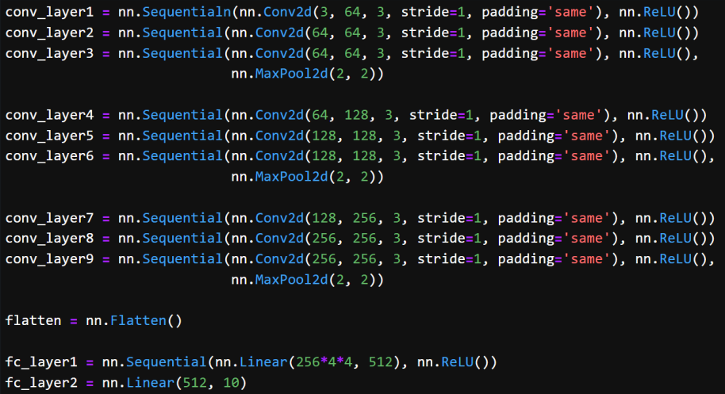
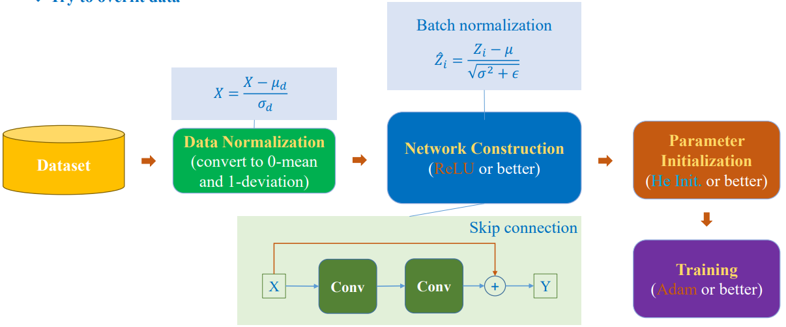

How to increase training accuracy?

## 1. Motivation

Qua bài trước chúng ta biết được CNN gồm các lớp Conv + MaxPooling vậy chúng ta sẽ xây dựng như thế nào để training trở nên tốt nhất có thể. Xây dựng các xây dựng một mạng Neural Network

## 2. Setting-up Context

### 2.1. VGG-16

{}

Bởi vì có tất cả 16 layer có tham số.

{}

Input vào các lớp Conv rồi tới Pooling sau đó tiếp tục cuối cùng đến Dense ( Linear)

#### 2.1.1. VGG16 for ImageNet

#### 2.1.2. VGG16-like for Cifar-10

### 2.2. Network Training

Triển khai hai lớp conv, sau đó cho qua MLP để phân loại. Quan sát biểu đồ, mô hình huấn luyện khá hiệu quả.

Chúng ta thử một bộ dữ liệu khác có độ phức tạp hơn `Cifar-10 dataset`. Khi áp dụng vào mô hình ta có thể thấy được mô hình huấn luyện không được tốt. 

Bằng các truyền thống chúng ta sẽ thêm nhiều layer hơn sẽ học được mô hình.

Chúng ta có thể thấy được accuracy tăng lên nhưng khi thực tế lại bị overfitting. Vậy chúng ta thử xem thêm 1 layer.

Qua kết quả trên chúng ta có thể thấy mô hình không thể học được dataset nữa. Vậy vấn đề ở đâu

>[!NOTE]
>Ở bài trước chúng ta điều biết khi đạo hàm hàm `sigmoid` sẽ giảm qua từng lớp khi chúng ta huấn luyện với quá nhiều layer việc mà các tham số không thể cập nhật có thể lường trước được.

Việc thay thế activation bằng ReLU giúp mô hình học ổn định hơn, mang lại kết quả khả quan cho hầu hết tập dữ liệu. 

Bây giờ chúng ta hãy thử thêm nhiều layer nữa xem mô hình có tốt hơn không tại chúng ta đang thấy val accuracy còn khá thấp.

có thể thấy mô hình không học được nữa.

## 3. Solutions for the Context

### 3.1. Solution 1: Observation

Với mô hình đề cập ở section trước, với dataset là MNIST thì có vẻ như mọi thứ hoạt động ổn nhưng với Cifar-10 thì có vẻ val acc khá thấp.

### 3.2. Solution 1: Idea

Có vẻ tại vì Cifar-10 phức tạp hơn so với MNIST vậy nên nó làm cho mô hình khó học được hơn.

> Chúng ta thử normalization 

Có vẻ như `val_acc` tăng một ít.

Chúng ta thử normalization trong khoảng [-1, 1]

### 3.3. Solution 2: Batch Normalization

Trong thực tế mỗi input đi qua các node thì mỗi node làm cho giá trị lệch một cách khác nhau vì vậy ta cần normalization theo từng node thì sẽ hiệu quả hơn.

{}

{}

Ta có thể thấy được kết quả đã tốt hơn rất nhiều.

### 3.4. Solution 3: Use more robust initialization

Như chúng ta đã biết trong bàng `model initiation` thì relu được sử dụng với he inititaiton mà trong bài lại dùng Glorot: 

### 3.5. Solution 4: Using advanced activation

### 3.6. Solution 5: Skip connection

### 3.7. Solution 6: Reduce learning rate

## 4. Summary

