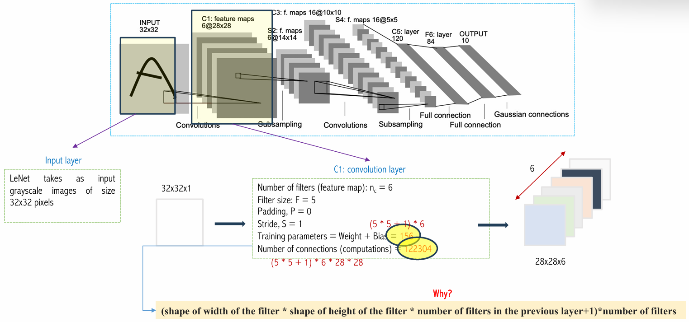

## 1. CNN: Basic Concepts

{}

CNN là một mô hình mạng nơ-ron sử dụng trong Deep Learning, được thiết kế để nhận dạng và phân loại ảnh. CNN được thiết kế để nhận dạng và phân loại ảnh dựa trên cấu trúc của não người. CNN sử dụng các **lớp convolutional** để học các đặc trưng của ảnh, các **lớp pooling** để giảm kích thước của ảnh và các lớp **fully connected** để phân loại ảnh.

Ở các lớp trong CNN, mỗi lớp sẽ thực hiện một số phép toán nhất định. Cụ thể, mỗi lớp sẽ thực hiện các phép toán sau:

1. **Convolutional Layer**: Lớp này sẽ thực hiện phép tích chập giữa ảnh đầu vào và các bộ lọc (filter) để tạo ra các feature maps. Các feature maps này sẽ chứa các đặc trưng của ảnh như cạnh, góc, texture, v.v.
2. **Activation Function**: Lớp này sẽ thực hiện phép kích hoạt (activation) trên các feature maps để tạo ra các feature maps đã được kích hoạt.
3. **Pooling Layer**: Lớp này sẽ thực hiện phép pooling (max pooling hoặc average pooling) để giảm kích thước của feature maps.
4. **Fully Connected Layer**: Lớp này sẽ thực hiện phép nhân ma trận giữa feature maps đã được flatten và ma trận trọng số để phân loại ảnh.
 

Các lớp CNN càng sâu thì trích xuất các đặc trưng hình ảnh như đường thẳng, cạnh viên, v.v. Các lớp cao hơn tìm hiểu nhiều đặc trưng trừu tượng hơn như hình dạng của hình ảnh.

{}

{}

Reception feild là kết quả của việc áp dụng phép toán convolutional và pooling.

{}

## 2. LetNet

**LetNet** là một trong những mô hình CNN đầu tiên được giới thiệu bởi Yann LeCun vào năm 1998. Mô hình này được thiết kế để nhận dạng và phân loại chữ số viết tay trong bộ dữ liệu MNIST. Mô hình này bao gồm 7 lớp, trong đó có 3 lớp convolutional, 2 lớp pooling và 2 lớp fully connected.

Các kí hiệu trong hình:
+ C: Convolutional Layer
+ S: Subsampling Layer
+ F: Fully Connected Layer


  Thay vì sử dụng flatten để chuyển từ lớp convolutional sang lớp fully connected thì ngta sử dụng conv 1x1 để làm việc flatten.


  
{}

{}

{}

Thay vì sử dụng max pooling bình thường, LeNet sử dụng **parameterized pooling appoarch**. Điều này giúp mô hình có thêm tham số để đào tạo mô hình, cho mô hình có thể linh hoạt hơn trong việc học các đặc trưng.

+ sum là tổng tất cả các giá trị trong vùng pooling.

{}

{}

Lenet sử dụng kernel 5x5 để tìm ra đặc trưng của ảnh. channel của filter là 5x5xc là số channel của input. LeNet có một cách tiếp cận khác để giảm số lượng tham số.

Các index từ [0..15] là các channel output. các index từ [0..5] là các input channel với các filter khác nhau. Giả sử output channel 0 được tích chập từ input channel 0, 2, 3. Từ hình ảnh ta có thể thấy được rằng các tham số của mô hình sẽ được giảm đi một phần.

{}

{}

Thay vì sử dụng flatten, LeNet sử dụng conv 1x1 để làm việc flatten. Điều này giúp mô hình có thêm tham số để đào tạo mô hình, cho mô hình có thể linh hoạt hơn trong việc học các đặc trưng.

{}

{}

{}

{}

{}

{}

{}
## 3. AlexNet

## 4. FZNet

## 5. VGGNet

## 6. GoogleLeNet

## 7. ResNet

## 8. MobileNet

## 9. ConvNext

## 10. Performance Evaluate on Cifar10 Dataset

## 11. Performance Evaluate on vietnamesefood Dataset 