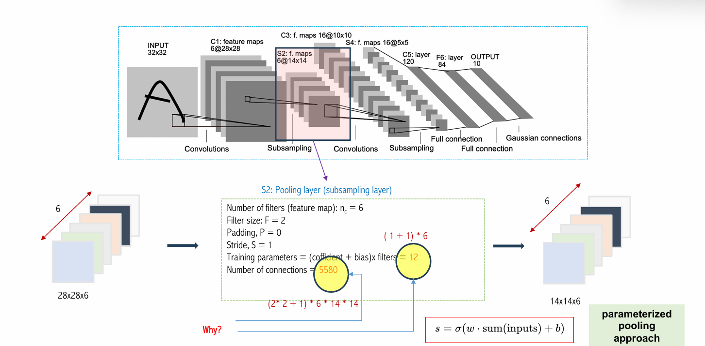
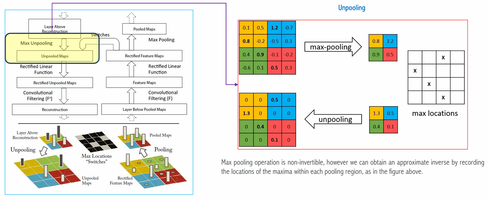
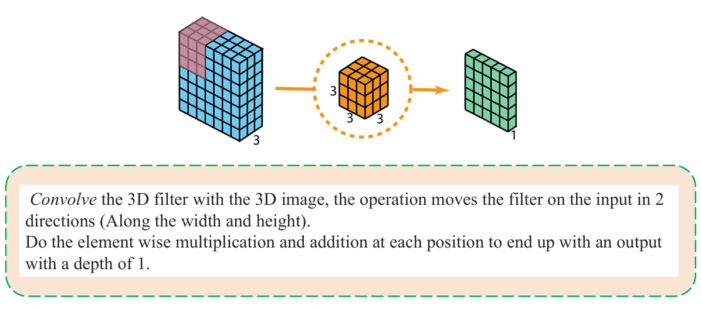
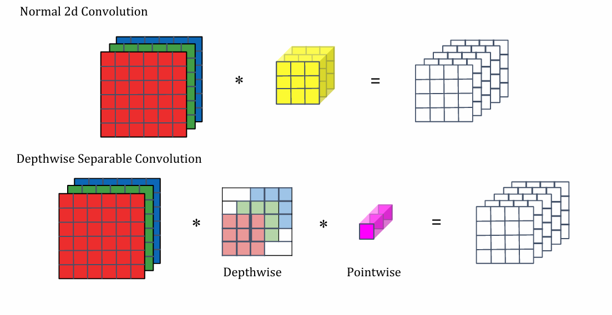
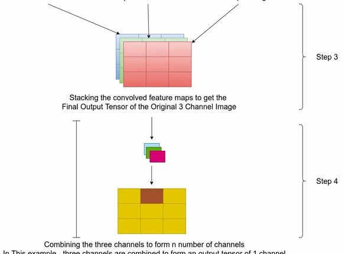

## 1. CNN: Basic Concepts


{}


CNN là một mô hình mạng nơ-ron sử dụng trong Deep Learning, được thiết kế để nhận dạng và phân loại ảnh. CNN được thiết kế để nhận dạng và phân loại ảnh dựa trên cấu trúc của não người. CNN sử dụng các **lớp convolutional** để học các đặc trưng của ảnh, các **lớp pooling** để giảm kích thước của ảnh và các lớp **fully connected** để phân loại ảnh.


Ở các lớp trong CNN, mỗi lớp sẽ thực hiện một số phép toán nhất định. Cụ thể, mỗi lớp sẽ thực hiện các phép toán sau:

1. **Convolutional Layer**: Lớp này sẽ thực hiện phép tích chập giữa ảnh đầu vào và các bộ lọc (filter) để tạo ra các feature maps. Các feature maps này sẽ chứa các đặc trưng của ảnh như cạnh, góc, texture, v.v.
2. **Activation Function**: Lớp này sẽ thực hiện phép kích hoạt (activation) trên các feature maps để tạo ra các feature maps đã được kích hoạt.
3. **Pooling Layer**: Lớp này sẽ thực hiện phép pooling (max pooling hoặc average pooling) để giảm kích thước của feature maps.
4. **Fully Connected Layer**: Lớp này sẽ thực hiện phép nhân ma trận giữa feature maps đã được flatten và ma trận trọng số để phân loại ảnh.
 

Các lớp CNN càng sâu thì trích xuất các đặc trưng hình ảnh như đường thẳng, cạnh viên, v.v. Các lớp cao hơn tìm hiểu nhiều đặc trưng trừu tượng hơn như hình dạng của hình ảnh.

{}

{}


Reception feild là kết quả của việc áp dụng phép toán convolutional và pooling.


{}


## 2. LetNet


**LetNet** là một trong những mô hình CNN đầu tiên được giới thiệu bởi Yann LeCun vào năm 1998. Mô hình này được thiết kế để nhận dạng và phân loại chữ số viết tay trong bộ dữ liệu MNIST. Mô hình này bao gồm 7 lớp, trong đó có 3 lớp convolutional, 2 lớp pooling và 2 lớp fully connected.

Các kí hiệu trong hình:
+ C: Convolutional Layer
+ S: Subsampling Layer
+ F: Fully Connected Layer


  Thay vì sử dụng flatten để chuyển từ lớp convolutional sang lớp fully connected thì ngta sử dụng conv 1x1 để làm việc flatten.


  
{}

{}

{}


Thay vì sử dụng max pooling bình thường, LeNet sử dụng **parameterized pooling appoarch**. Điều này giúp mô hình có thêm tham số để đào tạo mô hình, cho mô hình có thể linh hoạt hơn trong việc học các đặc trưng.


+ sum là tổng tất cả các giá trị trong vùng pooling.

{}

{}


Lenet sử dụng kernel 5x5 để tìm ra đặc trưng của ảnh. channel của filter là 5x5xc là số channel của input. LeNet có một cách tiếp cận khác để giảm số lượng tham số.


Các index từ [0..15] là các channel output. các index từ [0..5] là các input channel với các filter khác nhau. Giả sử output channel 0 được tích chập từ input channel 0, 2, 3. Từ hình ảnh ta có thể thấy được rằng các tham số của mô hình sẽ được giảm đi một phần.

{}

{}


Thay vì sử dụng flatten, LeNet sử dụng conv 1x1 để làm việc flatten. Điều này giúp mô hình có thêm tham số để đào tạo mô hình, cho mô hình có thể linh hoạt hơn trong việc học các đặc trưng.

{}

{}

{}

{}


{}

{}


{}

{}
```python
class LeNet(nn.Module):
    def __init__(self, imdim=3, num_classes=10):
        super(LeNet, self).__init__()

        self.conv1 = nn.Conv2d(imdim, 64, kernel_size=5, stride=1, padding=0)
        self.mp = nn.MaxPool2d(2)
        self.relu1 = nn.ReLU(inplace=True)
        self.conv2 = nn.Conv2d(64, 128, kernel_size=5, stride=1, padding=0)
        self.relu2 = nn.ReLU(inplace=True)
        self.fc1 = nn.Linear(128*5*5, 1024)
        self.relu3 = nn.ReLU(inplace=True)
        self.fc2 = nn.Linear(1024, 1024)
        self.relu4 = nn.ReLU(inplace=True)
        
        self.fc3 = nn.Linear(1024, num_classes)

    def forward(self, x):
        in_size = x.size(0)
        out1 = self.mp(self.relu1(self.conv1(x)))
        out2 = self.mp(self.relu2(self.conv2(out1)))
        out2 = out2.view(in_size, -1)
        out3 = self.relu3(self.fc1(out2))
        out = self.relu4(self.fc2(out3))
        
        return self.fc3(out)
```

{}

## 3. AlexNet


AlexNet là một trong những mô hình CNN đầu tiên giành chiến thắng trong cuộc thi ImageNet Large Scale Visual Recognition Challenge (ILSVRC) vào năm 2012. Mô hình này được thiết kế bởi Alex Krizhevsky, Ilya Sutskever và Geoffrey Hinton. Mô hình này bao gồm 8 lớp, trong đó có 5 lớp convolutional, 3 lớp pooling và 3 lớp fully connected.

1. Alex Net bao gồm % lớp convolutional, 3 lớp pooling và 3 lớp fully connected.
2. Có 60 triệu tham số và 650.000 neuron và dùng 5 đến 6 ngày để train trên 2 GPU GTX 580 3GB GPUs (2012).
3. AlexNet là mô hình đầu tiên sử dụng GPU để train.

{}


Phương pháp Overlapping này giúp giảm lỗi top-1 thêm 0,4% và lỗi top-5 thêm 0,3% so với phương pháp pooling 2x2 không overlapping (stride 2), trong khi vẫn giữ nguyên kích thước đầu ra.

{}

{}
Qua các bài trước chúng ta đã biết được nhược điểm của Tanh vậy nên AlexNet đã sử dụng ReLU để thay thế cho Tanh. ReLU giúp mô hình học nhanh hơn và giảm thiểu hiện tượng vanishing gradient.


{}


{}


{}

Dropout là một kỹ thuật regularization giúp giảm overfitting bằng cách ngẫu nhiên bỏ (drop) một số neuron trong quá trình huấn luyện. Công thức toán học của nó có thể được chia thành hai giai đoạn:  

📌 **1. Giai đoạn huấn luyện (Training Phase)**  
Trong giai đoạn này, một số neuron được **tắt đi** với xác suất $1 - p$, tức là chúng chỉ có xác suất $p$ được giữ lại. Công thức toán học như sau:  

$$
r_j^{(l)} \sim Bernoulli(p)
$$

$$
\tilde{y}^{(l)} = r^{(l)} \ast y^{(l)}
$$

$$
z_i^{(l+1)} = \mathbf{w}_i^{(l+1)} \tilde{y}^{(l)} + b_i^{(l+1)}
$$

$$
y_i^{(l+1)} = f(z_i^{(l+1)})
$$

- $ r_j^{(l)} $ là một biến ngẫu nhiên Bernoulli với xác suất $ p$. Điều này có nghĩa là nó có thể nhận giá trị 1 với xác suất $ p$ và giá trị 0 với xác suất $ 1 - p$.
- $ \tilde{y}^{(l)}$ là đầu ra sau khi áp dụng dropout, tức là chỉ giữ lại một phần giá trị của tầng trước đó.
- $ z_i^{(l+1)}$ là đầu vào của neuron $ i$ ở tầng tiếp theo.
- $ y_i^{(l+1)}$ là đầu ra sau khi áp dụng hàm kích hoạt $ f$ (ReLU, sigmoid,...).

**Hiểu đơn giản:** Một số neuron bị tắt đi, làm cho mạng không dựa quá nhiều vào một số đặc trưng cụ thể, giúp mô hình tổng quát hóa tốt hơn.

📌 **2. Giai đoạn suy luận (Test Phase)**  
Trong quá trình suy luận, chúng ta không bỏ neuron nữa, nhưng vì trong lúc huấn luyện ta đã loại bỏ một số neuron nên cần điều chỉnh lại trọng số để giữ nguyên giá trị kỳ vọng. Công thức:  

$$
z_i^{(l+1)} = \mathbf{w}_i^{(l+1)} (p \cdot y^{(l)}) + b_i^{(l+1)}
$$

- Các trọng số $w$ được nhân với $p$ để bù lại sự giảm số lượng neuron trong quá trình huấn luyện.  
- Điều này giúp giữ nguyên tổng năng lượng truyền qua mạng, tránh làm thay đổi đầu ra mô hình.

📌 **Ý nghĩa thực tế**: Khi huấn luyện, mạng học cách hoạt động với ít neuron hơn. Khi suy luận, tất cả neuron được sử dụng, nhưng trọng số được điều chỉnh để phù hợp với quá trình huấn luyện.

{}
{}

{}


{}

{}


{}

{}

```python {filename="Data Augmentation"}
train_transform = transforms.Compose(
    [   
        transforms.Resize((70, 70)),
        transforms.RandomCrop((64, 64)),
        transforms.ToTensor(),
        transforms.Normalize([0.4914, 0.4822, 0.4465], 
                             [0.2470, 0.2435, 0.2616]),
    ])

val_transform = transforms.Compose(
    [
        transforms.Resize((70, 70)),
        transforms.RandomCrop((64, 64)),
        transforms.ToTensor(),
        transforms.Normalize([0.4914, 0.4822, 0.4465], 
                             [0.2470, 0.2435, 0.2616])
    ])
```

```python {filename="AlexNet"}
model = torch.hub.load('pytorch/vision:v0.6.0', 'alexnet', pretrained=True)

# Replace the last fully-connected layer
model.classifier[6] = nn.Linear(4096, 10)

model = model.to(device)
```
{}

## 4. FZNet


Bằng việc visualizing the convolutional network , ZNet đã chiến thắng trong cuộc thi **ILSVLC2013** tại hạng mục Image Classification bằng cách tinh chỉnh AlexNet năm 2012.

{}

🔹 **Quá trình Forward trong CNN** 

Một mạng CNN đi qua các bước chính sau:  
1. **Convolution (Conv)**: Trích xuất đặc trưng từ ảnh đầu vào.  
2. **Rectification (Activation Function, ví dụ ReLU)**: Giữ lại các giá trị có ý nghĩa, loại bỏ giá trị âm.  
3. **Pooling (ví dụ Max Pooling)**: Giảm kích thước feature maps, chỉ giữ lại thông tin quan trọng nhất.  

🔹 **Deconvolution - Quá trình đảo ngược**  
Deconvnet là kỹ thuật ngược lại với các bước trên, giúp chúng ta thấy được cách CNN “hiểu” dữ liệu.  

1. Unpooling (ngược với Pooling)
2. Deconvolution (ngược với Convolution)
3. ReLU Inversion (ngược với Activation Function)
🔥 **Mục đích của Deconvnet**
- **Trực quan hóa đặc trưng**: Cho thấy mỗi lớp trong CNN học được những gì từ hình ảnh đầu vào.  
- **Debug mô hình**: Giúp kiểm tra xem mạng có học đúng đặc trưng hay không.  
- **Giải thích mô hình**: Hỗ trợ giải thích cách CNN đưa ra quyết định, hữu ích trong AI minh bạch (Explainable AI).  

{}

{}
- Khi Pooling giữ lại giá trị lớn nhất trong mỗi vùng, Unpooling sẽ đặt lại giá trị đó vào vị trí ban đầu và gán các vị trí khác bằng 0.
  
- Điều này được thực hiện bằng cách lưu lại vị trí của giá trị lớn nhất trong quá trình Pooling (gọi là "Switches").  


{}
  
{}
- Thay vì sử dụng bộ lọc để trích xuất đặc trưng, Deconvolution sử dụng các phép toán đảo ngược để tái tạo lại hình ảnh ban đầu từ feature maps.

{}

{}
- Nếu trước đó ReLU loại bỏ giá trị âm, bây giờ chúng ta khôi phục lại những vùng đó.


+ Summary:

  
{}

{}


🔹 Layer 1 - Học biên và họa tiết đơn giản:
+ Nhận diện các tần số thấp và cao, nhưng không có tần số trung bình.
+ Chủ yếu là các bộ lọc cạnh, góc, đường chéo và biên độ sáng. Đây là các đặc trưng cơ bản nhất của hình ảnh.

🔹 Layer 2 - Học các họa tiết phức tạp hơn
+ Xuất hiện vấn đề aliasing (nhiễu do mất thông tin khi sampling). 
+ Bắt đầu nhận diện các mẫu lặp lại như họa tiết vải, hoa văn đơn giản.

🔹 Layer 3 - Học các mẫu tổng quát hơn: 
+ Bắt đầu học các đặc trưng phức tạp hơn, chẳng hạn như cấu trúc hình học. 
+ Nhận diện các phần nhỏ của đối tượng, ví dụ: một phần bánh xe, một phần khuôn mặt. 

🔹 Layer 4 - Học đặc trưng mang tính ngữ nghĩa cao hơn: 
+ Các đặc trưng trở nên có ý nghĩa hơn với từng loại đối tượng cụ thể. Ví dụ: có thể phân biệt được khuôn mặt chó, chân chim.

🔹 Layer 5 - Nhận diện toàn bộ đối tượng 
+ Ở lớp sâu nhất, CNN có thể nhận diện các đối tượng hoàn chỉnh với nhiều tư thế khác nhau. Ví dụ: bàn phím, chó, hoa, người.

{}

{}


ZFNet là một kiến trúc mạng nơ-ron được phát triển để cải thiện hiệu suất của AlexNet.

1. **Giảm Kích Thước Bộ Lọc**: ZFNet giảm kích thước bộ lọc ở lớp 1 và lớp 2 từ 11x11 xuống 7x7, giúp tăng cường khả năng phát hiện các đặc trưng nhỏ hơn trong hình ảnh.

2. **Thay Đổi Stride**: ZFNet điều chỉnh stride (bước nhảy) của lớp convolution đầu tiên từ 4 xuống 2, cho phép mạng học được nhiều thông tin hơn từ các đặc trưng trong hình ảnh.

3. **Bổ Sung Các Kỹ Thuật**: Mạng này cũng sử dụng các kỹ thuật như Local Response Normalization và các phương pháp pooling khác để tối ưu hóa quá trình học.

Những thay đổi này giúp ZFNet cải thiện độ chính xác và khả năng tổng quát so với AlexNet.

{}

{}

{}


{}

{}


{}

{}

{}


+ LRN (Local Response Normalization):
  + Có thể huấn luyện: Không.
  + Tham số huấn luyện: 0.
  + Tập trung vào: Ứng dụng ức chế lân cận.
+ BN (Batch Normalization):
  + Có thể huấn luyện: Có.
  + Tham số huấn luyện: 2 (tỉ lệ và dịch).
  + Tập trung vào: Đối phó với Internal Covariate Shift (ICF).

{}
ICF (Internal Covariate Shift) là khái niệm trong học sâu mô tả sự thay đổi phân phối của đầu ra từ các lớp trước trong mạng nơ-ron khi các tham số của mạng được cập nhật trong quá trình huấn luyện. 

### Điểm chính về ICF:

1. **Vấn đề**: Khi huấn luyện mạng nơ-ron, các phân phối đầu ra của từng lớp có thể thay đổi liên tục. Điều này khiến cho các lớp sau phải điều chỉnh liên tục để thích ứng với các phân phối mới, làm chậm quá trình hội tụ.

2. **Hệ quả**: ICF có thể dẫn đến việc mô hình học chậm hơn và khó khăn hơn trong việc tối ưu hóa, vì mỗi lớp phải học từ đầu mỗi khi tham số của lớp trước thay đổi.

3. **Giải pháp**: Batch Normalization được phát triển để giảm thiểu tác động của ICF bằng cách chuẩn hóa đầu ra của mỗi lớp, giữ cho phân phối đầu ra ổn định hơn trong suốt quá trình huấn luyện. Bằng cách này, mạng nơ-ron có thể học nhanh hơn và hiệu quả hơn.


{}
{}

## 5. VGGNet

VGG là một trong những mô hình CNN nổi tiếng được giới thiệu bởi Visual Geometry Group (VGG) tại Đại học Oxford vào năm 2014. Mô hình này bao gồm 16-19 lớp, trong đó có 13 lớp convolutional và 3 lớp fully connected.


{}


AlexNet, ra mắt năm 2012, là một bước đột phá trong mạng nơ-ron tích chập (CNN), trở thành mô hình hàng đầu cho phân loại hình ảnh với bộ lọc 11x11 và bước nhảy 4 ở lớp đầu tiên. Các cải tiến sau này, như ZFNet, đã điều chỉnh kích thước bộ lọt xuống 7x7 và bước nhảy xuống 2, giúp nâng cao khả năng phát hiện đặc trưng và mở đường cho nhiều mô hình mới trong lĩnh vực này. Với VGG sử dụng bộ lọc 3x3 làm mô hình trở nên hiệu quả hơn nữa.


{}


  Tại vì VGG16net có 16 layer có tham số nên được gọi là VGG16net


{}


{}

## 6. GoogleLeNet

{}
+ Một góc nhìn khác của backpropagation algorithm.



Kích thước mạng neuron lớn dẫn đến số lượng tham số lớn hơn, làm tăng nguy cơ overfiting, đặc biệt với dataset nhỏ.
Kíc thước neuron tăng cũng làm cho tiêu tốn tài nguyên tính toán hơn


{}
Giới thiệu tính thưa (sparsity) và thay thế các lớp kết nối đầy đủ bằng các lớp thưa, ngay cả bên trong các phép tích chập (convolutions).


{}

{}

{}


  1x1 Convoluation được sử dụng như một module giảm chiều dữ liệu dẫn đến giảm việc tính toán.


Chúng ta giả sử chúng ta cần chuyển từ shape (28, 28, 192) sang (28, 28, 32)

Nếu chúng ta sử dụng Convolution 5x5 để chuyển từ (28, 28, 192) sang (28, 28, 32).


Nếu chúng ta sử dụng 1 convolution 1x1 và 1 convolution 5x5.


Từ hai hình ảnh trên việc thêm conv1x1 làm giảm tham số lượng parameter. Theo như tác giả nhận định việc chúng ta đi được sâu sẽ tốt hơn so với việc chúng ta đi không được sâu mà có nhiều tham số.



{}

{}


{}


Vào thời điểm bấy giờ việc xây dựng mô hình với 22 layer khá phức tạp bởi không có đủ tài nguyên để thực hiện.

## 7. ResNet


{}


Trong deeplearning vấn đề **vanishing gradient**, việc thêm layer vừa phải sẽ giúp mô hình học tốt hơn. Nhưng khi chúng ta thêm nhiều layer quá lại làm cho mô hình học không được tốt nữa gây ra vấn đề vanishing gradient.

Skip connection giúp giải quyết vấn đề vanishing gradient. Skip connection giúp cho gradient có thể truyền qua các layer mà không bị giảm đi nhiều.


Kiến trúc mạng **ResNet** dựa trên mạng 34 lớp đơn giản lấy cảm hứng từ **VGG-19**, và thêm các kết nối ngắn. Những kết nối này giúp các gradient dễ dàng truyền qua mạng trong quá trình huấn luyện, giảm thiểu vấn đề gradient biến mất và cho phép đào tạo các mạng sâu hơn.

{}

{}


+ **Identity mapping**: Gradient đi qua mà không gặp phải bất kỳ trọng số nào, giữ nguyên giá trị. Ánh xạ đồng nhất cho phép thông tin chảy qua mà không bị thay đổi, giúp duy trì giá trị gradient trong quá trình huấn luyện.

+ **Residual mapping**: Gradient đi qua các trọng số, có thể gây ra sự thay đổi đáng kể.
{}


{}


{}

{}


+ Mỗi lớp của ResNet bao gồm một số khối


Có 2 loại shortcut là:
+ identity Shortcut: là đường đi không tham số mà ở đó khi kết hợp lại nó cùng shape.
+ projection shortcut: ngược lại khi kết hợp với đường Residual Mapping hai đường không cùng shape.

{}


C1: Sử dụng Conv với stride để downsampling dữ liệu.
C2: Sử dụng Conv 1x1 đi kèm với Conv để giảm parameters nữa.
{}


{}

{}


{}

## 8. MobileNet


{}

Vì điện thoại di động có bộ nhớ RAM giới hạn vì vậy việc áp dụng một mô hình có parameters khá lớn sẽ làm cho điện thoại khó khăn trong việc sử dụng tài nguyên có thể gây ra việc tràn bộ nhớ. Vì cậy các nhà khoa học muốn một phương áp tuy đán đổi parameters nhưng độ chính xác vẫn phải ở mức chấp nhận được. MobileNet được ra đời vào năm 2017 bởi Google. MobileNet phiên bản nhỏ nhất sử dụng khoảng 1.3 tr tham số. Trong khi đó một VGG model cần sử dụng 500MB disk space, mobileNet chỉ cần 16-18Mb.
{}


Hai kỹ thuật chính giúp giảm số lượng tham số:
+ Depthwise Separable Convolution
+ Two shrinking Hyperparameters: width multiplier và resolution multiplier.

{}



Trên hình ảnh là phương pháp conv truyền thống chung ta hay làm và phương pháp Depthwise Separable Convolution. Vậy chúng ta thử so sánh giữa chúng.


Hình ảnh trên là phương pháp truyền thống có thể thấy được tốn khoảng 2160 phép tính.


Đầu tiên chúng ta sẽ thực hiện Depthwise Convolution sau đó sẽ thực hiện Pointwise Convolution.


Với chi phí tính toán của Depthwise Convolution và Pointwise Convolution là:


Tổng kết lại chi phí của cả hai phương pháp được tóm tắt như sau:


Chúng ta thấy trả về cùng shape nhưng phương pháp thứ 2 trả về số parameters ít hơn.

{}

{}


+ Thực hiện riêng biệt cho từng kênh đầu vào.
+ Mỗi kênh màu sẽ được xử lý bởi một bộ lọc riêng, tức là mỗi bộ lọc chỉ hoạt động trên một kênh duy nhất.
+ Đầu ra từ mỗi kênh sẽ được kết hợp lại để tạo ra một tensor đầu ra 3D.



+ Sử dụng một bộ lọc 1x1 để kết hợp các kênh đã được xử lý từ bước trước, cho phép tạo ra một số lượng kênh đầu ra tùy ý.
{}

{}


Tỉ lệ giữa conv truyền thống và Depthwise Separable Convolution là:

{}

{}


{}

{}
+ **Width Multiplier trong MobileNet: Các Mô Hình Mỏng Hơn**
  

+ **Resolution multiplier which adjusts the spatial dimensions of the feature maps and the input image: Reduced Representation**
  
{}

{}


{}
## 9. ConvNext

## 10. Performance Evaluate on Cifar10 Dataset
