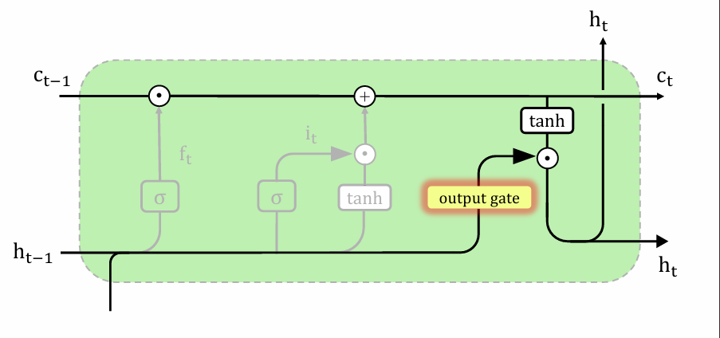
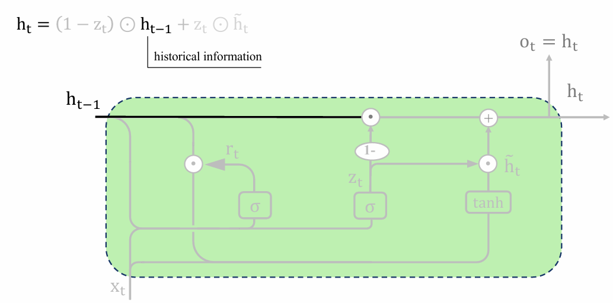
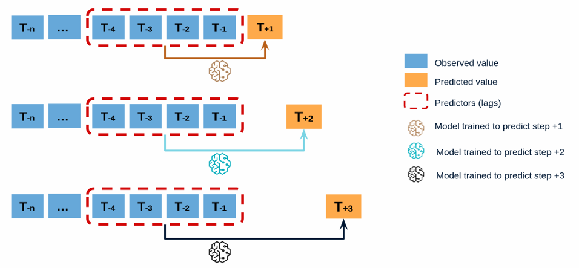
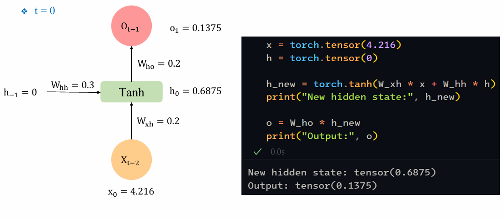
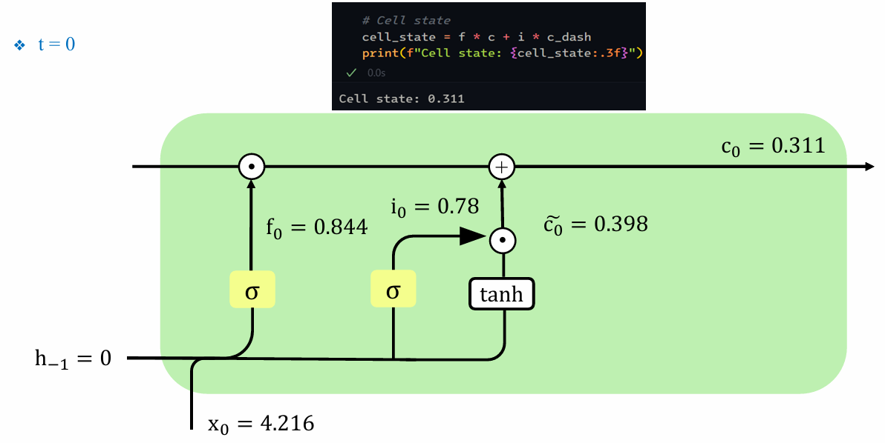

## Table of Contents

- [Table of Contents](#table-of-contents)
- [1. Review: Recurrent Neural Network (RNN)](#1-review-recurrent-neural-network-rnn)
- [2. LSTM](#2-lstm)
- [3. GRU](#3-gru)
- [4. Time Series – Basic Knowledge](#4-time-series--basic-knowledge)
- [5. LSTM, GRU for Time Series Data](#5-lstm-gru-for-time-series-data)
- [6.  LSTM, GRU for Text Data](#6--lstm-gru-for-text-data)
- [7. Summary](#7-summary)

## 1. Review: Recurrent Neural Network (RNN)

{}

Giới hạn của neural network là fix input đầu vào, làm cho mô hình không flexible.

{}

{}

chúng ta muốn dự đoán thời điểm hiện tại nhờ vào các thời điểm trong quá khứ, thời gian trước đó.


  Nhưng lại có vấn đề chúng ta chỉ nhớ thông tin ngắn hạn không thể nhớ được các thông tin dài hạn hơn, làm cho mạng ko flexible. Chúng ta cần một mạng flexible.


RNN lấy idea từ não người, bộ nhớ người gồm các short term (bộ nhớ ngắn hạn), long term (bộ nhớ dài hạn). bộ nhớ ngắn hạn sẽ ghi nhớ thông tin ngắn hạn, bộ nhớ dài hạn sẽ ghi nhớ thông tin dài hạn. Có những thông tin não người có thể nhớ rất đâu từ nhỏ đến giờ thì được lưu vào long term memory.

Các thông tin chính của RNN:

{}

có nghĩa là các thông tin được truyền từ đầu đến cuối của mạng.
{}

{}

Output của trạng thái trước được đưa vào input của trạng thái hiện tại.

{}

{}

Tất cả các trạng thái đều dùng chung các tham số.

{}

{}

{}
+ Many to many (equal input to output)

+ Many to many (unequal input to output)

+ One to many

+ Many to one

{}

{}

việc tính toán trạng thái hiện tại phụ thuộc vào trạng thái trước đó làm mô hình khó train và gây ra vấn đề vashing/exploding gradient. 

khi trọng số bằng 2 vậy thì giá trị output sẽ rất lớn gây ra vấn đề **Exploding gradient**

Khi trọng số bằng 0.5 thì output sẽ rất nhỏ có thể gây ra vấn đề vanishing gradient.


  Vậy làm cách nào để tránh được 2 vấn đề trên.

{}

## 2. LSTM

{}

LSTM là kiểu mạng giải quyết vấn đề gradient/vanishing gradient. với idea thay vì chỉ lấy thông tin ngắn hạn thì chúng ta cần lấy thêm thông tin dài hạn long term memory.
{}

{}

LSTM gồm 3 **stages**:
1. **Forget gate**: quyết định thông tin nào cần quên và thông tin nào cần nhớ.
2. **Input gate**: quyết định thông tin nào cần cập nhật vào long term memory.
3. **Output gate**: quyết định thông tin nào cần lấy ra từ long term memory.
{}

{}

- **Long term memories** lưu trữ lại dữ liệu quá khứ dài hạn, không có bias và trọng số nên tránh được tình trạng exploding gradient và vanishing gradient.

- **Short term memories** lưu trữ dữ liệu ngắn hạn, có bias và trọng số.

> Vậy các nào để **long term memories** và **short term memories** giao tiếp với nhau.

{}

Block trên xác định số lượng thông tin nào cần quên và thông tin nào cần nhớ.
{}

{}

Pontential long term sẽ cho biết cần nhớ bao nhiêu % input để làm long term memory và khối bên phải sẽ quyết định thông tin nào cần cập nhật vào long term memory.
{}

{}

**Output gate** sẽ quyết định thông tin nào cần lấy ra từ **long term memory**.

{}

{}

{}

Giả sử input đầu vào day 1 đến day 4 và xác định day 5 sử dụng LSTM.

Khởi tạo tham số ban đầu đều bằng 0.

+ Bắt đầu với **ngày 1**:
  

+ Input đầu vào **ngày 2** và output đầu vào **ngày 1**:
  

+ Input đầu vào **ngày 3** và output đầu vào **ngày 2**:
  

+ Input đầu vào **ngày 4** và output đầu vào **ngày 3**:

{}

{}

+ **Forget gate**: quyết định thông tin nào cần quên và thông tin nào cần nhớ.

+ **Input gate**: quyết định thông tin nào cần cập nhật vào long term memory.

+ **Output gate**: quyết định thông tin nào cần lấy ra từ long term memory.

{}

{}
{}

## 3. GRU

{}

GRU là một phiên bản đơn giản hơn của LSTM, GRU không có **long term memory** và **short term memory** như LSTM.

{}

{}
+ Bỏ qua **long term memory** và **short term memory** như LSTM.

 
+ Cách GRU hoạt động:

{}

{}

{}

## 4. Time Series – Basic Knowledge

{}
+  **Evenly Sampled**: các điểm dữ liệu được lấy mẫu cách đều nhau.

+  **Unevenly Sampled**: các điểm dữ liệu không có mẫu cách đều nhau.

{}

{}

+ **Single step (short term)**: dự đoán giá trị tại thời điểm tiếp theo.

+ **Multi step (long term)**: dự đoán giá trị tại nhiều thời điểm tiếp theo.

  + **Iterated Multi-step Forecasting**: dự đoán giá trị tại nhiều thời điểm tiếp theo dựa vào giá trị dự đoán trước đó.

  

  + **Direct Multi-step Forecasting**:

  

{}

{}

{}

{}
{}

{}

{}

## 5. LSTM, GRU for Time Series Data

{}

{}

{}
  

+ Tại t = 0:

  

+ Tại t = 1:

  

+ Tại t = 2:

  

+ **Stacked RNN**: output của một RNN sẽ là input của RNN tiếp theo.

  

+ **Bidirectional RNN**: giúp cho học thông tin theo các chiều khác nhau.

  
{}

{}

+ Tại thời điểm **t=0**:

+ Tại thời điểm **t=1**:

+ Tại thời điểm **t=2**:

{}

{}

+ Tại thời điểm **t=0**:

+ Tại thời điểm **t=1**:

+ Tại thời điểm **t=2**:

{}

## 6.  LSTM, GRU for Text Data

{}

{}

{}

{}

{}

{}

{}

{}

## 7. Summary

