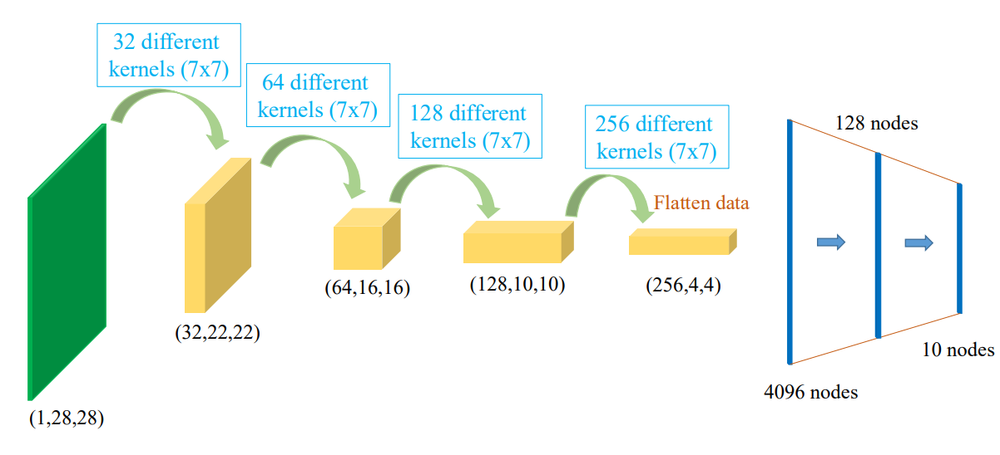

## 1. Motivation

Khi xử lý ảnh, mỗi ảnh có hàng ngàn pixels, mỗi pixel được coi là một feature. Ví dụ một bức tranh có kích thước 1000x1000 sẽ có 1 triệu features. Trong mạng nơ-ron feed-forward thông thường, mỗi lớp kết nối hoàn toàn với lớp trước, nghĩa là với mỗi lớp, 1 triệu pixel sẽ kết nối hoàn toàn với 1 triệu pixel ở lớp trước, dấn đến tổng số tham số lên đến $10^{12}$. Số tham số khổng lồ này sẽ gặp phải nhiều vấn đề như overfitting, yêu cầu lượng lớn tài nguyên tính toán và huấn luyện mô hình và dự đoán.

Phá vỡ tính không gian của bức ảnh, trong thực tế các điểm gần nhau thường có liên quan đến nhau việc flatten làm mất đi tính chất này giảm khả năng dự đoán của mô hình.

## 2. MLP Limitations

### 2.1. Apply MLP for GrayScale images

Với ảnh xám thì MLP hoạt động khá tốt

### 2.2. Apply MLP for Color images

Kết quả cho performance khá tệ

### 2.3. Apply MLP for Color images (add more layers)

Như motivation của MLP , mình biết rằng càng tăng tham số thì model hoạt động càng tốt, đúng khi càng thêm layers việc học trên tập train sẽ rất tốt nhưng trên tập test sẽ như nào?

Kết quả vẫn tệ !

### 2.4. Problem 

MLP hoạt động cho ảnh màu không tốt bởi vì : 

#### 2.4.1. Vấn đề khi flatten 

+ Khi flatten một bức ảnh (chuyển đổi từ dạng 2D thành 1D) và đưa vào MLP, bạn đang làm mất đi thông tin không gian và mối quan hệ giữa các pixel trong ảnh. Khi ảnh được flatten, các pixel sẽ không còn giữ được thông tin về vị trí của chúng trong không gian 2D nữa. Các mối quan hệ không gian giữa các pixel (ví dụ, các pixel gần nhau có thể có sự liên quan mạnh mẽ) bị phá vỡ.

+ Điều này có thể làm cho mô hình không thể học tốt các đặc trưng không gian, ví dụ như đường viền, hình dạng, hay các mẫu hình học trong ảnh, bởi vì MLP không có khả năng nhận diện cấu trúc không gian mà chỉ hoạt động dựa trên các kết nối fully connected.

#### 2.4.2. Theo góc nhìn của Yann LeCun : 

**a. Concentrating on a Local Region**

+ Yann LeCun nói rằng mắt người không thể tập trung vào mọi nơi cùng một lúc, mà chỉ có thể tập trung vào một điểm hoặc một vùng nhỏ tại một thời điểm. Điều này là rất hợp lý, bởi vì não bộ con người cũng ưu tiên việc nhận diện các đặc trưng cục bộ (ví dụ như nhận diện một hình dạng hay một chi tiết nhỏ trong cảnh).

+ CNNs hoạt động tương tự như vậy. Thay vì xử lý toàn bộ bức ảnh một cách đồng thời, CNNs sử dụng các phần convolutional filters (hoặc kernels) để chỉ tìm kiếm các đặc trưng cục bộ trong các vùng nhỏ của ảnh (ví dụ: cạnh, hình tròn, kết cấu). Điều này giúp mô hình hiểu được các đặc trưng cơ bản như hình dạng, cạnh, màu sắc ở những vùng cụ thể của ảnh mà không cần phải tính toán quá nhiều tham số cho toàn bộ ảnh.

**b. Focusing on a Specific Region of the Image**

+ Khi chúng ta nhìn vào một bức tranh, dù mắt có thể di chuyển hoặc chúng ta có thể xoay đầu để nhìn khắp bức tranh, nhưng chúng ta vẫn tập trung vào một phần nhất định tại một thời điểm. Điều này có nghĩa là não bộ luôn xử lý thông tin từ các vùng cụ thể (vì vùng này chứa thông tin mình cần nên không cần phải để ý background), thay vì xem xét toàn bộ ảnh một lúc.

+ CNNs cũng hoạt động theo cách này thông qua các lớp convolutional và pooling. Mỗi lớp trong CNN có thể chỉ tập trung vào một vùng nhỏ của bức ảnh (được gọi là receptive field). Những lớp này sẽ dần dần học được các đặc trưng từ các vùng nhỏ và kết hợp lại để hiểu được toàn bộ bức ảnh. Khi mạng đi sâu hơn, các lớp cao hơn sẽ học được các đặc trưng phức tạp hơn từ các vùng lớn hơn.

**c. Divide and Conquer**

+ Yann LeCun cũng nói rằng với dữ liệu quá lớn, chúng ta không thể dùng một mạng fully connected để kết nối hết tất cả các pixel với nhau. Thực tế, việc sử dụng một mạng fully connected (MLP) cho toàn bộ bức ảnh là cực kỳ tốn kém về tính toán và dễ dàng dẫn đến overfitting.

+ CNNs giải quyết vấn đề này bằng cách chia nhỏ và chỉ tập trung vào các vùng cục bộ (local receptive fields) trong ảnh. Mỗi node trong các lớp convolutional chỉ xử lý một vùng nhỏ của ảnh, điều này giúp giảm số lượng tham số đáng kể và giúp mô hình có thể xử lý dữ liệu lớn mà không gặp phải vấn đề về tài nguyên tính toán hay overfitting. Hơn nữa, CNNs vẫn có thể học các mối quan hệ không gian và hình học giữa các phần của ảnh thông qua các lớp sâu hơn.

## 3. Convolutional Layer

Bức ảnh cho thấy cùng với một hình ảnh việc sử dụng CNN cần ít tham số hơn, nhờ việc sử dụng convolutional layer.

{}

{}

### 4. Apply Convolutional Layer

### 4.1. Apply for Fashion-MNIST dataset

### 4.2. Apply for Cifar-10 dataset

## 4. Standard CNNs

Nếu sử dụng tích chập, chúng ta sẽ có thể giảm nhưng số chiều khá chậm. Nếu chiều còn lớn vậy flatten sẽ mất đi thông tin không gian rất nhiều.


Sử dụng stride và pooling giúp giảm chiều mạnh hơn nhưng vẫn giữ được tính chất của ảnh.


### 4.1. Down-sample Feature Map

#### 4.1.1. Max pooling

#### 4.1.2. Average pooling

#### 4.1.3. Interpolation poling

Xóa một số cột và dòng.

#### 4.1.4. Comparison of down-samplings

Mục đích của việc sử dụng down-samplings chỉ đơn giản muốn giảm kích thước của ảnh, còn kết quả thì các loại downsampling đều cho kết quả gần như tương đồng nhau.

### 4.2. Stride

+ Conv with stride = 1:

+ Conv with stride = 2:
  

### 4.3. Padding

