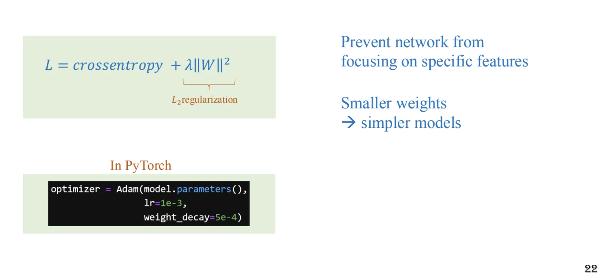

## 1. Motivation

{}

Buổi hôm trước chúng ta thảo luận về việc huấn luyện mô hình. generalization là một khái niệm quan trọng trong deep learning. Một mô hình được coi là generalization tốt khi nó có khả năng dự đoán tốt trên dữ liệu mới mà nó chưa từng thấy. Hiện tại kiến trúc buổi trước tập huấn luyện đạt được độ chính xác cao nhưng khi áp dụng vào tập test thì kết quả không tốt. Điều này chứng tỏ mô hình không generalization tốt.


{}


  Mục tiêu của bài này sẽ cãi thiện độ chính xác trên tập kiểm tra (test accuracy) và giảm khoảng cách giữa độ chính xác trên tập huấn luyện và tập kiểm tra.


## 2. Problem


{}
+ **Mô hình** bắt đầu ở trạng thái **ngẫu nhiên** với các **biên phân tách (decision boundary)** **không chính xác**.  
+ Đây là **điểm khởi đầu** của **mô hình**, **mô hình** **không thể dự đoán chính xác** trên tập **huấn luyện** và **tập kiểm tra**.
{}

{}
+ **Mô hình** dần dần **cải thiện**, **học được** các **xu hướng chính** của tập dữ liệu.  
+ **Biên phân tách** trở nên **hợp lý** hơn, phản ánh tốt các **đặc điểm** của dữ liệu.
{}

{}
+ **Mô hình** đã **học được** các **đặc điểm chính** của tập dữ liệu, **biên phân tách** trở nên **chính xác**.  
+ Tại trạng thái này, **mô hình** có khả năng **tổng quát hóa (generalization)** **tốt**, tức là có **khả năng dự đoán tốt** trên **dữ liệu mới**.
{}

{}
+ **Mô hình** **huấn luyện** **quá mức** dẫn đến việc **học "quá mức"** các **đặc điểm** của tập dữ liệu.  
+ **Biên phân tách** trở nên **quá phức tạp**, **mô hình** không thể **tổng quát hóa** **tốt** trên **dữ liệu mới**.
{}


## 3. Solution

### 3.1. Trick 1: 'learn hard' - randomly add noise to training data

{}
Nếu dữ liệu quá sạch thì mô hình không thể học được các đặc trưng phức tạp hoặc khó khăn. Khi gặp dữ liệu thử nghiệm chứa nhiều nhiễu hoặc khó hơn, mô hình dễ bị sai (fail)

{}

{}
+ **Thêm nhiễu** vào dữ liệu huấn luyện, giúp mô hình **học được** các **đặc điểm phức tạp** hơn. 


{}


{}
```python
transforms.Compose([
    transforms.ToTensor(),
    transforms.Normalize([0.4914, 0.4822, 0.4465], 
                         [0.2470, 0.2435, 0.2616]),
    transforms.RandomErasing(
    p=0.75,          # Xác suất áp dụng Random Erasing (75% ảnh sẽ bị xóa ngẫu nhiên một phần)
    scale=(0.01, 0.3),  # Kích thước phần bị xóa: tối thiểu 1% - tối đa 30% diện tích ảnh
    ratio=(1.0, 1.0),   # Tỷ lệ khung hình (width/height) của vùng bị xóa luôn là 1.0 (hình vuông)
    value=0,           # Giá trị pixel thay thế (0 tức là tô màu đen)
    inplace=True       # Thay đổi ảnh gốc thay vì tạo bản sao mới
)
])
```
{}

{}

{}

### 3.2. Trick 2: Batch Normalization

{}
+ Batch Normalization giúp giảm thiểu **Internal Coveriate Shift**, một vấn đề xáy ra khi phân phối của các đặc trưng thay đổi liên tục trong qúa trình huấn luyện do sự cập nhật trọng số lần trước đó. Bằng cách chuẩn hóa giá trị đầu vào của mỗi lớp, Batch Normalization giúp mô hình học nhanh hơn và hiệu quả hơn, duy trì sự ổn định của phân phối dữ liệu, giúp các lơp phía sau không cần phải liên tục điều chỉnh để thích nghi. Điều này giúp mô hình tăng tốc độ hội tụ và làm quá trình huấn luyện hiệu quả hơn.

+ Batch Normalization vô tình thêm nhiễu (noise) vào quá trình huấn luyện trong mean và variancr giữa các mini-batch. Nhiễu này hoạt động như một dạng **regularization**, làm giảm nguy cơ overfitting. Nhờ đó mô hình không chỉ hoạt động tốt trên tập huấn luyện mà còn cải thiện khả năng tổng quát hóa trên tập kiểm tra, đảm bảo hiệu suất cao hơn khi gặp dữ liệu chưa từng thấy.

<div style='display: flex'>


</div>

{}
Bởi vì mỗi lần chuẩn hóa, dữ liệu sẽ bị biến đổi, và sự biến đổi này khác nhau sau mỗi epoch do sự thay đổi mean và variance giữa các mini-batch. Điều này làm cho các feature map thay đổi liên tục qua từng epoch, đồng thời thêm một lượng nhiễu tự nhiên vào quá trình huấn luyện. Nhờ đó, mô hình không chỉ học được các đặc trưng chính xác của tập huấn luyện mà còn học được cách xử lý dữ liệu nhiễu, giúp tăng khả năng tổng quát hóa của mô hình.


{}

{}

{}
Từ công thức chúng ta có thể mô hình hóa như sau đây:


Kết quả của tính backward


{}

{}

{}

### 3.3. Trick 3: Dropout

{}
+ **Dropout** là một kỹ thuật regularization phổ biến trong deep learning. Ý tưởng của Dropout là loại bỏ ngẫu nhiên một số lượng node trong mạng neural network trong quá trình huấn luyện. Điều này giúp mô hình trở nên **robust** hơn, giảm nguy cơ overfitting, tăng khả năng tổng quát hóa của mô hình.

+ **Dropout** giúp mô hình học được các đặc trưng chính xác của dữ liệu, đồng thời giảm khả năng mô hình học "quá mức" các đặc trưng của tập huấn luyện. Điều này giúp mô hình có khả năng dự đoán tốt trên dữ liệu mới, giảm khoảng cách giữa độ chính xác trên tập huấn luyện và tập kiểm tra.


{}

{}
{}


Pytorch sẽ sinh ra D có giá trị = {0,1}, dot hadamard với giá trị của layer đó.


**Hệ số $scale$ :**

Bởi vì tắt node thì đầu ra các layer sẽ bị giảm, cần scale lên cho các node không tắt  để giữ cho **tổng năng lượng (magnitude)** của đầu ra không đổi.


{}

{}
Với tỷ lệ dropout $r$:

- Ngẫu nhiên đưa các node đầu vào về giá trị 0 với **tần suất là $r$**.
- Chỉ áp dụng trong **chế độ huấn luyện** (training mode)


{}

{}


{}
Thực tế thì mọi người hay xài dropout ở những layer cuối


{}


### 3.4. Trick 4: Kernel regularizer

{}

Thêm hệ số $W$ vào hàm Loss , mà mình mong muốn giảm thiểu hàm Loss xuống nên $W$ cũng nhỏ xuống 

—> Mục địch chính của regular là không muốn $W$ quá lớn



{}

{}
```python
optimizer = torch.optim.Adam(model.parameters(), lr=0.
001, weight_decay=1e-5) ## weight_decay là hệ số lambda
```
{}


{}

{}


### 3.5. Trick 5: Data Augmentation

{}

{}

{}


```python
transforms.Compose([
    transforms.RandomHorizontalFlip(p=0.5),
    transforms.RandomCrop(),
    transforms.ToTensor(),
    transforms.Normalize((0.5, 0.5, 0.5), (0.5, 0.5, 0.5))
])
```
{}

{}


{}





Đến đây, chúng ta đã đạt được mục tiêu ban đầu: tăng độ chính xác (accuracy) trên tập kiểm tra (test) và giảm khoảng cách giữa độ chính xác trên tập huấn luyện và tập kiểm tra. Tuy nhiên, nếu muốn tăng thêm độ chính xác trên tập kiểm tra, liệu có khả thi hay không?

{}
Để cải thiện độ chính xác trên tập kiểm tra, chúng ta cần làm:

**Tăng độ chính xác trên tập huấn luyện trước (train_accuracy)**:

- Mục tiêu là để mô hình học được các đặc trưng phức tạp hơn trong dữ liệu.
- Điều này tương đương với việc bạn muốn đạt điểm cao hơn trên bài kiểm tra thực tế, thì trước tiên bạn phải nắm vững kiến thức trong quá trình ôn luyện.

—> Tăng model capacity

{}




### 3.6. Trick 6: Trick 6: Reduce learning rate (Adam + Weight decay)

{}
Ban đầu, mô hình cần một learning rate cao để khám phá không gian tham số.
Sau đó, giảm learning rate giúp tinh chỉnh mô hình và hội tụ tốt hơn.
Nếu giữ LR quá cao, mô hình có thể dao động quanh điểm tối ưu thay vì hội tụ.

{}

{}


{}


### 3.7. Trick 7: Increase model capacity (and use more data augmentation)

{}
- **Tăng model capacity** giúp mô hình học được các đặc trưng phức tạp hơn trong dữ liệu.
- **Data augmentation** giúp mô hình học được các đặc trưng chính xác của dữ liệu, giảm nguy cơ overfitting, tăng khả năng tổng quát hóa của mô hình.


{}

{}

{}

### 3.8. Trick 8: Using skip-connection

{}
- **Skip connection** giúp truyền ngược thông tin từ các lớp thấp đến các lớp cao hơn, giúp mô hình học được các đặc trưng phức tạp hơn trong dữ liệu.
- **Skip connection** giúp giảm nguy cơ vanishing gradient, giúp mô hình học nhanh hơn và hiệu quả hơn.
- **Skip connection** giúp mô hình học được các đặc trưng chính xác của dữ liệu, giảm nguy cơ overfitting, tăng khả năng tổng quát hóa của mô hình.
- **Skip connection** giúp mô hình học được các đặc trưng cục bộ và toàn cục của dữ liệu, giúp mô hình hiểu được cấu trúc không gian và hình học của dữ liệu.


{}

{}

{}

### 3.9. Trick 9: Increase model capacity once more

{}

Tăng gấp đôi out_channels của các layer Conv2d


{}

{}


{}

## 4. Summary


## 5. Câu hỏi ôn tập

{}
Hiện tượng **overfitting** xảy ra khi mô hình học quá tốt trên tập huấn luyện nhưng không tổng quát hóa được trên tập kiểm tra.
{}

{}
Mục tiêu là **cải thiện độ chính xác trên tập kiểm tra** và **giảm khoảng cách** giữa `training accuracy` và `test accuracy`.
{}

{}
Biên phân tách dần trở nên hợp lý hơn, phản ánh tốt các đặc điểm của dữ liệu.

{}

{}
Khi mô hình học được các đặc trưng chính của dữ liệu mà không làm phức tạp hóa biên phân tách.

{}

{}
Mô hình trở nên quá phức tạp, khớp với cả các outliers và không phản ánh xu hướng tổng quát của dữ liệu.

{}

{}
Mô hình chưa học được quy luật dữ liệu và có thể có biên phân tách không hợp lý.

{}

{}
Thêm nhiễu giúp mô hình học cách xử lý dữ liệu phức tạp hơn, tránh tình trạng "học thuộc lòng" và cải thiện khả năng dự đoán trên dữ liệu mới.
{}

{}
Kỹ thuật **RandomErasing** trong thư viện `torchvision.transforms` được sử dụng để thêm nhiễu một cách ngẫu nhiên vào dữ liệu huấn luyện.
{}

{}
Batch Normalization giúp giảm thiểu **Internal Covariate Shift**, tức là sự thay đổi phân phối của các đặc trưng đầu vào trong quá trình huấn luyện.
{}

{}
Batch Normalization thêm nhiễu vào quá trình huấn luyện do sự khác biệt giữa **mean** và **variance** trong các mini-batch, từ đó giảm nguy cơ **overfitting** và cải thiện khả năng tổng quát hóa.
{}

{}
Batch Normalization làm thay đổi **mean** và **variance** giữa các mini-batch, dẫn đến các **feature map** biến đổi liên tục qua từng epoch.
{}

{}
Độ chính xác kiểm tra tăng từ khoảng **80.9%** lên **84%**.
{}

{}
Dropout vô hiệu hóa ngẫu nhiên một số **nodes** (đặt giá trị bằng 0) trong mạng để giảm sự phụ thuộc và cải thiện khả năng tổng quát hóa.
{}

{}
Dropout ngăn mô hình học quá mức từ một node hoặc feature cụ thể, buộc mô hình học các đặc trưng tổng quát hơn và tạo ra nhiều phiên bản mô hình khác nhau như một phương pháp **ensemble**.
{}

{}
Mục đích của Kernel Regularizer là giảm kích thước trọng số \(w\), ngăn mô hình tập trung quá mức vào các đặc trưng cụ thể và tránh overfitting.
{}

{}
Tham số **`weight_decay`** trong Adam optimizer thực hiện chức năng L2 Regularization.
{}

{}
Data augmentation giúp tăng kích thước và sự đa dạng của tập dữ liệu huấn luyện, giúp mô hình học tốt hơn và cải thiện khả năng tổng quát hóa.
{}

{}
Các kỹ thuật phổ biến bao gồm **horizontal flip** (lật ngang), **rotate** (xoay), và **crop and resize** (cắt và thay đổi kích thước).
{}

{}
Mục tiêu là tăng độ chính xác trên tập kiểm tra (**test accuracy**) và giảm khoảng cách giữa tập huấn luyện và tập kiểm tra.
{}

{}
Tăng **model capacity** để mô hình học được nhiều đặc trưng phức tạp hơn từ dữ liệu.
{}

{}
Công thức là $ \eta = \eta_0 \times \gamma^{\text{epoch}} $ với $ \gamma $ là hệ số giảm learning rate.
{}

{}
Tham số **gamma** trong **ExponentialLR** kiểm soát tốc độ giảm learning rate, ở đây $ \gamma = 0.96 $.
{}

