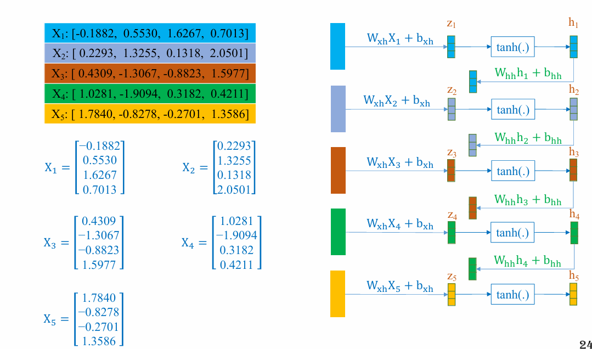
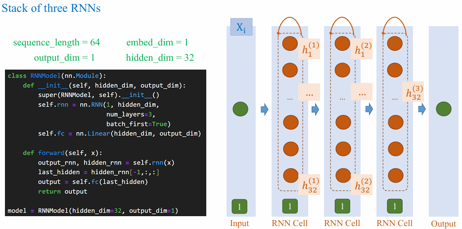
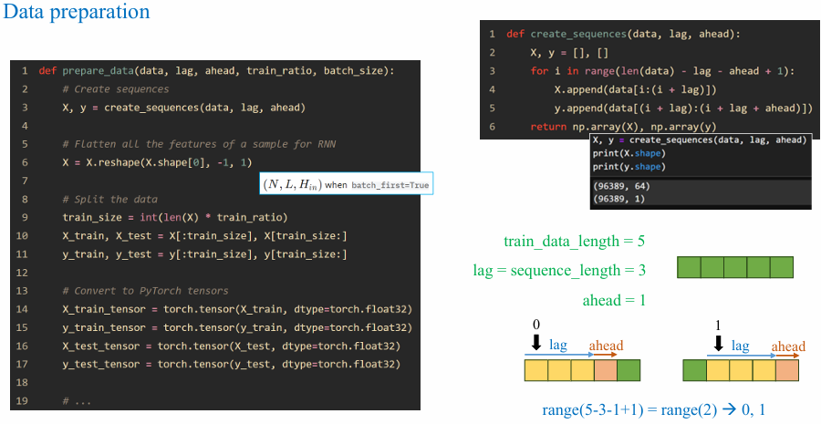

## 1. Motivation

{}
Hôm nay chúng ta sẽ đi đến một nhánh song song với CNN, mục đích xuất phát từ việc CNN không xử lí được, trong quá trình phát triển các mô hình học sâu chúng ta đã đi qua những bước tiến quan trọng như sử udunjg Multi-layer perceptron (MLP) để giải quyết các vấn đề cho dạng bảng (tabular data) hay Convolution Neural Network (CNN) để giải quyết xử lí dữ liệu ảnh. Các loại dữ liệu này có đặc điểm chung là dữ liệu cố định chẳng hạn như số lượng cột trong bảng hoặc pixel của một bức ảnh. Điều này cho phép chúng ta dễ dàng chuẩn hóa dữ liệu về một kích thước thống nhất trước khi đưa vào mô hình.

Tuy nhiên, khi làm việc với dữ liệu **dạng chuỗi (sequential data)** như văn bản, âm thanh, hay chuỗi thời gian, chúng ta gặp phải một thách thức đặc biệt: **độ dài của từng mẫu** dữ liệu **có thể thay đổi**. Ví dụ, các câu văn bản thường có độ dài khác nhau, và việc chuẩn hóa như **padding** hay **truncate** không chỉ làm mất ngữ nghĩa mà còn có thể tạo ra nhiễu không cần thiết.
{}

{}
Điều này dẫn đến một nhu cầu cấp thiết về một mô hình có khả năng xử lý linh hoạt dữ liệu dạng chuỗi với độ dài biến đổi, đồng thời có khả năng ghi nhớ mối quan hệ giữa các thành phần trong chuỗi. Recurrent Neural Networks (RNNs) ra đời như một giải pháp lý tưởng cho các vấn đề này. Với cơ chế hồi tiếp, RNNs có thể tận dụng thông tin từ các bước trước đó để dự đoán và xử lý bước tiếp theo trong chuỗi, mở ra cánh cửa cho nhiều ứng dụng mạnh mẽ trong phân tích văn bản, xử lý tín hiệu âm thanh, và dự đoán chuỗi thời gian.
{}

## 2. Text Classification

{}

{}

{}

{}
Bước này thực hiện chuyển tất cả chữ hoa về chữ thường, loại bỏ ký tự đặc biệt và tách văn bản thành các token. Sau đó, quá trình chuẩn hoá (standardization) giúp tách các từ thành các token, còn quá trình vector hoá (vectorization) chuyển chúng thành những vector số học.

Trong từ điển, nếu số lượng token quá lớn, chỉ một lượng từ vựng tối đa được chọn nhằm tối ưu hoá xử lý. Ví dụ, với tiếng Anh, chỉ cần khoảng 3.000 từ thông dụng là đủ để giao tiếp. Những từ không nằm trong từ điển sẽ được đánh dấu bằng <UNK> để giảm kích thước từ vựng. Ngoài ra, nhằm đưa tất cả câu về cùng độ dài, <PAD> được dùng để điền thêm vào câu ngắn, trong khi những câu dài hơn bị cắt bớt.

{}

{}

Từ phần trước chúng ta đã có một tensor gồm các số tượng trưng cho các từ, trong deep learning các số cố định ko mô tả được nhiều ý nghĩa mà một từ có thể có nhiều ý nghĩa vậy nên việc chỉ sử dụng 1 số để mô tả 1 từ sẽ gây cho mô hình không học được. Vậy nên chúng ta cần sử dụng nhiều chiều hơn và sử dụng thêm các số thực đó là motivation của `Embedding`. 

Trong `nn.Embedding` sẽ nhận về 2 tham số chính là `vocab_size` và `embed_dim`, với `vocab_size` là kích thước của từ điển của mình và `embed_dim` là số chiều mà mình muốn mô tả cho 1 token. Khi chúng tao khởi tạo xong nó sẽ tạo ngẫu nhiên các tham số cho các từ trong bảng từ vựng có thể xem bên hình dưới. 

>[!NOTE]
>Các số này chỉ là khởi tạo ban đầu nó có thể được học sau này và thay đổi có thể hiểu sau khi train các từ giống nhau thì khoảng cách giữa 2 vector đó sẽ gần lại chẳng hạn.

Sau đó chúng ta có thể gọi embedding cho input là các từ khi chúng ta chuyển về thành các token. Kết quả của nó sẽ được hiện thực như hình ảnh sau.

{}
{}

## 3. RNN Construction

### 3.1. Simplest idea: Based on MLP

**Vấn đề cần giải quyết:**

- Trong các bài toán có dữ liệu tuần tự (chuỗi văn bản, chuỗi thời gian, âm thanh...), thông tin tại một thời điểm thường phụ thuộc vào ngữ cảnh trước đó. Các mô hình truyền thống (như mạng nơ-ron feedforward) không thể ghi nhớ hoặc tận dụng được thông tin từ quá khứ.
- Mục tiêu là xây dựng một mô hình có thể **khai thác thông tin nhân quả (causal information)** để đưa ra các quyết định chính xác dựa trên cả dữ liệu hiện tại và dữ liệu trong quá khứ.

{}

Chúng ta thử áp dụng kiến thức MLP nối tất cả các features lại với nhau mỗi số là mỗi node vậy sẽ có ưu nhược điểm gì?.

=> Nhược điểm của cách trên là **mất đi thông tin tuần tự** của các từ trong câu, mối quan hệ thứ tự các từ, số lượng tham số cũng khá lớn nếu sequence quá nhiều thì sẽ có rất nhiều tham số.
{}

{}

Mỗi token trong chuỗi chúng ta cho trượt qua cái giống như `kernel` có output đầu ra sẽ là số node của từ đó tạo thành. Các token chỉ trượt qua `kernel` đó nên tham số của `kernel` đó sẽ được dùng chung nên được gọi là `share weight`.

Nhưng cách trên vẫn có nhược điểm chưa thực hiện được **khai thác thông tin nhân quả (causal information)**. Vậy chúng ta cần xây dựng mô hình làm sao có thể lấy được thông tin thứ tự các từ.
{}

{}

Ý tưởng của chúng ta sẽ nối các ouput node trước vào làm input của node sau cùng với input của từ đó. Nhưng như chúng ta đã từng biết output cần phải qua activation để trở thành phi tuyến giúp biểu diễn giàu ngữ nghĩa hơn, giúp mô hình học tốt hơn.

Sau khi thêm activation giả sử Tanh (vì thời đó chỉ có Tanh với Sigmoid).


  Tại sao H1 được sử dụng để đưa ra quyết định, không phù hợp để gửi trực tiếp đến Z2 hoặc H2.


Để thể hiện mối quan hệ nhân quả (từ đứng sau được suy ra từ từ đứng trước) có vấn đề xảy ra là 

- Không cùng miền giá trị
    
     $-\infty < z_2 < \infty \\
    -1 < h_1 < 1$
    
—> cần thực hiện trung gian qua transformation để về cùng miền giá trị.

Dot product $h1$ với ma trận $W$ để chuyển về cùng shape và miền giá trị

{}

{}

Khi transformation $h1$ , chúng ta có 2 cách để combination 2 vector là concat và Addition . Ta chọn Addition

{}

{}

thêm h0 với bhh để đồng bộ công thức giữa các node.
{}

{}

{}

### 3.2. Text Deep Models

{}

{}

{}

{}

{}
Ví dụ tính $h1$ 

Ví dụ tính $h2$ từ $h1$

{}

{}

{}

{}

{}

{}

{}

{}

{}

{}

{}

{}

{}

## 4. RNNs for Time-series

### 4.1. Weather Forecasting

Problem Statement: Given temperature from the previous 5 hours (including the current one), predict 
temperature of the next 1 hour.

{}

{}

{}

{}

{}
Ta giả sử một giá trị là một node trong RNN thì nó sẽ được biểu diễn như dưới đây:

{}

{}

{}

{}

{}

### 5. Summary

