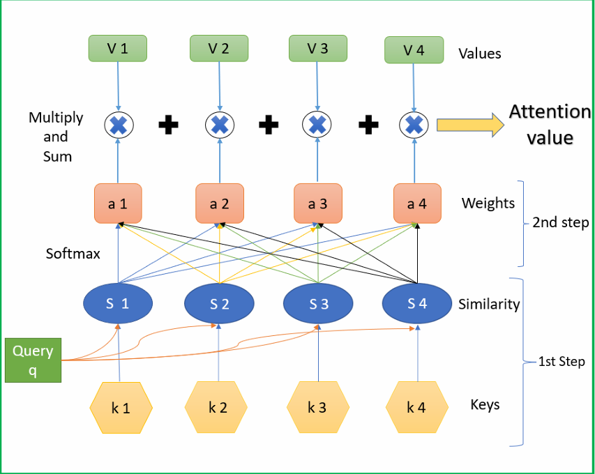
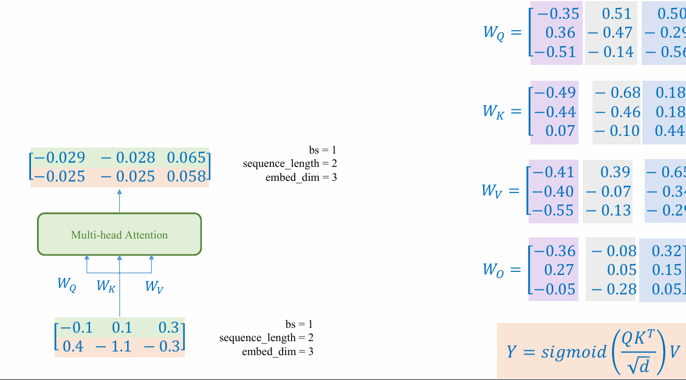
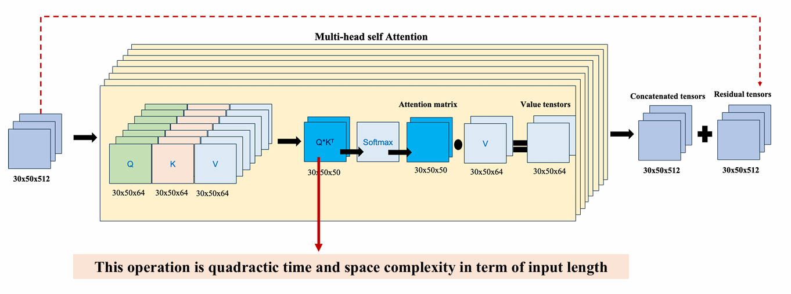

## 1. Normalization Techniques

{}

Normalization is a technique for scaling and shifting input data to ensure it falls within a certain range or distribution


So sáng sử dụng batch size của 32 ảnh trên 1 GPU trong tập ImageNet. Valid Error với số epoch training được mô tả ở bên dưới đây:

{}

## 2. Review transformer.

{}

{}

{}

>[!NOTE]
>Word Embedding là kỹ thuật biểu diễn từ ngữ dưới dạng vector số thực, giúp máy học hiểu được mối quan hệ ngữ nghĩa giữa các từ. Các mạng nơ-ron có thể học các embedding này thông qua các kiến trúc như Word2Vec, FastText hoặc các mô hình hiện đại hơn như BERT.

{}

Trong các từ vị trí cũng là phần quan trọng trong ngữ nghĩa của câu. Vì vậy chúng ta cần phải thêm thông tin về vị trí của các từ trong câu.

{}

{}

{}

Dựa vào binary representation của các bit ta có thể thấy được. các số 0 với 1 theo các dimeson khác nhau sẽ có tần số lặp lại khác nhau.

Trên ý tưởng đó người ta ứng dụng vào positional encoding.

{}

Mỗi line đại diện cho một chiều, tương đương để theo dõi một cột (vị trí trong bit) trỏng bảng bit table được đề cập ở phần trước.
Dim 0 có dao động nhanh, thay đổi theo mọi vị trí. Điều này giống y hệt với bit ngoài cùng trong nhị phân, lật theo mỗi lần đếm. Dim 21 (đường màu cam) thay đổi chậm hơn nhiều, tương tự như cách các bit bên trái trong biểu diễn nhị phân của chúng ta lật ít thường xuyên hơn.

**Simulation:**

<video width="100%" controls>
    <source src="SteppedPositionalEncodingPlot.mp4" type="video/mp4">
</video>

>[!NOTE]
> `pos`, `i` phải nhỏ hơn L/2. `d` là số chiều của vector.

- Kết hợp position với word embedding:

{}

{}

{}

{}

## 3. Transformer Encoder: Review.

{}

Trong này từ `it` có mối quan hệ với từ `pizza` bởi vì `it` thay thế cho từ `pizza` trong câu. Và từ `it` sẽ có mối quan hệ kém hơn với các từ như `oven`, `tasted`. Như các bài trước chúng ta sẽ tách thành các `token` và sẽ `embedding` thành các vector.

Trọng số của từ `pizza` với các từ được tính bằng `dot product` giữa vector của từ `pizza` và các từ còn lại, để tốt nhất chúng ta phải `normalization`.

{}

{}

Chồng các bộ tham số Q, K, V với nhau.

{}

{}

Tương tự như Resnet.

{}

## 4. Transformer Decoder: Review.

{}

Dữ liệu đầu vào được encoder xử lý qua Transformer, tạo ra các embedding cho từng từ với các trọng số attention phản ánh mối quan hệ ngữ nghĩa giữa chúng. Sau đó, decoder sử dụng đầu ra của encoder làm `Key` và `Value` cùng với target để dự đoán từ tiếp theo một cách chính xác.

{}

{}

Giả sử bên decoder chúng ta bật `[EOS]` lên 1 và các từ còn lại là 0. Chúng ta sẽ dự đoán từ tiếp theo dựa vào từ trước đó. Để dự đoán từ tiếp theo chúng ta sẽ sử dụng `attention` giữa từ trước đó và các từ còn lại.

Ouput ta cho qua một lớp mạng để dự đoán từ tiếp theo được dự đoán.

{}

{}

{}

{}
{}

## 5. Transformer for Text Classification

{}

Ta có bộ dataset `IMDB` với 50k review, mỗi review có label là `positive` hoặc `negative`. Mục tiêu là dự đoán label của review.

{}

## 6. Transformer for Time-Series

{}
Ta có ETTh1 dataset là bộ dữ liệu về nhiệt độ, áp suất, độ ẩm, ... trong 1 khoảng thời gian. Mục tiêu là dự đoán nhiệt độ của ngày hôm sau dựa vào dữ liệu của ngày hôm trước.
{}

{}
Informer là một mô hình transformer được thiết kế để dự đoán chuỗi thời gian. Mô hình này sử dụng các biến thể của transformer để xử lý dữ liệu chuỗi thời gian, giúp giảm thời gian tính toán.

{}

+ ProbSparse Self Attention: Sử dụng để giảm số lượng tham số trong mô hình.

{}

{}

{}

{}

## 7. Transformer for Image Classification

{}

Mặc dù Transformer là một kiến trúc cực kỳ mạnh mẽ và tiềm năng, song thời điểm nghiên cứu ban đầu chỉ thực hiện trên dữ liệu văn bản. Điều này đã thôi thúc các nhà nghiên cứu tìm cách áp dụng Transformer cho các kiểu dữ liệu khác, đặc biệt là dữ liệu hình ảnh. Trong số các công trình đã được thực hiện, Vision Transformer (ViT) là một điểm nổi bật.

Ý tưởng cốt lõi của ViT là chuyển đổi hình ảnh thành một chuỗi các vùng ảnh nhỏ, gọi là "patch", tương tự như cách một câu được chia thành các từ trong ngôn ngữ. Sau khi chia hình ảnh thành các `patch`, mỗi `patch` được chuyển đổi tuyến tính `(linear projection)` thành một vector biểu diễn `(embedding)`, tương tự như cách các token `embedding` được sử dụng trong Transformer gốc. Các vector này sau đó được kết hợp với thông tin vị trí `(positional encoding)` để tạo thành một chuỗi các `embedding`, đóng vai trò là đầu vào cho Transformer.

Khi đã có chuỗi các `vector embedding` này, `ViT` áp dụng gần như tương tự các bước tính toán như trong `encoder` của Transformer. Cụ thể, ViT sử dụng cơ chế self-attention để tính toán mối liên hệ giữa các patch trong toàn bộ bức ảnh, cho phép mô hình hiểu được các đặc trưng không gian và mối quan hệ giữa các vùng khác nhau trong hình ảnh. Quá trình này giúp ViT tận dụng sức mạnh tính toán song song và khả năng học các mối quan hệ dài hạn của Transformer, đồng thời thích ứng hoàn hảo với dữ liệu hình ảnh. Với cách tiếp cận này, ViT không chỉ kế thừa sức mạnh từ Transformer mà còn mở ra một hướng đi mới trong xử lý hình ảnh, nơi dữ liệu hình ảnh được biểu diễn và phân tích theo cách giống như dữ liệu ngôn ngữ. Đây chính là bước tiến quan trọng, đặt nền móng cho việc ứng dụng Transformer vào các lĩnh vực thị giác máy tính.

Để hiểu rõ cách hoạt động của ViT, chúng ta sẽ tìm hiểu từng bước xử lý mà ViT cần thực hiện trong một lần forward dữ liệu đầu vào để lấy kết quả dự đoán. Theo đó, với pipeline xử lý tổng quát của ViT, như được minh họa trong hình trên, chúng ta sẽ khám phá cách xử lý dữ liệu cho một ảnh và một batch ảnh.

{}
+ **Bước 1:**

Trong **bước đầu tiên** của pipeline Vision Transformer (ViT), chúng ta cần định nghĩa rõ cấu trúc của ảnh đầu vào và cách chia ảnh thành các patch nhỏ. Một ảnh đơn sẽ được biểu diễn dưới dạng tensor với kích thước $H * W * C$, trong đó H, W, C lần lượt là chiều cao, chiều rộng và số kênh (channel).

Đối với batch ảnh, tensor sẽ có kích thước $B * H * W * C$, với B là số lượng ảnh trong batch. Kích thước patch được quy định là $P * P$, và tổng số lượng patch N trên mỗi ảnh được tính theo công thức.

$$N = \frac{H * W}{P * P}$$

Như vậy, $\textbf{bước đầu tiên}$ sẽ nhận đầu vào (input) là một ảnh hoặc một batch ảnh. Với đầu vào là một ảnh đơn, ảnh được biểu diễn dưới dạng tensor $\mathbf{I} \in \mathbb{R}^{H \times W \times C}$, trong đó $H, W,$ và $C$ lần lượt là chiều cao, chiều rộng và số kênh (channel) của ảnh. Đối với batch ảnh, đầu vào được biểu diễn dưới dạng tensor $\mathbf{I}_{\text{batch}} \in \mathbb{R}^{B \times H \times W \times C}$, với $B$ là số lượng ảnh trong batch.

Kết quả đầu ra (output) của bước này là ảnh hoặc batch ảnh đã được xử lý, chia thành các patch nhỏ ở bước tiếp theo.

+ **Bước 2:**

Tiếp tục với việc chia tensor đầu vào $\mathbf{I}$ thành $N$ patch nhỏ. Mỗi patch có kích thước $P \times P \times C$, và sau đó được làm phẳng (flatten) để chuyển thành một vector với chiều dài $P^2 C$. Quá trình này giúp tổ chức lại thông tin từ ảnh gốc dưới dạng các vector nhỏ hơn, chuẩn bị cho các bước xử lý tiếp theo. Đầu ra cho một ảnh được biểu diễn như sau:

$$
\mathbf{X}_{\text{patch}} \in \mathbb{R}^{N \times (P^2C)}.
$$

Đối với batch ảnh $\mathbf{I}_{\text{batch}}$, quá trình này được áp dụng cho từng ảnh trong batch. Sau khi chia, batch ảnh được sắp xếp lại thành một tensor với kích thước:

$$
\mathbf{X}_{\text{patch}} \in \mathbb{R}^{B \times N \times (P^2C)}.
$$

+ **Bước 3:**

Liên quan đến quá trình Patch Embedding, trong đó các patch được ánh xạ từ không gian $\mathbb{R}^{P^2C}$ sang không gian $\mathbb{R}^{D}$ bằng cách sử dụng một tầng tuyến tính (Linear Layer). Quá trình này được thực hiện thông qua công thức chính, với $W_E \in \mathbb{R}^{(P^2C) \times D}$ là trọng số và $b_E \in \mathbb{R}^{D}$ là bias của tầng embedding:

$$
\mathbf{E} = \mathbf{X}_{\text{patch}} \cdot W_E + b_E.
$$

Đối với batch ảnh, công thức trên được áp dụng cho toàn bộ batch, cụ thể:

$$
\mathbf{E}_{\text{batch}} = \mathbf{X}_{\text{patch\_batch}} \cdot W_E + b_E.
$$

Đầu vào của bước này bao gồm tensor $\mathbf{X}_{\mathrm{patch}} \in \mathbb{R}^{N \times (P^2C)}$ đối với một ảnh và tensor $\mathbf{X}_{\mathrm{patch\_batch}} \in \mathbb{R}^{B \times N \times (P^2C)}$ đối với batch ảnh. Kết quả đầu ra là tensor $\mathbf{E} \in \mathbb{R}^{N \times D}$ cho một ảnh và tensor $\mathbf{E}_{\mathrm{batch}} \in \mathbb{R}^{B \times N \times D}$ cho batch ảnh. Quá trình này đảm bảo rằng các patch đã được ánh xạ sang không gian mới để phù hợp với các bước tiếp theo trong pipeline Vision Transformer.

{}
{}