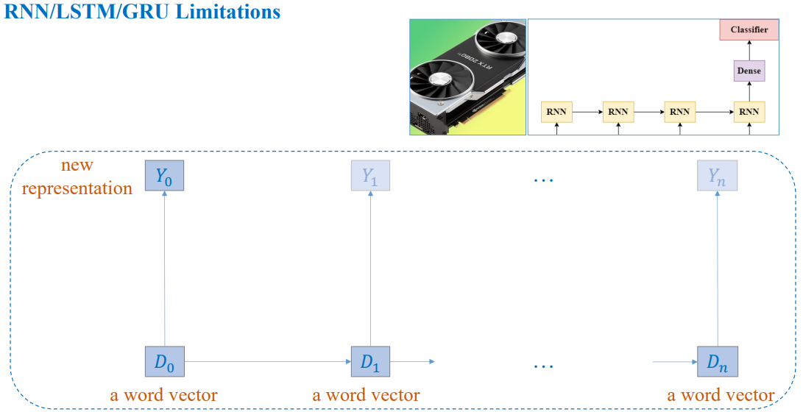
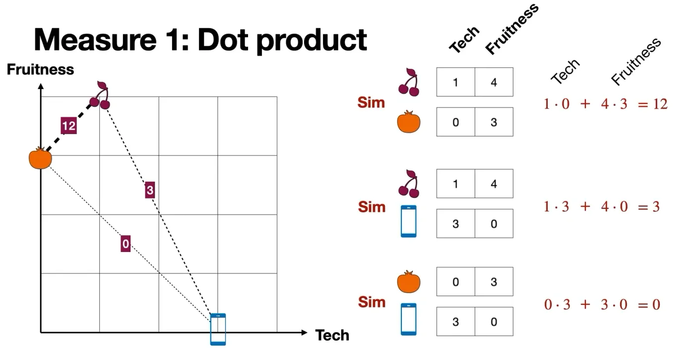
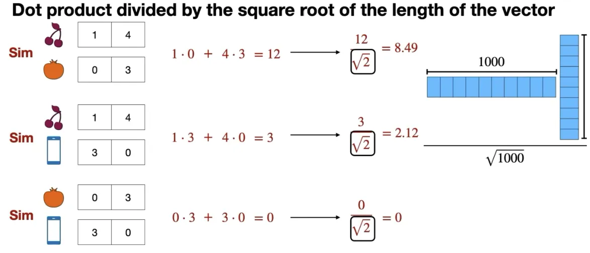
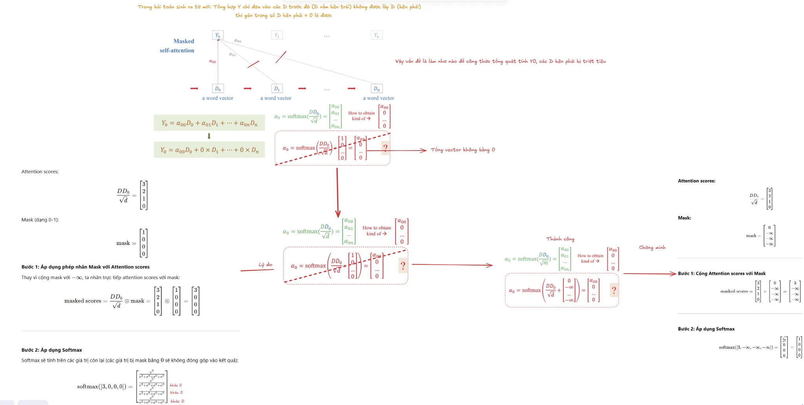

## 1. Motivation

{}
Hạn chế của RNN:

+ **Xử lý truần tự:** RNN phải xử lý từng bước trong chuỗi theo thứ tự, làm giảm hiệu suất và tăng thời gian huấn luyện đặc biệt với dữ liệu lớn.
+ **Khả năng nắm bắt các ngữ cảnh dài hạn:** RNN phải gặp khó khăn trong việc học các mối quan hệ xa trong chuỗi dài, dẫn đến làm mất thông tin quan trọng trong dữ liệu truân tự. ví dụ: từ thứ 300 có mối tương tác với từ thứ 100 do khoảng cách quá xa làm mất đi hầu hết thông tin giữa từ.
+ Ứng dụng hạn chế: Với tính chất tuần tự, RNN không tận dụng được sức mạnh xử lý song song của GPU, làm giảm khả năng mở rộng khi làm việc với các bài toán phức tạp như ngôn ngữ tự nhiên hoặc chuỗi thời gian.

Thách thức khi mở rộng ứng dụng:

+ Các mô hình RNN dù hiệu quả với văn bản, nhưng không xử lý tốt các dạng dữ liệu khác đặc biệt như ảnh, âm thanh, video.

{}

{}
+ Transformer theo cơ chế self-attention:
  + **Xử lý song song:** Thay vì xử lý tuần tự như RNN, Transformer sử dụng cơ chế self-attention để tính toán toàn bộ chuỗi dữ liệu đồng thời, giúp giảm thời gian huấn luyện đáng kể.
  + **Học mối quan hệ dài hạn:** Self-attention cho phép Transformer tập trung vào toàn bộ chuỗi dữ liệu, tính toán mối quan hệ trực tiếp giữa các phần của chuỗi mà không bị giới hạn bởi khoảng cách.
  + **Hiệu suất vượt trội:** Với khả năng xử lý song song và học ngữ cảnh toàn diện, Transformer đã trở thành tiêu chuẩn trong xử lý ngôn ngữ tự nhiên, giúp giải quyết hiệu quả các bài toán như dịch máy, tóm tắt văn bản, và trả lời câu hỏi.
  
+ Transformer không chỉ dừng lại ở văn bản mà còn được mở rộng để xử lý các dạng dữ liệu khác, như hình ảnh, âm thanh, và video, nhờ tính linh hoạt và khả năng học biểu diễn mạnh mẽ.

{}

## 2. Text classification

{}

{}

{}

Khác với bài trước specials có thêm kí tự `<s>` kí tự này được thêm vào đầu câu, kí tự `<s>` kí tự này được thêm vào cuối câu, đầu câu khi giả sử ta padding đầu câu thì để nhận biết khi nào nhận diện bắt đầu đến chuỗi.
{}

{}

{}

{}

> Nhắc lại, Bidirectipnal RNN là stack RNN với 2 layer RNN, một layer RNN forward, một layer RNN backward.
{}

{}

{}

{}

> `self.embedding` có output size là `N, C, L` với `N` là batch size, `C` là số lượng channel, `L` là chiều dài của chuỗi. nhưng đầu vào của Conv1D của torch lại là `N, L, C` nên cần phải chuyển vị input.

+ **Global Pooling**:

{}

## 3. RNN to Transformer

{}
1.  RNN gặp vấn đề **vanishing gradient**, khiến các từ đứng sau nhận được rất ít thông tin từ các từ phía trước. Với một câu dài 500 từ, nếu cần quyết định dựa vào từ thứ 100 và 500, thông tin từ từ thứ 100 sẽ bị triệt tiêu qua nhiều bước trung gian trước khi đến từ thứ 500.
2.  RNN **tính toán tuần tự** không tận dụng được sức mạnh xử lý song song của GPU, làm giảm hiệu suất khi xử lý dữ liệu lớn.
3.  RNN chỉ tính toán tuần tự từ trái sang phải, nhưng nếu ngữ cảnh yêu cầu tương tác từ phải sang trái thì không thể thực hiện, dẫn đến hạn chế trong việc nắm bắt đầy đủ ý nghĩa của chuỗi

{}

{}
Để khắc phục các nhược điểm của RNN như **vanishing gradient**, tính toán tuần tự kém hiệu quả và không tận dụng được thông tin hai chiều, mình thiết kế lại cách mỗi từ tổng hợp thông tin. Cụ thể, mỗi từ không còn phụ thuộc vào các bước trung gian, mà có thể tương tác trực tiếp với tất cả các từ khác trong chuỗi thông qua cơ chế trọng số **(attention weights)**. Phương pháp này giúp tối ưu hóa việc nắm bắt thông tin ngữ cảnh dài, tăng hiệu suất tính toán, và đảm bảo mỗi từ được xử lý đầy đủ với toàn bộ thông tin cần thiết từ chuỗi.

{}

## 4. The attention mechanism in high level

{}
Embedding là phần quan trọng trong LLM, nó là cầu nối giữa máy tính và con người.

Embedding là phần quan trọng nhất trong mô hình LLM vì:
+ Con người rất giỏi trong việc sử dụng từ ngữ, còn máy tính lại giỏi trong việc xử lý số liệu.
+ Để giao tiếp hiệu quả, cần một cầu nối giữa hai thế giới này, và embedding chính là cầu nối đó.

Chất lượng của embedding ảnh trực tiếp đến hiệu suất của mô hình: nếu mỗi từ hoặc đoạn văn bản được biểu diễn bằng các vector số tốt, bài toán sẽ trởi nên đơn giản hơn và sẽ hiệu quả hơn.

{}
trước khi đi xâu vào, chúng ta sẽ đi đến một ví dụ. Bạn đặt từ "Apple" ở mặt phẳng này? có nhiều nơi có thể xuất hiện, cho phép 3 khả năng được dán nhẵn là A, B, và C.

Nếu là mình mình sẽ chọn C bởi nhận thấy góc trái có một vài môn thể thao, góc dưới thì thấy căn nhà, góc phải thì thấy các căn nhà. Góc phải trên thì thấy một vài loại trái cây, nên mình sẽ đặ Apple vào vị trí C có tọa độ (5,5).

-> Kết luận là mình đặt apple gần với nhóm trái cây và đặt xa nhóm về phương tiện hay nhà ở.

Mình rút ra một số kinh nghiệm: 
+ Các số được gán giá trị từ (như tọa độ x, y) chính là word embedding theo các này từ apple sẽ được gán giá trị [5,5] 

{}

{}

Đặt ở đâu cũng đúng , Bởi vì 'Calf' và 'Cow' đều là bò nên ở A cũng đúng. Nếu xét về tuổi thì ở B cũng đúng vì 'Dog' và 'Cow' là hai động vật trưởng thành. Nhưng tại sao ở C đúng? Bởi vì, đặt tại **C** giúp bắt được các mối quan hệ quan trọng giữa các từ, được mô tả thông qua hình chữ nhật.

  1.  "A puppy is to a dog as a calf is to a cow" or "The path from the word puppy to the word dog is the same as the path from the word calf to the word cow" ---> Nếu xét từ trái sang phải: Quan hệ: **Trẻ → Trưởng thành** (sự phát triển theo độ tuổi).
  2.  A dog is to a cow as a puppy is to a calf ---> Nếu xét từ dưới lên Quan hệ: **Loài động vật trưởng thành → Loài động vật nhỏ hơn**. (Quan hệ về kích cỡ)

>[!NOTE]
> Vậy là embedding này hiểu được 2 thuộc tính chính (features): Tuổi(age) và Kích cỡ(size). Hơn thế nữa, là embedding này định nghĩa được trục tung là Age và trục hoành là Size
{}

{}

Một word embedding tốt không chỉ nắm bắt được các thuộc tính như tuổi và kích thước, mà còn nhiều đặc điểm khác của từ. Vì mỗi thuộc tính tương ứng với một chiều (axis) hoặc tọa độ mới, nên một embedding tốt cần có nhiều hơn hai tọa độ để biểu diễn mỗi từ. Ví dụ, một embedding của Cohere có đến 1024 tọa độ gán cho mỗi từ. Các hàng gồm 1024 (hoặc nhiều hơn) tọa độ này được gọi là vector, vì vậy chúng ta thường nói về vector tương ứng với một từ, và mỗi số bên trong vector được gọi là một tọa độ.

Một số tọa độ có thể biểu thị các thuộc tính quan trọng của từ, chẳng hạn như tuổi, giới tính, hoặc kích thước. Một số khác có thể biểu diễn sự kết hợp của nhiều thuộc tính, và thậm chí có những tọa độ phản ánh các đặc tính phức tạp mà con người khó có thể hiểu được. Tuy nhiên, nhìn chung, word embedding được xem là một cách hiệu quả để chuyển đổi ngôn ngữ con người (từ ngữ) thành ngôn ngữ máy tính (số liệu), từ đó tạo nền tảng để huấn luyện các mô hình machine learning với những con số này.

{}

{}

{}

{}
Khi bạn nói về bạn sẽ đặt nhóm nào, bạn sẽ không biết đặt ở đâu đành đặt nó ở giữa.

Attention sẽ giải quyết vấn đề dựa vào ngữ cảnh để giúp embedding giải quyết các bài mơ hồ (ambiguous)

{}

{}

Từ "Apple" có thể gây nhầm lẫn vì nó không rõ ràng đang nói về thương hiệu apple hay là quả táo vậy nên chúng ta cần ngữ cảnh. Chính các từ khác trong câu nói sẽ giúp hiểu được ý nghĩa của từ "Apple" đang đề cập đến.

Ví dụ cho 2 câu, câu hỏi đặt ra ở đây là chìa khóa (key) nào cho chúng ta biết rằng chúng ta đang nói về một loại cây (fruit) ở câu bên trái và thương hiệu ở câu bên phải.

> Đáp án là : Orange ở câu bên trái và phone ở câu bên phải

Biểu diễn dưới hình học như sau:

Vậy dựa vào 2 câu này : embedding từ 'apple' sẽ di chuyển:

-   Xét câu đầu tiên : 'apple' đỏ sẽ di chuyển đến gần 'orange' , hay có thể nói là thay đổi **tọa độ** 'apple' đỏ gốc để di chuyển đến gần tọa độ "orange". Theo đúng nghĩa đen là từ "Orange" đang kéo "apple" đỏ lại gần
-   Xét câu thứ hai : 'apple' đen sẽ di chuyển gần lại chữ phone.

Khi sử dụng vector mới làm embedding trong câu, mô hình sẽ dễ dàng xử lý hơn. Qua quá trình lặp lại nhiều lần, tọa độ của từ "apple" sẽ thay đổi để phản ánh đúng ngữ cảnh, ví dụ gần "orange" trong ngữ cảnh trái cây hoặc gần khu vực công nghệ khi liên quan đến công nghệ.

{}

{}

Đối với người , thì mình nhìn vào có thể biết "orange" ảnh hưởng đến "apple". Nhưng máy tính thì không.

Máy tính không hiểu nghĩa "Apple" là trái táo hay thương hiệu ngay lập tức. Nó phải xem xét tất cả các từ trong câu thông qua thuật toán để điều chỉnh nghĩa của từ "Apple" sao cho phù hợp.

  
  

{}

{}

Khi bạn giao tiếp, ý nghĩa không chỉ đến từ câu riêng lẻ mà còn từ toàn bộ ngữ cảnh xung quanh. Nếu ngữ cảnh hiện tại của bạn đang tập trung vào chủ để trái cây thì các từ liên quan như 'Banana', 'Strawberry', và 'Lemon' sẽ tạo nên một 'thiên hà trái cây' trong không gian ngữ nghĩa. Khi bạn bất ngờ nhắc đến từ 'Apple', từ này sẽ bị lực hấp dẫn của 'thiên hà trái cây' kéo lại gần, khiến vector tọa độ của nó dịch chuyển để nằm gần các từ trái cây khác.

Điều này phản ánh rằng, nếu bạn đã nói về một chủ đề cụ thể trong một thời gian dài, ngữ cảnh sẽ tạo nên một 'thiên hà ngữ nghĩa' mạnh mẽ, và bất kỳ từ nào bạn nói ra cũng sẽ bị kéo vào quỹ đạo của thiên hà đó. Đây chính là cách cơ chế Attention giúp mô hình theo dõi và duy trì ngữ cảnh, giống như việc các từ 'hút' lẫn nhau nhờ trọng lực.

 
  

{}
{}

{}
{}
Một embedding duy nhất chỉ cung cấp một góc nhìn cố định về từ không gian ngữ nghĩa. Điều này có thể ổn trong một số trường hợp, nhưng không thể xử lí được các tình huống phức tạp hoặc khi một từ mang nhiều ý nghĩa tùy thuộc vào ngữ cảnh.

Ví dụ:

  + Embedding đầu tiên được đánh giá là tốt nhất vì nó phân tách rõ ràng các điểm dữ liệu trong không gian ngữ nghĩa.

  + Embedding này không xử lý tốt sự mơ hồ.Các vector không được phân tách rõ ràng, dẫn đến tình trạng "Apple" trong cả hai ngữ cảnh (trái cây và công nghệ) vẫn nằm quá gần nhau.

  + Embedding này chỉ ở mức chấp nhận được. Mặc dù có tách biệt phần nào "Apple" trong hai ngữ cảnh, nhưng sự phân tách chưa đủ rõ ràng, khiến Attention không thể đạt hiệu quả tối ưu.

  

{}

{}

**Tốn nhiều tài nguyên và công sức**: Việc xây dựng embedding chất lượng cao là một quá trình phức tạp và đòi hỏi nguồn lực lớn (dữ liệu, mô hình huấn luyện, thời gian).

>Tiết kiệm bằng cách Tạo embedding mới dựa trên embedding có sẵn

**Khác biệt về kích thước embedding**: Các embedding được xây dựng có thể có các kích thước vector khác nhau (số chiều khác nhau). Ví dụ, một embedding có thể là vector 300 chiều, trong khi một embedding khác có thể là vector 512 chiều.

Sử dụng Linear Transformations để biến đổi để có thể combination

{}

{}

## 5. The math behind Attention: Keys, Queries, and Values matrices

{}
{}

{}

{}

{}

{}
**Cosine similarity** giống như một phiên bản được chuẩn hóa của Dot product, với giá trị tối đa là 1 (khi hai vector hoàn toàn đồng hướng) và tối thiểu là -1 (khi hai vector hoàn toàn ngược hướng). **Cosine similarity** chỉ phụ thuộc vào góc giữa hai vector, không bị ảnh hưởng bởi độ dài của chúng.

{}

{}
+ vector nhiều chiều -> dot product lớn -> cần normalize

{}
{}

{}
Cơ chế attention giúp xác định từ nào quan trọng trong câu và các từ có mối quan hệ mạnh mẽ sẽ thu hút nhau lại gần nhau hơn trong không gian vector. Lần này, chúng ta không chỉ nói về việc các **ảnh hưởng** lẫn nhau, mà sâu hơn để hiểu **chúng gần như thế nào**.

Đầu tiên ta cho trước embeddign từng từ và tính cosine giữa chúng:

Sử dụng Softmax để chuẩn hóa (vào mục **Why use softmax to normalization** để xem chi tiết hơn)

  
  

**Cập nhật tọa độ mới dựa trên ngữ cảnh:**

  + Trong câu "**an apple and an orange**", từ **Apple** được cập nhật bằng cách kết hợp trọng số với vector của Orange:

  $$
  \\text{Apple}\_\\text{mới} = 0.43 \\cdot \\text{Orange} + 0.57 \\cdot \\text{Apple}\_\\text{gốc}
  $$

  Tọa độ mới của Apple là (1.14, 2.43), thể hiện rằng trong ngữ cảnh này, Apple gần hơn với Orange.

  + Trong câu "an apple phone", từ Apple được cập nhật bằng cách kết hợp trọng số với vector của Phone:
  
  $$
  \\text{Apple}\_{\\text{mới}} = 0.43 \\cdot \\text{Phone} + 0.57 \\cdot \\text{Apple}\_{\\text{gốc}}
  $$

  Tọa độ mới của Apple là (2.86, 1.14), cho thấy trong ngữ cảnh này, Apple gần hơn với Phone.

Ta có thể hiểu rằng cosine giữa các vector chính là trọng số (weight), dùng để xác định mức độ từ này đóng góp bao nhiêu phần trăm vào việc tạo ra tọa độ mới.

{}

{}

Gỉa sử chúng ta có bảng **Q,K,V** như sau :

Hiện tại thì những con số khi combination còn khá nhỏ bởi vì mình xài cosine và số chiều còn ít, điều gì xảy ra khi mình nâng số chiều lên (thực tế thường embedding dim = 512). Con số sẽ rất lớn. => **Cần normalize tiếp**

Mình sẽ chọn cách normalize về phân phối xác suất :

Sử dụng công thức:
$$
\\text{Normalized coefficients} = \\frac{\\text{Hệ số từng phần}}{\\text{Tổng các hệ số}}
$$

> Nhưng có nhược điểm là có khả năng mẫu chia cho 0

Sử dụng softmax để khắc phục chia cho 0:

=> Khắc phục được tránh chia cho 0.

**Các từ ít quan trọng vẫn được xem xét**:

- Trong ví dụ:
    -   Từ **Orange** và **Apple** có trọng số cao hơn (do cosine similarity lớn hơn).
    -   Từ **And** và **An** có trọng số nhỏ hơn (cosine similarity bằng 0), nhưng chúng vẫn đóng góp một phần nhỏ vào tổng.
- Mặc dù những từ như And và An không quan trọng (coefficient nhỏ), Softmax vẫn tính tất cả để duy trì phân phối xác suất.

{}

{}

{}
Không phải lúc nào mình cx tìm được embeddim tốt, việc tạo ra embeddim mới mà tốt thì cần nhiều thời gian . Ở ví dụ dưới bạn có thể thấy khi thực hiện attention dựa vào các embeddim gốc lúc thì tốt , lúc thì xấu.

Vậy làm sao mình có thể tạo ra những embeddim tốt nhưng không tốn quá nhiều chi phí

-> Ma trận $K,Q$ sẽ giúp mình tìm được embeddim tốt bằng Linear Transformation

{}

{}
Trong hình, không gian vector bên trái (hình vuông) là embeddings ban đầu. Sau khi áp dụng ma trận $Q ,K$, embeddings được chuyển sang không gian bên phải (hình bình hành), giúp cải thiện Attention.

{}
{}

{}
Trong mô hình Transformer, mỗi thành phần trong cơ chế Attention được thiết kế để đảm nhiệm các nhiệm vụ cụ thể:

+ **Keys (K**) và **Queries (Q)** được sử dụng để tính toán sự tương đồng (similarity) giữa các từ trong câu, giúp mô hình xác định từ nào cần tập trung dựa trên ngữ cảnh.

+ Tuy nhiên, không gian embedding được tối ưu hóa cho việc tính toán sự tương đồng không phải là không gian mà chúng ta muốn thực sự "di chuyển" các từ.

+ Đây là lúc Values Matrix (V) tham gia. V đảm bảo rằng chúng ta có một không gian embedding khác, được thiết kế để hỗ trợ việc dự đoán từ tiếp theo -- một nhiệm vụ cốt lõi của Transformer.

Sau khi tính toán sự tương đồng giữa Queries và Keys, Values Matrix sử dụng những kết quả này để "di chuyển" các từ trong embedding bên phải.

{}

Không gian bên trái (Keys và Queries):

-   Hiểu ý nghĩa của từ "buy" và các từ liên quan (ví dụ: "car," "apple," "phone"), dựa trên đặc điểm ngữ nghĩa như:
    -   **Color** (Màu sắc): Táo có màu đỏ hoặc xanh.
    -   **Size** (Kích thước): Xe hơi lớn, điện thoại nhỏ.
    -   **Technology**: Điện thoại liên quan đến công nghệ.
    -   **Fruitness**: Táo là một loại trái cây.
-   **Mục tiêu**: Tìm sự tương đồng giữa các từ trong câu dựa trên đặc điểm của chúng.

Không gian bên phải (Values):

-   Sử dụng thông tin từ sự tương đồng tính toán được để:
    -   Xác định các từ phù hợp trong **ngữ cảnh cụ thể** (dự đoán từ tiếp theo).
    -   Ví dụ: Trong câu "I want to buy a \_\_\_", các từ "car," "apple," và "phone" nằm gần nhau trong không gian này, vì chúng có khả năng xuất hiện tiếp theo trong câu.
-   **Mục tiêu**: Tối ưu hóa việc dự đoán từ tiếp theo dựa trên ngữ cảnh.

{}
-   **Câu 1:**

    *"Please buy an apple and an orange."*

    -   Trong ngữ cảnh này, từ **"apple"** và **"orange"** đều là các loại trái cây, có liên quan đến hành động **"buy"** (mua).
    -   **Keys** và **Queries** giúp mô hình xác định rằng **"apple"** và **"orange"** có sự tương đồng cao dựa trên ngữ nghĩa (đều là trái cây) và mối quan hệ với động từ **"buy"**.
    -   Sau khi qua **Value Matrix**, embedding dịch chuyển **"apple"** và **"orange"** lại gần nhau hơn trong không gian embedding bên phải vì chúng phù hợp với ngữ cảnh của câu và có khả năng xuất hiện cùng nhau.
-   **Câu 2:**

    *"Apple unveiled the new phone."*

    -   Trong ngữ cảnh này, từ **"apple"** không mang nghĩa trái cây, mà chỉ một công ty công nghệ. Nó liên quan đến động từ **"unveiled"** (giới thiệu) và từ **"phone"** (sản phẩm công nghệ).
    -   **Keys** và **Queries** giúp mô hình nhận ra rằng **"apple"** và **"phone"** có sự tương đồng cao trong ngữ cảnh công nghệ.
    -   Sau khi qua **Value Matrix**, embedding của **"apple"** và **"phone"** được dịch chuyển gần nhau hơn trong không gian embedding bên phải, vì chúng liên quan trong ngữ cảnh giới thiệu sản phẩm công nghệ.

{}
{}

{}

{}

{}
Bước 1 : $Q.K^T$ : giúp mô hình đo lường **độ tương đồng** giữa Query và các Key.

Để tránh giá trị Dot Product trở nên quá lớn khi kích thước vector lớn, chúng ta chia nó cho $\\sqrt{d^k}$

Bước 2 : Softmax: nơi xác định cụ thể cách "di chuyển" các từ.(Vào mục Why use softmax to normalization để biết rõ hơn)

Bước 3: Nhân với ma trận Value:

Ma trận V đóng vai trò như một phép biến đổi tuyến tính ( linear transformation) để chuyển đổi không gian embedding bên trái thành không gian embedding bên phải. Trong không gian embedding bên phải, chúng ta thực hiện việc "di chuyển" các từ, bởi vì không gian này đã được tối ưu hóa cho chức năng chính của Transformer, đó là tìm từ tiếp theo trong một câu.

{}

{}
Mục đích bước Linear rất quan trọng bởi vì :

- Giảm chiều embedding từ không gian cao chiều thành không gian thấp hơn, giúp việc tính toán dễ quản lý hơn.
-   Ma trận **Linear** không chỉ giảm chiều mà còn học cách **phân loại embedding tốt/xấu**:
    -   **Embedding tốt** sẽ được phóng đại (scaled up) để có ảnh hưởng lớn hơn.
    -   **Embedding kém** sẽ được giảm trọng số (scaled down) để giảm tác động.
-   **Tích hợp thông tin từ nhiều đầu:**
    -   Sau khi tính toán Attention từ nhiều đầu (heads), các kết quả được **ghép nối (Concat)** và chuyển qua một bước Linear cuối cùng.
    -   Mục tiêu: Kết hợp thông tin từ tất cả các đầu Attention để tạo ra embedding tốt nhất, phù hợp với mục đích dự đoán tiếp theo.

{}

{}

## 6. Example

{}

{}

{}

{}

## 7. Transformer Insight
{}
Trong bài toán sinh từ mới **(causal language modeling)**, yêu cầu cốt lõi là mô hình chỉ được sử dụng thông tin của các từ bên trái hoặc chính nó để dự đoán từ hiện tại. Các từ bên phải không được phép sử dụng, vì chúng thuộc về "tương lai" và việc sử dụng chúng sẽ phá vỡ tính nhân quả của bài toán.

{}
1. Chỉ nhìn vào bên trái:

-   Khi dự đoán từ $Y\_0$ , mô hình chỉ được phép sử dụng thông tin từ các từ trước đó $(D\_0)$ hoặc chính nó, mà không được nhìn thấy các từ bên phải ($D\_1, D\_2, \\dots, D\_n$ ).
-   Điều này đảm bảo rằng mô hình học theo cách "tuần tự", giống như cách con người xử lý ngôn ngữ.

2. Loại bỏ ảnh hưởng của từ bên phải:

-   Trong quá trình tính toán $Y\_0$ , cần đảm bảo rằng ảnh hưởng của các từ bên phải bị triệt tiêu hoàn toàn.
-   Điều này có nghĩa là trọng số attention của các từ bên phải, ví dụ như $\\alpha\_{01}, \\alpha\_{02}, \\dots,$ phải bằng **0** sau khi áp dụng softmax.


  Chú ý chổ nào mình không muốn hiện mình sẽ để bằng -∞ bởi vì nếu để 0 thì softmax là hàm e mũ nên nó vẫn còn trọng số.



{}

{}
-   Bài toán sinh từ yêu cầu tính toán tuần tự. Tại mỗi bước, mô hình chỉ được dựa vào thông tin đã biết.
-   Nếu mô hình sử dụng thông tin từ tương lai (các từ bên phải), điều này sẽ giống như "gian lận", phá vỡ mục tiêu học tập thực sự.

{}

{}