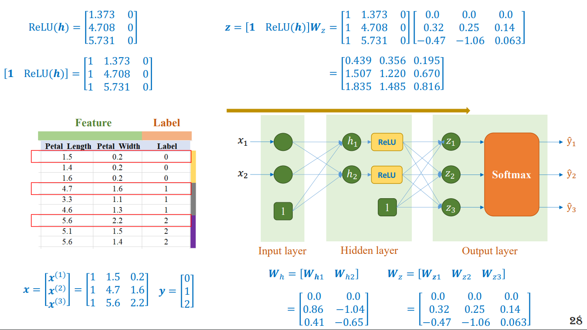
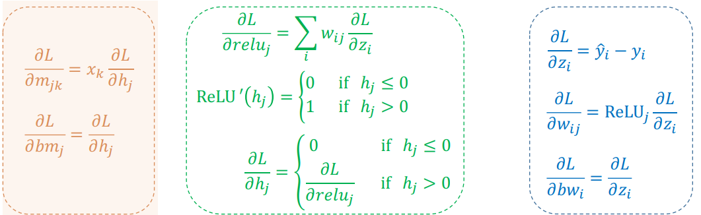
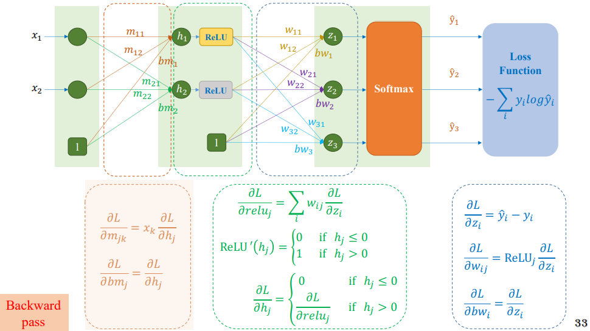

Tiếp tục từ bài trước chúng ta sẽ tiếp tục tìm hiểu sâu hơn về Multi-layer Perceptron.

## 1. Activation function

    Một vài activation function.

### 1.1. Sigmoid function

Sigmoid saturate and kill gradients: Một nhược điểm dễ nhận thấy là khi đầu vào có trị tuyệt đối lớn (rất âm hoặc rất dương), gradient của hàm số này sẽ rất gần với 0. Điều này đồng nghĩa với việc các hệ số tương ứng đang xét sẽ gần như không được cập nhật.

### 1.2. Tanh function

Cũng có nhược điểm tương tự như Sigmoid.

### 1.3. Softplus function

### 1.4. Relu function

Nếu như output của một node nào đó bằng 0 thì các tham số của mạng có liên quan đến node đó sẽ không được cập nhật.

### 1.5. LeakyReLU function

### 1.6. ELU function

### 1.6. PReLU function

### 1.7. Swish function

### 1.8. Sumarry activation function

## 2.MLP Example

## 3. Backpropagation

Phương pháp phổ biến nhất để tối ưu MLP vẫn là Gradient Descent (GD). Để áp dụng GD, chúng ta cần tính được gradient của hàm mất mát theo từng ma trận trọng số $\mathbf{W}^{(l)}$ và vector bias $\mathbf{b}^{(l)}$ 

$$
\mathbf{a}^{(0)} = \mathbf{x}
$$

$$
z_{i}^{(l)} = \mathbf{w}_i^{(l)T}\mathbf{a}^{(l-1)} + b_i^{(l)}
$$

$$
\mathbf{z}^{(l)}  = \mathbf{W}^{(l)T}\mathbf{a}^{(l-1)} + \mathbf{b}^{(l)},~~ l =  1, 2, \dots, L
$$

$$
\mathbf{a}^{(l)} = f(\mathbf{z}^{(l)}), ~~ l =  1, 2, \dots, L
$$

$$
\mathbf{\hat{y}} = \mathbf{a}^{(L)}
$$

Bước này được gói là `feedforward` vì cách tính toán được thực hiện từ đầu đến cuối của network. MLP cũng được gọi

Giả sử $J(\mathbf{W, b, X, Y})$ là một hàm mất mát của bài toán, trong đó $W$, $b$ là tập hợp ma trận giữa các layers và biases của mỗi layers. $\mathbf{X, Y}$ là cặp dữ liệu huấn luyện với mỗi cột là một tương ứng với một điểm dữ liệu. Để có thể áp dụng các gradient-based methods (mà Gradient Descent là một ví dụ), chúng ta cần tính được:

$$ \frac{\partial J}{\partial \mathbf{W}^{(l)}} ; \frac{\partial J}{\partial \mathbf{b}^{(l)}},~~ l = 1, 2, \dots, L$$

Trong MLP, việc tính toán trực tiếp giá trị này là cực kỳ phức tạp vì hàm mất mát không phụ thuộc trực tiếp vào các hệ số. Phương pháp phổ biến nhất được dùng có tên là Backpropagation giúp tính gradient ngược từ layer cuối cùng đến layer đầu tiên. Layer cuối cùng được tính toán trước vì nó gần gũi hơn với predicted outputs và hàm mất mát. Việc tính toán gradient của các layer trước được thực hiện dựa trên một quy tắc quen thuộc có tên là `chain rule`, tức đạo hàm của hàm hợp.

Đạo hàm của hàm mất mát theo chỉ một thành phần của ma trận trọng số của lớp cuối cùng:

$$
\frac{\partial J}{\partial w_{ij}^{(L)}} = \frac{\partial J}{\partial z_j^{(L)}} \cdot \frac{\partial z_j^{(L)}}{\partial w_{ij}^{(L)}}
$$

$$
= e_j^{(L)} a_i^{(L-1)}
$$

Trong đó $e_j^{(L)} = \frac{\partial J}{\partial z_j^{(L)}}$ thường là một đại lượng dễ tính toán và $\frac{\partial z_j^{(L)}}{\partial w_{ij}^{(L)}}  = a_i^{(L-1)}$ vì $z_j^{(L)} = \mathbf{w}_j^{(L)T}\mathbf{a}^{(L-1)} + b_j^{(L)}$ 

Tương tự như thế, đạo hàm của hàm mất mát theo bias của layer cuối cùng là:

$$\frac{\partial J}{\partial b_{j}^{(L)}} = \frac{\partial J}{\partial z_j^{(L)}}. \frac{\partial z_j^{(L)}}{\partial b_{j}^{(L)}} = e_j^{(L)}$$

Với đạo hàm theo hệ số ở các lớp $l$ thấp hơn, chúng ta hay xem hình dưới đây. Ở đây, tại mỗi lớp linear, tôi đã viết riêng đầu vào $z$ và đầu ra $a$ để các bạn tiện theo dõi.

Dựa vào hính trên, ta có thể tính được:

$$
\begin{aligned}
\frac{\partial J}{\partial w_{ij}^{(l)}} &= \frac{\partial J}{\partial z_j^{(l)}} \cdot \frac{\partial z_j^{(l)}}{\partial w_{ij}^{(l)}} = e_j^{(l)} a_i^{(l-1)}
\end{aligned}
$$

với:

$$\frac{\partial J}{\partial b_j^{(l)}} = e_j^{(l)}$$

Công thức với Activation là ReLU:

#### Example Dying ReLU

Forward pass:


  Giá trị của node bằng 0 thì các tham số của node đó sẽ không được cập nhật.


Backward pass:

Forward again:

## 4. Initialization Examples

Bây giờ chúng ta sẽ qua ví dụ nếu như các tham số của mô hình đều được khởi tạo bằng 0 thì kết quả sẽ như thế nào.

### 4.1. Linear Regression

  
  

### 4.2. Logistics Regression

  
  

### 4.3. Softmax Regression

  
  

  
  

  
  

### 4.4. MLP

Khi khởi tạo các tham số bằng 0 thì MLP không thể nào cập nhật được các trọng số.

## 5. Optimizers

Sẽ được nói kĩ hơn vào các bài tiếp theo.

## 6. Summary

### 6.1. Recommendation

Một mô hình lí tưởng có thể sử dụng được MLP hoặc các mạng Neural Network khác khi cài đặt.

### 6.2. Pipeline training model

