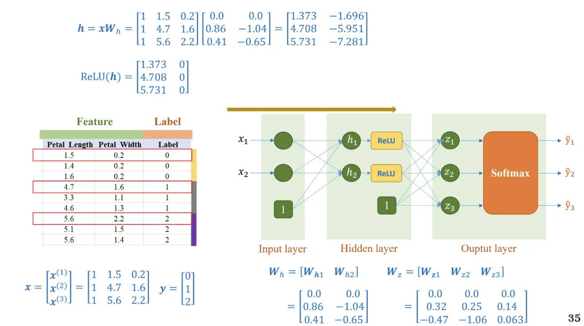

## 1. Motivation

  Trước giờ chúng ta chỉ practice với dữ liệu tabular, vậy chuyện gì sẽ xảy ra nếu sử dụng những model cổ điển chúng ta học trước đây (Linear Regresssion, Logistics Regression, Softmax Regression,…) vào xử lý cho dữ liệu dạng Image? .


Sử dụng được, nhưng accuracy sẽ rất thấp

Bởi vì :

- Dữ liệu bảng các cột sẽ cô đọng thông tin hơn , dễ hiểu thì bạn xài 1 feature trong dataset thì vẫn cho kết quả khá cao (Với trường hợp cột đó đã qua xử lý nha, và tùy từng correlation feature với biến target mà cho mỗi accuracy khác nhau)

Ví dụ minh họa:

**a. Dữ liệu tabular (bảng):**
<p align="center">
    
</p>

  - Giả sử bạn chỉ sử dụng **1 feature** là `sepal_length` để phân loại hoa.
  - Các giá trị trong feature này đủ để chia hoa vào các loại (ví dụ: đường màu đỏ trên boxplot chia hai loại Setosa và Versicolor).
  - **Kết quả:** Nếu dựa vào đường phân chia này, mô hình dự đoán với độ chính xác 100%.

**b. Dữ liệu hình ảnh (image):**
<p align="center">
    
</p>

- Đối với dữ liệu ảnh 2D (kích thước 28×28), các mô hình thường được thiết kế để xử lý dữ liệu 1D.
- Do đó, ta cần "flatten" ảnh từ ma trận 28×28 thành vector 1D dài 784 (mỗi pixel là một feature).
- **Tình huống đơn giản hóa:** Nếu chỉ sử dụng 1 pixel làm feature duy nhất để dự đoán, mô hình sẽ không đạt kết quả tốt, vì 1 pixel không đủ thông tin.

- **Với dữ liệu phức tạp hơn:**
    - Ví dụ: Fashion-MNIST, mỗi ảnh quần áo có 784 pixel.
    - Việc chỉ sử dụng 4-5 pixel để phân biệt áo và quần không khả thi, vì thông tin quá ít.
    - Mô hình cần **kết hợp nhiều pixel** để nắm được mối quan hệ và đặc trưng tổng thể.
  
- **Cần thiết kế mô hình thông minh hơn:**
    - Với dữ liệu tabular (bảng), việc sử dụng **softmax** cho các feature đơn giản đã giúp mô hình đạt độ chính xác cao.
    - Tuy nhiên, với dữ liệu ảnh, thông tin được phân bố trên rất nhiều pixel.
        - Ví dụ: Để phân biệt 2 tấm ảnh áo và quần, nếu chỉ dùng 4-5 pixel thì mô hình không thể dự đoán chính xác được.
        - Mô hình cần học cách kết hợp hàng trăm pixel để trích xuất đặc trưng chính, sau đó đưa ra dự đoán chính xác (đây là cơ sở của **MLP**).

## 2. Image Data

### 2.1. Cấu trúc ảnh xám và ảnh màu

**Grayscale images:**


**Color images:**


### 2.2. Important Packages

a. Thư viện cổ điển:

Download 1 file từ cloud về : 


Đọc ảnh: 


Hiển thị 1 ảnh:


Kết quả :


b. Thư viện PyTorch

**`transforms.Compose`** và **`transforms.ToTensor()`**:

- `transforms.Compose` cho phép kết hợp nhiều phép biến đổi (transform) lại với nhau. Trong ví dụ này, `transforms.ToTensor()` được dùng để chuyển đổi ảnh từ định dạng PIL sang tensor để có thể xử lý trong PyTorch.

**`FashionMNIST`**:

- Hàm này được sử dụng để tải bộ dữ liệu Fashion MNIST từ `torchvision.datasets`. Bộ dữ liệu bao gồm các ảnh và nhãn tương ứng cho bài toán phân loại.

**`DataLoader`**:

- Hàm `DataLoader` từ `torch.utils.data` dùng để tạo một bộ nạp dữ liệu (data loader) giúp chia dữ liệu thành các batch, đồng thời hỗ trợ việc xáo trộn dữ liệu và tải song song để tăng tốc độ huấn luyện.

### 2.3. Giới thiệu về tập MNIST dataset


Dữ liệu mnist được tạo ra từ những năm đầu tiên thế kỉ 20. Vì mạng thời đó còn nhiều sai sót khi truyền tin nên người ta sử dụng 16 bytes đầu tiên để luưu thông tin nhằm khi dữ liệu truyền đến nơi sẽ được kiểm tra 16 bytes đó đểm xem dữ liệu có bị mất mát hay không.

*a. Sử dụng thư viện cổ điển*
```python {filename="Tải và lưu tập dữ liệu mnist"}
from urllib import request

filenames = ["train-images-idx3-ubyte.gz",
             "train-labels-idx1-ubyte.gz",
             "t10k-images-idx3-ubyte.gz",
             "t10k-labels-idx1-ubyte.gz"]

folder = 'data_fashion_mnist/'
base_url = "http://fashion-mnist.s3-website.eu-central-1.amazonaws.com/"
for name in filenames:
    print("Downloading " + name + "...")

    # lưu vào folder data_fashion_mnist
    request.urlretrieve(base_url + name, folder + name)
```
<p align="center">
    
</p>


```python {filename="Đọc file mnist"}
import numpy as np
import gzip

# load training images
with gzip.open('train-images-idx3-ubyte.gz', 'rb') as f:
    X_train = np.frombuffer(f.read(), np.uint8, offset=16).reshape(-1, 28*28)

# load testing images
with gzip.open('t10k-images-idx3-ubyte.gz', 'rb') as f:
    X_test = np.frombuffer(f.read(), np.uint8, offset=16).reshape(-1, 28*28)

# load training labels
with gzip.open('train-labels-idx1-ubyte.gz', 'rb') as f:
    y_train = np.frombuffer(f.read(), np.uint8, offset=8)
    
# load testing labels
with gzip.open('t10k-labels-idx1-ubyte.gz', 'rb') as f:
    y_test = np.frombuffer(f.read(), np.uint8, offset=8)
    

# check data
print(X_train.shape)
print(y_train.shape)
print(X_test.shape)
print(y_test.shape)
```
Output:

```python
(60000, 784)
(60000,)
(10000, 784)
(10000,)
```


offset=16 bởi vì bỏ qua phần để kiểm tra dữ liệu có bị mất qua khi đi qua đường truyền.


*b. Sử dụng pytorch*

```python
from torchvision.datasets import FashionMNIST
from torch.utils.data import DataLoader
from torchvision import transforms

transform = transforms.Compose([transforms.ToTensor()])
trainset = FashionMNIST(root='data', 
                        train=True, 
                        download=True, 
                        transform=transform)

trainloader = DataLoader(trainset, 
                         batch_size=3500, 
                         num_workers=2, 
                         shuffle=True)
print(len(trainloader)) # 59
```

`Data Loader` chia dữ liệu thành các batch để đưa vào GPU

<p align="center">
    
</p>

```python
# batch_size=3500
for i, (inputs, labels) in enumerate(trainloader, 0):
    print(f'Batch index {i} -- {inputs.shape} -- {labels.shape}')
```

Output:

```python
Batch index 6 -- torch.Size([3500, 1, 28, 28]) -- torch.Size([3500])
Batch index 7 -- torch.Size([3500, 1, 28, 28]) -- torch.Size([3500])
Batch index 8 -- torch.Size([3500, 1, 28, 28]) -- torch.Size([3500])
Batch index 9 -- torch.Size([3500, 1, 28, 28]) -- torch.Size([3500])
Batch index 10 -- torch.Size([3500, 1, 28, 28]) -- torch.Size([3500])
Batch index 11 -- torch.Size([3500, 1, 28, 28]) -- torch.Size([3500])
Batch index 12 -- torch.Size([3500, 1, 28, 28]) -- torch.Size([3500])
Batch index 13 -- torch.Size([3500, 1, 28, 28]) -- torch.Size([3500])
Batch index 14 -- torch.Size([3500, 1, 28, 28]) -- torch.Size([3500])
Batch index 15 -- torch.Size([3500, 1, 28, 28]) -- torch.Size([3500])
Batch index 16 -- torch.Size([3500, 1, 28, 28]) -- torch.Size([3500])
Batch index 17 -- torch.Size([3500, 1, 28, 28]) -- torch.Size([3500])
Batch index 18 -- torch.Size([3500, 1, 28, 28]) -- torch.Size([3500])
Batch index 19 -- torch.Size([3500, 1, 28, 28]) -- torch.Size([3500])
Batch index 20 -- torch.Size([3500, 1, 28, 28]) -- torch.Size([3500])
Batch index 21 -- torch.Size([3500, 1, 28, 28]) -- torch.Size([3500])
Batch index 22 -- torch.Size([3500, 1, 28, 28]) -- torch.Size([3500])
Batch index 23 -- torch.Size([500, 1, 28, 28]) -- torch.Size([500])
```
## 3. Softmax Regression for Image Data

Để hiểu rõ Multilayer Perceptron khắc phục được điểm yếu gì từ model đời trước, chúng ta sẽ sử dụng Softmax thuần túy trước đây để visualize lên cho mn thấy rõ

### 3.1. Ôn lại Softmax Regression


### 3.2. Where to put Flatten

Chúng ta phải flatten về 1D , bởi vì các hàm Linear hay Softmax chỉ xử lý được dữ liệu 1D thôi.


```python {filename="Flatten"}
import torch.nn as nn
model = nn.Sequential(
    nn.Flatten(), 
    nn.Linear(784, 10)
)

#Generating a random tensor
input_tensor =  torch.rand(5, 28, 28)

#Feeding the tensor into the model
output = model(input_tensor)
print(output.shape)
```

### 3.3. Training without normalization

Bởi vì chưa normalization input nên cách khắc phục là Giảm Lr (Bởi vì các feature input đang lớn —> Gradient cx lớn theo , nhân cho Lr càng nhỏ để giảm nó xuống)


Trường hợp lr = 0.01:

Trường hợp lr = 0.00001:


### 3.4. Training with normalization

Normalize rồi thì kh cần giảm Lr nữa (bởi vì normalize thì feature x nhỏ lại rồi —> Gradient cx nhỏ theo)

—> Giữa Lr và Gradient thì chọn 1 trong 2 mà giảm thôi

#### 3.4.1. Normalize using pytorch

Điểm đặc biệt là ở Pytorch , bước đầu tiên mình kh cần chuẩn hóa về $[0;1]$ như công thức bên trái (Image ~ 255 / 255) bởi vì pytorch tự động chuyển về 


Các hàm normalize : `transforms.ToTensor()` chuyển thành tensor và tự động normalize về [0, 1] và `transforms.Normalize((mean,), (std,))`

**a. Normalize khoảng [0 - 1]:**

```python
import torchvision.transforms as transforms

transform = transforms.Compose([transforms.ToTensor()])

trainset = torchvision.datasets.FashionMNIST(root='data', train=True, download=True, transform=transform)
```


**b. Normalize khoảng [-1 - 1]:**

```python
import torchvision.transforms as transforms

transform = transforms.Compose([transforms.ToTensor(), transforms.Normalize((0.5,), (0.5,))])

trainset = torchvision.datasets.FashionMNIST(root='data', train=True, download=True, transform=transform)
```


**c. Normalize dựa vào mean và std (đưa về khoảng z-score)**

```python
import torchvision.transforms as transforms

transform = transforms.Compose([transforms.ToTensor(), transforms.Normalize((mean,), (std,))])

trainset = torchvision.datasets.FashionMNIST(root='data', train=True, download=True, transform=transform)
```


## 4. MLP for Image Data

John Von Neumann's quote “with four parameters I can fit an elephant, with five I can make him wiggle his trunk”

Hiểu nôm na thì càng nhiều tham số đẩy vào để xử lý thì model càng trích xuất-học quan hệ giữa các feature càng tốt —> model xử lý càng tốt Và đây là Lý do thứ 2 trong 2 lý do mình nêu ở motivation.

Vậy câu hỏi đặt ra : Làm như nào để thêm? Thêm vào đâu? 

1. Thêm vào ở input ? : Kh được , vì đó là dữ liệu cứng của đề bài cung cấp kh thể thay thế được
2. Thêm vào ở output ? : nếu tăng trọng số ở output  thì đồng nghĩa tăng số lượng đầu ra —> cx thay đổi đề bài rồi (ví dụ đề bài bắt phân loại 9 label mà chế thêm 10 label đâu có được ….)
3. Thêm 2 đầu không được thì thêm ở giữa và thêm 1 layer ở giữa in/out put thì gọi là **hidden layer**
   


## 5. Multi-layer Perceptron

### 5.1. Ví dụ sử dụng Pytorch


### 5.2. Áp dụng vào dữ liệu tabular





### 5.3. Áp dụng vàoo dữ liệu ảnh

Đến với mục đích chính , sử dụng MLP + Softmax để trainning , so sánh với Softmax thông thường xem như nào. 

Nhắc lại các bạn nhớ , Dữ liệu ảnh phức tạp hơn dữ liệu bảng , Cần tăng tham số lên để model học và tự trích xuất thông tin (kiểu thêm nhiều tham số cho model tự trích xuất-học các quan hệ giữa các feature-pixel để cô đọng lại hàng trăm pixel còn ít pixel (hay dễ hiểu là số lượng cần cô đọng lại là ouputs của bài toán) )


Chứng minh được là càng thêm hidden layer thì càng tốt


## 6. Summary

### 6.1. Data Preparation 

<div style="display: flex">
    
    
</div>

### 6.2. Data Normalization

<div style="display: flex">
    
    
</div>

### 6.3. Training pipeline (MLP Model)

<div style="display: flex">
    
    
</div>

## 7. Câu hỏi ôn tập

{}

Phạm vi giá trị của mỗi pixel trong ảnh xám là từ 0 đến 255.

{}

{}

Mỗi pixel trong ảnh màu bao gồm ba giá trị: đỏ, xanh lá, và xanh dương (RGB).

{}

{}

Thư viện `urllib.request`.

{}

{}

Lệnh `plt.imshow(img)`

{}

{}

Hàm `transforms.ToTensor()` dùng để chuyển đổi ảnh từ định dạng PIL sang tensor để xử lý trong PyTorch.

{}

{}

`DataLoader` giúp chia dữ liệu thành các batch và hỗ trợ việc xáo trộn dữ liệu, tải song song để tăng tốc độ huấn luyện.

{}

{}

Bởi vì 8 byte đầu lưu những thông tin cơ bản có thể lược bỏ, không cần thiết cho quá trình training như:

- **Magic number**: Định dạng file (để xác định loại file: label hay image).
- **Số lượng items**: Số lượng hình ảnh hoặc nhãn.
- **Kích thước hình ảnh**: Số hàng và cột (chỉ có trong file ảnh).

{}

{}

Giúp tối ưu hóa hiệu suất tính toán, giảm nhiễu trong gradient descent, và phù hợp với giới hạn bộ nhớ phần cứng.

{}

{}

Kết hợp nhiều bước tiền xử lý (như `ToTensor`) vào một pipeline để áp dụng tuần tự lên dữ liệu.

{}

{}

Chuyển dữ liệu hình ảnh từ định dạng PIL hoặc NumPy thành tensor và chuẩn hóa giá trị pixel về khoảng [0, 1]

{}

{}

Bởi vì những thuật toán cổ điển đến thời điểm học hiện tại là MLP chỉ xử lý được dữ liệu ở 1D.

{}

{}

Khi không sử dụng normalization, các feature có độ lớn khác nhau sẽ gây ra các gradient có độ lớn không đồng nhất. Điều này làm cho step-size khi cập nhật trọng số (weights) không đồng đều, dẫn đến việc tối ưu không hiệu quả và có thể khiến quá trình học gặp khó khăn hoặc không hội tụ.

Ví dụ: Feature lớn sẽ tạo ra gradient lớn, làm biến động mạnh trong quá trình tối ưu. Điều này khiến learning rate không phù hợp cho tất cả các feature, làm giảm tính "fairplay" khi tối ưu toàn bộ mô hình.


{}

{}

Giảm learning rate (LR) để tránh gradient lớn gây ảnh hưởng mạnh, giúp mô hình ổn định hơn khi huấn luyện.

{}

{}

Không cần giảm nữa, nếu giảm cả 2 thì Gradient sẽ rất nhỏ (gần bằng 0) khiến tham số không cập nhật.

{}

{}

`transforms.Normalize` chuẩn hóa mỗi pixel bằng cách trừ mean và chia std để dữ liệu có phân phối chuẩn, giúp mô hình học ổn định hơn.

{}

{}


1-B, 2-A, 3-C

{}

{}

Thêm tham số hoặc hidden layers tăng khả năng học các mối quan hệ phức tạp giữa các feature, cải thiện năng lực biểu diễn của mô hình.

{}

{}

Bởi vì 2 đầu là inputs và outputs được quy định và fix cứng bởi bài toán, mình không thể tự ý thêm được. Nên chỉ còn cách là thêm ở giữa.

{}
