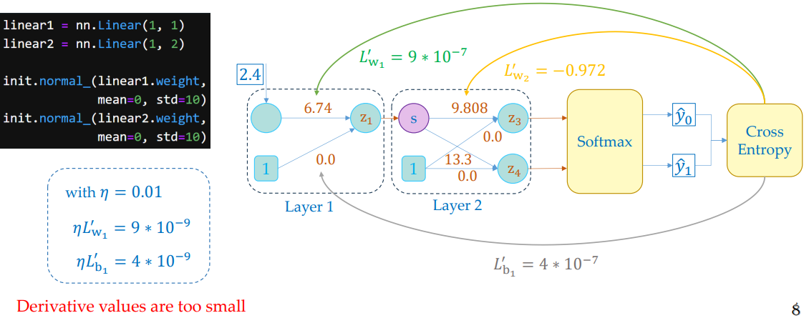
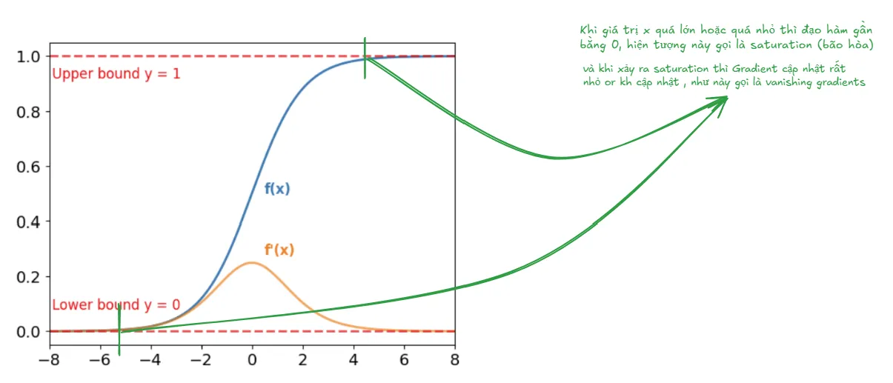
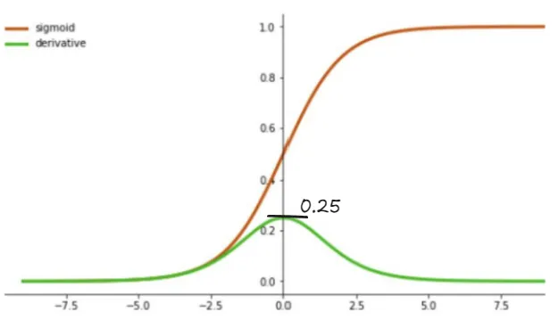
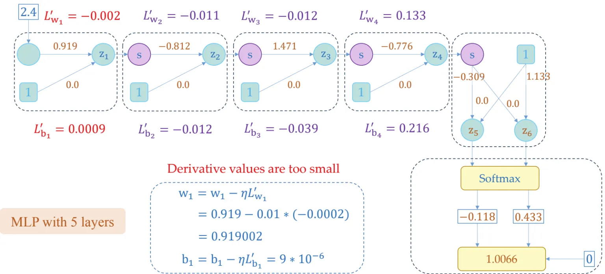
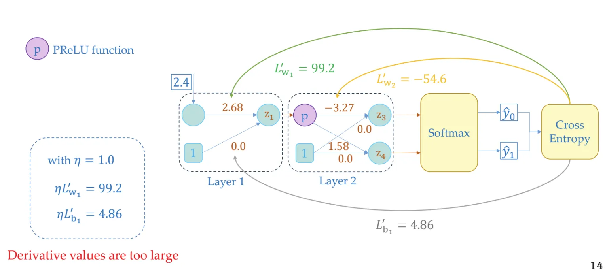
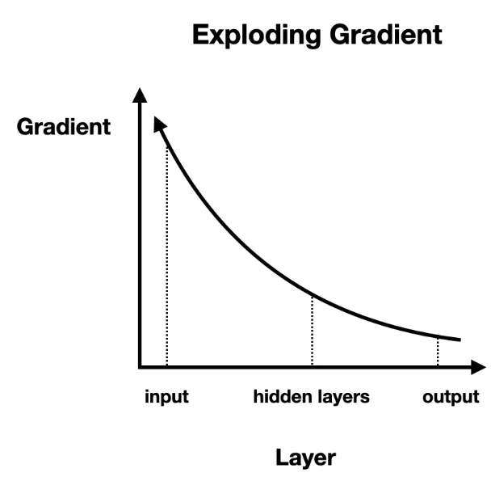
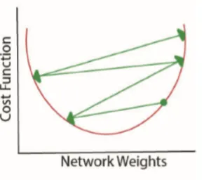

## 1. Motivation

> [!NOTE]
> Trong bài Insight MLP chúng ta thảo luận về vấn đề Gradient Vanishing khi khởi tạo các giá trị tham số $\theta$ bằng âm hoặc bằng không , vậy có cách nào khởi tạo $\theta$ mà tránh được trường hợp đó không ? 

{}

Chúng ta không thể khởi tạo bằng con số mình thích vì :

- Không có tính linh hoạt trong bài toán
- Chưa chắc con số của mình đã tốt , có thể tốt với model ở bài toán này nhưng theo thời gian dữ liệu sẽ thay đổi thì chưa chắc $\theta$ của mình đã còn tốt

Các con số chạy đến vô cùng nên mình khó có thể tìm được con số tốt nhất, vậy nên mình sẽ cố định trong khoảng nào đó , rồi random $\theta$ trong khoảng đó.

{}

Bài hôm nay chúng ta sẽ đi tìm các khoảng khởi tạo để tránh việc đó, bao gồm 2 loại : 

- Xavier Glorot Init : dành cho activation `Sigmoid` và `Tanh`
- Kaiming He Init : dành cho activation `Relu`

## 2. Case Studies

Chúng ta sẽ thảo luận tiếp các trường hợp dẫn đến Gradient Vanishing/Exploding khác trước khi đi sâu vào cách khắc phục nó

> [!NOTE]
> Những case study các bạn có thể tự thực nghiệm lại trên code Pytorch

### 2.1. Large weight initialization

Ví dụ khởi tạo ở $w = 6.74$ ở node 1, $L_{w1}'$ sẽ còn rất nhỏ (bằng $9*10^{-7}$) làm xảy ra Gradient Vanishing

> [!TIP]
> Bởi Gradient được hình thành từ chain-rule , vậy chỉ cần gradient local rất nhỏ (ví dụ = 0.001 ) khi nhân cùng với những gradient local khác cũng làm global gradient trở nên nhỏ 

Vậy trong mạng Nơ ron ở case này , phần gradient local đạt giá trị nhỏ là : 

$$
\frac{\partial sigmoid}{\partial z}
$$

Chúng ta đi qua phần đạo hàm Sigmoid để visualization :

$$
\text{sigmoid}'(x) = \text{sigmoid}(x) \cdot \left(1 - \text{sigmoid}(x) \right)
$$

Visualization : theo hình bạn thấy từ khoảng $(-\infty, -4) \, \text{và} \, (4, \infty)$ giá trị đạo hàm dường như tiến đến 0.

Quay trở lại bài , ta có : 

$$
z = wx + b 
$$

$$
z = 14,15 
$$

$$
\frac{d}{dz}\text{sigmoid}(z) = \text{sigmoid}(z) \cdot (1 - \text{sigmoid}(z))
$$

$$
\text{sigmoid}'(14.15) = 0.9999992912 \cdot (1 - 0.9999992912) 
$$
$$
\text{sigmoid}'(14.15) \approx 7.08 \times 10^{-7}
$$

Đến đây chắc bạn cũng hiểu tại sao gradient local của $\frac{\partial sigmoid}{\partial z}$  quá nhỏ làm xảy ra hiện tượng Gradient Vanishing

### 2.2. Using appropriate weight initialization

Trong ví dụ này, chúng ta giả định đã tìm được trọng số thích hợp, nhưng model lại có rất nhiều layer.

#### 2.2.1. Ví dụ 1 :

Trước khi đi vào bài toán chính, ta ví dụ một bài tính toán tiểu học chút: Giả sử bạn có một số ban đầu là 100 và mỗi lần bạn nhân số này với 0.1 (tương tự như gradient nhỏ dần qua từng lớp). Hãy tính giá trị sau 5 lần nhân

$$
\text{Lần 1: } 100 \times 0.1 = 10
$$
$$
\text{Lần 2: } 10 \times 0.1 = 1 
$$
$$
\text{Lần 3: } 1 \times 0.1 = 0.1 
$$
$$
\text{Lần 4: } 0.1 \times 0.1 = 0.01 
$$
$$
\text{Lần 5: } 0.01 \times 0.1 = 0.001
$$

Vậy càng nhân với số nhỏ $< 1$ thì càng nhân càng tiến đến gần $0$ 

#### 2.2.2. Ví dụ 2:

> [!NOTE]
> Nhìn hình ta thấy , giá trị maximum của đạo hàm là xấp xỉ 0.25

Ví dụ cho mạng nơ ron 2 layer ta tính như sau :
$$
\frac{dy}{dx} = \frac{df^{(2)}}{df^{(1)}} \cdot \frac{df^{(1)}}{dx} 
$$$$
\frac{dy}{dx} = 0.25 \cdot \frac{df^{(1)}}{dx}
$$

> Vì vậy, càng thêm 1 layer, giá trị của Gradient Global sẽ bị giảm ít nhất  1/4 giá trị . Ví dụ 2 layer thì 0.25*0.25 = 0.0625, 3 layer thì 0.25*0.25*0.25 = 0.015625,…..

#### 2.2.3. Quay trở lại bài toán chính , giả sử ta có một mạng nơ ron như sau

Tính backward

Tương tự ta cũng thấy đạo hàm giảm qua từng layer

> [!WARNING]
> Kết quả : cập nhật $\theta $ có giảm nhưng không đáng kể

### 2.3. Large weight initialization and large learning rate

Khi mà khởi tạo trọng số quá lớn,không chỉ có thể xảy ra Vanishing mà còn hiện tượng Exploding gradients (bùng nổ gradient) làm quá trình trainning không hội tụ.

Visualization : 

Gradient càng tăng khi càng qua mỗi layer

Gradient quá lớn làm model không hội tụ được