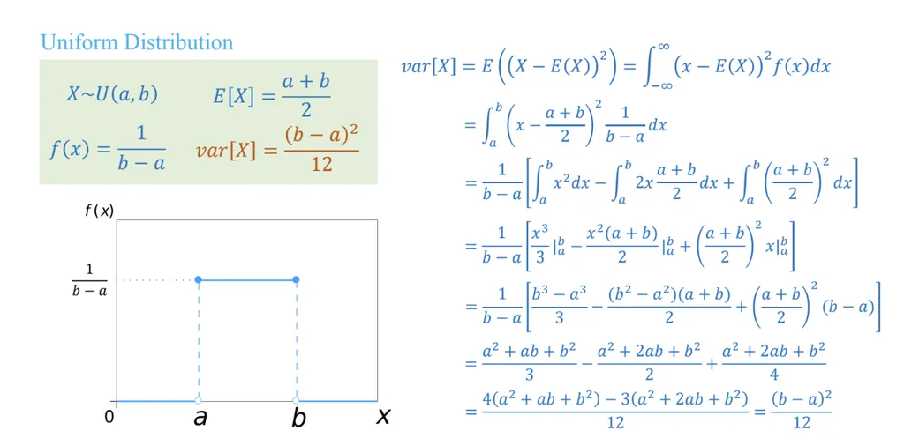

## 1. Motivation

> [!NOTE]
> Trong bài Insight MLP chúng ta thảo luận về vấn đề Gradient Vanishing khi khởi tạo các giá trị tham số $\theta$ bằng âm hoặc bằng không , vậy có cách nào khởi tạo $\theta$ mà tránh được trường hợp đó không ? 

{}

Chúng ta không thể khởi tạo bằng con số mình thích vì :

- Không có tính linh hoạt trong bài toán
- Chưa chắc con số của mình đã tốt , có thể tốt với model ở bài toán này nhưng theo thời gian dữ liệu sẽ thay đổi thì chưa chắc $\theta$ của mình đã còn tốt

Các con số chạy đến vô cùng nên mình khó có thể tìm được con số tốt nhất, vậy nên mình sẽ cố định trong khoảng nào đó , rồi random $\theta$ trong khoảng đó.

{}

Bài hôm nay chúng ta sẽ đi tìm các khoảng khởi tạo để tránh việc đó, bao gồm 2 loại : 

- Xavier Glorot Init : dành cho activation `Sigmoid` và `Tanh`
- Kaiming He Init : dành cho activation `Relu`

## 2. Case Studies

Chúng ta sẽ thảo luận tiếp các trường hợp dẫn đến Gradient Vanishing/Exploding khác trước khi đi sâu vào cách khắc phục nó

> [!NOTE]
> Những case study các bạn có thể tự thực nghiệm lại trên code Pytorch

### 2.1. Large weight initialization

Ví dụ khởi tạo ở $w = 6.74$ ở node 1, $L_{w1}'$ sẽ còn rất nhỏ (bằng $9*10^{-7}$) làm xảy ra Gradient Vanishing


> [!TIP]
> Bởi Gradient được hình thành từ chain-rule , vậy chỉ cần gradient local rất nhỏ (ví dụ = 0.001 ) khi nhân cùng với những gradient local khác cũng làm global gradient trở nên nhỏ 

Vậy trong mạng Nơ ron ở case này , phần gradient local đạt giá trị nhỏ là : 

$$
\frac{\partial sigmoid}{\partial z}
$$

Chúng ta đi qua phần đạo hàm Sigmoid để visualization :

$$
\text{sigmoid}'(x) = \text{sigmoid}(x) \cdot \left(1 - \text{sigmoid}(x) \right)
$$

Visualization : theo hình bạn thấy từ khoảng $(-\infty, -4) \, \text{và} \, (4, \infty)$ giá trị đạo hàm dường như tiến đến 0.


Quay trở lại bài , ta có : 

$$
z = wx + b 
$$

$$
z = 14,15 
$$

$$
\frac{d}{dz}\text{sigmoid}(z) = \text{sigmoid}(z) \cdot (1 - \text{sigmoid}(z))
$$

$$
\text{sigmoid}'(14.15) = 0.9999992912 \cdot (1 - 0.9999992912) 
$$
$$
\text{sigmoid}'(14.15) \approx 7.08 \times 10^{-7}
$$

Đến đây chắc bạn cũng hiểu tại sao gradient local của $\frac{\partial sigmoid}{\partial z}$  quá nhỏ làm xảy ra hiện tượng Gradient Vanishing

### 2.2. Using appropriate weight initialization

Trong ví dụ này, chúng ta giả định đã tìm được trọng số thích hợp, nhưng model lại có rất nhiều layer.

a. Ví dụ 1 :

Trước khi đi vào bài toán chính, ta ví dụ một bài tính toán tiểu học chút: Giả sử bạn có một số ban đầu là 100 và mỗi lần bạn nhân số này với 0.1 (tương tự như gradient nhỏ dần qua từng lớp). Hãy tính giá trị sau 5 lần nhân

$$
\text{Lần 1: } 100 \times 0.1 = 10
$$
$$
\text{Lần 2: } 10 \times 0.1 = 1 
$$
$$
\text{Lần 3: } 1 \times 0.1 = 0.1 
$$
$$
\text{Lần 4: } 0.1 \times 0.1 = 0.01 
$$
$$
\text{Lần 5: } 0.01 \times 0.1 = 0.001
$$

Vậy càng nhân với số nhỏ $< 1$ thì càng nhân càng tiến đến gần $0$ 

b. Ví dụ 2:


> [!NOTE]
> Nhìn hình ta thấy , giá trị maximum của đạo hàm là xấp xỉ 0.25

Ví dụ cho mạng nơ ron 2 layer ta tính như sau :
$$
\frac{dy}{dx} = \frac{df^{(2)}}{df^{(1)}} \cdot \frac{df^{(1)}}{dx} 
$$$$
\frac{dy}{dx} = 0.25 \cdot \frac{df^{(1)}}{dx}
$$

> Vì vậy, càng thêm 1 layer, giá trị của Gradient Global sẽ bị giảm ít nhất  1/4 giá trị . Ví dụ 2 layer thì 0.25*0.25 = 0.0625, 3 layer thì 0.25*0.25*0.25 = 0.015625,…..

Quay trở lại bài toán chính , giả sử ta có một mạng nơ ron như sau

Tính backward

Tương tự ta cũng thấy đạo hàm giảm qua từng layer


> [!WARNING]
> Kết quả : cập nhật $\theta $ có giảm nhưng không đáng kể


### 2.3. Large weight initialization and large learning rate

Khi mà khởi tạo trọng số quá lớn,không chỉ có thể xảy ra Vanishing mà còn hiện tượng Exploding gradients (bùng nổ gradient) làm quá trình trainning không hội tụ.


Visualization : 
<div style="display: flex">
  <div>
    
    Gradient càng tăng khi càng qua mỗi layer
  </div>
  <div>
  
  Gradient quá lớn làm model không hội tụ được
  </div>
</div>

## 3. Cơ sở lý thuyết

### 3.1. Mean, variance, standard deviation

#### 3.1.1. Mean

<div style="display: flex;">
  <div style="width: 50%; padding-right: 1em;">
    
  </div>
  <div style="width: 50%;">
    <p>Trung bình có trọng số của hai biến ngẫu nhiên độc lập</p>
    
  </div>
</div>

#### 3.1.2. Variance & standard deviation

<div style="display: flex;">
  <div style="width: 50%; padding-right: 1em;">
    <p></p>
  </div>
  <div style="width: 50%;">
    <p><strong>1. Biến đổi công thức tính phương sai</strong></p>
    <p></p>
    <p><strong>2. Phương sai của hai biến ngẫu nhiên độc lập</strong></p>
    <p></p>
  </div>
</div>


{}

mọi người sẽ thắc mắc phải đổi $P_X(X_i) -> P_{X^2}(X_i^2)$ lúc đó mới đúng công thức. 

Có thể giải thích như sau :

+ Chúng ta đang xem xét phân phối của cùng một biến ngẫu nhiên $ X$, trong đó chỉ thay đổi giá trị từ $X$ sang $X^2$ (khác độ lớn). Trong trường hợp này, phân phối xác suất $P(X)$ được giữ nguyên và không thay đổi.

+ Vậy nên khi thay đổi xác $X_i -> X_i^2 $ mình muốn thay đổi đầu vào nhưng vẫn để có cùng phân phối xác suất cũ thì xài lại hàm mật độ xác suất ($P_X(X_i)$) 

  

Ví dụ : 

Giả sử bạn khảo sát khoảng cách từ nhà đến trường của một nhóm học sinh. Khoảng cách $X$  được đo bằng **km**, với các giá trị và tỷ lệ xác suất sau:

- **1 km:**  30% học sinh = $P(X = 1) = 0.3$
- **2 km:** 40% học sinh. $P(X = 2) = 0.4$
- **3 km:** 30% học sinh. $P(X = 3) = 0.3$

Bây giờ, bạn đổi ý , không thích thống kê bằng $km$  mà thích $km^2$ 

$$
S = X^2
$$

nhưng bạn muốn giữ nguyên ý nghĩa thống kê của bài toán (tức là phân phối xác suất không thay đổi), chỉ thay đổi đại lượng đo lường.

- $P(X^2 = 1) = P(X = 1) = 0.3$
- $P(X^2 = 4) = P(X = 2) = 0.4$
- $P(X^2 = 9) = P(X = 3) = 0.3$

{}

### 3.2. Uniform & Gaussian Distribution

#### 3.2.1. Uniform Distribution

Định nghĩa: Uniform distribution mô tả trường hợp mà tất cả các sự kiện đều có khả năng xảy ra như nhau.
Đồ thị của Uniform Distribution luôn có dạng hình chữ nhật, vì xác suất của mọi sự kiện đều bằng nhau.

Ví dụ : 

- **Discrete Uniform Distribution:** Tung một con xúc xắc, mỗi mặt đều có xác suất bằng nhau (1/6).

Continuous Uniform Distribution: Xe buýt rời khỏi bến mỗi giờ một lần (every hour).Tuy nhiên, không biết thời gian cụ thể mà chuyến xe buýt gần nhất đã rời đi. Xác suất chờ trong khoảng thời gian bất kỳ được tính như thế nào?

Dựa vào uniform distribution , mình sẽ giải thích như sau


Vì vậy : 

- Thời gian chờ ngắn nhất là **0 phút**, do đó **Lower Bound = 0**.
- Thời gian chờ dài nhất là **60 phút**, nên **Upper Bound = 60**

Vậy xác suất chờ xe buýt mỗi phút là $\frac{1}{60}$ , hay là mỗi phút đều có xác suất xảy ra như nhau

Ví dụ xác suất chờ xe buýt trong khoảng 5-20 phút là bao nhiêu: $\frac{20-5}{60} = 0.25 = 25\%$


Mean and Variance

> [!NOTE]
> $$\text{với biến rời rạc : } E(X) = \sum_{i} x_i P(x_i) $$
> $$\text{với biến liên tục : } E(X) = \int_{-\infty}^{\infty} x f(x) \, dx$$

<div style="display: flex;">
  <div style="width: 50%; padding-right: 1em;">
    
  </div>
  <div style="width: 50%;">
    
  </div>
</div>

#### 3.2.2. Gaussian Distribution

Comming soon ...

### 3.3. Maclaurin series

Khai triển Maclaurin là một trường hợp đặc biệt của khai triển Taylor, được dùng để xấp xỉ một hàm số $f(x)$ gần đúng bằng $g(x)$ tại các giá trị gần $ x = 0$


Mục đích:

- Trong các ứng dụng thực tế, tính trực tiếp một hàm phức tạp có thể rất khó khăn hoặc tốn kém.
- Sử dụng Maclaurin giúp thay thế hàm bằng một đa thức bậc thấp, dễ dàng tính toán hơn

#### 3.3.1. Áp dụng cho Tanh


Maclaurin phát biểu rằng : khi giá trị x nhỏ ($\approx 0$) thì $Tanh(x) = x $.


Bây giờ chúng ta sẽ bắt đầu xây dựng và tìm khoảng khởi tạo , để làm được điều này cần phải thỏa mãn 2 quy tắc (những quy tắc này được rút ra trong quá trình thực nghiệm của NCKH). 

```python
import numpy as np
import matplotlib.pyplot as plt

# Generate x values from -0.5 to 0.5
x = np.linspace(-0.5, 0.5, 100)

# Calculate tanh(x) and its Maclaurin approximation
y = np.tanh(x)
y_approx = x  # Maclaurin approximation: tanh(x) ≈ x for small x

# Create the plot
plt.plot(x, y, label="tanh(x)", color="blue")  # Actual tanh(x)
plt.plot(x, y_approx, label="Maclaurin Approximation (x)",
         linestyle="--", color="red")  # Approximation

# Add labels and title
plt.xlabel("x")
plt.ylabel("y")
plt.title("Hyperbolic Tangent Function and Maclaurin Approximation")

# Add legend
plt.legend()

# Add grid for better readability
plt.grid(True)

# Display the plot
plt.show()
```


#### 3.3.2. Áp dụng cho Sigmoid


```python
import numpy as np
import matplotlib.pyplot as plt

# Define the sigmoid function
def sigmoid(x):
    return 1 / (1 + np.exp(-x))


# Generate x values from -0.5 to 0.5
x = np.linspace(-0.5, 0.5, 100)

# Calculate sigmoid(x) and its Maclaurin approximation
y = sigmoid(x)
y_approx = 1 / 2 + x / 4  # Maclaurin approximation for sigmoid(x)

# Create the plot
plt.plot(x, y, label="sigmoid(x)", color="blue")  # Actual sigmoid function
plt.plot(x, y_approx, label="Maclaurin Approximation (1/2 + x/4)",
         linestyle="--", color="red")  # Approximation

# Add labels and title
plt.xlabel("x")
plt.ylabel("y")
plt.title("Sigmoid Function and Maclaurin Approximation")

# Add legend
plt.legend()

# Add grid for better readability
plt.grid(True)

# Display the plot
plt.show()
```


> [!NOTE]
> Phương sai của các layer bằng nhau qua các lớp : Điều này giúp đảm bảo rằng các giá trị kích hoạt (activations) trong mạng không bị lệch về phía dương hoặc âm quá nhiều, làm giảm hiệu suất của quá trình học.
> $$\text{Var}(a^{[l-1]}) = \text{Var}(a^{[l]})$$

> [!NOTE]
> Mean của các hàm kích hoạt nên bằng 0 : Điều này nhằm giữ cho tín hiệu truyền qua các layer không bị giảm dần (gradient vanish) hoặc tăng quá mức (gradient explosion).
> $$\mathbb{E}(a^{[l]}) = 0$$

<div style="display: flex">
  
  
</div>

**Ta sẽ bắt đầu chứng minh như sau**


bạn có thể chuyển qua về giữa $ \mathbb{E}[x_i]$ và  $\mathbb{E}[a_i^{[l-1]}]$ trong suốt quá trình chứng minh nha 

$$z_i = \left(x_1 w_1 + \cdots + x_n w_n + b\right)$$

$$\text{Var}(z_i) = \text{Var}\left(x_1 w_1 + \cdots + x_n w_n + b\right)$$

$$\text{Var}(z_i) = \text{Var}(x_1 w_1) + \text{Var}(x_2 w_2) + \cdots + \text{Var}(x_n w_n) + Var(b)$$
