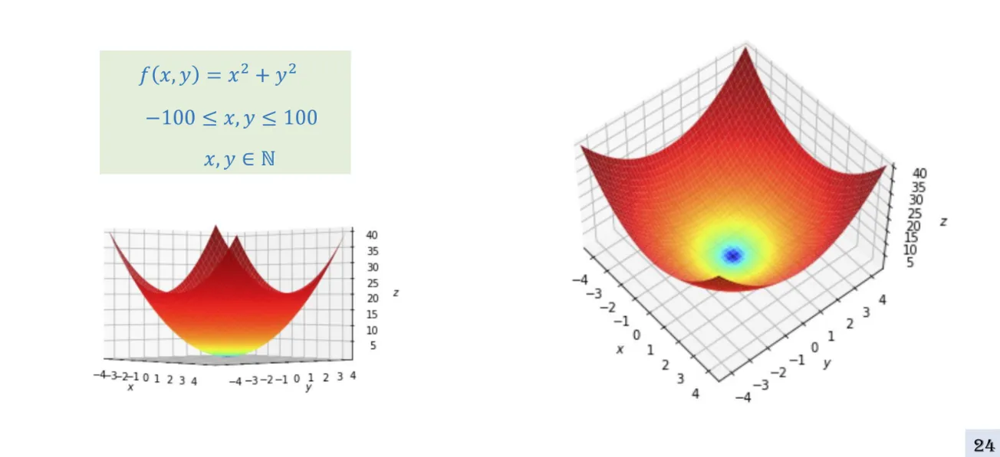

## 1. Motivation

Ở bài Model Initialization , chúng ta học cách khởi tạo $\theta$ làm sao để tránh được Gradient Vanishing/Exploding nhưng cố định với Learning rate rất nhỏ.

Hạn chế chung với các hyperparameters là rất khó tìm được để đáp ứng với bài toán , ở bài trước tìm $\theta$ thì chúng ta khắc phục bằng cách cố định vào khoảng nào đó. 

Đối với Learning rate ($Lr$) rất khó cố định ở một khoảng nào đó bởi vì:

+ Đối với những thuật toán cổ điển như Lo.R , Ln.R, So.R  thì hàm Loss luôn convex , lúc đó chỉ cần khởi tạo $Lr$ thật nhỏ và chạy nhiều epochs thì chắc chắn sẽ tìm được Global minimum:

    

+ Khi bắt đầu huấn luyện một MLP, giá trị dự đoán $\hat{y}$ phải đi qua rất nhiều layer, mỗi layer con kèm thêm activation func hàm $f(x)$, khiến cho hàm Loss không còn mang tính Convex nữa (như hình minh họa bên cạnh).  Ví dụ $softmax(z^{[l]}(relu(z^{l-1})))$

    

+ Thực tế, việc xác định hình dáng của hàm Loss là rất phức tạp, và chúng ta sẽ không bao giờ biết chính xác hình dạng của nó. Nếu biết được, chúng ta sẽ có thể dễ dàng xác định được điểm tối ưu ngay từ ban đầu mà không cần phải qua quá trình huấn luyện.

+ Khi hàm Loss không còn Convex, sẽ xuất hiện nhiều điểm Local minimum, làm cho việc tìm kiếm Global minimum trở nên khó khăn, đặc biệt nếu learning rate $(Lr)$ được khởi tạo cố định. Ví dụ, như trong hình, mỗi giá trị $Lr$ khác nhau sẽ dẫn đến việc mô hình tìm được một điểm minimum khác nhau.


1. Không có định nghĩa nào nói $Lr$ như này là nhỏ , như này là lớn . Các giá trị như $0.01, 0.001$,... mà chúng ta sử dụng trước đây chủ yếu dựa trên kinh nghiệm từ NCKH. Khi đối mặt với một bài toán mới, chúng ta không thể khẳng định rằng $Lr$ của mình luôn mang lại kết quả tốt nhất.
2. Hàm Loss rất phức tạp và có phạm vi giá trị rộng, vì vậy chúng ta chỉ có thể phỏng đoán về hình dạng của nó, chứ không ai biết chính xác. Các thuật toán mà chúng ta đã thảo luận hôm nay đều phản ánh góc nhìn và quan sát của các tác giả, dựa trên các vấn đề phổ biến trong lĩnh vực Deep Learning. Mỗi người có những quan sát khác nhau và đưa ra các giải pháp phù hợp với bài toán cụ thể mà họ đang giải quyết. Vì vậy, không có thuật toán nào là tốt nhất cho mọi trường hợp. Khi đối mặt với một bài toán mới, chúng ta không thể khẳng định rằng một thuật toán cụ thể sẽ luôn mang lại kết quả tốt nhất.



Hôm nay, chúng ta sẽ cùng tìm hiểu về việc thay vì cố định một learning rate ($Lr$) trong suốt quá trình huấn luyện, ta có thể để $Lr$ tự điều chỉnh linh hoạt dựa trên "địa hình" của hàm Loss. Cách tiếp cận này còn được gọi là Adaptive Learning Rate, giúp mô hình điều chỉnh tốc độ học phù hợp với từng tình huống trong quá trình học.


## 2. Challenges

Local Minima: Là một điểm trong đó hàm số lớn nhất trong một vùng nhỏ xung quanh nó.

Saddle Point: Là một điểm trong đó hàm số thấp hơn các giá trị xung quanh nó trong một số hướng, nhưng cao hơn trong các hướng khác.

Global Minima: Là một điểm thấp nhất.

Gradient vanishing: Khi đạo hàm giảm dần đến không làm cho tham số không cập nhật được.

## 3. SGD Insight

Điểm chung khi giải quyết vấn đề một cách học thuật là chúng ta thường tìm một hàm số $f(x)$ và cố gắng tối ưu hóa hàm đó, thường là tìm cực đại hoặc cực tiểu. Trong bài toán này, mục tiêu của chúng ta là minimize hàm Loss, vì vậy chúng ta sẽ cố gắng tối ưu hóa hàm để đạt được cực tiểu.

### 3.1. Derivative/Gradient

**Đạo hàm cho hàm liên tục**

**Gradient descent : đi ngược hướng đạo hàm để tìm giá trị min**

**Mô phỏng đơn giản về Gradient descent**

    
    
    

### 3.2. SGD: 2D function

### 3.3. For composite function

Xét 2 hàm $g(f(x))$ và  $g(x)$

Với giá trị $Lr$ 0.01 hoặc 0.001 : 

+ Với $g(f(x))$ : bị vanishing gradient lúc $x= 1$ vì độ dốc = 0

+ Với $g(x)$ thì có thể đến được trung tâm vì luôn cố độ dốc xung quanh

Với những giá trị $Lr$ khác : 

)$')

$, hội tụ quá chậm gây tốn tài nguyên')


Vì vậy, khi thiết kế thuật toán, chúng ta cần nhận diện được vị trí mà đạo hàm (gradient) lớn hay nhỏ. Tùy theo đó, learning rate $(Lr)$ sẽ được điều chỉnh sao cho phù hợp, giúp tối ưu hóa quá trình học và đạt được hiệu quả tốt nhất.


## 4. Adaptive Learning Rate

### 4.1. Learning rate decay

Tác giả giả định rằng trong quá trình huấn luyện, đường đi của mô hình luôn có độ dốc, và khi tiến gần đến vị trí tối ưu, độ dốc sẽ càng lớn, dẫn đến nguy cơ "exploit gradients". Vì vậy, càng về sau, khi mô hình tiến đến vị trí tối ưu, việc giảm learning rate sẽ giúp tránh hiện tượng exploit gradients do độ dốc lớn.

**Exponential decay** : Giup chạy smooth hơn , còn độ hiệu quả không chênh lệch với bản gốc quá nhiều.

### 4.2. Adagrad


Trước khi **Adagrad** ra đời, phương pháp **Learning Rate Decay** là một trong những cách phổ biến để điều chỉnh learning rate trong quá trình huấn luyện. Bản chất cả hai phương pháp đều có điểm chung là làm giảm learning rate khi quá trình huấn luyện tiến triển. Tuy nhiên, **Decay** giảm **learning rate theo một quy trình cố định,** thường theo số epoch, và làm giảm đều tất cả $\theta$  

Trong khi đó, **Adagrad** sử dụng một cách tiếp cận khác biệt: thay vì giảm learning rate đồng đều, Adagrad điều chỉnh learning rate **cho từng tham số riêng biệt dựa vào tích lũy gradient**. Những **tham số có gradient lớn** sẽ có **learning rate nhỏ hơn**, giúp tránh việc cập nhật quá mạnh. Ngược lại, các **tham số có gradient nhỏ** sẽ có **learning rate lớn hơn** , giúp mô hình học hiệu quả hơn và điều chỉnh chính xác hơn.


**Cách 1:** 

$W_{t+1} = W_t - \frac{\eta}{\sqrt{\sum_{i=0}^t g_i^2}} \cdot g_t$

- $W_{t+1}$: Tham số cập nhật ở bước t+1.    
- $W_t$: Tham số tại bước t.   
- $\eta$: Learning rate ban đầu.
- $g_t$: Gradient tại bước t.    
- $\sum_{i=0}^{t} g_i^2$: Tích lũy gradient từ bước 0 đến t.
 
**Cách 2 :**

$\epsilon$ : tránh chia cho 0

Cả 2 cách đều là một chỉ là khác cách viết. Adagrad cộng dồn gradients theo thời gian , giá trị cộng dồn càng lớn thì $Lr$ càng giảm.


Vậy kết luận là ý tưởng của Ada cũng tương tự Decay , nhưng **Decay giảm dựa vào epochs** còn **Adagrad dựa vào gradient**


***Adagrad 2 chiều trở lên:***

### 4.3. RMSProp

#### 4.3.1. Limitation Adagrad



Adagrad sẽ liên tục giảm tốc độ học cho tham số đó vì nó cộng dồn các gradient bình phương qua các lần cập nhật. Vấn đề xảy ra khi quá trình huấn luyện tiếp tục với những gradient rất nhỏ mà không có sự điều chỉnh kịp thời. Sau một vài bước cập nhật, giá trị của $G_i^t$ sẽ lớn lên (vì tổng bình phương của gradient trước đó tăng lên), dẫn đến tốc độ học giảm mạnh, làm quá trình hội tụ bị chậm lại hoặc ngừng lại khi quãng đường đến đích còn xa hoặc trên đường gặp điểm có độ dốc nhỏ



#### 4.3.2. SMA (Simple Moving Average) và EMA (Exponential Moving Average)
**a. SMA (Simple Moving Average)**

Định nghĩa: SMA là trung bình cộng của một số lượng cố định các giá trị trong dữ liệu lịch sử trong một cửa sổ nhất định.

+ Cách tính toán: SMA được tính bằng cách lấy trung bình cộng của n giá trị gần nhất trong chuỗi thời gian.
  
  $\text{SMA}(t) = \frac{1}{n} \sum_{i=t-n+1}^{t} x_i$

  $\text{Trong đó: }$
  
  $x_i \text{ là các giá trị của chuỗi thời gian}$ 

  $n \text{ là kích thước cửa sổ.}$

  

**b. EMA (Exponential Moving Average)**

Định nghĩa: EMA là trung bình có trọng số theo mũ, nơi các giá trị gần đây sẽ có trọng số lớn hơn và giảm dần theo thời gian.

+ Cách tính toán:
  
  EMA sử dụng một hệ số làm mịn (smoothing factor) $\alpha$, để áp dụng trọng số lớn cho các giá trị gần đây và trọng số nhỏ cho các giá trị cũ hơn.

  $\text{EMA}(t) = \alpha \cdot x_t + (1 - \alpha) \cdot \text{EMA}(t-1)$

  $\text{Trong đó: }$

  $\alpha = \frac{2}{n + 1}$  $\text{ là hệ số làm mịn, với } n \text{ là độ dài cửa sổ, }$

  $x_t \text{ là giá trị tại thời điểm } t$

  $\text{EMA}(t-1) \text{ là giá trị EMA của thời điểm trước đó.}$

#### 4.3.3. AdaGrad to RMSProp.

Như ở trên nhược điểm của AdaGrad đã đề cập trên mục 4.3.1. thay vì chúng ta cộng dồn chúng ta sẽ sử dụng EMA để cập nhật $s_t$

 
  
  

* **Generalization**

### 4.4. Momentum and Towards Adam.

#### 4.4.1. SGD + Momentum.

+ **SGD**
  

+ **SGD + Momentum**
  

Do các hằng số $ p $ và $- (1 - \rho) \alpha \nabla_{\theta} L $ không còn mối liên hệ trực tiếp với nhau, nên ta có thể đặt tên biến khác nhau một cách linh hoạt.

+ **Nesterov Momentum**
  
  *Các vấn đề của Momentum:*
    + Khi đạo hàm liên tục có cùng hướng, vận tốc $v$ có thể tích lũy quá lớn dẫn đến bước nhảy quá dài, có thể vượt qua cực tiểu hoặc gây ra hiện tượng “nhảy qua” vùng tối ưu.
    + Khi mặt hàm tối ưu có hình dạng “rãnh” hay “dốc” không đồng đều, momentum có thể làm cho các bước cập nhật trở nên không chính xác do “đà” tích lũy từ các lần cập nhật trước không còn phù hợp với hướng tối ưu mới.
  
  *Ý tưởng của Nesterov Momentum:*

    + Nesterov Accelerated Gradient (NAG) cải thiện điểm yếu của momentum bằng cách “nhìn trước” (look-ahead) vị trí mà Momentum sẽ đưa bạn đến. Thay vì tính đạo hàm tại vị trí hiện tại , ta ước tính vị trí “tiên đoán". Sau đó, đạo hàm được tính tại vị trí "tiên đoán" thay vì vị trí hiện tại.

  *Ưu điểm của Nesterov Momentum:*
  Việc tính đạo hàm tại vị trí "tiên đoán" cho phép thuật toán “điều chỉnh” kịp thời trước Momentum tích lũy dẫn đến bước đi quá xa.
  Nhờ tính toán trước, nếu gradient tại điểm "tiên đoán" cho thấy rằng bước nhảy dự kiến không phải là hướng giảm mạnh, thuật toán có thể giảm Momentum, tránh việc quá “nhanh” dẫn đến vượt qua điểm cực tiểu.

#### 4.4.2. RSMProp + Momentum

+  **SGD + Momentum**

Công thức (1) có thể chuyển thành (2) bởi vì chỉ cần đổi dấu và $m_{t-1}$ là tổng các gradient trước thì lúc đổi dấu khôgn cần đổi dấu biến này.

+ **RSMProp**

+ **Simpler version of Adam.**

#### 4.4.3. Adam

Do khi khởi tạo ta thường đặt $m_0 = 0$ và $v_0 = 0$, các giá trị $m_t$ và $v_t$ ban đầu bị lệch về 0, nhất trong những bước đầu khi $t$ còn nhỏ. Để hiệu chỉnh sự chênh lệch này, ta dùng ước lượng hiệu chỉnh:

$$\hat{m}_t = \frac{m_t}{1-\beta_1^t}$$

$$\hat{v}_t = \frac{v_t}{1-\beta_2^t}$$

Việc chia cho $ 1-\beta_1^t $ và $ 1-\beta_2^t $ giúp “bù” cho hiệu ứng khởi tạo bằng 0, từ đó đưa ra các ước lượng không thiên lệch của trung bình động của gradient và bình phương gradient. Điều này giúp các bước cập nhật trọng số trở nên chính xác và ổn định hơn trong quá trình tối ưu.
