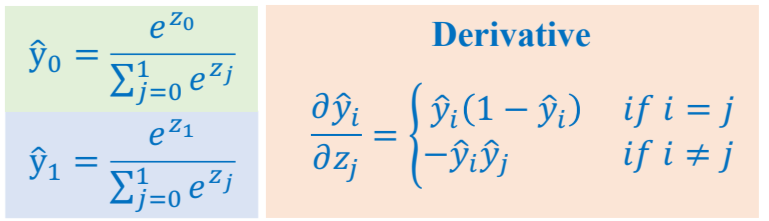

## 1. Introduction

Softmax Regression là một thuật toán học có giám sát thuộc nhóm các phương pháp phân loại đa lớp (multiclass classification) trong lĩnh vực Machine Learning. Đây là phiên bản mở rộng của Logistic Regression, được phát triển để giải quyết các bài toán với nhiều hơn hai lớp phân loại. Bằng cách sử dụng hàm Softmax, thuật toán này có thể chuyển đổi các giá trị đầu ra tuyến tính thành một phân bố xác suất trên các lớp đầu ra, đảm bảo rằng tổng xác suất của tất cả các lớp bằng 1.

Mục tiêu của Softmax Regression là tối ưu hóa quá trình dự đoán, giúp xác định lớp đầu ra với xác suất cao nhất cho một mẫu dữ liệu nhất định. Đặc biệt, phương pháp này phù hợp cho các ứng dụng như:

- **Phân loại văn bản**: Ví dụ như phân tích cảm xúc (cảm xúc tích cực, trung tính, tiêu cực).
- **Phát hiện gian lận**: Ví dụ như xác định giao dịch thẻ tín dụng là hợp lệ hay gian lận.
- **Nhận dạng hình ảnh**: Phân loại các hình ảnh động vật như mèo, chó, chim, v.v.

### 1.1. Cấu trúc cơ bản và lợi ích của Softmax Regression:

+ Hàm Softmax: Đây là nền tảng của Softmax Regression, có chức năng biến đổi các đầu ra tuyến tính thành xác suất phân lớp. Điều này giúp chuyển đổi mô hình thành một phân phối xác suất, hỗ trợ việc ra quyết định dựa trên mức độ tự tin của mô hình về mỗi lớp đầu ra.
+ Hàm mất mát Cross-Entropy: Để đo lường độ sai lệch giữa giá trị dự đoán và giá trị thực tế, Softmax Regression sử dụng hàm Cross-Entropy. Hàm mất mát này phản ánh độ tin cậy của mô hình đối với dự đoán của nó, với giá trị thấp hơn thể hiện mức độ chính xác cao hơn.

Thông qua các phương pháp trên, Softmax Regression không chỉ đảm bảo tính chính xác mà còn mang lại sự rõ ràng trong việc hiểu các khả năng của từng lớp đầu ra. Các tính năng này làm cho Softmax Regression trở thành lựa chọn tối ưu cho nhiều ứng dụng thực tế và các bài toán đa lớp.

### 1.2. Các bước cơ bản của mô hình

Để xây dựng một mô hình Softmax Regression hiệu quả, chúng ta cần tuân thủ các bước chính trong pipeline dưới đây. Quy trình này đảm bảo mô hình được huấn luyện chính xác và có khả năng tổng quát tốt trên các tập dữ liệu mới.

**a) Tiền xử lý dữ liệu (Data Preprocessing)**

Đây là bước quan trọng nhằm chuẩn bị và làm sạch dữ liệu trước khi đưa vào mô hình. Các công việc chính bao gồm:

- **Chuẩn hóa dữ liệu (Normalization)**: Đảm bảo rằng các đặc trưng có phân phối dữ liệu đồng nhất. Trong bài Card Fraud Detection, sử dụng `StandardScaler` để chuẩn hóa các giá trị trong tập huấn luyện và áp dụng cùng scaler này cho các tập kiểm tra và xác minh.
- **One-hot Encoding**: Chuyển đổi nhãn thành dạng vector, với mỗi phần tử đại diện cho một lớp. Ví dụ, nhãn gốc [0, 1, 2] sẽ được chuyển thành [[1, 0, 0], [0, 1, 0], [0, 0, 1]] để tương thích với Cross-Entropy Loss.
  
**b) Huấn luyện mô hình (Model Training)**

Quá trình huấn luyện bao gồm tối ưu hóa các trọng số của mô hình để tối thiểu hóa hàm mất mát. Các bước chính:

- **Khởi tạo trọng số**: Tạo ngẫu nhiên các trọng số ban đầu. Với Softmax Regression, mỗi lớp cần một bộ trọng số riêng để tối ưu hóa khả năng dự đoán.
- **Dự đoán bằng hàm Softmax**: Tính toán đầu ra tuyến tính và áp dụng hàm Softmax để biến các đầu ra thành xác suất phân lớp.
- **Tính toán hàm mất mát Cross-Entropy**: Sử dụng hàm mất mát Cross-Entropy để đánh giá độ lệch giữa dự đoán và giá trị thực tế, cung cấp thông tin cho quá trình tối ưu hóa.
- **Gradient Descent và cập nhật trọng số**: Sử dụng thuật toán Gradient Descent để cập nhật trọng số dựa trên gradient của hàm mất mát. Công thức cập nhật trọng số:
  
  $$θ=θ−η∇θL$$

  + *Trong đó:*
    + $\theta$ là vector trọng số (đọc là theta)
    + $\eta$ là tốc độ học (learning rate)
    + $∇θL$ là gradient của hàm mất mát L theo $θ$

**c) Đánh giá mô hình (Model Evaluation)**

Đo lường hiệu suất của mô hình trên tập kiểm tra để đảm bảo rằng mô hình đạt độ chính xác và độ tổng quát hóa tốt. Các phép đo đánh giá chính bao gồm:

- **Độ chính xác (Accuracy)**: Tỷ lệ giữa số dự đoán đúng trên tổng số dự đoán.
- **Độ đo F1 (F1-score)**: Đánh giá sự cân bằng giữa độ chính xác (Precision) và độ nhạy (Recall), phù hợp khi các lớp có sự mất cân bằng.

## 2. Motivation

- ***Linear Regression***

  
  Trong bài toán Linear Regression chúng ta sử dụng một đường tuyến tính để dự đoán. Việc dự đoán được cho là tốt khi hàm loss của nó đặt mức tối thiểu và chấp nhận được. Bài toán linear regression phù hợp với bài toán hồi quy, vậy còn bài toán phân loại thì sao ?

  Chúng ta thử xem với bài toán phân loại nhị phân trong hồi quy tuyến tính:

  

  Chúng ta có thể thấy bài toán phân loại nhị phân trong mô hình hồi quy tuyến tính hoạt động không tốt. Vì vậy có một giải pháp khác được sử dụng để phân loại nhị phân tốt hơn đó là Logistics Regression.

- ***Logistics Regression***
  
  

  Mô hình Logistics Regression có vẻ giải quyết tốt cho bài toán phân loại nhị phân, nhưng nó có thể giải quyết được bài toán phân loại đa lớp hay không ?

  > Mô hình logistics Regression không thể giải quyết được bài toán phân loại đa lớp vì output của nó có đi qua activation Sigmoid vì vậy giá trị đầu ra của mô hình nằm trong khoảng [0; 1] và nó dùng mỗi threshold để xác định ngưỡng để output nó thuộc về 0 hay 1 vì vậy Mô hình logistics regression chỉ phù hợp cho bài toán phân loại nhị phân.

Để giải quyết bài toán phân loại đa lớp, chúng tôi có đề xuất về `Softmax Regression`.

## 3. Softmax Regression

### 3.1. One hot coding

Cách truyền thống nhất để đưa dữ liệu hạng mục về dạng số là mã hóa one-hot. Trong cách mã hóa này, một “từ điển” cần được xây dựng chứa tất cả các giá trị khả dĩ của từng dữ liệu hạng mục. Sau đó mỗi giá trị hạng mục sẽ được mã hóa bằng một vector nhị phân với toàn bộ các phần tử bằng 0 trừ một phần tử bằng 1 tương ứng với vị trí của giá trị hạng mục đó trong từ điển.

Ví dụ, nếu ta có dữ liệu một cột là `"Sài Gòn", "Huế", "Hà Nội"` thì ta thực hiện các bước sau:

  1. Xây dựng từ điển. Trong trường hợp này ta có thể xây dựng từ điển là `["Hà Nội", "Huế", "Sài Gòn"]`

  2. Sau khi xây dựng được từ điển ta cần lưu lại chỉ số của từng hạng mục trong từ điển. Với từ điển như trên, chỉ số tương ứng là `"Hà Nội": 0, "Huế": 1, "Sài Gòn": 2`.

  3. Cuối cùng, ta mã hóa các giá trị ban đầu như sau:

        | Thành Phố    | One-Hot Encoder |
        |--------------|-----------------|
        | Sài Gòn      | [0, 0, 1]       |
        | Huế          | [0, 1, 0]       |
        | Hà Nội       | [1, 0, 0]       |

### 3.2. Softmax


Thay vì sử dụng xác suất để tính tỉ lệ phần trăm giữa các giá trị đầu ra. Chúng ta sẽ sài Softmax, bởi softmax có khả năng tính tỉ lệ % đối với các giá trị âm.

Ví dụ nếu output của chúng ta là [2, 3] thì dễ dàng có thể suy ra được xác suất bình thường là [0.4, 0.6] nhưng giả sử chúng ta có [-2, 3] chúng ta không thể tính xác suất cho cặp này. Vì vậy chúng ta phải sử dụng `softmax function`.


Khi một trong các $z_i$ quá lớn, việc tính toán $e^{z_i}$ có thể gây ra hiện tượng tràn số (overflow) như hình trên, ảnh hưởng lớn tới kết quả của hàm softmax. Có một cách khắc phục hiện tượng này bằng cách dựa trên quan sát sau:

$$
\begin{aligned}
\frac{\exp(z_i)}{\sum_{j=1}^C \exp(z_j)} &= \frac{\exp(-c) \exp(z_i)}{\exp(-c) \sum_{j=1}^C \exp(z_j)} \\
&= \frac{\exp(z_i - c)}{\sum_{j=1}^C \exp(z_j - c)}
\end{aligned}
$$

```python
def softmax_stable(Z):
    """
    Compute softmax values for each sets of scores in Z.
    each column of Z is a set of score.    
    """
    e_Z = np.exp(Z - np.max(Z, axis = 0, keepdims = True))
    A = e_Z / e_Z.sum(axis = 0)
    return A
```

### 3.3. Model Constructions

Hàm Softmax chuyển đổi các giá trị đầu ra của mô hình thành xác suất cho từng lớp, với tổng xác suất của tất cả các lớp bằng 1.

Chúng ta có tập dữ liệu hoa Iris như hình.


Chúng ta sẽ xây dựng model với đầu vào  là các Features (columns), tương ứng các cánh của cây hoa đầu ra sẽ là xác suất của sample (mẫu thử) thuộc vào các label (là các loại hoa). Vì chúng tôi có 3 loài hoa nên output chúng tôi sẽ thiết kế gồm 3 node.


Số tham số của model trên sẽ được tính bằng cách:

$$(node\_input + 1) * node\_output$$

Nếu có bias thì có `+1` còn không có thì không cần cộng.

### 3.4. Cross-Entropy
Cross entropy giữa hai phân phối p và q được định nghĩa là:

$$H(\mathbf{p}, \mathbf{q}) = \mathbf{E_p}[-\log \mathbf{q}]$$

với $\mathbf{p}$ và $\mathbf{q}$ rời rạc, công thức có thể được viết dưới dạng:

$$ H(\mathbf{p}, \mathbf{q}) =-\sum_{i=1}^C p_i \log q_i ~~~ (1)$$

Để hiểu rõ hơn ưu điểm của hàm cross entropy và hàm bình phương khoảng cách thông thường, chúng ta cùng xem Hình 4 dưới đây. Đây là ví dụ trong trường hợp C = 2 và $p_{1}$ lần lượt nhận các giá trị 0.5, 0.1 và 0.8.


**Nhận xét:**

+ Giá trị nhỏ nhất của cả hai hàm số đạt được khi $\mathbf{p} = \mathbf{q}$ tại hoành độ của các điểm màu xanh lục.
+ Quan trọng hơn, hàm cross entropy nhận giá trị rất cao (tức loss rất cao) khi q ở xa p. Trong khi đó, sự chênh lệch giữa các loss ở gần hay xa nghiệm của hàm bình phương khoảng cách 
$(q − p)^2$ là không đáng kể. Về mặt tối ưu, hàm cross entropy sẽ cho nghiệm gần với p hơn vì những nghiệm ở xa bị trừng phạt rất nặng.

Trong Logistic Regression, chúng ta cũng có hai phân phối đơn giản.

(i) Đầu ra thực sự của điểm dữ liệu đầu vào $x_i$ có phân phối xác suất là $[y_i;1−y_i]$ với $y_i$ là xác suất để điểm dữ liệu đầu vào rơi vào class thứ nhất (bằng 1 nếu $y_i=1$, bằng 0 nếu 
$y_i = 0$.

(ii) Đầu ra dự đoán của điểm dữ liệu đó là $a_i = \text{sigmoid}(\mathbf{w}^T\mathbf{x})$ là xác suất để điểm đó rơi vào class thứ nhất. Xác suất để điểm đó rơi vào class thứ hai có thể được dễ dàng suy ra là $1 - a_i$. Vì vậy, hàm mất mát trong Logistic Regression:

$$J(\mathbf{w}) = -\sum_{i=1}^N(y_i \log {a}_i + (1-y_i) \log (1 - {a}_i))$$

chính là một trường hợp đặc biệt của Cross Entropy.

Với Softmax Regression, trong trường hợp có C classes, loss giữa đầu ra dự đoán và đầu ra thực sự của một điểm dữ liệu $x_i$ được tính bằng:

$$J(\mathbf{W};\mathbf{x}_i, \mathbf{y}_i) = -\sum_{j=1}^C y_{ji}\log(a_{ji})$$

Với $y_{ji}$ và $a_{ji}$ lần lượt là là phần tử thứ j của vector (xác suất) $y_{i}$ và $a_{i}$
. Nhắc lại rằng đầu ra $a_{i}$ phụ thuộc vào đầu vào $x_{i}$ và ma trận trọng số W.


### 3.4. Design Softmax Regression.

Để huấn luyện mô hình Softmax Regression, ta sử dụng hàm mất mát Cross-Entropy, một độ đo độ sai khác giữa phân phối dự đoán của mô hình và phân phối thực tế.

Trong các ví dụ tiếp theo sẽ sử dụng mô tả của model như sau:


ta có hàm loss của ví dụ trên như sau:


Chúng ta lại sử dụng Stochastic Gradient Descent (SGD) ở đây để cập nhật các tham số cho mô hình.


Đầu tiên chúng ta đi ngược hướng sử dụng `chain rule` để tính theo hướng backward. lần dượt tình đạo hàm như sau.



Thế ảnh trên vào ảnh dưới ta được như sau:


Tiếp tục ta sẽ đạo hàm theo các param trong mô hình, tương tự như các bài logicstics và linear. Ta sẽ thu được như sau:


## 4. Summary


## 5. Question

{}

Softmax Regression (hay còn gọi là Multinomial Logistic Regression) là một thuật toán học máy có giám sát dành cho các bài toán phân loại đa lớp, mở rộng từ Logistic Regression để áp dụng cho các bài toán có nhiều lớp.

{}

{}

Softmax Regression (hay còn gọi là Multinomial Logistic Regression) là một thuật toán học máy có giám sát dành cho các bài toán phân loại đa lớp, mở rộng từ Logistic Regression để áp dụng cho các bài toán có nhiều lớp.

- **Logistic Regression**: Thích hợp cho bài toán phân loại nhị phân (2 lớp).
- **Softmax Regression**: Tổng quát hóa để có thể xử lý các bài toán với nhiều hơn 2 lớp.
  
{}

{}

Hàm Softmax đảm bảo tổng xác suất của tất cả các lớp bằng 1, giúp chuyển đổi đầu ra của mô hình thành một phân phối xác suất trên các lớp, phù hợp cho bài toán phân loại.

{}

{}

Trong Softmax Regression, ta tối ưu hóa hàm Loss bằng cách tính gradient của Loss đối với các tham số và cập nhật chúng qua thuật toán Gradient Descent:

$$\theta_{t+1} = \theta_t - \eta \cdot \nabla_{\theta} L$$

{}

{}

Pipeline cơ bản của Softmax Regression bao gồm:

+ Tiền xử lý dữ liệu: chuẩn hóa và mã hóa dữ liệu.
+ Chia dữ liệu: tách thành các tập huấn luyện, xác minh và kiểm tra.
+ Huấn luyện mô hình: tính toán dự đoán, loss, gradient và cập nhật trọng số.
+ Đánh giá mô hình: kiểm tra hiệu suất trên tập kiểm tra và điều chỉnh tham số.
{}

{}

One-hot encoding chuyển đổi nhãn lớp thành dạng vector, trong đó chỉ số tương ứng với lớp của nhãn có giá trị 1, còn các chỉ số khác là 0. Điều này giúp dễ dàng tính toán Cross-Entropy Loss khi so sánh với xác suất dự đoán.  

{}


{}

Softmax Regression là mở rộng của Logistic Regression cho các bài toán phân loại nhiều lớp. Trong Logistic Regression, mô hình tính xác suất cho hai lớp (nhị phân), nhưng với Softmax Regression, mô hình có thể xử lý nhiều lớp cùng lúc. Hàm Softmax tạo ra xác suất phân lớp cho từng lớp đầu ra bằng cách tính toán các giá trị đầu ra tuyến tính, sau đó chuẩn hóa chúng để đảm bảo tổng xác suất của tất cả các lớp bằng 1.  

{}


{}

Khi một lớp có xác suất dự đoán cao nhất nhưng không phải là lớp đúng, Cross-Entropy Loss sẽ trả về một giá trị loss lớn. Cross-Entropy đo lường khoảng cách giữa phân phối xác suất của mô hình và phân phối mục tiêu, nên nó phạt mạnh các dự đoán sai có độ tự tin cao. Điều này khuyến khích mô hình đưa ra dự đoán đúng với xác suất cao hơn.  

{}


{}

Quy trình trong Softmax Regression bao gồm:

1. **Tiền xử lý dữ liệu**: chuẩn hóa và mã hóa dữ liệu đầu vào.  
2. **Kết hợp tuyến tính**: tính toán giá trị đầu ra tuyến tính bằng trọng số và đặc trưng.  
3. **Hàm Softmax**: chuyển đổi giá trị đầu ra thành xác suất.  
4. **Dự đoán**: chọn lớp có xác suất cao nhất làm kết quả.  

Nếu bỏ qua bất kỳ bước nào, ví dụ như chuẩn hóa, mô hình có thể không hội tụ hoặc đưa ra kết quả không chính xác.  

{}


{}

Khi một lớp xuất hiện thường xuyên hơn các lớp khác, mô hình có thể bị lệch về lớp đó. Để khắc phục:

- **Thêm trọng số lớp vào Loss**: giảm ảnh hưởng của lớp phổ biến.  
- **Cân bằng dữ liệu**: sử dụng undersampling/oversampling để điều chỉnh số lượng mẫu giữa các lớp.  

Điều này giúp mô hình học tốt hơn và giảm bias.  

{}
