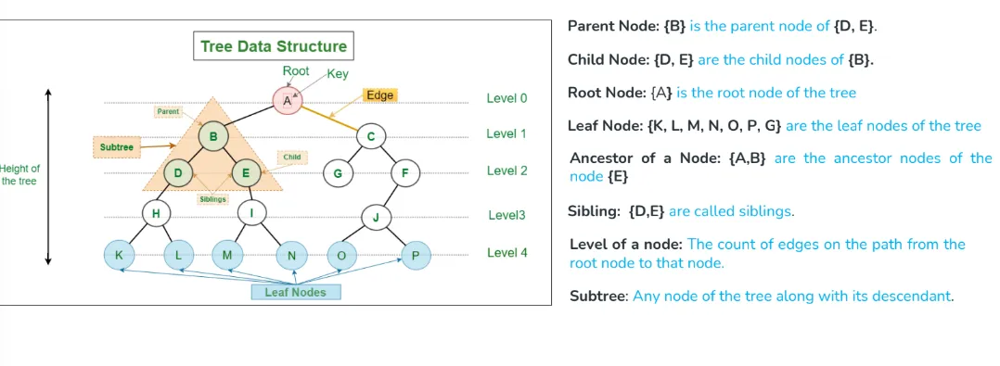
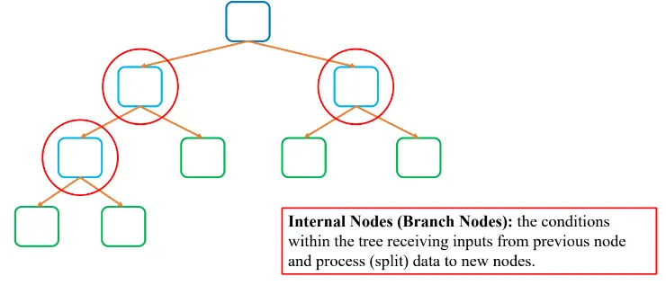
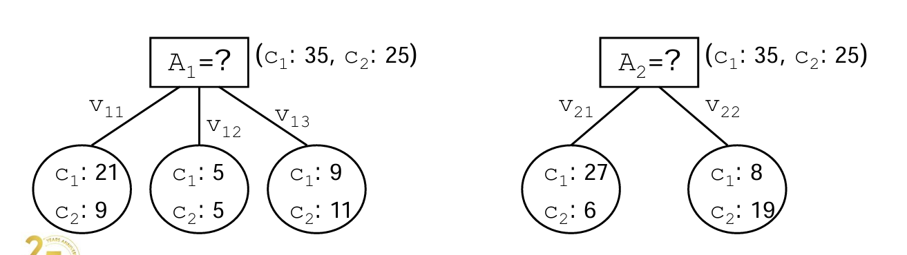
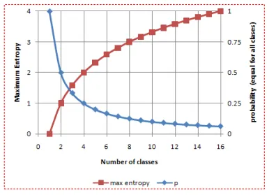
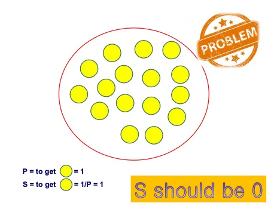
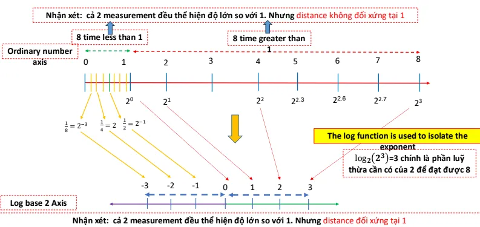
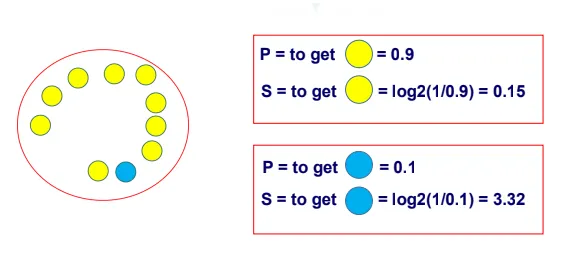
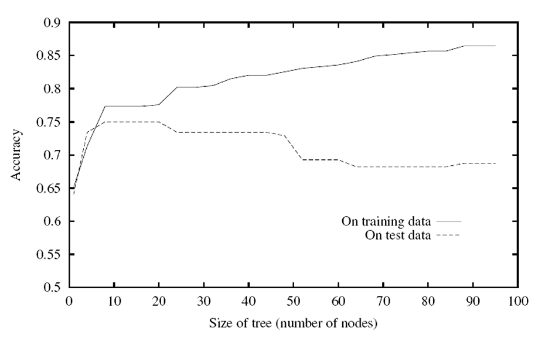
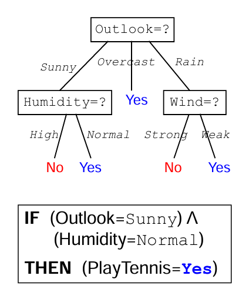

## 1. Introduction

### 1.1. Decision trees

{}
Decision trees là thuật toán supervised.

Một decision tree bao gồm:

+ **Node**: kiểm tra giá trị của một thuộc tính nhất định 
+ **Edge**: tương ứng với kết quả của một kiểm tra và kết nối với nút hoặc lá tiếp theo
+ **Leaves**: node terminal là node dự đoán.

Ngoài ra còn một số tên gọi khác của trees như là:

Người ta dựa trên **độ thuần khiết (Impure/pure)** data để diễn tả việc phân loại có tốt hay không. Độ thuần khiết được định nghĩa nếu bias về một phía.

Có các cách để đo lường độ thuần khiết của một mô hình decision trees:

+ **Gini index**
+ **Entropy**

{}

### 1.2. TDIDT: Top down introduction decision trees

{}
**TDIDT (Top-Down Induction of Decision Trees)** là phương pháp học cây quyết định theo hướng từ trên xuống.

Quá trình học diễn ra theo hai bước chính:
  + **Chia bài toán lớn thành các bài toán con nhỏ hơn** (tạo nhánh dựa trên thuộc tính quan trọng).
  + **Giải quyết từng bài toán con** (lặp lại quá trình cho đến khi đạt điều kiện dừng).

Nói cách khác, cây quyết định sẽ liên tục chia dữ liệu thành các nhóm nhỏ hơn bằng cách chọn thuộc tính quan trọng nhất tại mỗi bước, cho đến khi mỗi nhóm chứa các điểm dữ liệu có cùng nhãn (hoặc gần giống nhau nhất có thể).

{}

## 2. ID3

{}
Xây dựng (học) một cây quyết định theo chiến lược top-down, bắt đầu từ nút gốc

**Ở mỗi nút, chọn thuộc tính kiểm tra** (là thuộc tính có khả năng phân loại tốt nhất đối với các ví dụ học gắn với nút đó)

Tạo mới một cây con **của nút hiện tại** cho mỗi giá trị của thuộc tính kiểm tra, và tập học sẽ được **tách ra (thành các tập con)** tương ứng với cây con vừa tạo.

Quá trình phát triển cây quyết định sẽ tiếp tục cho đến khi:
+ Cây quyết định phân loại hoàn toàn các ví dụ học.
+ Tất cả các thuộc tính đã được sử dụng


  Chú ý: Mỗi thuộc tính chỉ được phép xuất hiện tối đa 1 lần đối với bất kỳ một đường đi nào trong cây.


{}

{}
Thuật toán nhận vào một tập dữ liệu huấn luyện **S** và trả về một cây quyết định **DT**. Quy trình hoạt động như sau:

1.  **Điều kiện dừng:**

    -   Nếu tất cả dữ liệu trong **S** thuộc cùng một lớp **c**, thuật toán trả về một lá (**Leaf Node**) gán nhãn **c**.
2.  **Nếu chưa đạt điều kiện dừng:**

    -   Chọn một thuộc tính **A** để chia dữ liệu.
    -   Tạo một **nút mới (Node)** với **A** làm điều kiện phân chia.
    -   Với mỗi giá trị **vᵢ** của **A**, tạo tập con **Sᵢ** gồm các mẫu dữ liệu có giá trị **A = vᵢ**.
    -   Gọi đệ quy thuật toán ID3 trên từng **Sᵢ** để xây dựng cây con **DTᵢ**.
    -   Kết nối **DT** với các **DTᵢ** bằng các cạnh tương ứng với giá trị **vᵢ**.
{}

### 2.1. Attribute selection 

{}

  Tại mỗi nút, chọn thuộc tính như thế nào để kiểm tra ?


Chọn thuộc tính **quan trọng nhất** cho việc phân lớp các ví dụ học gắn với nút đó.

Làm thế nào để đánh giá khả năng của một thuộc tính đối với việc phân tách các ví dụ học theo nhãn lớp của chúng?

  + Sử dụng một đánh giá thống kê -- **Information Gain**

{}
+ Thuộc tính nào $A\_1$ hay $A\_2$ tốt hơn để phân lớp các ví dụ học?

{}

  

{}

### 2.2. Entropy, Information Gain.

#### 2.2.1. Entropy

{}
**Entropy** đo mức độ hỗn tạp **(impurity/inhomogeneity)** của một tập.

**Entropy** của tập S đối với việc phân lớp có c lớp:

$$ Entropy(S) = - \\sum\_{i=1}^{c} p\_i \\log\_2 p\_i $$

+ trong đó $p_i$ là tỷ lệ các ví dụ trong tập S thuộc vào lớp i.

**Ý nghĩa** của entropy trong lĩnh vực **Information Theory**:

+ Entropy chỉ ra số bits trung bình cần thiết để mã hóa một lớp trong S.
+ Entropy của một message đo giá trị trung bình của lượng thông tin chứa trong message đó.
+ Entropy của một biến ngẫu nhiên x đo mức độ không đoán được x.

{}

{}
S gồm 14 ví dụ, trong đó 9 ví dụ thuộc về lớp $c_1$ và 5 ví dụ thuộc về lớp $c_2$

**Entropy** của tập **S** đối với phân lớp có 2 lớp:
  

$$\textbf{Entropy(S)} = -\left(\frac{9}{14} \log_2 \frac{9}{14} + \frac{5}{14} \log_2 \frac{5}{14} \right) \approx 0.94$$

**Entropy = 0**, nếu tất cả các ví dụ thuộc cùng một lớp (**C₁** hoặc **C₂**).

**Entropy = 1**, nếu số lượng các ví dụ thuộc về lớp **C₁** bằng số lượng các ví dụ thuộc về lớp **C₂**.

**Entropy** thuộc (0,1), nếu như số lượng các ví dụ thuộc về lớp **C₁** khác với số lượng các ví dụ thuộc về lớp **C₂**.

{}

{}

  
Trong trường hợp tệ nhất thì entropy lớn nhất → xác suất các class = nhau


$$ 
-\sum_i^n p_i\log_2(p_i) = -n\bigg(\frac{1}{n}\log_2\frac{1}{n}\bigg) = -\log_2\frac{1}{n} = \log_2n
$$

{}

+ Chúng ta cần một công thức nào đó mà input là xác suất 100% (các class được phân loại hoàn toàn) thì output trả về (aka độ hỗn loại) = 0.

+ Ta có thể xem xác suất xảy ra một sự kiện là $\frac{1}{8}$ thì sẽ bất ngờ hơn 8 lần một sự kiện có xác suất xảy ra là 1. Do ta đang làm việc với con số xác suất từ 0 đến 1, ta cần có một cách đo lường độ lớn của thông tin hay "sự bất ngờ" này → log.

  + **Điều này có thể ví như**: Xác suất bốc được quả bóng màu xanh sẽ có độ bất ngờ cao hơn quả bóng màu vàng.

+ Tách được tích/thương → tổng/hiệu
{}
{}

### 2.2.2. Information Gain

{}
- **Information Gain** của một thuộc tính đối với một tập **S**:
  - Đo mức độ giảm **Entropy** nếu chia **S** theo các giá trị của thuộc tính đó.

- **Information Gain** của thuộc tính **A** đối với tập **S**:

$$
\mathbf{Gain}(S, A) = \mathbf{Entropy}(S) - \sum_{v \in \mathbf{Values}(A)} \frac{|S_v|}{|S|} \mathbf{Entropy}(S_v)
$$

  trong đó **Values(A)** là tập các giá trị có thể của thuộc tính **A**, và
    
$$
\mathbf{S_v} = \{ \mathbf{x} \mid \mathbf{x} \in \mathbf{S}, \ x_A = v \}
$$

- Trong công thức trên, thành phần thứ 2 thể hiện giá trị **Entropy** sau khi tập **S** được phân chia bởi các giá trị của thuộc tính **A**.

  - **Ý nghĩa của Gain(A)**: *Lượng thông tin (trung bình) bị mất nếu chia S theo thuộc tính A*.

{}

{}
+ ID3 tìm kiếm một cây quyết định phù hợp (fits) với tập học, trong không gian các cây quyết định

+ ID3 thực hiện chiến lược tìm kiếm từ đơn giản đến phức tạp, bắt đầu với cây rỗng (empty tree)

+ Quá trình tìm kiếm của ID3 được điều khiển bởi độ đo đánh giá Information Gain

+ ID3 chỉ tìm kiếm một (chứ không phải tất cả các) cây quyết định phù hợp với tập học


ID3 thực hiện tìm kiếm tham lam:

+ Chỉ đảm bảo tìm được lời giải **tối ưu cục bộ (locally optimal solution**) chứ không đảm bảo tìm được lời giải **tối ưu tổng thể (globally optimal solution)**

+ Một khi một thuộc tính được chọn là **thuộc tính kiểm tra** cho một nút, thì ID3 **không** bao giờ **cân nhắc lại** lựa chọn này

{}

### 2.3. GainRatio

{}
-   Đây là một phiên bản cải tiến của *Information Gain*, giúp khắc phục một nhược điểm của nó.
-   Khi một thuộc tính có nhiều giá trị, *Information Gain* có xu hướng ưu tiên chọn thuộc tính đó do số lượng nhánh lớn.
-   *Gain Ratio* điều chỉnh điều này bằng cách chia *Information Gain* cho *Intrinsic Information*---một đại lượng đo lường sự phân tán của dữ liệu dựa trên số lượng nhánh.
-   Công thức: 
$$
GR(S, A) = \frac{Gain(S, A)}{IntI(S, A)}
$$​
-   Điều này giúp tránh việc chọn thuộc tính có quá nhiều giá trị nhưng không mang lại nhiều thông tin thực sự.

{}

### 2.4. Gini index

{}
-   Đây là một cách khác để đo **độ tinh khiết** của một tập dữ liệu, thay vì dùng **Entropy**.

-   Công thức tính độ bất thuần của tập dữ liệu S:

$$
Gini(S) = 1 - \sum_{i} p_i^2
$$

-   Gini càng nhỏ, tập dữ liệu càng tinh khiết (tức là ít hỗn loạn hơn).

-  Khi chia tập dữ liệu theo một thuộc tính A, ta tính *Gini Index trung bình* bằng:

$$
Gini(S, A) = \sum_{i} \frac{|S_i|}{|S|} Gini(S_i)
$$

Khác với *Information Gain*, khi chọn thuộc tính để chia tập dữ liệu, ta **tối thiểu hóa** Gini Index (thay vì tối đa hóa Information Gain).
{}

### 2.4. Vấn đề trong ID3

{}
+ Cây quyết định học được quá phù hợp **(over-fit)** với tập học.
+ Xử lý các thuộc tính có kiểu giá trị liên tục (kiểu số thực)?
+ Các đánh giá phù hợp hơn (tốt hơn Information Gain) đối với việc xác định thuộc tính kiểm tra?
+ Các đánh giá phù hợp hơn (tốt hơn Information Gain) đối với việc xác định thuộc tính kiểm tra?
+ Xử lý các thuộc tính có chi phí (cost) khác nhau?


Cải tiến của giải thuật ID3 với tất cả các vấn đề nêu trên được giải quyết: giải thuật C4.5


{}

## 3. C4.5

{}
Một thuật toán cây quyết định thực tế phải có các đặc điểm sau để áp dụng được vào nhiều tình huống trong thế giới thực:

-   **Hỗ trợ thuộc tính số (numeric attributes)** → Có thể xử lý các giá trị liên tục, không chỉ dữ liệu phân loại.
-   **Chấp nhận giá trị bị thiếu (missing values)** → Không phải lúc nào dữ liệu cũng đầy đủ, thuật toán phải có cách xử lý.
-   **Khả năng chống nhiễu (robust to noise)** → Một số dữ liệu có thể bị sai lệch hoặc không chính xác, thuật toán cần giảm thiểu ảnh hưởng của chúng.
-   **Mô tả các khái niệm phức tạp (approximate arbitrary concepts)** → Có thể mô hình hóa được cả những bài toán phức tạp.

{}

### 3.1. NumericValues

{}
**Vấn đề cần giải quyết**

-   Trong cây quyết định, khi một thuộc tính là **số liên tục (numeric attribute)**, ta không thể chia dữ liệu theo từng giá trị riêng lẻ như với thuộc tính phân loại.
-   Mỗi thuộc tính số có **vô số điểm chia tách (split points)**, làm tăng độ phức tạp khi xây dựng cây quyết định.

**Phương pháp tiếp cận**

Cách tiếp cận phổ biến là sử dụng **chia tách nhị phân (binary splits)**, nghĩa là chỉ chia dữ liệu thành hai nhóm thay vì nhiều nhóm.

**Các bước chọn điểm chia (split point)**

1.  **Tạo danh sách tất cả các điểm chia có thể có**

    -   Với thuộc tính số A, ta sắp xếp tất cả các giá trị của nó theo thứ tự tăng dần.
    -   Xác định các điểm chia nằm giữa hai giá trị liên tiếp.
    -   Ví dụ: Nếu một thuộc tính có các giá trị {2,5,7,10}, các điểm chia tiềm năng có thể là 3.5,6,8.5
2.  **Tính toán Information Gain hoặc Gini Index tại mỗi điểm chia**

    -   Với mỗi điểm chia, phân chia dữ liệu thành hai nhóm:
        -   **Nhóm 1**: Các mẫu có giá trị **≤ điểm chia**.
        -   **Nhóm 2**: Các mẫu có giá trị **> điểm chia**.
    -   Tính toán **Information Gain (hoặc Gini Index)** sau khi chia tách.
3.  **Chọn điểm chia tốt nhất**

    -   Điểm chia có **Information Gain cao nhất** (hoặc **Gini Index thấp nhất**) sẽ được chọn.
    -   Thông tin thu được từ điểm chia tốt nhất sẽ đại diện cho thuộc tính số.
4.  **Xây dựng cây quyết định dựa trên điểm chia tốt nhất**

    -   Tiếp tục áp dụng quá trình này cho các node con đến khi cây hoàn tất.

{}

### 3.2. Missing Values 

{}
**Vấn đề cần giải quyết**

-   Khi một thuộc tính trong tập dữ liệu **bị thiếu giá trị**, làm sao để cây quyết định xử lý nó mà không bị ảnh hưởng đến hiệu suất phân loại?
-   Nếu bỏ qua dữ liệu thiếu, cây quyết định có thể mất đi nhiều thông tin quan trọng.

**Giải pháp tiếp cận**

Thay vì bỏ qua dữ liệu bị thiếu, ta áp dụng **phân chia mẫu thành các phần nhỏ (fractional instances)** để xử lý.

**Các bước xử lý khi thuộc tính bị thiếu giá trị**

1.  **Chia mẫu thành các phần nhỏ (fractional instances)**

    -   Thay vì loại bỏ dữ liệu bị thiếu, ta chia nó thành nhiều bản sao nhỏ hơn (mỗi bản sao đi theo một nhánh của cây).
2.  **Mỗi phần đi theo một nhánh của node**

    -   Nếu node có **n** nhánh, thì mẫu bị thiếu giá trị sẽ được chia thành **n phần**.
3.  **Gán trọng số (weights) cho mỗi phần**

    -   Trọng số của mỗi phần dựa trên **độ phổ biến của nhánh đó**.
    -   Ví dụ: Nếu 70% dữ liệu đã biết đi vào nhánh A và 30% đi vào nhánh B, thì mẫu bị thiếu cũng sẽ chia theo tỷ lệ này.
4.  **Tổng trọng số của tất cả phần luôn bằng 1**

    -   Điều này đảm bảo dữ liệu không bị thay đổi tổng số lượng.

{}
### 3.3. Pruning

{}
Tiếp tục quá trình học cây quyết định sẽ làm tập thử nghiệm giảm độ chính xác đối với mặc dù tăng độ chính xác đối với tập học.

1. 2 chiến lược giảm overfitting.
   + **Ngừng học sớm hơn**, trước khi nó đạt tới cấu trúc cây cho phép phân loại hoàn hảo tập huấn luyện.
   + Học (phát triển) cây đầy đủ (tương ứng với cấu trúc cây hoàn toàn phù hợp đối với tập huấn luyện), và sau đó **thực hiện quá trình tỉa** (to post prune) cây

2. **Chiến lược tỉa cây** đầy đủ (Post-pruning over-fit trees) thường cho hiệu quả tốt hơn trong thực tế.
   + Lý do: Chiến lược "ngừng sớm" việc học cây cần phải đánh giá chính xác được khi nào nên ngừng việc học (phát triển) cây -- **Khó xác định!**
{}

{}
1. Đánh giá hiệu năng phân loại đối với một tập tối ưu (validation set)
  + Đây là phương pháp thường được sử dụng nhất
  + 2 f.f. chính: **reduced-error pruning** and **rule post pruning**

2. Áp dụng một thí nghiệm thống kê **(vd: chi-square test)** để đánh giá xem việc mở rộng (hay cắt tỉa) một nút có giúp cải thiện hiệu năng đối với tập huấn luyện.

3. Đánh giá độ phức tạp của việc mã hóa các ví dụ học và cây quyết định, và ngừng việc học (phát triển) cây quyết định khi kích thước của việc mã hóa này là tối thiểu.
  + Dựa trên nguyên lý Minimum Description Length (MDL)
  + Cần cực tiểu hóa: size(tree) + size(misclassifications(tree))

{}

{}

- Mỗi nút của cây (khớp hoàn toàn) được kiểm tra để cắt tỉa 

- Một nút sẽ bị cắt tỉa nếu cây (sau khi cắt tỉa nút đó) đạt được hiệu năng không tồi hơn cây ban đầu đối với tập tối ưu (validation set) 
  
- Cắt tỉa một nút bao gồm các việc: 
  - Loại bỏ toàn bộ cây con (sub-tree) gắn với nút bị cắt tỉa 
  - Chuyển nút bị cắt tỉa thành một nút lá (nhãn phân lớp) 
  - Gắn với nút lá này (nút bị cắt tỉa) nhãn lớp chiếm số đông trong tập huấn luyện gắn với nút đó 
  - 
- Lặp lại việc cắt tỉa các nút 
  - Luôn lựa chọn một nút mà việc cắt tỉa nút đó tối đa hóa khả năng phân loại của cây quyết định đối với tập tối ưu (validation set) 
  - Kết thúc, khi việc cắt tỉa thêm nút làm giảm khả năng phân loại của cây quyết định đối với tập tối ưu (validation set)
{}

{}

- Học (phát triển) cây quyết định hoàn toàn phù hợp với tập huấn luyện 

- Chuyển biểu diễn cây quyết định học được thành một tập các luật tương ứng (tạo một luật cho mỗi đường đi từ nút gốc đến một nút lá) 

- Rút gọn (tổng quát hóa) mỗi luật (độc lập với các luật khác), bằng cách loại bỏ bất kỳ điều kiện nào giúp mang lại sự cải thiện về hiệu quả phân loại của luật đó 

- Sắp xếp các luật đã rút gọn theo khả năng (hiệu quả) phân loại, và sử dụng thứ tự này cho việc phân loại các ví dụ trong tương lai

{}