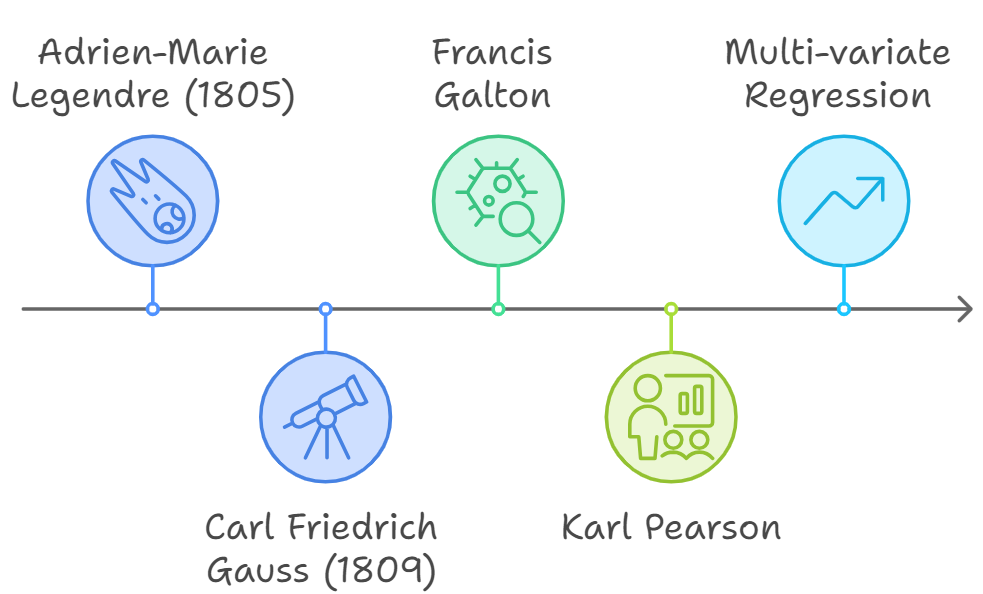
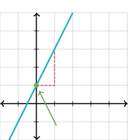
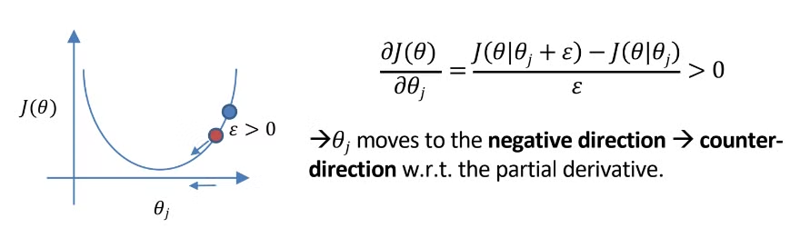
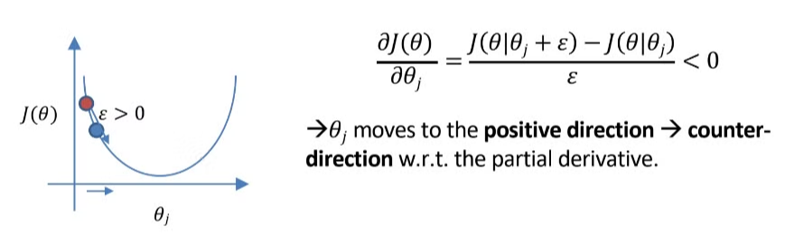

## Introduction

**Linear Regression** là một trong những phương pháp cổ điển và nền tảng nhất trong thống kê và học máy, với lịch sử phát triển lâu đời từ đầu thế kỷ 19. 



Ý tưởng cơ bản của nó xuất hiện với tên gọi **Least Squares (bình phương tối tiểu/bình phương nhỏ nhất)** khi nhà toán học người Pháp **Adrien-Marie Legendre** (1805) và nhà thiên văn học **Carl Friedrich Gauss** (1809) sử dụng phương pháp này để dự đoán quỹ đạo của các thiên thể (chủ yếu là sao chổi, sau đó là các tiểu hành tinh xung quanh Trái Đất). 

Sau đó thuật ngữ **Regression** (Hồi quy) mới được **Francis Galton** sử dụng để ứng dụng vào sinh học và phát triển các khái niệm như **hệ số tương quan (correlation coefficient)** và **Regression toward the mean**. Về sau chúng được **Udny Yule** và **Karl Pearson** mở rộng một cách tổng quát.

Vào những năm 1950 và 1960, các nhà kinh tế học đã sử dụng máy tính để bàn cho việc tính toán hồi quy. Trước năm 1970, đôi khi phải mất tới 24 giờ để nhận được kết quả.

](image%201.png)

The Italian Programma 101, an early commercial programmable calculator produced by Olivetti in 1964 - [wikipedia.org](https://en.wikipedia.org/wiki/Calculator#Precursors_to_the_electronic_calculator)

### Một ví dụ về bài toán Linear Regression.
    
Hãy tưởng tượng bạn là quản lý nhân sự và cần dự đoán tiền lương của nhân viên dựa trên số năm kinh nghiệm của họ. Bạn có một vài thông tin về mức lương và số năm kinh nghiệm của một số nhân viên, và bây giờ bạn muốn dựa vào đó để dự đoán mức lương cho những nhân viên khác.

Để trực quan hóa, ta gọi số năm kinh nghiệm là ($x$) và số tiền lương là ($y$). Khi đó, với một vài thông tin cho trước của một vài nhân viên, ta có thể sử dụng trục đồ thị $Oxy$ để trực quan hóa dữ liệu như hình sau:

](image%202.png)

Nguồn: [AI Việt Nam](https://drive.google.com/file/d/1wJPfRJ1vdGfCSLCoymLmzhLLIsOxui8r/view?fbclid=IwY2xjawFwkJJleHRuA2FlbQIxMAABHcQR6X69cg-V5EzAwxE_Z4NINrlM_s7G1l65KiHPu_WBtJfRKk2x4XHGxw_aem_zw3qi6fKXp0h6I_RdnhFQw)
    
{}

- **Linear Regression**:
    - Dự đoán giá trị liên tục.
    - Kết quả đầu ra là một số thực vô hạn, có thể âm hoặc dương.
    - Phù hợp cho các bài toán dự đoán giá trị như dự đoán doanh thu, giá nhà.
- **Logistic Regression**:
    - Dự đoán xác suất, dùng để **phân loại**.
    - Kết quả đầu ra là giá trị trong khoảng từ 0 đến 1, hoặc phân loại hữu hạn như 0/1 (Yes/No).
    - Phù hợp cho các bài toán phân loại nhị phân như xác định email spam hay không, bệnh nhân có bệnh hay không.
    
    ](image%203.png)
    
    Nguồn: [https://x.com/YuHelenYu/status/1455747442662596608](https://x.com/YuHelenYu/status/1455747442662596608)
    

$$
y = \theta_0 + \theta_1x_1 + \theta_2x_2 + ... + \theta_dx_d  = \sum^d_{i = 0} \theta_ix_i
$$


{}

{}
    Hồi quy tuyến tính đa biến.

- **$\theta_0$ được gọi là gì (3 cách gọi tiếng anh khác nhau)? Tại sao không có $x_0$ đi kèm?**
    - Bias : độ lệch, thiên kiến
    - Intercept : hệ số chặn hoặc hệ số tự do
    
    Ta mặc định $x_0 = 1$, khi đó chỉ còn phụ thuộc hoàn toàn vào $\theta_0$. Độ lớn của $\theta_0$ chính là độ lớn mà đường hồi quy cắt trục $Oy$.
    
    

- $x_i$ **được gọi là gì?**
    
    $x_i$ được gọi là **features** (các đặc trưng) hoặc **independent variables** (biến độc lập) là những giá trị mà mô hình sử dụng để dự đoán giá trị đầu ra $y$. Nghĩa là nếu ký hiệu $x_d$ nghĩa là ta có $d$ dimensions / $d$ features.
    
    Một số cách gọi khác cho $x_i$ trong tiếng Anh bao gồm:
    
    - **Predictors**: Biến dùng để dự đoán giá trị đầu ra.
    - **Explanatory variables**: Biến giải thích, vì nó giúp giải thích sự thay đổi của $y$.
    - **Input variables**: Biến đầu vào trong mô hình học máy.
    
    > Ví dụ bộ dữ liệu về giá nhà có 2 cột là chiều dài và chiều rộng → $x_1$ và $x_2$.
    > 
    
    Dĩ nhiên là một cột thì sẽ có nhiều giá trị, tương ứng với chiều dài và chiều rộng của nhiều căn nhà khác nhau. Sau này để phân biệt một cách rạch ròi, một số sách sẽ ký hiệu: 
    
    - $x_i$ để chỉ cho 1 giá trị duy nhất, ví dụ $x_1 = 10, x_2 = 5$
    - $\mathrm x_i$ để chỉ cho 1 vector cột, gồm nhiều giá trị:
    
    $$
    \mathrm x_1 = \begin{bmatrix} 10\\ 20 \\ 13\end{bmatrix}
    $$
    
    Tương ứng với chiều dài của căn nhà thứ 1 là 10, chiều dài căn nhà thứ 2 là 20 và chiều dài căn nhà thứ 3 là 13.

{}
    
     
    

    

    
- **Tại sao người ta gọi $x_i$ là các biến độc lập?**
    
    Từ độc lập ở đây xuất phát từ điều kiện của Hồi quy tuyến tính, bắt buộc các $x_i$ phải độc lập với nhau.
    
    Trong nhiều trường hợp, các **đặc trưng (features)** $x_i$ được giả định là **độc lập với nhau**. Điều này có nghĩa là các biến $x_i$ không có mối quan hệ trực tiếp hoặc tương quan cao với nhau, tức là không có biến nào có thể được biểu diễn dưới dạng một hàm tuyến tính của các biến khác. Đây là một giả định quan trọng trong nhiều mô hình hồi quy tuyến tính để tránh vấn đề **đa cộng tuyến** (multicollinearity), nơi mà mối quan hệ tuyến tính mạnh giữa các biến đầu vào có thể làm cho việc ước lượng các hệ số $\theta_i$ trở nên không ổn định.
    
- $y$ **được gọi là gì?**
    
    
    
- **Hãy miêu tả dataset sau dưới dạng phương trình hồi quy tuyến tính**
    
    $$
    y = \theta_0 + \theta_1x_1+ \theta_2x_2 + \theta_3x_3
    $$
    
    ](438e4f8a-da0b-48ef-8041-a67560fdb94a.png)
    
    Nguồn: [https://www.researchgate.net/figure/A-simulated-dataset-of-100-observations-from-a-multiple-linear-regression-consisting-of-3_tbl1_337882697](https://www.researchgate.net/figure/A-simulated-dataset-of-100-observations-from-a-multiple-linear-regression-consisting-of-3_tbl1_337882697)
    
- **Giả sử bài toán hồi quy của chúng ta có 2 features, khi đó công thức được viết như thế nào? Hình dạng của hàm hồi quy sẽ như thế nào?**
    
    $$
    y = \theta_0 + \theta_1x_1 + \theta_2x_2
    $$
    
    
    
- **Từ câu trên, để có thể vẽ hình trực quan thì chúng ta chỉ có thể vẽ được bao nhiêu feature?**
    
    Tối đa là 2 feature
    
    ](image%205.png)
    
    Nguồn: [https://thaddeus-segura.com/multiple-linear/](https://thaddeus-segura.com/multiple-linear/)
    
    Nếu có **nhiều hơn 2 feature**, việc vẽ trực quan trở nên khó khăn, vì chúng ta không thể trực quan hóa không gian với nhiều chiều (trên 3D) trên mặt phẳng thông thường. Trong trường hợp này, các kỹ thuật trực quan hóa khác như **giảm chiều** (dimensionality reduction) hoặc biểu đồ cặp (pair plots) được sử dụng để xem xét mối quan hệ giữa các đặc trưng và đầu ra trong không gian 2D.
    
- **Giữa $x$ và $\theta$ giá trị nào đã biết, giá trị nào cần tìm?**
    
    **Đã biết:** 
    
    - $x$ và $y$
    
    **Cần tìm:**
    
    - $\theta$ là biến cần tìm.
        
        Đây là các tham số của mô hình mà bạn cần ước lượng thông qua quá trình huấn luyện. Mục tiêu của hồi quy tuyến tính là tìm ra các giá trị $\theta$ sao cho dự đoán $y$ từ $x$ là chính xác nhất.
        
- **Trong trường hợp tổng quát, nếu chỉ sử dụng đường thẳng để cắt qua các điểm dữ liệu thì ta có thể tìm được bao nhiêu đường thẳng?**
    
    Trong trường hợp tổng quát, nếu chỉ sử dụng **một đường thẳng** để cắt qua các điểm dữ liệu, thì về lý thuyết, ta có thể tìm được **vô số đường thẳng**.
    
    - Có rất nhiều cách chọn độ dốc $\theta_1$ và hệ số tự do $\theta_0$ để tạo ra các đường thẳng khác nhau. Chỉ cần thay đổi giá trị $\theta_1$ và $\theta_0$, ta sẽ có một đường thẳng khác.
        
        
        
- **Vậy ta có thể tìm được một đường thẳng đi qua hết tất cả các điểm dữ liệu trong thực tế không? Và mục tiêu của chúng ta có phải là tìm được hàm số đi qua hết toàn bộ điểm đó không?**
    
    Có thể, nhưng không phải dùng đường thẳng tuyến tính mà dùng Polynomial.
    
    Trong thực tế nếu polynomial đi qua hết toàn bộ điểm sẽ bị overfit → thay vì học pattern tổng quát → nó học luôn cả nhiễu.
    

<aside>
📌

Vậy mục tiêu không phải là làm sao cho đường thẳng đi qua toàn bộ các điểm, nghĩa là có độ chính xác tuyệt đối, mà ta chỉ cần một đường thẳng cho được độ chính xác tương đối. Nhưng theo một nghĩa nào đó (trường hợp tổng quát), nó lại là đường thẳng tốt nhất.

</aside>

- **Đường thẳng fit với dataset như thế nào được gọi là tốt?**
    
    Mục tiêu của hồi quy tuyến tính là tìm **một đường thẳng tối ưu** nhất. Đường thẳng tối ưu này sẽ là đường thẳng **tối thiểu hóa tổng khoảng cách (loss)** từ các điểm dữ liệu đến đường thẳng, tức là đường thẳng có giá trị **Mean Squared Error (MSE)** nhỏ nhất.
    
    Do đó, mặc dù về lý thuyết có thể tìm được vô số đường thẳng, nhưng ta chỉ tìm **một** đường thẳng tốt nhất cho bài toán dự đoán thông qua quá trình tối ưu hóa (ví dụ: sử dụng Gradient Descent).
    
- **Ý tưởng của Linear Regression là gì? Làm sao để “fit a line through all datapoints”?**
    - Dịch chuyển, nâng lên, hạ xuống, xoay sao cho MSE nhỏ nhất
- **Khi thay đổi hệ số slope $\theta_1, \theta_2,...$ thì điều gì sẽ xảy ra?**
    
    Đường thẳng sẽ xoay 
    
    
    
- **Khi thay đổi hệ số intercept $\theta_0$ thì điều gì sẽ xảy ra?**
    
    Đường thẳng sẽ nâng lên, hạ xuống
    
    
    
- **Ban đầu $\theta$ được chọn như thế nào?**
    
    Ban đầu, các tham số $\theta$ thường được khởi tạo ngẫu nhiên hoặc bằng các giá trị mặc định trong quá trình huấn luyện mô hình. Việc khởi tạo này không ảnh hưởng nhiều đến kết quả cuối cùng, vì các thuật toán tối ưu hóa như **Gradient Descent** sẽ điều chỉnh các giá trị
    
    $\theta$ theo từng bước để tối thiểu hóa hàm mất mát (loss function). 
    
    Nếu may mắn khởi tạo gần với giá trị chính xác, việc hội tụ có thể dễ dàng và xảy ra nhanh hơn.
    
    - Random
    - Nhưng mà việc random có ảnh hưởng đến kết quả tìm nghiệm. Một số thuật toán có thể hỗ trợ như Markov, Latin Hypercube Sampling, hoặc khởi tạo theo một số phân phối (Uniform, Gauss)
    - Hoặc bạn đã có domain knowledge về những hệ số, bạn có thể random bằng những con số đó (Xem ví dụ về bài toán tính giá tiền taxi).
- **Khoảng cách từ giá trị thực tế đến giá trị dự đoán gọi là gì?**
    
    Khoảng cách từ giá trị thực tế đến giá trị dự đoán trong hồi quy gọi là **sai số (residual)**.
    
    Cụ thể, sai số là hiệu giữa giá trị thực tế $y$ và giá trị dự đoán $\hat{y}$ của mô hình:
    
    $$
    \text{Residual} = y - \hat{y}
    $$
    
    Sai số thể hiện sự khác biệt giữa dữ liệu thực tế và giá trị mà mô hình dự đoán. Trong các bài toán hồi quy, mục tiêu của mô hình là tối thiểu hóa tổng các sai số (thông qua các chỉ số như **Mean Squared Error - MSE**) để cải thiện độ chính xác của dự đoán.
    
    ](image%209.png)
    
    Nguồn: [https://www.statology.org/residuals/](https://www.statology.org/residuals/)
    


- **Ta đang muốn tìm khoảng cách từ giá trị** **thực tế đến giá trị dự đoán sao cho ngắn nhất. Vậy có phải ta chỉ cần chiếu vuông góc điểm dữ liệu xuống đường hồi quy giống hình trên là tìm được khoảng cách ngắn nhất không?**
    
    Không, nhận định trên là sai về cách Hồi quy tuyến tính hoạt động.
    
    Tuy khoảng cách ngắn nhất giữa điểm thực tế và đường hồi quy chính là **khoảng cách vuông góc** từ điểm dữ liệu đó đến đường hồi quy, nhưng trong các bài toán hồi quy tuyến tính, mô hình tìm **khoảng cách theo chiều dọc** (đo từ điểm thực tế đến đường hồi quy dọc theo trục $y$) thay vì khoảng cách vuông góc giữa các điểm. 
    
    Nếu bạn áp dụng kỹ thuật như **PCA (Principal Component Analysis)** hoặc các phương pháp khác nhằm tìm thành phần chính chính, lúc đó khoảng cách vuông góc này mới có thể là tiêu chuẩn để đánh giá.
    
- **Ta sử dụng gì để đánh giá đường thẳng có “fit” với các điểm dữ liệu tốt hay không?**
    
    Dùng loss function.
    
    Sau khi training xong, việc sử dụng các công thức khác ngoài loss function để đánh giá gọi chung là metrics.
    
    Trong thực tế, **MSE** và **$R^2$** là hai metrics phổ biến nhất để đánh giá độ tốt của mô hình hồi quy tuyến tính. 
    
- **Giải thích định nghĩa hàm mất mát “loss function” và kể tên một số hàm mất mát thông dụng**
    
    **Hàm mất mát (Loss Function)** là một hàm số dùng để đo lường mức độ khác biệt giữa giá trị dự đoán của mô hình và giá trị thực tế. Mục tiêu của việc huấn luyện mô hình là tìm ra các tham số (weights) sao cho hàm mất mát này được tối thiểu hóa, tức là dự đoán của mô hình càng gần với giá trị thực tế càng tốt.
    
    Hàm mất mát thường phụ thuộc vào loại bài toán:
    
    - **Bài toán hồi quy (Regression)**: Hàm mất mát đo lường độ chênh lệch giữa các giá trị liên tục.
    - **Bài toán phân loại (Classification)**: Hàm mất mát đo lường độ chênh lệch giữa nhãn dự đoán và nhãn thực tế.
    
    ### Một số hàm mất mát thông dụng
    
    - Mean Squared Error (MSE)
    - Mean Absolute Error (MAE)
    - Root Mean Squared Error (RMSE)
    - Hinge Loss → $\mathcal L(y, \hat y) = \max(0, 1 - y\hat y)$
    Thường được sử dụng trong các mô hình phân loại nhị phân, đặc biệt là **SVM (Support Vector Machines)**. Hàm này phạt khi điểm dự đoán không nằm đủ xa so với đường biên phân loại.
    - Cross-Entropy Loss (Log Loss)
    - Kullback-Leibler Divergence (KL Divergence)
    - Huber Loss
        
        $$
        L_\delta(a)= \begin{cases}\frac{1}{2}(a)^2 & \text { for }|a| \leq \delta \\ \delta\left(|a|-\frac{1}{2} \delta\right) & \text { for }|a|>\delta\end{cases}
        $$
        
        Kết hợp giữa MAE và MSE. Nó hoạt động như MSE khi sai số nhỏ và như MAE khi sai số lớn, giúp giảm thiểu sự nhạy cảm với các ngoại lệ mà vẫn đảm bảo mô hình phản hồi tốt với sai số nhỏ.
        
- **Loss function và Error function khác nhau ở điểm nào?**
    
    Thông thường thì 2 cách gọi như nhau và có thể thay thế cho nhau. Chỉ có ông Bishop - Pattern Regconition → Một trong những cuốn viết ML theo toán học xác suất khó nhất là đi phân biệt 2 thằng này.
    
    Mình chưa hiểu rõ ý tác giả lắm chỗ này, nên mình sẽ đưa ra 2 ý kiến:
    
    1. **Loss function** thường được áp dụng cho **một mẫu dữ liệu** hoặc **một điểm dữ liệu**, và nó đo lường sai số của một giá trị đầu ra so với giá trị thực tế. **Error function** thường là tổng hoặc trung bình của tất cả các giá trị của **loss function trên toàn bộ tập dữ liệu**. Nó được sử dụng như một hàm mục tiêu tổng quát để tối ưu hóa toàn bộ mô hình.
    2. Loss function thường được dùng để tối ưu, training để tìm ra tham số. Còn các hàm error thường được dùng như các metrics để đánh giá hiệu suất kết quả.
- **Giải thích công thức Mean Square Error**
    
    Thay vì lấy tổng độ lệch (có giá trị âm và dương), các sai số này sẽ triệt tiêu lẫn nhau khiến cho giá trị này về 0 (không có lỗi) mặc dù trên thực tế, dự đoán của mô hình có thể rất kém chính xác. 
    
    Do đó người ta sẽ cân nhắc lựa chọn giữa lấy trung bình trị tuyệt đối hoặc bình phương. Thông dụng nhất ta sẽ dùng bình phương vì các tính chất đẹp của hàm số này.
    
- **Tại sao MSE dùng bình phương độ lệch mà không dùng giá trị tuyệt đối? Khi nào nên dùng MAE, khi nào nên dùng MSE?**
    
    Hint:
    
    1. 
    
    [AI VIET NAM](https://www.facebook.com/aivietnam.edu.vn/posts/pfbid02MpLuz1wcN4HSt9Qbx9AXBP1smDVC4SZWerVXme6MjihXawbN3EQyvpJAQAXdJj22l)
    
    1. 
    
    [AI VIET NAM](https://www.facebook.com/aivietnam.edu.vn/posts/pfbid05LRpL41MwJKaM2HH2UvhdoU7ysZzYkevNSRSP9cUQUASSJi1fGaPCLibvkHtbdjMl)
    
- **Giải thích hình vẽ sau, tại sao với các hệ số này thì ra được dạng hình vẽ đó?**
    
    
    
- **Giải thích công thức Loss function**
    
    $$
    h_\theta(x) = \theta_0 + \theta_1x
    $$
    
    $$
    J(\theta) = \frac{1}{2n} \sum_{i = 1}^n \bigg(h_\theta(x^{(i)}) - y^{(i)}\bigg)^2
    $$
    
    1. Tại sao người ta lại đổi ký hiệu từ $y$ → $h_\theta(x)$?
    2. $x^{(i)}$ , $y^{(i)}$ là gì?
    3. Với mỗi $x^{(i)}$, $h_\theta(x^{(i)})$  trả về kết quả là gì?
    4. Tại sao lại chia cho $\frac{1}{n}$?
    5. Tại sao lại lại chia cho $\frac{1}{2}$? (Hint: liên quan đến 2 câu dưới)
- **Máy tính Casio thường dùng cách nào để giải nghiệm?**
    - Đôi lúc sẽ là random, chạy toàn bộ các số gần đó. Ví dụ phương trình của bạn có 2 nghiệm 1 và -1. Bạn nhập vào 0.9 nó sẽ trả về nghiệm là 1, nhập vào -0.2 nó sẽ trả về -1.
- **Ta có thể tìm nghiệm giống máy tính Casio không?**
    
    Không nên, vì rất tốn thời gian, bộ nhớ. Nghiệm tìm được chưa chắc là global minimum.
    
- **Điều kiện của các features để có thể thực hiện Linear Regression là gì?**
    - **Mối quan hệ tuyến tính** giữa biến độc lập $x$ và biến phụ thuộc $y$.
    - **Không có đa cộng tuyến** (Multicollinearity thấp) giữa các biến độc lập $x_i$.
    - **Phân phối chuẩn** của sai số (residuals) $\varepsilon$.
    - **Phương sai không đổi** (Homoskedasticity).
    - **Các quan sát độc lập** với nhau.

<aside>
📌

Nếu được thì các bạn nên tìm hiểu cách giải hệ phương trình tuyến tính bằng phương pháp khử Gauss-Jordan để hiểu tại sao cần phải có điều kiện độc lập tuyến tính hoặc phải có các bước tiền xử lý như loại bỏ duplicate giữa các dòng để có thể giải được nghiệm.

[Bài tập: Giải hệ phương trình tuyến tính](https://www.notion.so/B-i-t-p-Gi-i-h-ph-ng-tr-nh-tuy-n-t-nh-17ce9755c5d08186ba82f81a993751c9?pvs=21) 

</aside>

- **Trong bài toán thực tế khi ta có rất nhiều features, liệu ta có thể thực hiện Linear Regression không?**
    
    Không, vì số features càng lớn, khả năng xuất hiện sự phụ thuộc càng nhiều. Khi đó khả năng tồn tại nghiệm rất thấp.
    
- **Tại sao ta có thể xem bài toán Linear Regression như một bài toán tối ưu?**
    
    Bài toán tìm max / min cho Loss function được xem là một bài toán tối ưu.
    
- **Công thức nghiệm chính xác của bài toán Linear Regression là gì?**
    
    $$
    \hat{\beta}=\left(X^T X\right)^{-1} X^T y
    $$
    
- **Chứng minh công thức trên**
    1. Không cần quan tâm đến hàm loss
        
        $$
        \begin{align*} y & = X\theta \\ X^Ty & = X^TX\theta \\ (X^TX)^{-1}X^T&y = (X^TX)^{-1} X^TX\theta\end{align*}
        $$
        
        $$
        \theta = (X^TX)^{-1}X^Ty
        $$
        
    2. Nếu suy ra từ hàm loss MSE 
        
        $$
        \begin{aligned}
        & J(\theta)=\left(\ (X \theta)^T-y^T\right)(X \theta-y) \\
        & J(\theta)=(X \theta)^T X \theta-(X \theta)^T y-y^T(X \theta)+y^T y \\
        & J(\theta)=\theta^T X^T X \theta-2(X \theta)^T y+y^T y
        \end{aligned}
        $$
        
        Lấy đạo hàm theo $\theta$, ta ra được nghiệm chính xác tương tự
        
        $$
        \begin{aligned}
        & \frac{\partial J}{\partial \theta}=2 X^T X \theta-2 X^T y=0 \\
        & X^T X \theta=X^T y \\
        & \theta=\left(X^T X\right)^{-1} X^T y
        \end{aligned}
        $$
        
- **Trên lý thuyết để tìm min/max của một hàm số người ta thường làm gì?**
    - Tính đạo hàm
- **Việc tính đạo hàm bậc 1 để tìm điểm minimum trong Linear Regression có đủ không?**
    
    Trong trường hợp tổng quát, việc tính đạo hàm bậc 1 và cho nó = 0 để tìm nghiệm chỉ là điều kiện cần. Một điểm có đạo hàm bằng 0 vừa có thể là minimum vừa là maximum.
    
    Để tìm minimum của một hàm số bất kì thật ra ta phải tính thêm đạo hàm bậc 2.
    
    Tuy nhiên do hàm mục tiêu của Linear Regression aka MSE là hàm Convex. Tính chất của hàm này là không có maximum mà chỉ có minimum và cũng là global minimum. Do đó chỉ cần tính đạo hàm bậc 1 là đủ.
    
    ](image%2011.png)
    
    [https://towardsdatascience.com/understanding-the-3-most-common-loss-functions-for-machine-learning-regression-23e0ef3e14d3](https://towardsdatascience.com/understanding-the-3-most-common-loss-functions-for-machine-learning-regression-23e0ef3e14d3)
    

<aside>
📌

Lưu ý rằng đạo hàm ở đây là tính theo công thức có sẵn, ví dụ như $(x^2)' = 2x$ chứ không phải như trong máy tính.

</aside>

- **Điểm yếu của việc tính đạo hàm để giải nghiệm chính xác là gì? Tại sao trong ML ngta không dùng đạo hàm để giải nghiệm chính xác?**
    1. Không thể tính toán trong các hàm số không khả vi (non-differentiable problems).
    2. Hoặc là giả sử mô hình có công thức quá phức tạp → không có công thức hoặc quá phức tạp để đạo hàm.
    3. Đạo hàm bậc hai khó tính và tính siêu lâu.
    4. Nếu có xảy ra sự phụ thuộc tuyến tính → không tồn tại nghiệm chính xác.
    5. Cách tính đạo hàm thủ công theo công thức phụ thuộc vào biểu thức cụ thể của hàm số. Khi hàm mục tiêu thay đổi hoặc có thêm biến, các công thức này phải được tính lại một cách thủ công, điều này không linh hoạt trong các hệ thống Machine Learning.
- **Polynomial Regression là gì? Công thức?**
    
    **Polynomial Regression** là một dạng mở rộng của **Linear Regression**, trong đó mối quan hệ giữa biến độc lập $x$ và biến phụ thuộc $y$ không chỉ là một đường thẳng, mà là một hàm **đa thức** (polynomial) bậc cao. 
    
    Điều này cho phép mô hình hồi quy có thể fit tốt hơn với các dữ liệu phi tuyến, bằng cách thêm các bậc cao hơn của biến độc lập.
    
    $$
    y = w_0 + w_1x + w_2x^2 + w_3x^3 + w_4x^4 + w_5x^5
    $$
    
- **Tuyến tính trong Linear Regression để chỉ điều gì? Polynomial Regression có được gọi là tuyến tính không?**
    
    **Tuyến tính trong Linear Regression** không chỉ đến việc số mũ của các biến độc lập, mà thực ra nó chỉ rằng **mối quan hệ giữa các tham số (hệ số hồi quy) và biến phụ thuộc là tuyến tính**. Nghĩa là đang xét đến mối quan hệ giữa $\theta$ và $y$.
    
    Điều này khác với mối quan hệ giữa $x$ và $y$.
    
    Do vậy nên **Polynomial Regression vẫn được gọi là Linear Regression**.
    
    Vậy chỉ khi ta đổi $\theta$ sang $\theta^2$ hoặc $\sin(\theta)$ thì khi đó mới gọi là Hồi quy phi tuyến.
    
- **Nếu tăng số bậc của $x \to x^2$ thì có còn được gọi là Linear Regression không?**
    
    Còn, vẫn được xem là Linear Regression.
    
- **Giải thích Global minimum và local minimum**
    
    Global : minimum nhỏ nhất trong toàn bộ minimum
    
    Local : chỉ cần là minimum
    
    
    
- **Khi thực hiện Linear Regression với bậc đa thức là bậc 1 và chỉ có 1 feature duy nhất thì hàm loss có xuất hiện local minimum không? Tại sao?**
    - Có duy nhất 1 thg minimum, vừa là local vừa là global minimum
- **Khi thực hiện Linear Regression với bậc đa thức ≥ 1, và có nhiều hơn 1 feature thì có xuất hiện local minimum không? Tại sao?**
    
    $$
    h_\theta(x) = \theta_0 + \theta_1x_1 + \theta_2x_2+...
    $$
    
    - Không luôn, vì bậc của đa thức là bậc 1.
    - Local minimum chỉ xảy ra nếu ta tăng bậc của $\theta$ dẫn đến nhiều nghiệm xảy ra, không liên quan đến việc tăng bậc của $x$.
    
    
    

<aside>
📌

Vậy do hàm mục tiêu (MSE) của chúng ta là hàm convex, do đó bài toàn Linear Regression nếu có nghiệm thì nó luôn có 1 nghiệm duy nhất và là global minimum. 

</aside>

<aside>
📌

Ta chỉ gặp hiện tượng local minimum khi sử dụng các thuật toán có độ phức tạp cao, sử dụng các hàm phi tuyến lên trọng số $w$ aka Deep Neural Network.

</aside>

- **Trong ML để tìm điểm tối ưu người ta dùng thuật toán gì? Giải thích tên gọi của thuật toán đó. Tại sao lại có dấu `(-)` trong công thức?**
    
    
    
    <aside>
    📌
    
    Gradient descent : ngược chiều vector đạo hàm riêng
    
    </aside>
    
    $\theta_j$ luôn chỉ về hướng tăng tại vì đạo hàm nghĩa là quãng đường (độ dời) đi được trong một đơn vị (thời gian /  khoảng cách $\varepsilon$)
    
    <aside>
    📌
    
    Do đó, bạn để ý trong công thức sẽ có $J(\theta|\theta_j +\varepsilon)$ chứ không phải $J(\theta|\theta_j -\varepsilon)$.
    
    Bạn để ý trục hoành cộng vào $\theta_j +\varepsilon$ → tăng lên → đi theo chiều dương
    
    </aside>
    
    Mục tiêu của mình là tăng hoặc giảm $\theta$ sao cho hàm loss $J$ đạt điểm cực tiểu.
    
    Vậy tại một giá trị $\theta$ bất kì, ta sẽ có 2 trường hợp:
    
    
    
    Trường hợp 1: 
    
    
    
    - Điểm màu đỏ → giá trị loss $J$ tại điểm $\theta$
    - Điểm màu xanh → giá trị loss $J$ tại điểm $\theta + \varepsilon$
    
    <aside>
    📌
    
    Bạn để ý trục tung $J(\theta|\theta_j + \varepsilon)$ lớn hơn $J(\theta|\theta_j)$ aka điểm màu xanh có giá trị lớn hơn điểm màu đó.
    
    Nghĩa là khi ta tăng giá trị trục hoành $\theta$  lên một đoạn $\varepsilon$ → loss tăng
    
    Do đó ta phải giảm giá trị của $\theta$  tương đương với đi ngược lại chiều đang tăng của đạo hàm loss $J$. 
    
    </aside>
    
    TH2 : 
    
    
    
    Tương tự, để tính đạo hàm thì ta phải tính $J(\theta|\theta_j + \varepsilon) - J(\theta|\theta_j)$.
    
    - Điểm màu đỏ → giá trị loss $J$ tại điểm $\theta$
    - Điểm màu xanh → giá trị loss $J$ tại điểm $\theta + \varepsilon$
    
    <aside>
    📌
    
    Lấy điểm màu xanh - điểm màu đỏ → đạo hàm < 0.
    
    Tuy nhiên nó đang đi đúng hướng, đang giảm loss, do đó ta cần tiếp tục tăng $\theta$
    
    Thêm dấu trừ vào để đạo hàm nó dương.
    
    </aside>
    
- **Khi tính đạo hàm cho nhiều biến, cách người ta làm là gì?**
    
    Khi tính đạo hàm cho các hàm có **nhiều biến** (multivariate functions), người ta sử dụng **đạo hàm riêng (partial derivatives)**. Đạo hàm riêng cho phép tính tốc độ thay đổi của hàm số theo từng biến trong khi giữ các biến còn lại cố định. 
    
    ](image%2012.png)
    
    [https://www.kristakingmath.com/blog/second-order-partial-derivatives](https://www.kristakingmath.com/blog/second-order-partial-derivatives)
    
- **Để tính đạo hàm riêng cho hàm số thì một số cách người ta sử dụng trong ML là gì?**
    1. Chain Rule
        
        ](image%2013.png)
        
        [https://www.magemma.com/?ggcid=2065960](https://www.magemma.com/?ggcid=2065960)
        
    2. Các kỹ thuật autodiff (automatic differentiation). 
        
        ](image%2014.png)
        
        [https://pub.towardsai.net/a-gentle-introduction-to-automatic-differentiation-74e7eb9a75af](https://pub.towardsai.net/a-gentle-introduction-to-automatic-differentiation-74e7eb9a75af)
        
- **Vậy có "đạo hàm chung" cho toàn bộ các biến không?**
    
    <aside>
    😀
    
    Nếu bạn biết cách "đạo hàm chung" cho toàn bộ các biến thì chắc 10 thế kỷ sau bạn vẫn còn được tôn vinh.
    
    </aside>
    
    Thật ra Hessian Matrix cũng là một cách để xem xét mối quan hệ đạo hàm giữa các biến với nhau.  Hessian giúp cung cấp thông tin về độ cong của hàm số trong không gian đa chiều.
    
    Ví dụ đối với hàm $f(x,y,z)$, Hessian sẽ là:
    
    $$
    f(x,y,z) = H(f)=\left(\begin{array}{lll}
    \frac{\partial^2 f}{\partial x^2} & \frac{\partial^2 f}{\partial x \partial y} & \frac{\partial^2 f}{\partial x \partial z} \\
    \frac{\partial^2 f}{\partial y \partial x} & \frac{\partial^2 f}{\partial y^2} & \frac{\partial^2 f}{\partial y \partial z} \\
    \frac{\partial^2 f}{\partial z \partial x} & \frac{\partial^2 f}{\partial z \partial y} & \frac{\partial^2 f}{\partial z^2}
    \end{array}\right)
    $$
    
    Hessian thể hiện sự thay đổi của hàm theo mọi biến và mọi cặp biến.
    
- **Điểm yếu của việc đạo hàm theo từng biến là gì?**
    
    [Who's Adam and What's He Optimizing? | Deep Dive into Optimizers for Machine Learning!](https://www.youtube.com/watch?v=MD2fYip6QsQ&t=801s&pp=ygUVYWRhbSBncmFkaWVudCBkZXNjZW50)
    
- **Giải thích learning-rate**
    
    **Learning rate** (tốc độ học) là một **siêu tham số** quan trọng trong các thuật toán tối ưu hóa, đặc biệt là các thuật toán như **Gradient Descent** và các biến thể của nó. Learning rate kiểm soát **kích thước của bước nhảy** mà mô hình thực hiện trong không gian tham số mỗi lần cập nhật để giảm hàm mục tiêu (hàm mất mát).
    
    ](image%2015.png)
    
    [https://www.jeremyjordan.me/nn-learning-rate/](https://www.jeremyjordan.me/nn-learning-rate/)
    
- **Nếu learning-rate quá lớn thì sao? Quá bé thì sao?**
    
    Nếu learning rate **quá nhỏ**, quá trình học sẽ diễn ra **chậm**. Mô hình cần rất nhiều vòng lặp để hội tụ, dẫn đến thời gian huấn luyện lâu và có thể gây ra hiện tượng mắc kẹt tại các cực trị cục bộ.
    
    Nếu learning rate **quá lớn**, mô hình có thể **nhảy quá xa** qua lại giữa các điểm mà không thực sự giảm giá trị của hàm mất mát. Điều này có thể làm cho mô hình không hội tụ, hoặc tệ hơn, dẫn đến sự dao động không ổn định trong giá trị hàm mất mát.
    
    
    
- **Ban đầu nên chọn learning-rate lớn hay bé?**
    
    Ban đầu nên chọn lớn, để tăng tốc độ hội tụ + vượt qua local minimum.
    
    - Trong thực tế, người ta thường thử nghiệm với nhiều giá trị learning rate khác nhau để tìm ra giá trị tốt nhất cho bài toán cụ thể.
- **Kể tên một số phương pháp thay đổi learning-rate trong quá trình huấn luyện mô hình**
    
    Có thể giảm lr theo lộ trình (schedule), nghĩa là ban đầu lớn, sau đó giảm dần. Ta sẽ quyết định tốc độ giảm bằng một số cách như:
    
    - LinearDecay : giảm 1 cách tuyến tính
    - ExponentialDecay : giảm theo hàm mũ
    - Ngoài ra có thể chọn các bộ tối ưu tự động điều chỉnh lr như: Adam, LBFGS, ISTA, FISTA, FISTA restart.
- **Nhắc lại về bài toán tính tiền taxi và trọng số của hàm Hồi quy tuyến tính**
    
    ***Ví dụ***: Chỉ cần bạn thuê xe taxi và bước chân lên xe, người ta sẽ tính tiền bạn trước một khoảng phí, ví dụ 5000. Và sau đó 12.500đ cho mỗi km di chuyển. Vậy hàm số mô tả cho việc đó có thể được viết như sau
    
    $$
    y = 5000 + 12500x
    $$
    
    Với $y$ là số tiền phải trả và $x$ là số km bạn đã đi.
    
    <aside>
    💡 Vậy bản chất của Hồi quy tuyến tính là đi tìm các con số $\theta_0 = 5000$ và $\theta_1 = 12500$ này, nghĩa là nó có ý nghĩa nào đó với thực tế. Nếu bạn tìm ra $\theta_1 = 500$ đồng thì nên kiểm tra lại
    
    1. Thuật toán bị sai, không thể nào taxi tính tiền 1 km di chuyển với giá 500 đồng.
    2. $x$ không thể hiện cho số km di chuyển mà đại diện cho một cái gì đó khác
    3. Đơn vị của $x$ không phải là 1 km mà có thể là 100 m hoặc 500 m.
    </aside>
    
- **Từ ví dụ trên, hãy giải thích workflow sau đây**
    
    1. 
    
    
    
    1. Gradient Descent : greedy
        
        
        
    
    1. 
        
        
        
    2. 
    
    
    
    1. 
        
        
        
    2. 
        
        
        
    3. 
        
        
        
        1. 
            
            
            
        2. 
        
        
        
- **Có mấy phương pháp huấn luyện dữ liệu theo batch? Kể tên, giải thích từng cái, nêu ưu điểm, khuyết điểm?**
    - SGD : chọn 1 điểm random
    - Batch (Full-batch) : cập nhật dựa trên toàn bộ điểm dữ liệu
    - Mini-Batch : chọn sample ngẫu nhiên
- **Mục tiêu của chúng ta là cải thiện hiệu suất (performance) của thuật toán, từ “hiệu suất” ở đây bao gồm những yếu tố nào?**
    - Time
    - Computional cost/store
    - Accuracy
    - …
- **Điều kiện dừng của GD là gì?**
    - Gradient rất nhỏ.
    - Số vòng lặp tối đa đạt được.
    - Thay đổi giá trị hàm mất mát nhỏ.
    - Thay đổi gradient nhỏ.
    - Thời gian huấn luyện tối đa.
    - …
- **Mỗi lần chạy thuật toán tìm kiếm điểm tối ưu, làm sao để ta biết điểm đó có phải là global minimum hay không?**
    
    > “You can not say this is the best solution, you can just say this is the best that you can do” - Prof. Haddou :)))
    > 
    
    Một số cách có thể kể đến như:
    
    1. Kiểm tra tính lồi (Convexity)
    2. Chạy thuật toán nhiều lần với các các bộ tham số khởi tạo khác nhau (random initialization). Chọn giá trị tối ưu nhất hoặc nếu nhiều điểm khởi đầu khác nhau đều hội tụ về cùng một điểm tối ưu, khả năng cao đó là global minimum.
    3. **Hessian matrix** là ma trận của các đạo hàm bậc hai của hàm số. Nếu Hessian là **dương xác định (positive definite)** tại điểm cực tiểu, tức là mọi giá trị riêng của Hessian đều dương, thì điểm đó là **global minimum**.
    
    Tham khảo thêm 
    
    [Second partial derivative test](https://en.wikipedia.org/wiki/Second_partial_derivative_test)
    
- **Hyper-parameter (siêu tham số) & parameter (tham số) là gì?**
    
    Hyper-param (siêu tham số) : những biến không thay đổi hoặc thay đổi rất ít trong suốt quá trình training. Ví dụ: learning-rate
    
    Param (tham số) : những biến luôn thay đổi. Ví dụ : $\theta$ (weights, trọng số)
    
- **Giải thích overfitting, underfitting?**
    - Overfit : tốt trên tập train, không tốt trên tập test
    - Underfit : không tốt trên tập train lẫn tập test
    
    overfit → giảm độ phức tạp = regularization/penalty → Lasso/Ridge Regression
    
    underfit → tăng độ phức tạp = non-linear regression , Deep Learning
    
- **Khác nhau giữa tập train, valid và test**
    
    Train : huấn luyện mô hình
    
    Test : đánh giá hiệu suất tổng quát
    
    Valid : tránh leak thông tin của tập test, dùng để tinh chỉnh các siêu tham số
    
- **Scaling là gì?**
    
    **Scaling** (chuẩn hóa dữ liệu) là quá trình *điều chỉnh giá trị* của các đặc trưng (features) dữ liệu *sao cho chúng nằm trong một phạm vi nhất định*. Mục tiêu của việc scaling là:
    
    - Làm cho các đặc trưng có độ đo khác nhau về cùng độ đo hoặc giảm sự sai lệch về độ đo.
    - Giảm độ lớn/độ nhỏ của giá trị, tránh hiện tượng exploding/vanishing gradient.
    1. **Min-Max Scaling**:
        - Chuyển các giá trị về một khoảng xác định (thường là [0, 1]).
        
        $$
        \mathrm{x}_{\text {scaled }}=\frac{\mathrm{x}-{x}_{\min }}{{x}_{\max }-{x}_{\min }}
        $$
        
    - Phù hợp cho các thuật toán không giả định phân phối dữ liệu, như K-means clustering và Neural Networks.
    1. **Standardization (Z-score Normalization)**:
        - Đưa trung bình về 0 và độ lệch chuẩn bằng 1.
        
        $$
        \mathrm x_{\text {scaled}}=\frac{\mathrm x-\mu}{\sigma}
        $$
        
        - Phù hợp cho các thuật toán giả định dữ liệu có phân phối chuẩn (Gaussian), như Linear Regression và Logistic Regression.
    2. **Robust Scaling**:
    - Sử dụng khi dataset có nhiều giá trị ngoại lai.
    - Công thức tính dựa trên giá trị trung vị (median) và khoảng tứ phân vi (interquartile range).
    
    $$
    \mathrm x_{\text {scaled }}=\frac{\mathrm x-\text {median}(\mathrm x)}{I Q R}
    
    $$
    
- **Liên kết việc scaling cải thiện GD với câu hỏi trước đó “Điểm yếu của việc đạo hàm theo từng biến là gì?”**
    
    
    
- **Phân biệt Standardization và Normalization**
    
    Normalization để gọi chung các phương pháp chuẩn hóa. Standardize là một phương pháp cụ thể (đưa về phân phối chuẩn tắc)
    
- **Khi thực hiện normalize thì ta cần lưu ý điều gì?**
    - Không normalize trước khi split train-test để tránh leak thông tin của tập test khi normalize
    1. Split train-test
    2. Normalize tập train → tìm ra trung bình, phương sai tập train
    3. Áp dụng normalize với trung bình và phương sai đó cho tập test
- **Tại sao ngta có thể thêm noise vào tập train nhưng không thêm vào tập test?**
    
    Mục đích thêm noise vào tập train là để mô hình có thể học một cách tổng quát hơn, tránh bị overfit.
    
    Trong thực tế dữ liệu cũng sẽ có nhiều noise.
    
    Thêm vào tập test không có ý nghĩa, vì nó cũng chỉ nhằm đánh giá hiệu suất, không dùng để train.
    
- **Regularization là gì, nó có tên gọi nào khác? Kể tên một số phương pháp Regression sử dụng Regularization**
    
    **Regularization** hay **Penalty**  được sử dụng như một kỹ thuật giúp cải thiện khả năng tổng quát hóa (generalization) của mô hình.
    
    Regularization là một phương pháp thêm một ràng buộc vào hàm mất mát (loss function) để buộc mô hình phải học các tham số nhỏ hơn hoặc ít phức tạp hơn. Điều này giúp tránh việc mô hình học thuộc (memorizing) dữ liệu thay vì học cách tổng quát hóa dữ liệu mới. Regularization thêm một 𝗽𝗲𝗻𝗮𝗹𝘁𝘆 vào hàm mất mát, nhằm ngăn việc các hệ số hồi quy có giá trị quá lớn.
    
    $$
    J_\theta(x) = \text{MSE} + \lambda_2\text{Regularization}
    $$
    
    𝟭. $\mathcal L_1$ 𝗥𝗲𝗴𝘂𝗹𝗮𝗿𝗶𝘇𝗮𝘁𝗶𝗼𝗻 (𝗟𝗮𝘀𝘀𝗼 𝗥𝗲𝗴𝗿𝗲𝘀𝘀𝗶𝗼𝗻) 
    
    $\mathcal L_1$ Regularization (thường được gọi là Lasso) thêm hình phạt là tổng giá trị tuyệt đối của các trọng số (weights) vào hàm mất mát: 
    
    $$
    \mathcal L_1 = \sum |w_i|
    $$
    
    Với $\mathcal L_1$, trọng số của các đặc trưng không quan trọng sẽ bị giảm về 0, từ đó loại bỏ chúng khỏi mô hình. Đây là lý do tại sao $\mathcal L_1$ được sử dụng trong việc feature selection (lựa chọn đặc trưng). Đặc điểm nổi bật của $\mathcal L_1$ là nó tạo ra một mô hình thưa thớt (sparse) – nhiều trọng số có giá trị bằng 0.
    
    𝟮. $\mathcal L_2$ 𝗥𝗲𝗴𝘂𝗹𝗮𝗿𝗶𝘇𝗮𝘁𝗶𝗼𝗻 (𝗥𝗶𝗱𝗴𝗲 𝗥𝗲𝗴𝗿𝗲𝘀𝘀𝗶𝗼𝗻) 
    
    $\mathcal L_2$ Regularization (hay còn gọi là Ridge Regression) thêm hình phạt là tổng bình phương của các hệ số vào hàm mất mát: 
    
    $$
    \mathcal L_2 = \sum (w_i)^2
    $$
    
    Khác với $\mathcal L_1$, $\mathcal L_2$ không giảm các trọng số về 0 mà thay vào đó giảm giá trị của chúng một cách mượt mà. Do đó, Ridge Regression thường giữ lại tất cả các đặc trưng nhưng giảm trọng số của chúng để làm cho mô hình ít phức tạp hơn.
    
    𝟯. 𝗘𝗹𝗮𝘀𝘁𝗶𝗰 𝗡𝗲𝘁 𝗥𝗲𝗴𝘂𝗹𝗮𝗿𝗶𝘇𝗮𝘁𝗶𝗼𝗻
    
    Elastic Net kết hợp cả $\mathcal L_1$ và $\mathcal L_2$ regularization bằng cách thêm cả hai hình phạt vào hàm mất mát. Công thức của Elastic Net: 
    
    $$
    \mathcal L  = \mathcal L + \lambda_1 \sum |w_i| + \lambda_2\sum(w_i)^2 
    $$
    
    Elastic Net là sự pha trộn giữa $\mathcal L_1$ và $\mathcal L_2$, nghĩa là nó vừa có khả năng lựa chọn đặc trưng như $\mathcal L_1$, vừa giữ lại các đặc trưng quan trọng như $\mathcal L_2$. Điều này đặc biệt hữu ích trong các trường hợp dữ liệu có nhiều đặc trưng liên quan đến nhau (correlated features).
    
- **Ưu điểm và khuyết điểm của các phương pháp Regularization? Nếu hệ số của thành phần Regularization quá lớn thì sao? Quá bé thì sao?**
    - Nếu regularization quá nhỏ, mô hình có thể bị overfit
    - Nếu regu quá lớn, mô hình dễ bị underfit.
- **Từ câu hỏi trên, giải thích hình ảnh bên dưới**
    
    
    
- **Kỹ thuật giảm số chiều là gì?**
    
    **Kỹ thuật giảm số chiều (Dimensionality Reduction)** là quá trình biến đổi dữ liệu từ không gian có nhiều chiều (nhiều đặc trưng/features/attributes) xuống không gian có ít chiều/ít đặc trưng hơn, trong khi vẫn giữ lại những thông tin quan trọng nhất. 
    
    > Ví dụ : đưa 2 cột chiều dài và chiều rộng → Diện tích; đưa chiều cao và cân nặng → BMI
    > 
    
    Mục đích của việc này là để:
    
    1. **Đơn giản hóa dữ liệu**: Giúp việc phân tích và trực quan hóa dữ liệu dễ dàng hơn.
    2. **Giảm chi phí tính toán**: Giảm số lượng tính toán cần thiết cho các mô hình máy học.
    3. **Giảm nhiễu**: Loại bỏ các đặc trưng không quan trọng hoặc không liên quan, giúp cải thiện hiệu suất của mô hình.
    
    Các phương pháp phổ biến bao gồm:
    
    - **PCA (Principal Component Analysis)**: Tìm các hướng (thành phần chính) mà dữ liệu phân tán nhiều nhất, rồi chiếu dữ liệu lên các hướng này. Đây là một phương pháp Unsupervised learning.
    - **LDA (Linear Discriminant Analysis)**: Giảm số chiều sao cho giữ được lượng thông tin nhiều nhất, trong khi PCA chưa chắc làm được điều này. Đây là một phương pháp Supervised.
    
    <aside>
    📌 Tuy nhiên cần nhớ rằng khi giảm chiều bằng các thuật toán, ta sẽ không “đặt tên” được các chiều thuộc tính mới tạo ra là gì. Ví dụ giảm từ 10 features → 3 components thì ta sẽ gọi là PC1, PC2 và PC3. Vì mỗi PC đều giữ thông tin của cả 10 features ban đầu, chỉ là ít hay nhiều mà thôi.
    
    </aside>
    
    <aside>
    📌 Bạn có thể tưởng tượng việc giảm số chiều giống như việc thay đổi góc nhìn.
    
    - Một mặt phẳng 3D → 1 đường thẳng 2D → 1 điểm 1D.
    
    Từ đó ta có thể thấy việc giảm số chiều luôn làm mất thông tin từ bộ dữ liệu.
    
    </aside>
    
    
    


- **Tại sao khi sử dụng SGD, đặc biệt là với số sample nhỏ, sau một khoảng thời gian thì loss có hiện tượng fluctuation như trên?**
    - Model sẽ cố gắng tối ưu cho từng sample → tùy theo điểm ở trên hay ở dưới mà nó sẽ di chuyển lên xuống tương ứng → loss fluctuated
        
        
        
    
    Cách khắc phục:
    
    - Tăng dữ liệu
    - Tối ưu toàn bộ cùng lúc
    - Early stopping
    - Giảm learning-rate

### Tổng quan về Computational Graph

](image%2018.png)

[https://zhangruochi.com/Computational-Graph/2019/12/06/](https://zhangruochi.com/Computational-Graph/2019/12/06/)

Việc tính toán **đạo hàm** dựa trên **Computational graph (đồ thị tính toán)** và ứng dụng của **Chain Rule** **(chuỗi mắt xích)** đã đóng một vai trò rất quan trọng trong sự phát triển của các thuật toán Deep Learning. Nó là nền tảng, cốt lõi của mọi thuật toán cần tính đến đạo hàm và hầu hết đều được các thư viện như pytorch, tensorflow,… đều sử dụng để tối ưu hiệu suất tính toán.

<aside>
📌 Tuy việc hiểu nó hoạt động như thế nào không mấy quan trọng. Nhưng dạo này mình có hứng thú viết lách nên sẵn soạn luôn :))

Các bạn có thể skip qua phần câu hỏi ôn tập.

</aside>

### Lịch sử của việc tính toán đạo hàm bằng máy tính

Trước khi các thuật toán học máy như ngày nay phát triển, việc tính toán đạo hàm và gradient thường được thực hiện một cách giải tích bằng cách sử dụng các phương pháp như **Sai phân hữu hạn (Finite Difference Method - FDM)** hay tổng quát hơn là **chuỗi Taylor**. 

Ý tưởng cơ bản của các phương pháp này là xấp xỉ đạo hàm của một hàm số bằng cách thay đổi một giá trị rất nhỏ theo một biến và quan sát sự thay đổi của hàm số (các biến còn lại) tương ứng:

$$
f'(x) \approx \frac{f(x+h) - f(x)}{\varepsilon}
$$

> Mọi người có thể tham khảo tài liệu mình soạn năm ngoái soạn về FDM:
> 
> 
> [Overleaf, Online LaTeX Editor](https://www.overleaf.com/read/ffqscvsfxfkv#c57c64)
> 
> Hoặc xem ý tưởng của những phương pháp kiểu kiểu như vậy:
> 
> [Understanding the Finite Element Method](https://www.youtube.com/watch?v=GHjopp47vvQ&t=416s&pp=ygUYZmluaXRlIGRpZmZlcmVuY2UgbWV0aG9k)
> 

Mặc dù các phương pháp này có độ chính xác cao, nhưng nó có một số nhược điểm:

1. Chi phí tính toán cao, đặc biệt khi phương trình có nhiều tham số.
2. Giải theo scheme (kiểu như một đống công thức cố định → gần như là giải nghiệm chính xác) → không thể handle dữ liệu nhiễu.
3. Các biến thể của nó ngày càng phức tạp, lên đến hàng triệu dòng code → khó mở rộng, chỉnh sửa.
4. ….

### Sự xuất hiện của **Chain Rule** và Các cột mốc đáng chú ý

Vấn đề lớn nhất trong việc tính toán đạo hàm là làm sao có thể tính toán **hiệu quả** và **chính xác** một hàm số phức tạp khi có nhiều biến phụ thuộc lẫn nhau mà ta chưa tìm ra công thức chung cho chúng — ví dụ như $f(g(x))$.  

**Chain Rule** là một cách hiệu quả để giải quyết điều này, nó giúp ta tính đạo hàm của các hàm hợp, tức là khi một biến phụ thuộc vào nhiều biến khác thông qua các hàm trung gian.

$$
\frac{\partial [f(g(x))]}{\partial x} = \frac{\partial f}{\partial g} \times \frac{\partial g}{\partial x}
$$

Và thật ra nó đã được áp dụng rất lâu trong giải tích toán học, vào khoảng cuối thế kỷ 20, các mô hình học sâu và **backpropagation** (lan truyền ngược) bắt đầu trở thành phương pháp chủ đạo để huấn luyện mạng neuron. 

**Cột mốc đáng chú ý**:


- **Paul Werbos** vào năm 1974 đã đề xuất **Backpropagation (Lan truyền ngược)** trong luận án tiến sĩ của ông, backpropagation áp dụng Chain Rule một cách có hệ thống để tính toán gradient trong mạng neuron.
    - Mặc dù ông không trực tiếp sử dụng **Computational graph**, nhưng ý tưởng về việc tính toán theo từng bước phụ thuộc của hàm hợp là cơ sở cho sự phát triển sau này.
- Mãi đến năm 1986, phương pháp này mới được phổ biến rộng rãi hơn qua bài viết của **David E. Rumelhart**, **Geoffrey Hinton**, và **Ronald J. Williams**, mở ra kỷ nguyên mới cho học sâu.
    - Tuy lúc đó khái niệm **Computational graph** chưa được đề cập cụ thể, nhưng ý tưởng về việc **phân rã hàm phức hợp thành các phép tính đơn giản** và tính gradient thông qua các lớp của mạng chính là nền tảng của đồ thị tính toán.

### Vì sao người ta nghĩ đến **Computational graph**?

**Giai đoạn sau 2010 - Hệ thống autodiff và deep learning frameworks**:

- Với sự bùng nổ của **Deep learning** vào những năm 2010, các **frameworks như TensorFlow, PyTorch** đã chính thức đưa khái niệm **computational graph** vào sử dụng để tự động hóa quá trình tính toán gradient.
- Các framework này tạo ra **computational graph** động hoặc tĩnh để tổ chức quá trình tính toán, cho phép thực hiện các phép toán phức tạp như cộng, nhân, hoặc các hàm phi tuyến, sau đó sử dụng **backpropagation** và **Chain Rule** để tính toán gradient dựa trên đồ thị tính toán đó.

Trong quá trình huấn luyện mạng neuron, việc tính toán đạo hàm thông qua **computational graph** giúp chúng ta phân chia từng phép toán thành các thành phần nhỏ. Mỗi phép toán (ví dụ: cộng, nhân, hàm số) đều có đạo hàm đơn giản được định nghĩa trước. Điều này cho phép chúng ta sử dụng các **closed-form derivatives** (đạo hàm dạng đóng) thay vì phải lưu trữ các công thức phức tạp của toàn bộ quá trình tính toán.

- **Computational Graph là gì?**
    - Biểu diễn các phép toán và các mối quan hệ phụ thuộc giữa các giá trị dưới dạng đồ thị.
    - Mỗi nút trong đồ thị biểu diễn một phép toán (như cộng, nhân,…), và các cạnh biểu diễn sự phụ thuộc (đạo hàm) giữa các phép toán này.
    
    ](image%2018.png)
    
    [https://zhangruochi.com/Computational-Graph/2019/12/06/](https://zhangruochi.com/Computational-Graph/2019/12/06/)
    
- **Tại sao Computational Graph lại quan trọng trong tính toán đạo hàm?**
    - Biểu diễn các phép toán phức tạp dưới dạng các bước nhỏ hơn.
    - Sử dụng **Chain Rule** để tính đạo hàm một cách có hệ thống.
- **Chain Rule là gì và tại sao nó quan trọng trong Machine Learning?**
    - Quy tắc để tính đạo hàm hàm hợp.
    - Giúp tính toán gradient trong các mô hình phức tạp
- **Backpropagation là gì và liên quan đến Chain Rule như thế nào?**
    - **Backpropagation** là một phương pháp sử dụng **Chain Rule** để tính gradient của hàm loss đối với các tham số của mô hình.
    - Nó lan truyền ngược từ đầu ra về các lớp trước đó để cập nhật trọng số một cách hiệu quả, giúp mô hình học từ dữ liệu.
- **Ví dụ về Computational Graph**
    
    
    
    
    
    
    

### Mini-Batch training

- **Trong 3 loại phương pháp huấn luyện theo batch, loại nào có khả năng handle nhiễu và vượt qua local minimum lớn nhất?**
    - Full batch tốt nhất,
    - Mini-Batch hên xui tùy theo số batch
    - SGD khả năng cao bị vướng lại local minimum nhất.
- **Thường người ta chọn số batch là mấy?**
    
    $2^n$ → $2, 4, 8, 16, 32, 64, 128,...$
    
    - Có thể là bất kì số nào khác
- **Khi tối ưu bằng mini-batch, giả sử $m = 2$ thì ta sẽ tối ưu tuần tự hay đồng thời cả 2 điểm?**
    - Back-prop đồng thời ra $\mathcal L^{(1)},\mathcal L^{(2)}$ → sau đó lấy trung bình
    
    
    
- **Khi thực hiện mini-batch training (bao gồm cả SGD), sau mỗi epoch chúng ta nên thực hiện thao tác gì với dữ liệu?**
    - Shuffle để tạo sự ngẫu nhiên, tránh overfit
    
    > Lưu ý rằng không shuffle với dữ liệu Time Series hoặc NLP trong bối cảnh chúng ta muốn giữ các yếu tố tuần tự thời gian, ngữ nghĩa, cấu trúc ngữ pháp,…
    > 
    
    
    
    
    

# Thảo luận thêm

- **Sử dụng từ “biến độc lập” (independent) cho các biến $x_i$ là một cách gọi tệ hại**
    
    [In Regression Analysis, why do we call independent variables "independent"?](https://stats.stackexchange.com/questions/357745/in-regression-analysis-why-do-we-call-independent-variables-independent)
    
    
    
    <aside>
    📌
    
    Nghĩa là trên lý thuyết thì các biến $x_i$ phải độc lập với nhau, và $y$ phải phụ thuộc vào $x$. Tuy nhiên trong thực tế không nhất thiết phải như vậy.
    
    Có nhiều cách để thực hiện Linear Regression ngay cả khi có sự phụ thuộc giữa các biến hoặc không có quá nhiều sự tương quan giữa $x$ và $y$.
    
    </aside>
    
    
    
    
    
- **Thảo luận về tính phương sai đồng nhất và không đồng nhất.**
    
    [**Tính không đồng nhất (Heteroskedasticity) và Tính đồng nhất (Homoskedasticity) của phương sai**](https://www.notion.so/T-nh-kh-ng-ng-nh-t-Heteroskedasticity-v-T-nh-ng-nh-t-Homoskedasticity-c-a-ph-ng-sai-17ce9755c5d0812abbeafdd064a7a80f?pvs=21) 
    
- **Phương trình Linear Regression trong thống kê?**
    
    $$
    y = f(x) + \varepsilon
    $$
    
    Trong đó $\varepsilon$  là sai số tự nhiên.
    
- **Sai số tự nhiên là gì?**
    
    **Sai số tự nhiên** (hay còn gọi là **sai số không thể tránh khỏi**, **natural error**, hoặc **intrinsic error**) là các sai số xảy ra do các yếu tố khách quan và không thể kiểm soát hoặc loại bỏ hoàn toàn, ngay cả khi các phép đo được thực hiện với độ chính xác cao. Đây là những sai số tồn tại trong bất kỳ hệ thống đo lường hoặc tính toán nào và thường không thể loại bỏ hoàn toàn.
    
    ### Các yếu tố gây ra sai số tự nhiên bao gồm:
    
    1. **Sự thay đổi môi trường**:
        - Điều kiện môi trường như nhiệt độ, áp suất, độ ẩm có thể ảnh hưởng đến phép đo mà không thể kiểm soát hoàn toàn.
    2. **Giới hạn về công cụ đo lường**:
        - Ngay cả các thiết bị đo lường hiện đại và chính xác cũng có những giới hạn về độ chính xác. Điều này dẫn đến sai số tự nhiên trong các kết quả đo.
    3. **Sự không ổn định của đối tượng đo**:
        - Một số hệ thống hoặc đối tượng tự nhiên có thể thay đổi theo thời gian, gây ra sự không ổn định và làm xuất hiện sai số trong các phép đo lặp lại.
    4. **Sự nhiễu (noise)**:
        - Trong các hệ thống vật lý và kỹ thuật, nhiễu luôn tồn tại ở mức độ nhất định. Đây là một dạng sai số tự nhiên không thể tránh khỏi, chẳng hạn như nhiễu nhiệt trong các hệ thống điện tử.
- **Điều kiện của sai số trong Linear Regression là gì?**
    
    **1. Kỳ vọng của sai số bằng 0**:
    
    $$
    \mathbb E[\varepsilon] = 0
    $$
    
    Điều này có nghĩa là không có sai lệch có hệ thống trong mô hình, và mô hình dự đoán chính xác giá trị trung bình của $y$ dựa trên các biến độc lập $x$. Nếu điều này không được thỏa mãn, mô hình có thể đưa ra các dự đoán sai.
    
    **2.** **Phương sai của sai số không đổi (Homoscedasticity)**:
    
    $$
    Var(\varepsilon|x) = \sigma^2
    $$
    
    Điều này đảm bảo rằng độ phân tán của sai số không thay đổi theo các giá trị của $x$. Nếu phương sai thay đổi, thì mô hình hồi quy có thể dẫn đến các ước lượng không chính xác và không hiệu quả.
    
    **3. Sai số có phân phối chuẩn** **(Normality of errors):**
    
    $$
    \varepsilon \sim \mathcal N(0, \sigma^2)
    $$
    
- **Nếu không có phần sai số thì sao?**
    
    Nếu không có phần sai số, tức là $\varepsilon = 0$, điều này có nghĩa là mô hình hồi quy tuyến tính **hoàn toàn khớp với dữ liệu**, hay nói cách khác, giá trị dự đoán từ mô hình $f(x)$ luôn chính xác bằng giá trị thực tế $y$.
    
    ```python
    # Tạo lại dữ liệu từ đầu
    np.random.seed(0)
    x = np.linspace(0, 10, 100)  # Tạo 100 điểm từ 0 đến 10
    y_perfect = 2 * x + 3  # Hàm tuyến tính y = 2x + 3 không có sai số
    y_actual = 2 * x + 3 + np.random.normal(0, 2, size=x.shape)  # Thêm nhiễu với sai số chuẩn (mean=0, std=2)
    
    # Vẽ biểu đồ từ đầu với scatter plot cho cả hai bên
    fig, ax = plt.subplots(1, 2, figsize=(14, 6))
    
    # Đồ thị 1: Không có sai số với scatter plot
    ax[0].plot(x, y_perfect, label="y = 2x + 3 (Không có sai số)", color="blue")
    ax[0].scatter(x, y_perfect, label="Dữ liệu không có sai số", color="green", alpha=0.6)
    ax[0].set_title("Mô hình hồi quy tuyến tính không có phần sai số")
    ax[0].set_xlabel("Biến độc lập x")
    ax[0].set_ylabel("Biến phụ thuộc y")
    ax[0].legend()
    ax[0].grid(True)
    
    # Đồ thị 2: Có sai số (scatter plot)
    ax[1].plot(x, y_perfect, label="y = 2x + 3 (Không có sai số)", color="blue")
    ax[1].scatter(x, y_actual, label="Dữ liệu thực tế (có sai số)", color="red", alpha=0.6)
    ax[1].set_title("Mô hình hồi quy tuyến tính với phần sai số")
    ax[1].set_xlabel("Biến độc lập x")
    ax[1].set_ylabel("Biến phụ thuộc y")
    ax[1].legend()
    ax[1].grid(True)
    
    # Hiển thị đồ thị
    plt.tight_layout()
    plt.show()
    ```
    
- **Khi nào thì một hàm số được xem là liên tục (continuous) và không liên tục (discontinuous)?**
    - Khi lim trái = lim phải tại toàn bộ điểm thì hàm số liên tục
    - Nếu không = thì liên tục.
    
    ***Ví dụ***: Hình bên trái
    
    $$
    \lim_{x\to 1^+} = 1 \\ \lim_{x\to 1^-} = 0 
    $$
    
    
    
    
    
- **Khi nào một hàm số được gọi là khả vi (differentiable)?**
    
    
    
- **Tại sao ta không tính được nghiệm chính xác nếu các feature bị phụ thuộc tuyến tính?**
    
    Không tồn tại ma trận nghịch đảo
    
- **Khi các feature bị phụ thuộc tuyến tính thì ta có thể áp dụng kỹ thuật gì để khắc phục?**
    1. Xóa duplicate, feature selection
    2. Ma trận giả nghịch đảo
        
        [Moore–Penrose inverse](https://en.wikipedia.org/wiki/Moore–Penrose_inverse)
        
    3. Đổi thuật toán khác
- **Từ câu ‣, hãy cho biết cách để tăng số bậc trong máy tính?**
    
    Thật ra bản chất không có gì khác so với Linear Regression hết, nó thay đổi bậc trên chính bộ data bằng cách tạo thêm các cột mới như sau:
    
    - Giả sử ta có 2 feature và số bậc là 2:
    
    $$
    y = \theta_0 + \theta_1x_1 + \theta_2x_2+\theta_3x_1^2+\theta_4x_2^2 + \theta_5x_1x_2
    $$
    
    | $Y$ | $X_1$ | $X_2$ | $X_1^2$ | $X_2^2$ | $X_1X_2$ |
    | --- | --- | --- | --- | --- | --- |
    | … | 1 | 3 | 1 | 9 | 3 |
    | … | 2 | 5 | 4 | 25 | 10 |
    
- **Từ câu trên, hãy cho biết hạn chế của việc tăng số bậc này là gì?**
    
    Dẫn đến số chiều tăng theo cấp số nhân → curse of dimensionality → khó để có thể thực hiện phân loại hoặc hồi quy.
    
- **Một số cách giải quyết hạn chế trên?**
    1. Feature Selection, Feature Engineering
    2. Kernel Trick
    3. Sử dụng thuật toán khác như Deep Learning
    4. …

<aside>
📌 Câu hỏi sau chúng ta sẽ biết thêm một hạn chế nữa của MAE, MSE

</aside>

Thay vì ta xấp xỉ hàm $y = x^2$ bằng Polynomial Regression hoặc Neural Network bằng cách giảm thiểu sai số MSE như hình sau:


Thì chúng ta sẽ đi lật ngang nó lại $y^2 = x$:


- **Câu hỏi: Dự đoán xem điều gì sẽ xảy ra?**
    
    Nó sẽ luôn lấy trung bình các điểm này → trả về đường thẳng trung bình nằm ngang
    
    
    
    Đó là lí do chúng ta luôn giả sử mỗi input chỉ có đúng 1 nghiệm, hoặc các hàm số không quá đặc biệt.
    
- **Cách giải quyết hạn chế trên**
    
    Tách ra xấp xỉ từng đoạn trên, dưới
    
    